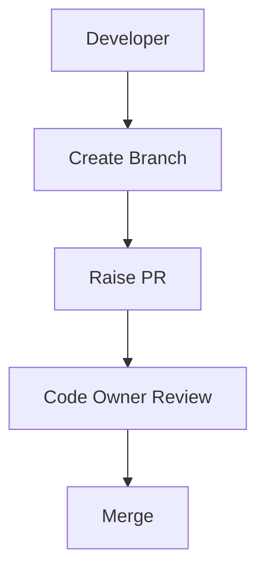
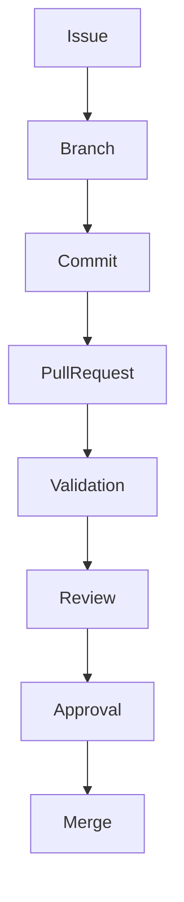

# CONTRIBUTING.md

**Repository:** starone-galaxy-architecture  
**Version:** 1.0  
**Author:** Sachin Salunke  
**Compliance:** ISO/IEC/IEEE 29148 + IEEE 1016 Aligned

---

# Contributing to StarOne Galaxy Architecture

Welcome to **StarOne Galaxy Architecture**, the architectural source-of-truth and governance repository for STARONE-INFOTECH.

This repository follows **Platform-First Governance**, **Documentation-as-Code**, and **Architecture-by-Standards** principles.

Before contributing, please read this guide fully.

---

# Project Workflow Lifecycle

| Status      | Meaning       |
| ----------- | ------------- |
| Backlog     | Planned       |
| Ready       | Sprint-ready  |
| In Progress | Active branch |
| Review      | PR Open       |
| Done        | PR Merged     |
| Closed      | Released      |

---

# 1. Contribution Principles

All contributions must adhere to:

- Platform First Thinking
- Domain Isolation Principles
- Documentation-as-Code
- Security by Default
- Traceability by Design
- Reusable Architecture Standards
- Mandatory Review Governance

Every contribution must improve one or more of:

- Architecture quality
- Governance controls
- Documentation consistency
- Platform scalability
- Compliance readiness

---

# 2. Repository Structure

```text
starone-galaxy-architecture/
│
├── docs/
│   ├── adr/
│   ├── brd/
│   ├── frd/
│   ├── hld/
│   ├── lld/
│   ├── prd/
│   ├── rtm/
│   ├── srs/
│   ├── epic/
│   ├── stories/
│   ├── milestones/
│   ├── standards/
│   └── templates/
│
├── architecture/
│   ├── c4/
│   ├── deployment/
│   ├── domain/
│   ├── integration/
│   ├── runtime/
│   └── security/
│
├── governance/
│   ├── audits/
│   ├── branching/
│   ├── compliance/
│   ├── controls/
│   ├── naming/
│   ├── policies/
│   └── standards/
│
└── .github/
    ├── workflows/
    ├── ISSUE_TEMPLATE/
    ├── CODEOWNERS
    └── PULL_REQUEST_TEMPLATE.md
```

---

# 3. Contribution Workflow

## Branching Model

```text
main
feature/<feature-name>
hotfix/<fix-name>
release/<release-version>
```

Examples:

```bash
git checkout -b feature/adr-saga-governance
git checkout -b feature/hld-platform-topology
git checkout -b hotfix/fix-rttm-linkage
```

---

# 4. Commit Standards

## Commit Format

```text
type(scope): summary
```

Use Conventional Commits:

```text
feat(adr): add saga orchestration decision
fix(c4): correct container dependency mapping
docs(hld): update architecture diagram
refactor(governance): improve template structure
chore(workflows): update markdown lint workflow
```

Allowed prefixes:

- feat
- fix
- docs
- refactor
- chore
- test

---

# 5. Pull Request Process

## Mandatory Traceability

Every PR must include:

```markdown
Epic:
Story:
Issue:

Closes #<issue-number>
```

## Pull Request Must Include

Every PR must contain:

- Linked Epic / Story / Issue
- Summary of change
- Architecture impact statement
- Traceability reference
- Updated diagrams (if impacted)
- Review evidence

---

## PR Template

```markdown
## Summary

What changed?

## Related Artifact

ADR/HLD/SRS/Issue Reference:

## Architecture Impact

Explain architectural effect.

## Compliance Check

- [ ] ISO sections updated
- [ ] RTM linkage verified
- [ ] Mermaid validated

## Review Checklist

- [ ] Self-review completed
- [ ] Tests/validation completed
```

---

# 6. Definition of Ready (Before PR)

Before opening PR:

- Scope is clearly defined
- Requirement linked
- Template followed
- Standards checks pass
- Documentation updated
- Mermaid diagrams validated

---

# 7. Definition of Done

## Current Solo Contributor Mode

Contribution is complete when:

- Self-review completed
- Documentation updated
- Traceability updated
- Pull Request created and reviewed
- Available governance checks passed
- Changes merged

## Future-State Governance Model

Contribution is complete when:

- Code owner approvals obtained
- Minimum 2 approvals received
- Required governance checks passed
- Traceability updated
- Documentation merged

## Merge Strategy

Approved merge strategy:

✅ Squash and Merge

Reason:

- Cleaner governance history
- Better auditability
- Reduced commit noise
- Stronger release traceability

---

# 8. Architecture Artifact Standards

## ADR Contributions

Must include:

- Context
- Decision Drivers
- Options Analysis
- Decision
- Consequences
- References

Path:

```text
/docs/adr/
```

Naming:

```text
ADR-###-Title.md
```

---

## HLD Contributions

Must include:

- Architecture Goals
- Component Views
- Data Flows
- Deployment Views
- NFR Architecture

Path:

```text
/docs/hld/
```

---

## SRS Contributions

Must include:

- Functional Requirements
- APIs
- Data Structures
- Security Controls
- Traceability

Path:

```text
/docs/srs/
```

---

# 9. Mermaid Diagram Standards

All diagrams must use Mermaid.

Allowed diagrams:

- Flowcharts
- Sequence diagrams
- ERDs
- State diagrams

Example:



Rules:

- Consistent naming
- Domain boundaries labeled
- Left-right for context maps
- Top-down for process flows

---

# 10. Review Governance

## Mandatory Reviewers

| Change Type         | Required Reviewers                |
| ------------------- | --------------------------------- |
| ADR                 | Platform Architect + Security     |
| HLD                 | Platform Architect + DevOps       |
| SRS                 | Solution Architect + Domain Owner |
| Governance Policies | Governance Board                  |

---

## Protected Paths

Require Code Owner Approval:

```text
/docs/adr/*
/docs/hld/*
/docs/srs/*
/docs/rtm/*
/governance/*
.github/workflows/*
```

---

## Solo Contributor Operating Mode

The repository is currently maintained by a single contributor.

Until governance teams are formally established:

- Platform Architect fulfills all review roles
- Self-review is mandatory
- Pull Requests remain mandatory
- Governance checklists remain mandatory
- Available workflow validations must pass

The governance model defined in this document represents the future-state operating model for multi-contributor repository governance.

---

# 11. Branch Protection Rules

Main branch:

- No direct pushes
- 2 required approvals
- Code owner review mandatory
- Status checks required

Required checks:

```yaml
architecture-review
security-compliance
doc-validation
lint-standards
```

---

# 12. Documentation Quality Gates

All contributions must pass:

## Required Quality Gates

- Markdown linting
- Broken link checks
- Mermaid validation
- Traceability verification
- Standards template compliance

---

# 13. Security Rules

All contributors must follow:

- No secrets in repo
- No credentials committed
- No hardcoded tokens
- Follow TLS/JWT/RBAC standards
- Security changes require security owner review

---

# 14. Distributed Transaction Rule

For architecture involving distributed services:

Mandatory:

- Saga pattern only
- Compensating transactions defined
- Failure rollback modeled

Any violation blocked in review.

---

# 15. Local Validation Before PR

Run:

```bash
markdownlint .
yamllint .github/workflows/
make validate-diagrams
make validate-traceability
```

Must pass before PR.

---

# 16. Issue and Story Linking

Every contribution must map to:

```text
Product Vision
-> Epic
-> User Story
-> Artifact
```

Examples:

```text
EPIC-001
Story S1
ADR-001
```

No orphan artifacts allowed.

---

# 17. Contribution Labels

Use GitHub labels:

```text
area:architecture
area:governance
type:documentation
priority:high
compliance:required
```

---

# 18. Prohibited Changes

Do NOT:

- Bypass templates
- Merge without approvals
- Commit generated docs outside standards
- Change protected paths without owners
- Add architecture outside governance review
- Introduce undocumented design decisions

---

# 19. New Contributor Onboarding

New contributors should:

1. Read README.md
2. Review C4 maps
3. Read CODEOWNERS
4. Review templates
5. Start with documentation issues tagged:

```text
good-first-issue
documentation
governance
```

---

# 20. Escalation Path

For questions:

| Topic         | Contact Team            |
| ------------- | ----------------------- |
| Architecture  | Platform Architects     |
| Security      | Security Governance     |
| DevOps        | Platform Engineering    |
| Documentation | Architecture Governance |

---

# 21. Contributor License Statement

By contributing you affirm:

- Contribution follows repository standards
- Work aligns with governance controls
- Contributions may be reviewed/modified under platform governance

---

# 22. Example Contribution Flow



---

# 23. Strategic Next Contributions

Recommended next governance artifacts:

- ADR-002 Documentation-as-Code Strategy
- STANDARD-003 CODEOWNERS Governance
- PULL_REQUEST_TEMPLATE.md
- Architecture Review Checklist
- CI Governance Validation Workflow

---

# Thank You

Build platforms.
Document decisions.
Protect standards.
Scale intentionally.

**StarOne Galaxy Governance**

# Recommended Companion Files

```text
.github/
├── CODEOWNERS
├── PULL_REQUEST_TEMPLATE.md
├── ISSUE_TEMPLATE/
└── workflows/
```

**Storage Location:**  
`/CONTRIBUTING.md`
