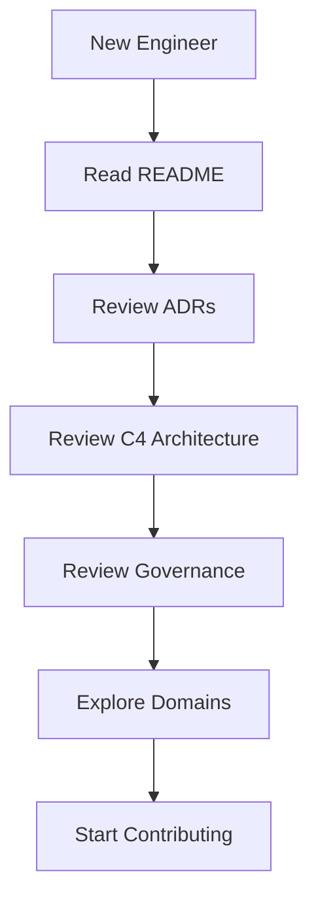
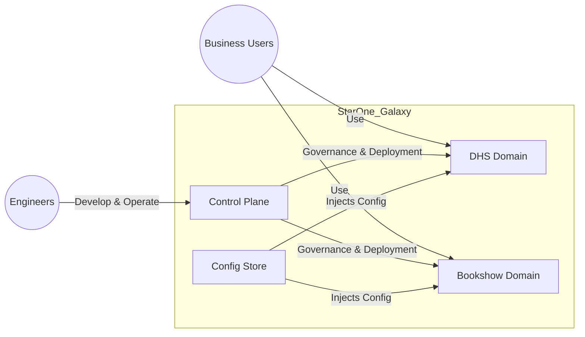
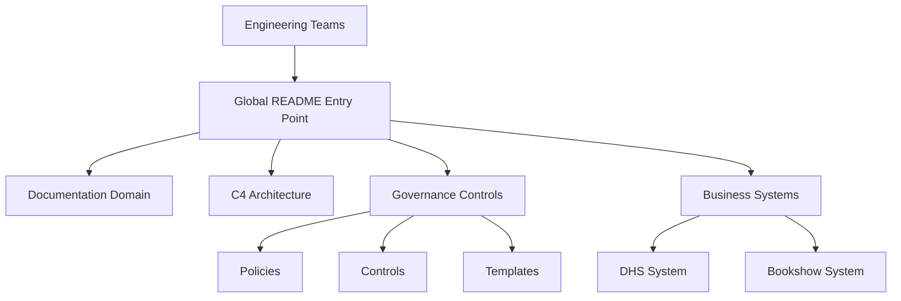
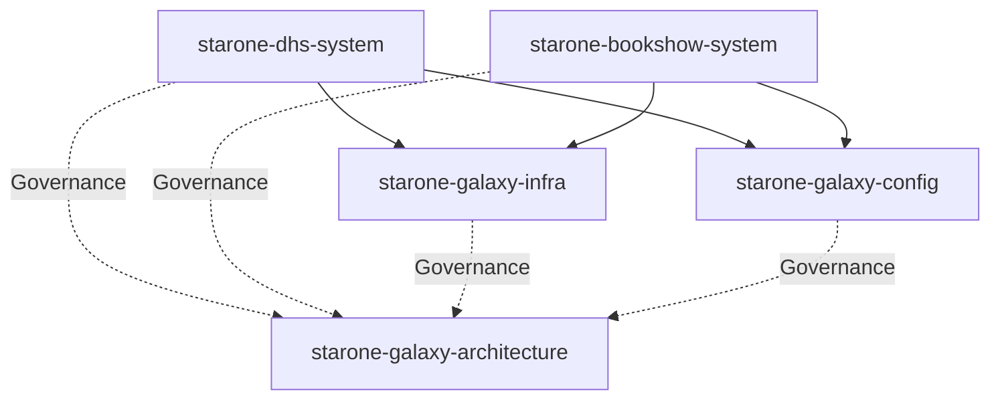
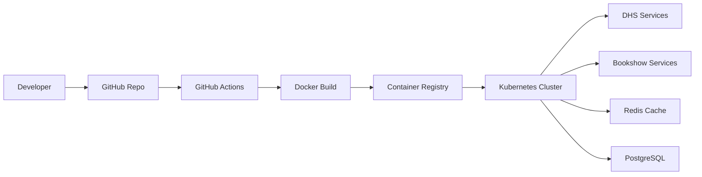
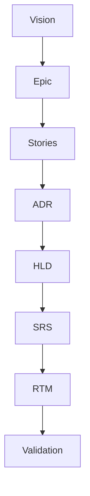
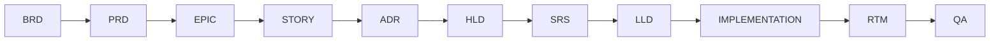
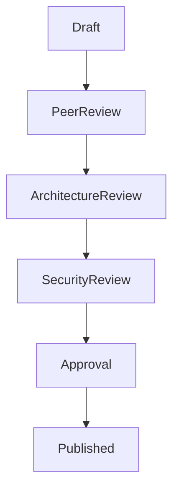

# ⭐ StarOne Galaxy

> Architecture Source Of Truth

---
# README Metadata

| Field | Value |
|---|---|
| Document ID | STARONE-GALAXY-README-v1.0 |
| Domain | Governance |
| Document Type | Architectural Source of Truth |
| Version | 1.0.0 |
| Author | Sachin Salunke |
| Status | Draft |
| Date | 2026-05-01 |
| Linked Epic | EPIC-ARCH-001 |
| Linked Story | STORY-ARCH-002 |
| Approval Status | Pending |

---

# Revision History

| Version | Date | Author | Description |
|---|---|---|---|
| 1.0 | Jan 2026 | Sachin Salunke | Initial Global Architecture README |
| 1.1 | Jan 2026 | Platform Governance | C4 and Governance Navigation Added |
| 1.2 | Jan 2026 | Sachin Salunke | Governance, Runtime and SDLC Enhancements |

---

# Sign-Off

| Role | Status |
|---|---|
| Platform Architect | Pending |
| Security Review | Pending |
| DevOps Governance | Pending |

---

## How to Navigate

This README serves as the primary architectural entry point for the StarOne Galaxy ecosystem.

### For New Engineers

Follow this order:

1. Ecosystem Overview
2. Repository Structure
3. Architecture Overview
4. Technology Stack
5. Getting Started
6. Domain Catalog
7. Contribution Path

---

### For Architects

Follow this order:

1. Architecture Overview
2. C4 Context View
3. C4 Container View
4. Dependency Relationships
5. High-Level Integration Overview
6. Governance Links
7. Documentation Links

---

### For Platform Engineers

Follow this order:

1. Repository Structure
2. Technology Stack
3. Dependency Relationships
4. High-Level Integration Overview
5. Governance Links
6. Contribution Path

---

### For Reviewers & Auditors

Follow this order:

1. Governance Links
2. Documentation Links
3. Traceability Artifacts
4. Ownership
5. Contribution Standards
6. Appendix A – Traceability Governance
7. Appendix B – Governance Lifecycles

---

### Architecture Repository Navigation

```text
/docs/adr/          -> Architecture Decision Records
/docs/brd/          -> Business Requirements
/docs/prd/          -> Product Requirements
/docs/frd/          -> Functional Requirements
/docs/hld/          -> High-Level Designs
/docs/lld/          -> Low-Level Designs
/docs/srs/          -> System Requirements
/docs/rtm/          -> Traceability Matrix

/architecture/c4/   -> C4 Architecture Models
/governance/        -> Governance Standards
/docs/templates/    -> Approved Templates
```

---

## 1. Ecosystem Overview

### 1.1 Executive Overview

**StarOne Galaxy** is the architectural and governance source-of-truth for the STARONE-INFOTECH ecosystem.
The repository establishes:

- Platform Governance
- Domain Isolation Standards
- Documentation-as-Code
- Architecture Traceability
- SDLC Governance
- Security & Compliance Baselines
- Platform Engineering Standards

The ecosystem consists of:

1. starone-galaxy-architecture — Architecture Source of Truth
2. starone-galaxy-infra — Shared Control Plane
3. starone-galaxy-config — Centralized Configuration Store
4. starone-dhs-system — Enterprise OMS Platform
5. starone-bookshow-system — Consumer Ticketing Platform

---

### 1.2 Architecture Highlights

This project demonstrates:

- Domain-Isolated Microservices Architecture
- Event-driven microservices architecture using Kafka
- Strict domain isolation (DHS vs Bookshow)
- Shared platform control plane (Kubernetes + CI/CD)
- Documentation-as-Code with full traceability (EPIC → RTM)
- Governance-first engineering model
- Saga-based distributed transaction management
- Kubernetes Native Platform Operations

---

### 1.3 Design Intent

This architecture is designed to:

- Separate enterprise and consumer domains with clear boundaries
- Establish governance as a foundational layer rather than an afterthought
- Enable scalable, event-driven communication between systems
- Provide a reusable platform model for future services

The goal is to simulate a production-grade ecosystem with strong architectural discipline.

---

## 2. Repository Structure

### 2.1 Repository Map

```text
starone-galaxy-architecture/
│
├── .github/
│   ├── workflows/
│   ├── ISSUE_TEMPLATE/
│   ├── PULL_REQUEST_TEMPLATE.md
│   └── CODEOWNERS
│
├── docs/
│   ├── adr/
│   ├── brd/
│   ├── frd/
│   ├── hld/
│   ├── lld/
│   ├── prd/
│   ├── rtm/
│   ├── srs/
│   ├── epic/
│   ├── stories/
│   ├── milestones/
│   ├── standards/
│   └── templates/
│
├── architecture/
│   ├── c4/
│   ├── deployment/
│   ├── integration/
│   ├── security/
│   ├── runtime/
│   └── domain/
│
├── governance/
│   ├── policies/
│   ├── controls/
│   ├── compliance/
│   ├── standards/
│   ├── branching/
│   └── naming/
│
├── references/
│   ├── diagrams/
│   ├── samples/
│   └── onboarding/
│
├── scripts/
│
├── README.md
├── CONTRIBUTING.md
├── LICENSE
└── .gitignore
```

---

### 2.2 Internal Taxonomy Standard

```text
/apps
/platform
/libs
/bom
/docs
/scripts
.github
```

---

## 3. Architecture Overview


### 3.2 Architecture Principles

Mandatory principles:

- Platform First
- Domain Isolation
- API Gateway Security
- Database per Service
- Event-Driven Integration
- Saga Patterns
- Compensating Transactions

---

### 3.3 Distributed Transaction Governance

All distributed workflows across DHS and Bookshow domains must implement:

- Saga Orchestration or Saga Choreography
- Mandatory Compensating Transactions
- Event Traceability
- Idempotent Consumers
- Retry + Dead Letter Queue (DLQ) handling
- Distributed correlation identifiers

Two-Phase Commit (2PC) is prohibited for cross-domain runtime flows due to scalability and availability constraints.

---

### 3.4 Repository Visibility Strategy

| Repository | Visibility | Reason |
|---|---|---|
| starone-galaxy-architecture | Public | Architecture portfolio |
| starone-galaxy-infra | Private | Deployment configs |
| starone-dhs-system | Private | Enterprise domain |
| starone-bookshow-system | Private | Consumer domain |
| starone-galaxy-config | Private | Secrets/config |

---

## 4. Technology Stack

### 4.1 Tech Stack Standards

| Layer | Standard |
|---|---|
| Language | Java 21 |
| Framework | Spring Boot 3.x |
| API Communication | REST + OpenFeign |
| Messaging | Kafka |
| Database | PostgreSQL |
| Cache | Redis |
| Security | JWT / RBAC / TLS 1.3 |
| DevOps | Docker + Kubernetes |
| CI/CD | GitHub Actions |

---

### 4.2 Architecture Standards

| Category | Standard |
|---|---|
| Requirements | ISO/IEC/IEEE 29148 |
| Architecture Design | IEEE 1016 |
| API Standards | OpenAPI 3.x |
| Diagrams | Mermaid.js |
| Documentation | Markdown-as-Code |
| CI Governance | GitHub Actions |
| Branching | Trunk-Based Development |

---

### 4.3 Visual Modeling Governance

All architecture diagrams shall comply with:

- Mermaid Modeling Standard
- C4 Modeling Conventions
- Domain Boundary Standards
- Architecture Review Controls

---

## 5. Repository Catalog

The StarOne Galaxy ecosystem consists of shared platform repositories and domain-specific repositories. The following catalog provides repository ownership and responsibility boundaries.

### 5.1 Ecosystem Repository Topology

| Repository | Responsibility | Type |
|---|---|---|
| starone-galaxy-architecture | Architecture governance & source-of-truth | Public |
| starone-galaxy-infra | Shared runtime platform & Kubernetes | Private |
| starone-galaxy-config | Centralized Spring Cloud Config repository | Private |
| starone-dhs-system | Enterprise OMS ecosystem | Private |
| starone-bookshow-system | Consumer ticketing platform | Private |
| sportstats | Sports analytics | Planned |
| vaultiron | Secret management | Planned |
---

## 6. Getting Started

### 6.1 Engineer Onboarding Guide

Welcome to the StarOne Galaxy ecosystem.

This onboarding path helps new engineers understand the architecture, governance model, repository structure, and contribution workflow.

### 6.2 Recommended Learning Path

#### Step 1 — Understand the Ecosystem

Review:

- Executive Overview
- Architecture Highlights
- Ecosystem Repository Topology

Objective:

Understand domain boundaries and platform responsibilities.

---

#### Step 2 — Learn the Architecture

Review:

```text
/architecture/c4/
/docs/hld/
/docs/adr/
```

Objective:

Understand system context, repository relationships, and architecture decisions.

---

#### Step 3 — Understand Governance

Review:

```text
/governance/
/governance/standards/
/docs/rtm/
/docs/templates/
```

Objective:

Learn contribution standards, traceability requirements, and governance controls.

---

#### Step 4 — Explore Domain Systems

Repositories:

- starone-dhs-system
- starone-bookshow-system

Objective:

Understand business capabilities and domain ownership.

---

#### Step 5 — Start Contributing

Follow:

Issue
→ Branch
→ Pull Request
→ Review
→ Merge

Objective:

Contribute using approved engineering workflows.

---

### 6.3 Prerequisites

- Java 21
- Maven 3.9+
- Docker
- Kubernetes CLI
- Git

```text
/docs/adr/
```

### 6.4 Clone Repositories

```bash
git clone --recursive git@github.com:starone/starone-galaxy-architecture.git
```

---

### 6.5 Local Bootstrap

```bash
# Start infrastructure
docker compose up -d

# Build shared modules
./mvnw clean install -DskipTests
```

---

### 6.6 Engineer Golden Path



---

### 6.7 Explore Architecture

Recommended order:

### 1. Read ADRs

```text
/docs/adr/
```

### 2. Review C4 Models

```text
/architecture/c4/
```

### 3. Review HLD

```text
/docs/hld/
```

### 4. Review Standards

```text
/governance/
```

---

## 7. Governance Links

### 7.1 Architecture Decisions

```text
/docs/adr/
```

- ADR-001 Repository Taxonomy
- ADR-002 Documentation-as-Code
- ADR-003 BOM Governance

---

### 7.2 Architecture Designs

```text
/docs/hld/
```

- HLD-001 Global Ecosystem Architecture

---

### 7.3 Technical Specifications

```text
/docs/srs/
```

- SRS-001 Documentation Standards Engine

---

### 7.4 Traceability

```text
/docs/rtm/
```

- RTM-001 Governance Traceability

---

### 7.5 Policies and Standards

```text
/governance/
```

- Contribution Standards
- Architecture Review Policies
- Compliance Controls

---

## 8. Documentation Links

| Artifact | Location |
|-----------|-----------|
| ADR | /docs/adr |
| BRD | /docs/brd |
| PRD | /docs/prd |
| FRD | /docs/frd |
| HLD | /docs/hld |
| LLD | /docs/lld |
| SRS | /docs/srs |
| RTM | /docs/rtm |
| Templates | /docs/templates |

---

## 9. Ownership

| Area | Owner |
|---|---|
| Architecture | Platform Architects |
| Governance | Governance Board |
| Security | Security Review |
| DevOps | Platform Engineering |

---

## 10. Domain Catalog

### 10.1 Overview

 The StarOne Galaxy ecosystem follows a centralized governance and platform model where shared services are consumed by business domains while architecture remains the authoritative source of truth.

---

### 10.2 Domain Inventory

| Domain                      | Responsibility                       | Status  |
| --------------------------- | ------------------------------------ | ------- |
| starone-galaxy-infra        | Shared platform infrastructure       | Active  |
| starone-galaxy-config       | Centralized configuration management | Active  |
| starone-galaxy-architecture | Architecture governance              | Active  |
| starone-dhs-system          | Enterprise OMS domain                | Active  |
| starone-bookshow-system     | Consumer ticketing domain            | Active  |
| sportstats                  | Sports analytics platform            | Planned |
| vaultiron                   | Secret management platform           | Planned |

---

### 10.3 Related Domains

| Repository | Purpose |
|------------|---------|
| starone-galaxy-infra | Shared platform services |
| starone-galaxy-config | Centralized configuration |
| starone-galaxy-architecture | Architecture governance |
| starone-dhs-system | Enterprise OMS |
| starone-bookshow-system | Consumer Ticketing |

---

## 11. C4 Context View


---

## 12. C4 Container View



---

## 13. Dependency Relationships

### 13.1 Dependency Relationship Matrix

| Source Domain | Target Domain | Dependency Type |
|---|---|---|
| starone-dhs-system | starone-galaxy-infra | Platform Dependency |
| starone-dhs-system | starone-galaxy-config | Configuration Dependency |
| starone-bookshow-system | starone-galaxy-infra | Platform Dependency |
| starone-bookshow-system | starone-galaxy-config | Configuration Dependency |
| All Domains | starone-galaxy-architecture | Governance Dependency |

---

### 13.2 Dependency Navigation Diagram


---

### 13.3 Dependency Rules

| Dependency | Rule |
|---|---|
| Infrastructure → Domains | Shared platform services are consumed by business domains |
| Configuration → Domains | Centralized configuration inheritance |
| Architecture → All Domains | Governance source-of-truth |
| Domain → Domain | Direct coupling should be minimized |
| Governance → Ecosystem | Standards apply across all repositories |

---

### 13.4 Architecture Dependency Hierarchy

```text
starone-galaxy-architecture
│
├── starone-galaxy-infra
│   │
│   ├── starone-dhs-system
│   └── starone-bookshow-system
│
└── starone-galaxy-config
    │
    ├── starone-dhs-system
    └── starone-bookshow-system
```

---

## 14. High-Level Integration Overview

### 14.1 Infrastructure Overview


---

### 14.2 Key Capabilities

- Containerized microservices (Docker)
- Kubernetes orchestration
- GitHub Actions CI/CD pipelines
- Centralized configuration (Spring Cloud Config)
- Event backbone using Kafka

Infrastructure implementation is maintained in a private repository to ensure security and operational integrity. The architecture and deployment model are fully represented here.

---

## 15. Contribution Path

### 15.1 Documentation Standards

```text
/docs/templates/
/governance/standards/
```

Artifacts:

- ADR Template
- HLD Template
- SRS Template
- RTM Template
- EPIC Story Linkage Template
- Documentation Compliance Standard
- Traceability Standard
- Mermaid Modeling Standard
- Review Workflow Standard

---

### 15.2 Contribution Workflow

Every contribution should follow:

```text
Issue
→ Feature Branch
→ Pull Request
→ Architecture Review
→ Merge
```

Example:

```bash
git checkout -b feature/s2-i05-onboarding-guide
```
---

### 15.3 Definition of Done For New Domain Repos

Every new domain repository must include:

- README.md using global template
- CODEOWNERS
- Reusable workflows
- Documentation templates
- Architecture diagrams
- RTM linkage
- Security baselines

---

### 15.4 Contribution Model

This repository follows:

- PR-based contribution workflow
- Protected branch governance
- Conventional Commits
- Architecture review approval
- Documentation-first engineering
- Traceability-first SDLC governance

---

### 15.5 Governance Rules

Required:

- Trunk based development
- Conventional commits
- CODEOWNER approval mandatory
- Protected branches
- Architecture review gate
- Security review gate

---

## Appendix A – Traceability Governance

### Artifact Traceability Model


---

### Traceability Governance

Mandatory rules:

```text
Every Requirement must map to:
ADR
HLD
LLD
Implementation
Testing
Validation
```

No orphan requirements, architecture artifacts, implementations, or test cases are permitted.

---

## Appendix B – Governance Lifecycles

### SDLC Governance Lifecycle


---

### Documentation Governance Lifecycle


---

## Appendix C – Standards References

### Documentation Standards Reference

- ISO/IEC/IEEE 29148
- IEEE 1016
- MADR
- C4 Model

### Internal Governance Standards

- Documentation Compliance Standard
- Traceability Standard
- Mermaid Modeling Standard
- Review Workflow Standard

---

## Appendix D – Architecture Roadmap

### Current Baseline

- Repository Taxonomy
- Governance Standards
- Documentation-as-Code
- C4 Architecture Models

### Next Evolution

- Platform HLD
- Domain HLDs
- Control Plane Architecture
- Runtime Deployment Models
- Event Catalog & Schema Registry
- Shared Platform Libraries
- Observability Architecture

---

### Planned Evolution

Future roadmap includes:

- Full Control Plane HLD
- Runtime deployment topology
- Kubernetes namespace governance
- Shared platform libraries
- API gateway security architecture
- Event catalog & schema registry
- Observability architecture
- Service dependency graph

---

Architectural Source of Truth — Built with Governance, Designed for Scale.

It serves as the central reference point for all architectural decisions, system boundaries, and governance standards across the ecosystem.