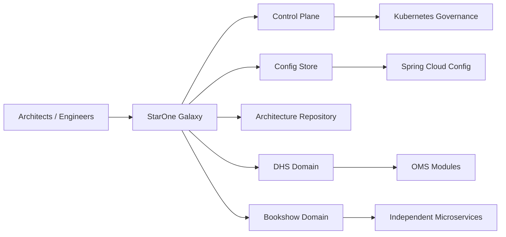
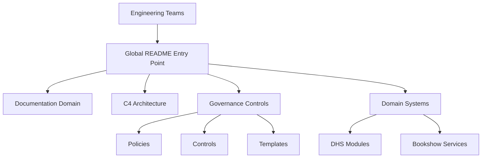
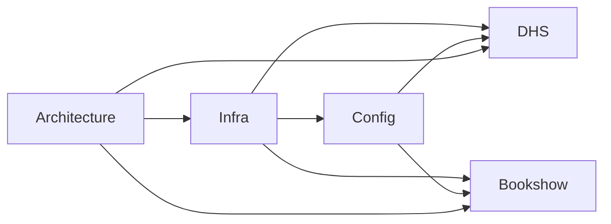
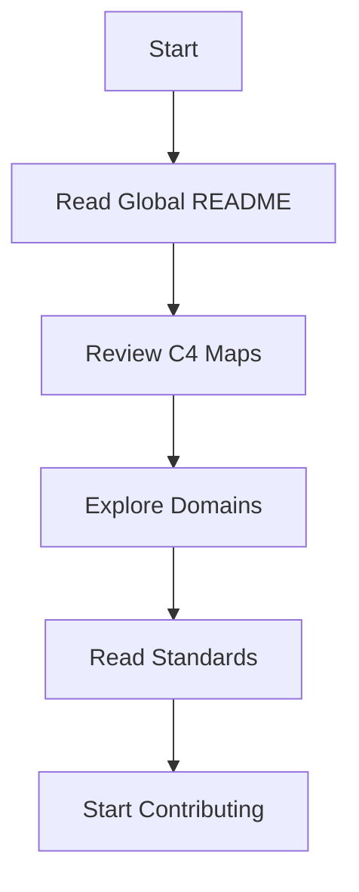
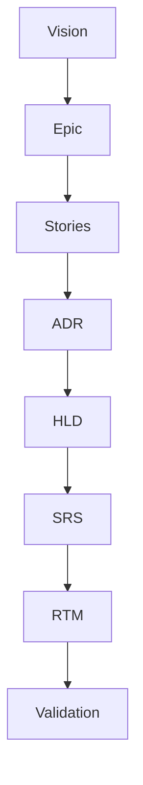

# ⭐ StarOne Galaxy Architecture
> **Document ID:** SOG-GALAXY-README-v1.0  
> **Repository:** starone-galaxy-architecture  
> **Status:** 🟢 Architectural Source of Truth  
> **Type:** Global Ecosystem Entry Point / C4 Navigation Map  
> **Author:** Sachin Salunke  
> **Date:** Jan 2026

---

# Revision History

| Version | Date | Author | Description |
|---|---|---|---|
| 1.0 | Jan 2026 | Sachin Salunke | Initial Global Architecture README |
| 1.1 | Jan 2026 | Platform Governance | C4 and Governance Navigation Added |

---

# Sign-Off

| Role | Status |
|---|---|
| Platform Architect | Pending |
| Security Review | Pending |
| DevOps Governance | Pending |

---

# 📌 Executive Overview

**StarOne Galaxy** is the architectural and governance source-of-truth for the STARONE-INFOTECH ecosystem.

It provides:

- Shared Control Plane Governance  
- Domain-Isolated Architecture Standards  
- Documentation-as-Code  
- Repository Operating Model  
- Security and Compliance Baselines  
- Platform Engineering Golden Path

The ecosystem is composed of:

1. **starone-galaxy-infra** — Shared Control Plane  
2. **starone-galaxy-config** — Git-backed Config Store  
3. **starone-galaxy-architecture** — Architecture Source of Truth  
4. **starone-dhs-system** — Enterprise OMS Domain  
5. **bookshow-system** — Consumer Ticketing Domain

---

# Core Value Propositions

## Unified Governance
Single architectural source-of-truth.

## Platform Chassis Pattern
Reusable shared standards, controls and architecture.

## Documentation-as-Code
Architecture, governance and compliance managed in Git.

## Zero-Drift Standards
Standardized patterns reduce architecture entropy.

---

# 🏗 C4 — System Context



---

# 🧱 C4 — Container View



---

# 📂 Repository Map

```text
starone-galaxy-architecture/
│
├── README.md
│
├── docs/
│   ├── adr/
│   ├── hld/
│   ├── srs/
│   ├── rtm/
│   └── standards/
│
├── architecture/
│   ├── c4/
│   ├── domain/
│   └── integration/
│
├── governance/
│   ├── policies/
│   ├── controls/
│   └── templates/
│
└── .github/
    ├── workflows/
    └── CODEOWNERS
```

---

# 🌌 Ecosystem Repositories

## 1. Control Plane
```text
starone-galaxy-infra
```

Contains:

- Kubernetes manifests  
- GitHub reusable workflows  
- Security baselines  
- Shared operational controls

---

## 2. Config Store
```text
starone-galaxy-config
```

Contains:

- Spring Cloud Config
- Encrypted secrets
- Domain config inheritance

---

## 3. Architecture Source of Truth
```text
starone-galaxy-architecture
```

Contains:

- ADRs
- HLDs
- SRS artifacts
- Governance controls
- Templates
- Traceability

---

## 4. DHS System
```text
starone-dhs-system
```

Modular Maven hierarchy:

```text
Parent
├── BOM
├── core-common
├── spring-boot-common
└── functional modules
```

Includes:

- Gateway
- Eureka
- Kafka Event Backbone

---

## 5. Bookshow System
```text
bookshow-system
```

Independent service model:

- Consumer services
- Gateway
- Eureka
- Event-driven services

---

# 🔗 Domain Dependency Map



---

# 📦 Internal Taxonomy Standard

```text
/apps
/platform
/libs
/bom
/docs
/scripts
.github
```

---

# 🔧 Tech Stack Standards

| Layer | Standard |
|---|---|
Language | Java 21 |
Framework | Spring Boot 3.x |
Messaging | Kafka |
Database | PostgreSQL |
Cache | Redis |
Security | JWT / RBAC / TLS 1.3 |
DevOps | Docker + Kubernetes |
CI/CD | GitHub Actions |

---

# ⚙ Architecture Principles

Mandatory principles:

- Platform First
- Domain Isolation
- API Gateway Security
- Database per Service
- Event-Driven Integration
- Saga Patterns
- Compensating Transactions

---

# 🔁 Distributed Transaction Rule

All distributed workflows must use:

- Saga Orchestration or Choreography
- Compensating Transactions
- Event Traceability

No distributed flow may use shared database transaction coupling.

---

# 🧭 Governance Navigation Index

## Architecture Decisions
```text
/docs/adr/
```

- ADR-001 Repository Taxonomy
- ADR-002 Documentation-as-Code
- ADR-003 BOM Governance

---

## Architecture Designs
```text
/docs/hld/
```

- HLD-001 Global Ecosystem Architecture

---

## Technical Specifications
```text
/docs/srs/
```

- SRS-001 Documentation Standards Engine

---

## Traceability
```text
/docs/rtm/
```

- RTM-001 Governance Traceability

---

## Policies and Standards
```text
/governance/
```

- Contribution Standards
- Architecture Review Policies
- Compliance Controls

---

# 🚀 Getting Started

## Prerequisites

- Java 21
- Maven 3.9+
- Docker
- Kubernetes CLI
- Git

---

## Clone Repositories

```bash
git clone --recursive git@github.com:starone/starone-galaxy-architecture.git
```

---

## Explore Architecture

Recommended order:

1 Read ADRs

```text
/docs/adr/
```

2 Review C4 Models

```text
/architecture/c4/
```

3 Review HLD

```text
/docs/hld/
```

4 Review Standards

```text
/governance/
```

---

# 👨‍💻 Engineer Onboarding Flow



---

# ✅ Definition of Done For New Domain Repos

Every new domain repository must include:

- README.md using global template
- CODEOWNERS
- Reusable workflows
- Documentation templates
- Architecture diagrams
- RTM linkage
- Security baselines

---

# 🔐 Governance Rules

Required:

- Trunk based development
- Conventional commits
- 2 required approvals
- CODEOWNER approval mandatory
- Protected branches
- Architecture review gate
- Security review gate

---

# 📊 Artifact Traceability Model



---

# 📚 Standards References

Aligned To:

- ISO/IEC/IEEE 29148
- IEEE 1016
- MADR
- C4 Model

---

# 🛠 Local Bootstrap

```bash
# Start infra
docker compose up -d

# Build shared modules
./mvnw clean install -DskipTests
```

---

# 📈 Architecture Roadmap

Current Baseline:
- Repository Taxonomy
- Governance Standards
- Documentation-as-Code

Next:
- Platform HLD
- Domain HLDs
- Control Plane Architecture
- Standards Engine

---

# 📞 Ownership

| Area | Owner |
|---|---|
Architecture | Platform Architects |
Governance | Governance Board |
Security | Security Review |
DevOps | Platform Engineering |

---

