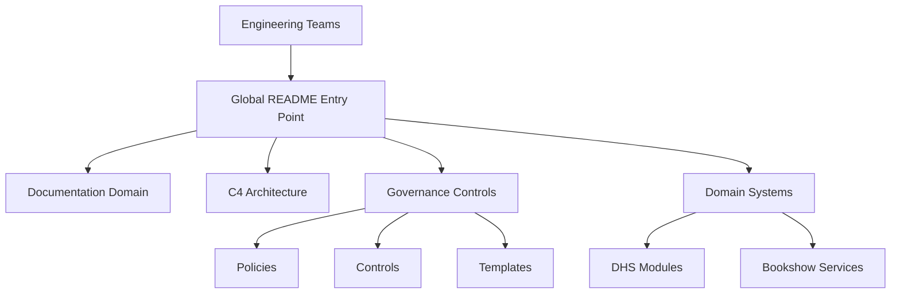
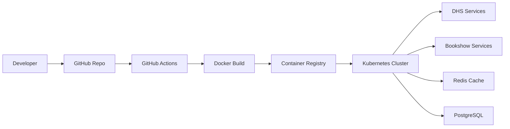
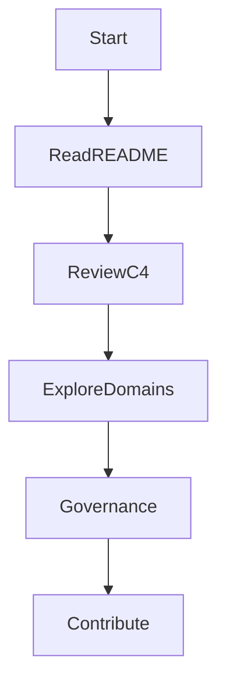
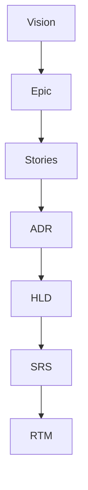
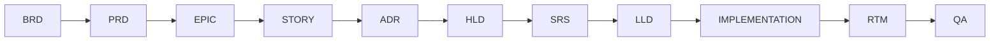

# ⭐ StarOne Galaxy Architecture
> **Document ID:** SOG-GALAXY-README-v1.0  
> **Repository:** starone-galaxy-architecture  
> **Status:** 🟢 Architectural Source of Truth  
> **Type:** Global Ecosystem Entry Point / C4 Navigation Map  
> **Author:** Sachin Salunke  
> **Date:** Jan 2026  

---

# 👀 How to Navigate (For Reviewers)

Start here:

1. Review C4 diagrams → `/architecture/c4/`  
2. Read architecture decisions → `/docs/adr/`  
3. Explore high-level design → `/docs/hld/`  
4. Review governance → `/governance/`  

This repository represents a structured enterprise architecture system designed with governance, traceability, and scalability as first-class concerns.

---

# ⭐ Architecture Highlights

This project demonstrates:

- Event-driven microservices architecture using Kafka  
- Strict domain isolation (DHS vs Bookshow)  
- Shared platform control plane (Kubernetes + CI/CD)  
- Documentation-as-Code with full traceability (EPIC → RTM)  
- Governance-first engineering model  
- Saga-based distributed transaction management  

---

# 📐 Architecture Standards

| Category | Standard |
|---|---|
| Requirements | ISO/IEC/IEEE 29148 |
| Architecture Design | IEEE 1016 |
| API Standards | OpenAPI 3.x |
| Diagrams | Mermaid.js |
| Documentation | Markdown-as-Code |
| CI Governance | GitHub Actions |
| Branching | Trunk-Based Development |

---

# 💡 Design Intent

This architecture is designed to:

- Separate enterprise and consumer domains with clear boundaries  
- Establish governance as a foundational layer rather than an afterthought  
- Enable scalable, event-driven communication between systems  
- Provide a reusable platform model for future services  

The goal is to simulate a production-grade ecosystem with strong architectural discipline.

---

# 📌 Executive Overview

**StarOne Galaxy** is the architectural and governance source-of-truth for the STARONE-INFOTECH ecosystem.

It provides:

- Shared Control Plane Governance  
- Domain-Isolated Architecture Standards  
- Documentation-as-Code  
- Repository Operating Model  
- Security and Compliance Baselines  
- Platform Engineering Golden Path  

---

# 🌌 Ecosystem Repository Topology

| Repository | Responsibility | Type |
|---|---|---|
| starone-galaxy-architecture | Architecture governance & source-of-truth | Public |
| starone-galaxy-infra | Shared runtime platform & Kubernetes | Private |
| starone-galaxy-config | Centralized Spring Cloud Config repository | Private |
| starone-dhs-system | Enterprise OMS ecosystem | Private |
| bookshow-system | Consumer ticketing platform | Private |

---

# 🏗 C4 — System Context (Improved)

```mermaid
flowchart LR

Users((Business Users))
Engineers((Engineers))

subgraph StarOne_Galaxy
    Infra[Control Plane]
    Config[Config Store]
    DHS[DHS Domain]
    Bookshow[Bookshow Domain]
end

Engineers -->|Develop & Operate| Infra
Users -->|Use| DHS
Users -->|Use| Bookshow

Infra -->|Orchestrates| DHS
Infra -->|Orchestrates| Bookshow

Config -->|Injects Config| DHS
Config -->|Injects Config| Bookshow

DHS <-->|Async Events (Kafka)| Bookshow
```

---

# 🧱 C4 — Repository Navigation View



---

# 🏗 Infrastructure Overview



## Key Capabilities

- Containerized microservices (Docker)  
- Kubernetes orchestration  
- GitHub Actions CI/CD pipelines  
- Centralized configuration (Spring Cloud Config)  
- Event backbone using Kafka  

Infrastructure implementation is maintained in a private repository to ensure security and operational integrity. The architecture and deployment model are fully represented here.

---

# 🔐 Repository Visibility Strategy

| Repository | Visibility | Reason |
|---|---|---|
starone-galaxy-architecture | Public | Architecture portfolio |
starone-galaxy-infra | Private | Deployment configs |
starone-dhs-system | Private | Enterprise domain |
bookshow-system | Private | Consumer domain |
starone-galaxy-config | Private | Secrets/config |

---

# 📂 Repository Map

```text
starone-galaxy-architecture/
│
├── .github/
│   ├── workflows/
│   ├── ISSUE_TEMPLATE/
│   ├── PULL_REQUEST_TEMPLATE.md
│   └── CODEOWNERS
│
├── docs/
│   ├── adr/
│   ├── brd/
│   ├── frd/
│   ├── hld/
│   ├── lld/
│   ├── prd/
│   ├── rtm/
│   ├── srs/
│   ├── epic/
│   ├── stories/
│   ├── milestones/
│   ├── standards/
│   └── templates/
│
├── architecture/
│   ├── c4/
│   ├── deployment/
│   ├── integration/
│   ├── security/
│   ├── runtime/
│   └── domain/
│
├── governance/
│   ├── policies/
│   ├── controls/
│   ├── compliance/
│   ├── branching/
│   └── naming/
│
├── references/
│   ├── diagrams/
│   ├── samples/
│   └── onboarding/
│
├── scripts/
│
├── README.md
├── CONTRIBUTING.md
├── LICENSE
└── .gitignore
```

---

# 🔧 Tech Stack Standards

| Layer | Standard |
|---|---|
Language | Java 21 |
Framework | Spring Boot 3.x |
API Communication | REST + OpenFeign
Messaging | Kafka |
Database | PostgreSQL |
Cache | Redis |
Security | JWT / RBAC / TLS 1.3 |
DevOps | Docker + Kubernetes |

---

# ⚙ Architecture Principles

- Platform First  
- Domain Isolation  
- API Gateway Security  
- Database per Service  
- Event-Driven Integration  
- Saga Patterns  
- Compensating Transactions  

---

# 🔁 Distributed Transaction Governance

All distributed workflows across DHS and Bookshow domains must implement:

- Saga Orchestration or Saga Choreography
- Mandatory Compensating Transactions
- Event Traceability
- Idempotent Consumers
- Retry + Dead Letter Queue (DLQ) handling
- Distributed correlation identifiers

Two-Phase Commit (2PC) is prohibited for cross-domain runtime flows due to scalability and availability constraints. 

---

# 🧭 Governance Navigation Index

```text
/docs/adr/
/docs/hld/
/docs/srs/
/docs/rtm/
/governance/
```

---

# 👨‍💻 Engineer Onboarding Flow



---

# 🔐 Governance Rules (Solo Adapted)

- PR-based workflow  
- Self-review governance  
- CODEOWNERS for ownership definition  
- Protected branch discipline  

---

# 📊 Artifact Traceability Model



---

# 🔄 SDLC Governance Lifecycle


---

# 📈 Architecture Roadmap

Current:
- Governance baseline  
- C4 models  
- Architecture repository  

Next:
- HLD expansion  
- Domain deep dives  
- Standards engine  

---

# 🤝 Contribution Model

This repository follows:

- PR-based contribution workflow
- Protected branch governance
- Conventional Commits
- Architecture review approval
- Documentation-first engineering
- Traceability-first SDLC governance

---

# 🚀 Planned Evolution

Future roadmap includes:

- Full Control Plane HLD
- Runtime deployment topology
- Kubernetes namespace governance
- Shared platform libraries
- API gateway security architecture
- Event catalog & schema registry
- Observability architecture
- Service dependency graph

---

# 📞 Ownership

| Area | Owner |
|---|---|
Architecture | Platform Architect |
Governance | Self-governed |
Security | Design-driven |
DevOps | Platform model |

---

Architectural Source of Truth — Built with Governance, Designed for Scale

It serves as the central reference point for all architectural decisions, system boundaries, and governance standards across the ecosystem.