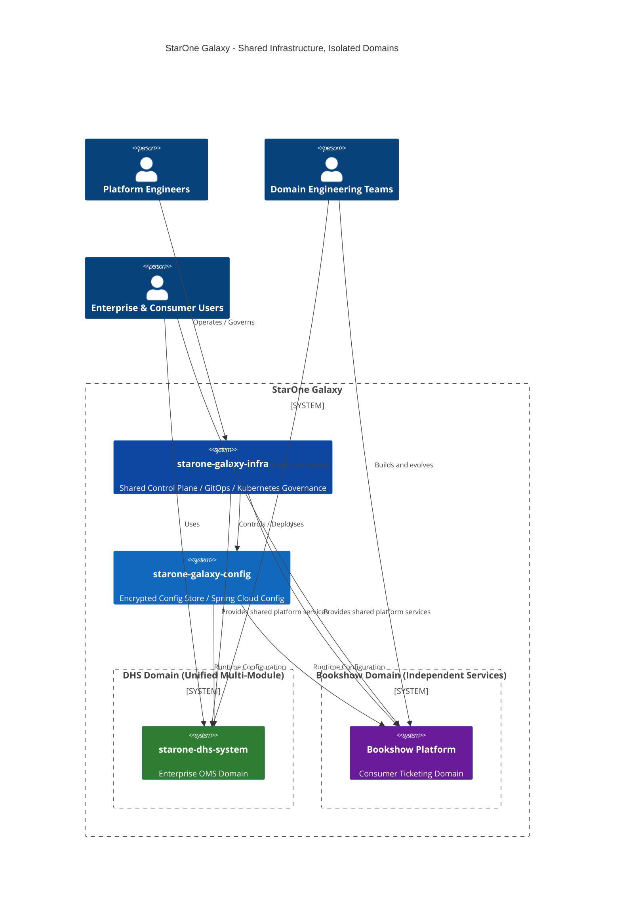
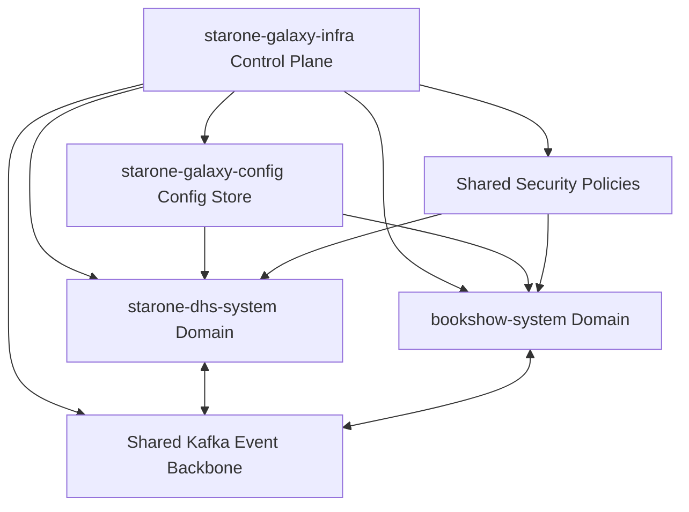
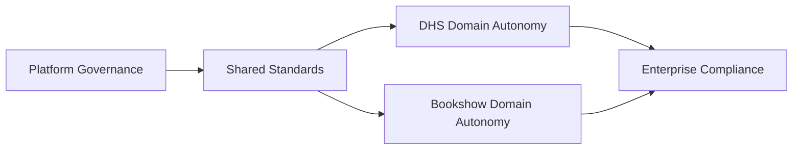

# StarOne Galaxy Global Ecosystem README  
**Repository:** `starone-galaxy-architecture`  
**Document ID:** SOG-README-GLOBAL-V1.0  
**Classification:** Architecture Entry Point / Ecosystem Root README  
**Compliance Alignment:** ISO/IEC/IEEE 29148 (Requirements), IEEE 1016 (Architecture Description)  
**Author:** Sachin Salunke  
**Date:** Jan 2026  
**Status:** Architectural Baseline  
**Reference Templates:** Global README baseline aligned with repository template guidance

---

# Revision History

| Version | Date | Author | Description | Change Type |
|---------|------|--------|-------------|-------------|
| 0.1 | Jan 2026 | Sachin Salunke | Initial ecosystem entry point draft | Draft |
| 0.9 | Jan 2026 | Sachin Salunke | Added C4 Context, topology, phased roadmap | Major Revision |
| 1.0 | Jan 2026 | Sachin Salunke | Approved architectural baseline | Release |

---

# Formal Sign-Off

| Role | Name | Review Scope | Status | Sign-off Date |
|------|------|--------------|--------|---------------|
| Platform Architect | Sachin Salunke | Control Plane & Domain Architecture | Approved | Jan 2026 |
| Security Review | Architecture Security Board | TLS, JWT, Domain Isolation | Approved | Jan 2026 |
| DevOps Governance | Platform Operations | GitOps / Kubernetes Governance | Approved | Jan 2026 |

---

# Requirement Traceability Matrix (RTM)

| Vision Objective | Requirement ID | Architectural Implementation | Repository Mapping | Verification |
|-----------------|----------------|-----------------------------|-------------------|-------------|
| Shared Infrastructure Standardization | SG-REQ-001 | Central Control Plane | starone-galaxy-infra | Architecture Review |
| Domain Isolation | SG-REQ-002 | DHS + Bookshow Segregated Domains | DHS + Bookshow | Security Review |
| GitOps Governance | SG-REQ-003 | GitHub Actions + K8s Manifests | Infra Repo | Pipeline Validation |
| Config Centralization | SG-REQ-004 | Spring Cloud Config + JCE Encryption | Config Repo | Config Audit |
| Event-Driven Enterprise Platform | SG-REQ-005 | Kafka Backbone + Saga Patterns | Domain Repos | Integration Tests |

---

# Executive Overview

## Shared Infrastructure, Isolated Domains Principle

**StarOne Galaxy** follows a platform-first operating model based on:

- **Shared Infrastructure** through a centralized control plane governing:
  - Kubernetes platform standards
  - GitOps delivery pipelines
  - Security controls and policy enforcement
  - Shared observability and runtime governance
  - Config-as-a-Service through encrypted centralized configuration

- **Isolated Domains** through bounded domain autonomy:
  - **DHS System** operates as a unified multi-module enterprise Maven ecosystem
  - **Bookshow System** operates as independently deployable microservice repositories
  - Each domain owns business logic, service boundaries, data, and release cadence

## Core Architectural Principle

> **One Platform. Multiple Domains. Shared Governance. Independent Evolution.**

This model ensures:

| Capability | Shared at Platform | Isolated by Domain |
|-----------|------------------|-------------------|
| Security Standards | Yes | Domain Extensions Only |
| CI/CD Governance | Yes | Service Release Autonomy |
| Kubernetes Policies | Yes | Namespace Isolation |
| Data Ownership | No | Yes |
| Domain APIs | No | Yes |
| Event Contracts | Federated Standards | Domain-Owned Topics |
| Saga Transaction Logic | Pattern Standardized | Domain Implemented |

---

# StarOne Galaxy C4 Context Diagram

## Level 1 — Ecosystem Context



---

# Repository Topology

## Organizational Repository Map

| Repository | Domain Type | Primary Role | Core Responsibilities | Technology Focus |
|------------|-------------|--------------|----------------------|------------------|
| `starone-galaxy-infra` | Shared Platform | Control Plane | K8s manifests, GitHub reusable workflows, policy governance, observability | Kubernetes, GitHub Actions, Security |
| `starone-galaxy-config` | Shared Platform | Configuration Backbone | Spring Config repository, encrypted secrets, environment profiles | Spring Cloud Config, JCE |
| `starone-dhs-system` | Isolated Business Domain | Enterprise OMS Domain | Multi-module services, shared libraries, domain gateway, service discovery | Java 21, Spring Boot, Kafka |
| `bookshow-system` | Isolated Business Domain | Consumer Ticketing Domain | Independent microservices, domain gateway, event-driven ticketing services | Spring Boot, Kafka, Redis |

---

## Logical Repository Dependency Model



---

# Domain Architecture Model

## 1. Control Plane (Shared Foundation)

### Responsibilities

- Kubernetes platform governance
- Namespace isolation controls
- Reusable GitHub Actions pipelines
- Supply chain security controls
- Centralized observability stack
- Policy-as-Code enforcement
- TLS 1.3 baseline controls
- JWT/RBAC shared gateway policies

### Platform Standards

| Capability | Standard |
|-----------|----------|
| Runtime | Kubernetes |
| Deployment | GitOps |
| Security | TLS 1.3 + JWT/RBAC |
| Messaging | Kafka Backbone |
| Observability | Prometheus / Grafana |
| Delivery | GitHub Reusable Workflows |

---

## 2. Config Store (Shared Configuration Plane)

Provides:

- Domain configuration inheritance
- Secret encryption via JCE
- Environment-specific overlays
- Runtime property federation
- Secure domain configuration isolation

---

## 3. DHS Domain (Unified Maven Hierarchy)

### Internal Structure

```text
Parent POM
 └── BOM
      ├── core-common
      ├── spring-common
      └── Functional Modules
            ├── Order
            ├── Inventory
            ├── Billing
            ├── Gateway
            └── Eureka
```

### Architectural Model

- Modular enterprise domain
- Internal shared libraries
- Strict bounded context modules
- Orchestrated Saga patterns for distributed flows
- Compensating transaction enforcement mandatory

---

## 4. Bookshow Domain (Independent Services)

### Architectural Model

- Repository-per-service pattern
- Independent service lifecycle
- Choreography-based domain events
- Gateway + Eureka inside domain boundary
- Consumer scale elasticity model

Representative Services:

- Catalog Service
- Booking Service
- Payment Service
- Seat Inventory Service
- Notification Service

---

# Strategic Roadmap

## Phase 1 — Infrastructure Foundation

## Objective
Establish platform baseline and control plane readiness before domain acceleration.

### Deliverables

| Initiative | Deliverable | Outcome |
|-----------|-------------|---------|
| Platform Bootstrap | Control Plane Repository | Shared foundation established |
| Security Baseline | JWT/RBAC + TLS Policies | Zero-trust foundation |
| GitOps Enablement | Reusable Workflows | Standardized delivery |
| Config Backbone | Encrypted Config Store | Centralized configuration |
| Event Backbone | Kafka Shared Platform | Enterprise event fabric |

### Exit Criteria

- Kubernetes governance baseline active
- Shared CI/CD reusable workflows operational
- Config encryption verified
- Observability stack deployed
- Security governance approved

---

## Phase 2 — DHS Core Domain

## Objective
Build enterprise OMS domain on established shared platform.

### Scope

| Capability | Pattern | Priority |
|-----------|---------|----------|
| Domain Gateway | Shared Domain Edge | Critical |
| Multi-Module Core | Maven Hierarchy | Critical |
| Saga Transactions | Orchestrated | Critical |
| Inventory + Billing | Event Driven | High |
| Shared Libraries | Domain Chassis | High |

### Mandatory Distributed Logic Standard

Every distributed workflow must include:

- Saga orchestration or choreography
- Compensating transactions
- Failure rollback events
- Idempotent event handlers
- Event contract versioning

---

## Phase 3 — Bookshow Domain Expansion

## Objective
Launch independent consumer-grade microservice domain using platform controls.

### Scope

| Capability | Architectural Pattern | Priority |
|-----------|----------------------|----------|
| Ticketing Core | Independent Services | Critical |
| Booking Saga | Choreography | Critical |
| Elastic Scale | K8s Autoscaling | High |
| Redis Performance Layer | Distributed Cache | High |
| Consumer Event Streams | Kafka | High |

### Success Targets

- Domain isolation validated
- Consumer-scale elasticity enabled
- Event-driven booking flows operational
- Shared governance inherited from control plane

---

# Architectural Principles

## Platform First Principles

| Principle | Description |
|----------|-------------|
| Platform Before Applications | Infrastructure readiness precedes domain rollout |
| Shared Infrastructure | Common control services reused enterprise-wide |
| Isolated Domains | Bounded contexts retain autonomy |
| Secure by Default | Security controls inherited automatically |
| Event-Driven Transactions | Kafka as enterprise event backbone |
| Mandatory Saga Compensation | No distributed transaction without rollback logic |

---

# Governance Model

## Operating Model



## Governance Layers

| Layer | Ownership | Scope |
|------|-----------|-------|
| Platform Governance | Infra Control Plane | Shared standards |
| Security Governance | Central Security | Policies & Controls |
| Domain Governance | Domain Teams | Business Logic Ownership |
| DevOps Governance | Platform Ops | Delivery & Runtime |

---

# Technology Baseline

| Layer | Standard |
|------|----------|
| Language | Java 21 |
| Framework | Spring Boot 3.x |
| Messaging | Apache Kafka |
| Database | PostgreSQL |
| Cache | Redis |
| Service Communication | OpenFeign + Events |
| Security | JWT/RBAC, TLS 1.3 |
| Runtime | Kubernetes |
| CI/CD | GitHub Actions |

---

# Ecosystem Navigation

## Repository Entry Sequence

Recommended onboarding path:

1. Start with `starone-galaxy-architecture` (this repository)
2. Move to `starone-galaxy-infra`
3. Review `starone-galaxy-config`
4. Enter domain repositories:
   - `starone-dhs-system`
   - `bookshow-system`

---

# Future Architectural Expansion

Planned ecosystem growth:

- Domain service mesh adoption
- Federated observability platform
- Central policy engine (OPA)
- Multi-region platform topology
- Event schema registry governance
- Platform developer portal

---

# Conclusion

StarOne Galaxy is intentionally designed around:

## Shared Infrastructure
Provides:
- Common governance
- Standardized security
- Platform consistency
- Operational scalability

## Isolated Domains
Provide:
- Independent evolution
- Domain autonomy
- Bounded context integrity
- Release velocity

## Combined Outcome
A cloud-native enterprise ecosystem where:

**Platform is centralized. Domains are autonomous. Governance is unified. Delivery is scalable.**

---

# Strategic Next Steps

| Priority | Doc Name | Domain | Feature | Logic | Requirements | Storage Location |
|---------|----------|--------|---------|-------|--------------|-----------------|
| P1 | Control Plane HLD | Infra | Generate HLD for Kubernetes control plane governance including reusable GitHub Actions, policy enforcement, namespace isolation and shared observability | Define control plane logical components, trust boundaries, GitOps workflow sequencing and operational governance | Produce ISO/IEEE HLD with Mermaid deployment and sequence diagrams, security controls, platform NFRs and RTM | `/docs/hld/infra/control-plane-hld.md` |
| P1 | Config Store ADR | Shared Platform | Generate ADR for encrypted Spring Cloud Config architecture with JCE secret handling and domain profile segregation | Evaluate options, justify config architecture decisions and secret lifecycle patterns | Produce MADR compliant decision document with risks, tradeoffs and implementation impacts | `/docs/adr/config/adr-config-store.md` |
| P2 | DHS Domain HLD | DHS | Generate domain HLD for multi-module DHS ecosystem including Saga orchestration, gateway and bounded modules | Define module decomposition, event choreography, compensating transactions and domain data ownership | Produce IEEE 1016 HLD with API contracts, domain events, ERD and RTM | `/docs/hld/dhs/dhs-domain-hld.md` |
| P2 | Bookshow Domain Architecture | Bookshow | Generate HLD for independent microservices ticketing domain with choreography saga flows | Define service decomposition, booking events, resilience logic and scaling patterns | Produce architecture specification including C4, event topology and distributed transaction requirements | `/docs/hld/bookshow/bookshow-hld.md` |
| P3 | Enterprise Event Backbone ADR | Cross Domain | Generate ADR for Kafka enterprise event backbone including topic taxonomy, schema governance and saga event standards | Define event standards, retries, idempotency and compensation event patterns | Produce architecture decision and event governance specification | `/docs/adr/platform/adr-event-backbone.md` |

---

**End of Document**

