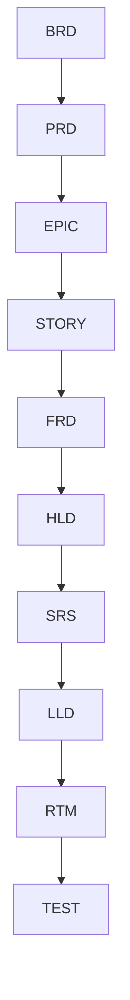

# ADR-002: Documentation Standards Governance

## Title Page

| Field     | Value                                                  |
| --------- | ------------------------------------------------------ |
| ADR ID    | ADR-002                                                |
| Title     | Documentation Standards Governance                     |
| Status    | Accepted                                               |
| Date      | Jan 2026                                               |
| Epic      | EPIC-ARCH-001 Ecosystem Design & Governance Baseline   |
| Story     | STORY-ARCH-004 Architecture Decision Baseline          |
| Author    | Sachin Salunke                                         |
| Reviewers | Platform Architect, Security Review, DevOps Governance |

---

## Revision History

| Version | Date     | Author                    | Description                                 |
| ------- | -------- | ------------------------- | ------------------------------------------- |
| 1.0     | Jan 2026 | Sachin Salunke            | Initial ADR                                 |
| 1.1     | Jan 2026 | Architecture Review Board | Documentation Governance Approved           |
| 1.2     | Jan 2026 | Sachin Salunke            | Documentation Governance Model Enhancements |

---

## Sign-Off

| Role               | Status   |
| ------------------ | -------- |
| Platform Architect | Approved |
| Security Review    | Approved |
| DevOps Governance  | Approved |

---

## 1. Context

StarOne Galaxy spans multiple domains, repositories, services, and engineering teams.

Without a standardized documentation model, architecture artifacts become inconsistent, difficult to review, and impossible to trace back to business objectives.

The ecosystem requires:

- Consistent documentation structure
- Standard lifecycle progression
- ISO/IEEE aligned artifacts
- Architecture traceability
- Reusable templates
- Governance review controls

A formal documentation governance model is required to establish a single documentation operating standard across the ecosystem.

The governance model shall support both current and future business domains without requiring changes to the documentation operating framework.

---

## 2. Problem Statement

How should documentation be structured and governed across StarOne Galaxy to ensure:

- Consistency
- Traceability
- Auditability
- Reusability
- Architectural integrity
- Long-term maintainability

while supporting both DHS and Bookshow domains under a common governance framework?

---

## 3. Decision Drivers

| Driver                 | Priority |
| ---------------------- | -------- |
| Traceability           | Critical |
| Governance Consistency | Critical |
| Auditability           | Critical |
| Reusability            | High     |
| Reviewability          | High     |
| Compliance             | High     |
| Standardization        | High     |
| Scalability            | Medium   |
| Documentation-as-Code  | Critical |

---

## 4. Considered Options

### Option 1 – Team-Specific Documentation

Each team creates its own document formats and lifecycle.

**Advantages**

- Flexible
- Fast initial creation

**Disadvantages**

- No consistency
- Difficult audits
- Poor traceability
- Governance drift

---

### Option 2 – Standardized Documentation Governance

All documentation follows a centrally governed lifecycle, template library, and traceability model.

**Advantages**

- Consistent structure
- Easier reviews
- Complete traceability
- Improved onboarding
- Governance compliance

**Disadvantages**

- Additional governance controls
- Requires template maintenance

---

### Option 3 – Tool-Generated Documentation Only

Generate architecture documents directly from tools and code.

**Advantages**

- Reduced manual effort

**Disadvantages**

- Limited business traceability
- Weak governance controls
- Insufficient architectural context

---

## 5. Decision

The governance model shall remain product-agnostic and reusable across all current and future StarOne Galaxy domains.

### Chosen Option

**Option 2 – Standardized Documentation Governance**

StarOne Galaxy shall maintain a centralized documentation governance model consisting of:

- Standard templates
- Traceability controls
- Review workflows
- Revision controls
- Architectural standards

All architecture and delivery artifacts shall follow the approved documentation lifecycle.

---

## 6. Documentation Lifecycle Model



Each artifact must reference its predecessor and successor where applicable.

---

## 7. Approved Documentation Standards

The approved template library represents the authoritative documentation baseline for the StarOne Galaxy ecosystem.

Future templates require Architecture Review and ADR approval before adoption.

The following templates are the official governance baseline.

```text
BRD_Template.md
PRD_Template.md
FRD_Template.md
HLD_Template.md
SRS_Template.md
LLD_Template.md
RTM_Template.md
ADR_Template.md
EPIC_Template.md
ISSUE_Template.md
MILESTONE_Template.md
PR_Template.md
README_Global_Template.md
README_MS_Template.md
```

No alternative template may be introduced without an approved ADR.

---

## 8. Governance Requirements

### Revision Control

Every document shall contain:

- Version
- Date
- Author
- Change History

---

### Sign-Off Controls

Every governed document shall contain:

- Review Authority
- Approval Status
- Approval Date

---

### Traceability Controls

All documents shall maintain traceability to upstream requirements.

Examples:

```text
BRD → PRD

PRD → EPIC

EPIC → STORY

STORY → FRD

FRD → HLD

HLD → SRS

SRS → LLD

LLD → RTM
```

---

### Visual Standards

Approved visual notation:

- Mermaid Flowcharts
- Mermaid Sequence Diagrams
- Mermaid ERDs
- Mermaid State Diagrams
- Mermaid C4-style Views

Visual consistency is mandatory.

---

## 9. Documentation Governance Principles

### Principle 1

Documentation is treated as code.

---

### Principle 2

Every architectural decision must be traceable.

---

### Principle 3

Templates are centrally governed.

---

### Principle 4

Documentation must be version controlled.

---

### Principle 5

Architecture artifacts are subject to review and approval.

---

### Principle 6

Documentation shall precede implementation for all governed initiatives.

---

### Principle 7

Documentation governance shall support future domain expansion without requiring structural redesign.

---

## 10. Consequences

### Positive Consequences

- Consistent documentation structure
- Improved onboarding
- Better audit readiness
- Strong requirement traceability
- Reduced documentation drift
- Easier governance automation
- Consistent architecture review process
- Improved cross-domain knowledge sharing

---

### Negative Consequences

- Additional review effort
- Template maintenance overhead
- Governance compliance enforcement required
- Increased documentation effort during planning phases

---

## 11. Compliance Impact

This decision supports:

- ISO/IEC/IEEE 29148
- IEEE 1016
- Documentation-as-Code
- Architecture Governance
- Traceability Compliance
- Review Governance
- Documentation Lifecycle Governance
- Architecture Review Governance

---

## 12. Traceability

| Source       | Reference                               |
| ------------ | --------------------------------------- |
| Epic         | EPIC-ARCH-001                           |
| Story        | STORY-ARCH-004                          |
| Related ADR  | ADR-001 Repository Taxonomy Governance  |
| Related ADR  | ADR-003 Governance Enforcement Controls |
| Source Story | STORY-ARCH-003 Documentation Standards  |

---

## 13. Implementation Guidance

All future architecture and delivery artifacts must use approved governance templates.

Template modifications require Architecture Review Board approval and must be recorded through an Architecture Decision Record.

All newly introduced business domains shall adopt the approved documentation governance model and template library before delivery activities begin.

---

## 14. References

- EPIC-ARCH-001 Ecosystem Design & Governance Baseline
- STORY-ARCH-003 Documentation Standards
- ADR-001 Repository Taxonomy Governance
- ISO/IEC/IEEE 29148
- IEEE 1016
- BRD Template
- PRD Template
- FRD Template
- HLD Template
- SRS Template
- LLD Template
- RTM Template
- ADR Template
- README Templates
- Mermaid Standards

---

## ADR Outcome

**Accepted**

This ADR establishes the official documentation governance model for the StarOne Galaxy ecosystem.

The decision becomes the authoritative architectural baseline governing:

- Documentation lifecycle management
- Documentation-as-Code
- Template governance
- Architecture traceability
- Review governance
- Documentation compliance

All future documentation standards shall align with this approved architecture decision unless superseded by a subsequent ADR.
