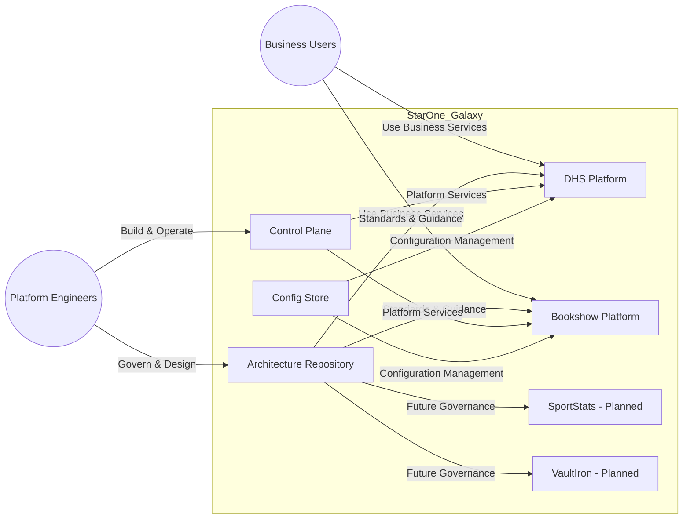

# C4-001 StarOne Galaxy System Context

> C4 Model Level 1 — System Context Diagram

---

# Metadata

| Field         | Value                             |
| ------------- | --------------------------------- |
| Document ID   | C4-001                            |
| Document Name | StarOne Galaxy System Context     |
| Repository    | starone-galaxy-architecture       |
| Domain        | Architecture                      |
| Document Type | C4 Level 1 System Context Diagram |
| Version       | 1.0.0                             |
| Status        | Draft                             |
| Author        | Sachin Salunke                    |
| Date          | 2026-05-01                        |
| Linked Epic   | EPIC-ARCH-001                     |
| Linked Story  | STORY-ARCH-002                    |
| Linked Issue  | S2-I03                            |
| Requirement   | S2-FR-002                         |

---

# Revision History

| Version | Date       | Author         | Description                    |
| ------- | ---------- | -------------- | ------------------------------ |
| 1.0     | 2026-05-01 | Sachin Salunke | Initial System Context Diagram |

---

# Sign-Off

| Role               | Status  |
| ------------------ | ------- |
| Platform Architect | Pending |
| Security Review    | Pending |
| DevOps Governance  | Pending |

---

# 1. Purpose

This document defines the official C4 Level 1 System Context Diagram for the StarOne Galaxy ecosystem.

The objective of this model is to provide a high-level view of:

- External actors
- System boundaries
- Platform services
- Governance relationships
- Domain interactions
- Future ecosystem expansion points

The context model serves as the architectural entry point for engineers, architects, governance teams, and stakeholders.

---

# 2. Scope

This model covers:

- Business Users
- Platform Engineers
- Architecture Repository
- Control Plane
- Configuration Store
- DHS Platform
- Bookshow Platform
- Future Ecosystem Domains

This model intentionally excludes:

- Internal service decomposition
- Runtime deployment topology
- Service-to-service interactions
- Domain dependency mappings
- Infrastructure implementation details

These concerns are addressed by subsequent architecture artifacts.

---

# 3. External Actors

| Actor              | Description                                       |
| ------------------ | ------------------------------------------------- |
| Business Users     | Consume business-facing applications and services |
| Platform Engineers | Build, operate, govern, and evolve the ecosystem  |

---

# 4. Internal Systems

| System                      | Description                                       |
| --------------------------- | ------------------------------------------------- |
| starone-galaxy-architecture | Architecture governance and source of truth       |
| starone-galaxy-infra        | Shared control plane and platform services        |
| starone-galaxy-config       | Centralized configuration management              |
| starone-dhs-system          | Enterprise OMS platform                           |
| starone-bookshow-system     | Consumer ticketing platform                       |
| sportstats                  | Planned analytics platform                        |
| vaultiron                   | Planned credential and secret management platform |

---

# 5. StarOne Galaxy Ecosystem Context Diagram

---

# 6. Relationship Descriptions

## 6.1 Business Users → DHS Platform

Business users interact with the DHS platform to consume enterprise order management capabilities.

Examples:

- Order Management
- Inventory Management
- Enterprise Operations

---

## 6.2 Business Users → Bookshow Platform

Business users interact with the Bookshow platform to consume ticketing and entertainment services.

Examples:

- Event Discovery
- Ticket Booking
- Customer Transactions

---

## 6.3 Platform Engineers → Architecture Repository

Platform engineers use the Architecture Repository as the authoritative source of truth for:

- Architecture Decisions (ADRs)
- Governance Standards
- Architecture Models
- Design Artifacts
- Traceability Documentation

---

## 6.4 Platform Engineers → Control Plane

Platform engineers use the Control Plane to:

- Build Applications
- Deploy Services
- Operate Infrastructure
- Manage Kubernetes Resources
- Execute CI/CD Pipelines

---

## 6.5 Architecture Repository → Runtime Domains

The Architecture Repository provides governance guidance to all ecosystem domains.

Responsibilities include:

- Documentation Standards
- Architecture Standards
- Security Standards
- Review Processes
- Traceability Requirements

---

## 6.6 Control Plane → Runtime Domains

The Control Plane provides shared platform capabilities.

Examples:

- Kubernetes Platform Services
- Deployment Automation
- CI/CD Pipelines
- Runtime Governance
- Operational Controls

---

## 6.7 Config Store → Runtime Domains

The Config Store provides centralized configuration management.

Capabilities include:

- Environment Configuration
- Configuration Inheritance
- Centralized Property Management
- Secure Configuration Distribution

---

## 6.8 Future Domains

Future ecosystem domains are represented for strategic planning purposes.

### SportStats

Planned sports analytics platform.

### VaultIron

Planned credential and secret management platform.

These domains are currently informational and do not participate in active ecosystem dependencies.

---

# 7. Architectural Decisions

| ADR     | Decision                             |
| ------- | ------------------------------------ |
| ADR-001 | Documentation-as-Code                |
| ADR-002 | Platform First Governance            |
| ADR-003 | Domain Isolation                     |
| ADR-004 | Centralized Configuration Management |
| ADR-005 | Shared Platform Control Plane        |

---

# 8. Assumptions

The following assumptions apply:

- All runtime domains follow governance standards defined by the Architecture Repository.
- Shared platform services are provided through the Control Plane.
- Configuration management is centralized through the Config Store.
- Future domains will adopt existing governance and platform standards.
- Business domains remain independently governed and deployed.

---

# 9. References

| Artifact                | Purpose                       |
| ----------------------- | ----------------------------- |
| README.md               | Ecosystem Entry Point         |
| C4-002 Container View   | Internal Repository Structure |
| Domain Dependency Map   | Domain Relationships          |
| Infrastructure Overview | Runtime Platform Architecture |
| ADR Repository          | Architecture Decisions        |
| Governance Standards    | Architecture Governance       |

---

# Traceability

| Epic          | Story          | Issue  | Requirement |
| ------------- | -------------- | ------ | ----------- |
| EPIC-ARCH-001 | STORY-ARCH-002 | S2-I03 | S2-FR-002   |

---

# Related Deliverables

| Deliverable ID | Deliverable                          |
| -------------- | ------------------------------------ |
| D1             | C4-001 StarOne Galaxy System Context |
| D2             | Mermaid System Context Diagram       |
| D3             | README Context Navigation            |

---

Architectural Source of Truth — StarOne Galaxy Ecosystem Context Model
