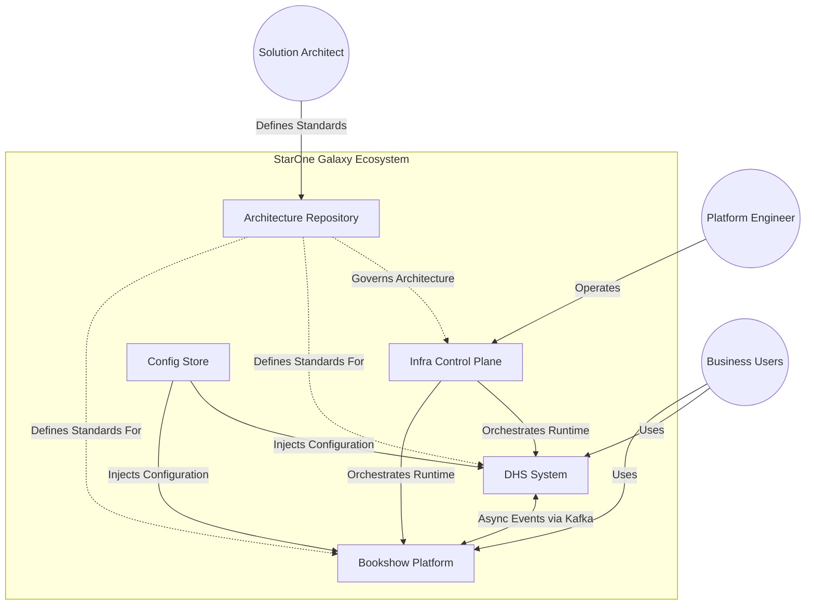
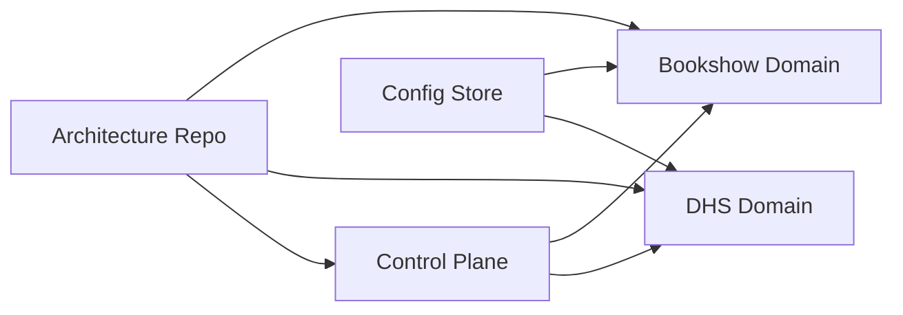

# C4-001 System Context Diagram
**Document ID:** C4-001  
**Artifact Type:** C4 Level 1 – System Context  
**Repository:** starone-galaxy-architecture  
**Parent Epic:** EPIC-ARCH-001 Ecosystem Design & Governance Baseline  
**Parent Story:** STORY-ARCH-003 — Global Ecosystem README  
**Issue:** S2-I02 Build C4 Context Diagram  
**Author:** Sachin Salunke  
**Version:** 1.0  
**Status:** Ready for Architecture Review

---

# Revision History

| Version | Date | Author | Description |
|---|---|---|---|
| 1.0 | Jan 2026 | Sachin Salunke | Initial C4 Context Baseline |
| 1.1 | Jan 2026 | Platform Architecture | Review Corrections Applied |

---

# Sign-Off

| Role | Status |
|---|---|
| Platform Architect | Pending |
| Security Review | Pending |
| DevOps Governance | Pending |

---

# 1. Purpose

The **System Context Diagram** is the architectural entry point into StarOne Galaxy.

It defines:

- Primary engineering actors
- System-of-interest boundary
- External and internal systems
- Dependency relationships
- Domain boundaries
- Governance interactions

---

# 2. Scope

This diagram covers:

- Shared Control Plane
- Config Store
- Architecture Source-of-Truth
- DHS Domain
- Bookshow Domain
- Engineering actors
- Cross-domain event interactions

Out of Scope:

- Container internals (C4 Level 2)
- Component decomposition
- Runtime deployment topology

---

# 3. Actors and Systems

| Entity | Type | Responsibility |
|---|---|---|
| Platform Engineer | Person | Operates platform and infrastructure |
| Solution Architect | Person | Defines architecture standards |
| Business Users | External Actor | Consume DHS / Bookshow services |
| Architecture Repository | System | Source-of-truth for architecture |
| Control Plane | System | Shared infrastructure governance |
| Config Store | System | Centralized encrypted configuration |
| DHS System | System | Enterprise OMS domain |
| Bookshow Platform | System | Consumer ticketing domain |

---

# 4. C4 System Context Diagram



---

# 5. System Boundary Definition

## System of Interest
**StarOne Galaxy Ecosystem**

Contains:

- Shared governance services
- Shared platform services
- Enterprise domain services
- Consumer domain services

Boundary Purpose:

- Demonstrates domain isolation
- Shows governance ownership
- Defines platform relationships

---

# 6. Dependency Relationships

## Core Dependency Model



---

## Dependency Rules

| Dependency | Relationship |
|---|---|
Architecture -> Domains | Governance dependency |
Infra -> Domains | Runtime dependency |
Config -> Domains | Configuration dependency |
DHS <-> Bookshow | Event dependency |

---

# 7. Context Narrative

## Architecture Repository
Acts as the **architectural executive branch**, containing:

- ADRs
- HLDs
- SRS specifications
- Standards
- Traceability controls

Provides governance across all domains.

---

## Infra Control Plane
Responsible for:

- Kubernetes governance
- Shared CI/CD
- Runtime security controls
- Shared operational services

Acts as shared platform foundation.

---

## Config Store
Provides:

- Centralized configuration
- JCE-encrypted secrets
- Domain config inheritance
- Secure runtime properties

Single configuration source-of-truth.

---

## DHS System
Represents enterprise domain:

- Modular Maven architecture
- OMS responsibilities
- Event-driven transactions
- Domain-isolated services

Enterprise-focused workload.

---

## Bookshow Platform
Represents greenfield consumer domain:

- Independent microservices
- Ticketing workloads
- Event-driven integrations

Consumer-focused workload.

---

# 8. Architectural Principles Demonstrated

This context model enforces:

- Platform First Architecture
- Domain Isolation
- Documentation-as-Code
- Shared Control Plane
- Event-Driven Integration
- Governance by Design

---

# 9. Distributed Transaction Rule

All cross-domain transactions implied by this model must use:

- Saga Pattern
- Compensating Transactions
- Kafka Event Traceability

No shared database transactions permitted.

---

# 10. Review Checklist

## C4 Modeling Validation

- [x] Actor(s) modeled
- [x] External users modeled
- [x] System boundary modeled
- [x] Relationships labeled
- [x] Dependency interactions shown
- [x] Domain isolation visible
- [x] Technology context included
- [x] Governance interactions modeled

---

## Issue S2-I02 Acceptance Checklist

- [x] Context diagram created
- [x] Domain boundaries modeled
- [x] External actors identified
- [x] Dependency relationships shown
- [x] Artifact located under /architecture/c4/
- [x] Architecture review checklist included

Issue Ready For Closure: ✅

---

# 11. Traceability

| Product Vision | Epic | Story | Issue | Artifact |
|---|---|---|---|---|
Architectural Source of Truth | EPIC-001 | S2 | S2-I02 | C4-001 |

Coverage: 100%

---

# 12. File Placement

Store artifact at:

```text id="4uhff8"
/architecture/c4/C4-001-System-Context.md
```

Optional index:

```text id="0cbx5j"
/architecture/c4/README.md
```

---

# 13. Future C4 Progression

This Level-1 artifact feeds:

```text id="c6vvj5"
C4-002 Container Diagram
C4-003 Component Views
HLD-001 Global Ecosystem Architecture
```


---

# 14. Risks

| Risk | Mitigation |
|---|---|
Context drift | Architecture review cadence |
Boundary ambiguity | Governance ownership model |
Dependency sprawl | Domain isolation controls |

---

# 15. Definition of Done

Artifact complete when:

- Diagram renders successfully
- Review comments addressed
- Platform Architect approves
- Linked to Story S2
- PR merged

Status: **Ready for PR**

---

