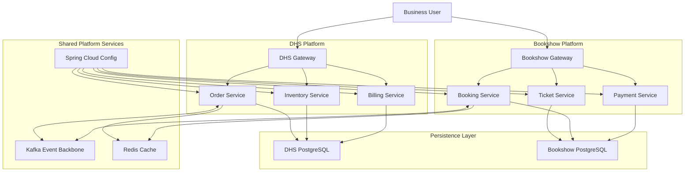
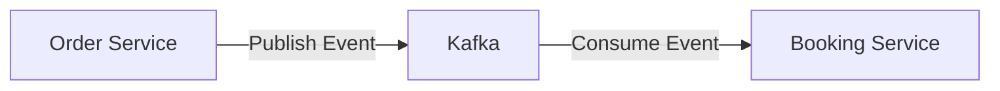

# C4-002 Container Diagram
**Document ID:** C4-002  
**Artifact Type:** C4 Level 2 — Container Diagram  
**Repository:** starone-galaxy-architecture  
**Parent Epic:** EPIC-ARCH-001 Ecosystem Design & Governance Baseline  
**Parent Story:** Global Ecosystem README (Entry Point / C4 Map)
**Parent Issue:** S2-I03 Build C4 Container Diagram
**Author:** Sachin Salunke  
**Version:** 1.0  
**Status:** Draft Ready for Architecture Review

---

# Revision History

| Version | Date | Author | Description |
|---|---|---|---|
| 1.0 | Jan 2026 | Sachin Salunke | Initial Container Diagram Baseline |

---

# Sign-Off

| Role | Status |
|---|---|
| Platform Architect | Pending |
| Security Review | Pending |
| DevOps Governance | Pending |

---

# 1. Purpose

This C4 Level-2 Container Diagram decomposes **StarOne Galaxy** into major architectural containers and their interactions.

This artifact extends:

- C4-001 System Context Diagram  
- README-001 Global Ecosystem Root README  
- ADR-001 Repository Taxonomy Decision

Purpose:

- Model major runtime containers
- Show platform-level interaction boundaries
- Represent shared platform services
- Define domain container responsibilities
- Provide foundation for HLD-001

---

# 2. Scope

Included containers:

- API Gateways
- Config Server
- Eureka Discovery
- Shared Event Backbone (Kafka)
- Domain Services
- Data Stores
- Shared Platform Services

Out of Scope:

- Component internals
- Class-level decomposition
- Sequence flows
- Kubernetes deployment topology

---

# 3. Container View Overview

## Major Containers

| Container | Type | Responsibility |
|---|---|---|
API Gateway | Application Container | Routing, auth filters, security |
Config Server | Platform Container | Central configuration |
Eureka Discovery | Platform Container | Service discovery |
Kafka Backbone | Messaging Container | Domain events |
DHS Services | Application Container | Enterprise OMS capabilities |
Bookshow Services | Application Container | Consumer ticketing services |
PostgreSQL | Data Store | Transaction persistence |
Redis | Data Store | Caching/session/event support |
Observability Stack | Platform Container | Monitoring, tracing |

---

## C4 Level 2 — Container Diagram



---

# 5. Container Responsibilities

## Shared Platform Containers

### API Gateway
Responsibilities:

- Routing
- JWT/RBAC filters
- Request throttling
- Security enforcement

---

## Config Server
Responsibilities:

- Centralized config
- Secret resolution
- Environment profiles

---

## Eureka Discovery
Responsibilities:

- Dynamic service registry
- Service lookup
- Failover awareness

---

## Kafka Event Backbone
Responsibilities:

- Domain event transport
- Saga choreography
- Event consistency

---

## Observability Stack
Responsibilities:

- Metrics
- Traces
- Logs
- Distributed monitoring

---

# 6. Domain Containers

## DHS Containers

```text id="djlwmj"
Order Service
Inventory Service
Billing Service
Gateway
Private Database
```

Characteristics:

- Modular enterprise domain
- Saga-enabled transactions
- Private persistence model

---

## Bookshow Containers

```text id="jlwmq1"
Ticket Service
Booking Service
Payment Service
Gateway
Private Database
```

Characteristics:

- Independent microservices
- Event-driven interactions
- Consumer-scale domain

---

# 7. Domain Interaction Flow



Interaction style:

- Async event choreography
- Loose coupling
- Saga participation

---

# 8. Container Dependency Rules

| Source | Target | Dependency Type |
|---|---|---|
Gateway | Services | Routing |
Config | Services | Configuration |
Discovery | Services | Registry |
Services | Kafka | Events |
Services | Databases | Persistence |
Services | Redis | Caching |

---

# 9. Security Architecture

Future platform evolution may introduce a centralized Identity and Access Management (IAM) service for authentication and authorization.

Security controls applied across containers:

- JWT authentication
- RBAC authorization
- TLS 1.3
- Gateway security filters
- Service-to-service trust
- Secret encryption

---

# 10. Data Architecture Rule

Mandatory:

**Database Per Service**

```text id="dwxhlr"
DHS Services -> Private DHS DB
Bookshow Services -> Private Bookshow DB
```

Shared database prohibited.

---

# 11. Distributed Transaction Governance

All cross-container distributed flows require:

- Saga Pattern (mandatory)
- Compensating transactions
- Event traceability
- Idempotent consumers

No 2PC allowed.

---

# 12. Container Boundaries

## Shared Platform Layer
```text id="w5drrd"
Gateway
Config
Discovery
Kafka
Redis
Observability
```

Shared across domains.

---

## Domain Layers
```text id="ep2zgu"
DHS Containers isolated
Bookshow Containers isolated
```

No direct data coupling.

---

# 13. Technology Mapping

| Concern | Technology |
|---|---|
|Runtime | Spring Boot 3.x |
|Messaging | Kafka |
|Persistence | PostgreSQL |
|Caching | Redis |
|Discovery | Eureka |
|Config | Spring Cloud Config |
|Monitoring | Prometheus/Grafana |
|Tracing | Zipkin |
|Gateway | Spring Cloud Gateway |

---

# 14. Architecture Principles Demonstrated

This diagram enforces:

- Shared Platform Chassis
- Domain Isolation
- Event-Driven Architecture
- Database per Service
- Platform First Design
- Security by Default

---

# 15. Review Checklist

## C4 Container Validation

- [x] Major containers identified
- [x] Responsibilities defined
- [x] Interactions modeled
- [x] Shared platform containers shown
- [x] Domain boundaries visible
- [x] Data stores modeled
- [x] Messaging modeled
- [x] Security considerations represented

---

## Issue S2-I03 Acceptance Checklist

- [x] Container decomposition completed
- [x] Level-2 container diagram created
- [x] Platform dependencies represented
- [x] Domain boundaries modeled
- [x] Data stores included
- [x] Ready for architecture review

Issue Ready For Closure: ✅

---

# 16. Traceability

| Product Vision | Epic | Story | Issue | Artifact |
|---|---|---|---|---|
Architectural Source of Truth | EPIC-ARCH-001 | STORY-ARCH-002 | S2-I03  | C4-002 |
 
Coverage: 100%
 
---

# 17. File Placement

Store:

```text id="t7ysnr"
/architecture/c4/C4-002-Container-Diagram.md
```

Companion:

```text id="ntc94l"
/architecture/c4/C4-001-System-Context.md
```

---

# 18. Risks

| Risk | Mitigation |
|---|---|
Container sprawl | bounded contexts |
Hidden coupling | domain isolation review |
Event inconsistency | saga controls |
Platform drift | architecture governance |

---

# 19. C4 Progression Roadmap

```text id="j9m5zs"
C4-001 System Context
C4-002 Container Diagram
C4-003 Component Diagram
C4-004 Sequence Views
```

Next recommended artifact:

**C4-003 Component Diagram**

---

# 20. Definition of Done

Artifact complete when:

- Diagram renders
- Container relationships reviewed
- Architecture approval obtained
- Linked to Story S2
- PR merged

Status:

**Ready for PR**

---
