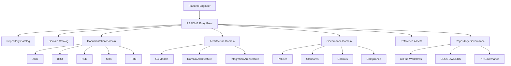

# C4-002 StarOne Galaxy Container View

> C4 Model Level 2 — Container Diagram

---

# Metadata

| Field         | Value                         |
| ------------- | ----------------------------- |
| Document ID   | C4-002                        |
| Document Name | StarOne Galaxy Container View |
| Repository    | starone-galaxy-architecture   |
| Domain        | Architecture                  |
| Document Type | C4 Level 2 Container Diagram  |
| Version       | 1.0.0                         |
| Status        | Draft                         |
| Author        | Sachin Salunke                |
| Date          | 2026-05-01                    |
| Linked Epic   | EPIC-ARCH-001                 |
| Linked Story  | STORY-ARCH-002                |
| Linked Issue  | S2-I04                        |
| Requirement   | S2-FR-003                     |

---

# Revision History

| Version | Date       | Author         | Description            |
| ------- | ---------- | -------------- | ---------------------- |
| 1.0     | 2026-05-01 | Sachin Salunke | Initial Container View |

---

# Sign-Off

| Role               | Status  |
| ------------------ | ------- |
| Platform Architect | Pending |
| Security Review    | Pending |
| DevOps Governance  | Pending |

---

# 1. Purpose

This document defines the official C4 Level 2 Container View for the StarOne Galaxy Architecture Repository.

The objective of this model is to provide visibility into the major architecture containers that compose the repository and demonstrate how engineers navigate architecture, documentation, governance, and repository automation assets.

This view serves as the primary repository architecture model and provides the foundation for architecture onboarding, governance discovery, and future dependency mapping.

---

# 2. Scope

This model covers:

- README Entry Point
- Repository Catalog
- Domain Catalog
- Documentation Domain
- Architecture Domain
- Governance Domain
- Reference Assets
- Repository Governance Automation

This model intentionally excludes:

- Runtime architecture
- Microservice topology
- Infrastructure deployment models
- Domain dependency mappings
- Integration architecture
- Service-to-service communication

These concerns are addressed in subsequent architecture artifacts.

---

# 3. Repository Containers

## 3.1 README Entry Point

The primary ecosystem navigation entry point.

Responsibilities:

- Ecosystem discovery
- Repository navigation
- Domain navigation
- Governance navigation
- Architecture onboarding

---

## 3.2 Repository Catalog

Provides visibility into ecosystem repositories.

Responsibilities:

- Repository discovery
- Repository ownership
- Repository responsibility mapping
- Platform topology visibility

---

## 3.3 Domain Catalog

Provides visibility into ecosystem domains.

Responsibilities:

- Domain discovery
- Domain ownership visibility
- Domain boundaries
- Future domain planning

---

## 3.4 Documentation Domain

Stores requirements, architecture, design, and traceability artifacts.

Artifacts include:

- ADR
- BRD
- PRD
- FRD
- HLD
- LLD
- SRS
- RTM

---

## 3.5 Architecture Domain

Stores architecture models and architecture documentation.

Artifacts include:

- C4 Models
- Domain Architecture
- Integration Architecture
- Architecture Decisions

---

## 3.6 Governance Domain

Stores governance and compliance assets.

Artifacts include:

- Policies
- Standards
- Controls
- Compliance Documentation

---

## 3.7 Reference Assets

Stores reusable assets and supporting materials.

Artifacts include:

- Diagrams
- Examples
- Samples
- Onboarding Assets
- Reference Material

---

## 3.8 Repository Governance

Provides repository-level governance automation.

Artifacts include:

- GitHub Workflows
- CODEOWNERS
- Pull Request Governance
- Review Controls

---

# 4. Container Diagram



---

# 5. Container Relationship Descriptions

## 5.1 Platform Engineer → README Entry Point

The README serves as the primary navigation hub into the StarOne Galaxy ecosystem and provides structured access to all architecture, governance, and documentation domains.

---

## 5.2 README → Repository Catalog

Provides repository discovery and ownership visibility across the ecosystem.

---

## 5.3 README → Domain Catalog

Provides visibility into domain boundaries, responsibilities, and ecosystem organization.

---

## 5.4 README → Documentation Domain

Provides access to requirements, design, architecture, and traceability artifacts.

---

## 5.5 README → Architecture Domain

Provides access to architecture models, C4 diagrams, domain architecture, and integration architecture.

---

## 5.6 README → Governance Domain

Provides access to governance policies, standards, controls, and compliance documentation.

---

## 5.7 README → Reference Assets

Provides reusable onboarding materials, examples, diagrams, and supporting references.

---

## 5.8 README → Repository Governance

Provides visibility into repository automation and governance controls.

---

## 5.9 Repository Governance → Governance Controls

Repository governance automation ensures:

- Pull request compliance
- Ownership enforcement
- Review workflows
- Approval controls
- SDLC governance adherence

---

# 6. Repository Navigation Flow

The repository follows a structured navigation model designed to simplify architecture discovery and onboarding.

Navigation path:

```text
README
│
├── Repository Catalog
├── Domain Catalog
│
├── Documentation Domain
│   ├── ADR
│   ├── BRD
│   ├── PRD
│   ├── FRD
│   ├── HLD
│   ├── LLD
│   ├── SRS
│   └── RTM
│
├── Architecture Domain
│   ├── C4 Models
│   ├── Domain Architecture
│   └── Integration Architecture
│
├── Governance Domain
│   ├── Policies
│   ├── Standards
│   ├── Controls
│   └── Compliance
│
├── Reference Assets
│
└── Repository Governance
    ├── GitHub Workflows
    ├── CODEOWNERS
    └── PR Governance
```

---

# 7. Architectural Decisions

| ADR     | Decision                             |
| ------- | ------------------------------------ |
| ADR-001 | Documentation-as-Code                |
| ADR-002 | Platform First Governance            |
| ADR-003 | Repository Navigation Through README |
| ADR-004 | Centralized Architecture Governance  |
| ADR-005 | Repository Automation Governance     |

---

# 8. Assumptions

The following assumptions apply:

- README remains the primary navigation entry point.
- All architecture artifacts are maintained within the Architecture Domain.
- Governance assets are centrally managed.
- Repository automation is enforced through governance controls.
- Documentation standards are applied consistently across all artifacts.

---

# 9. References

| Artifact                                | Purpose                   |
| --------------------------------------- | ------------------------- |
| README.md                               | Ecosystem Entry Point     |
| C4-001-StarOne-Galaxy-System-Context.md | System Context Model      |
| Domain Dependency Map                   | Domain Relationships      |
| Integration Architecture                | Cross-Domain Integrations |
| Governance Standards                    | Governance Controls       |
| Architecture Decision Records           | Architecture Decisions    |

---

# 10. Traceability

| Epic          | Story          | Issue  | Requirement |
| ------------- | -------------- | ------ | ----------- |
| EPIC-ARCH-001 | STORY-ARCH-002 | S2-I04 | S2-FR-003   |

---

# Related Deliverables

| Deliverable ID | Deliverable                          |
| -------------- | ------------------------------------ |
| D1             | C4-002 StarOne Galaxy Container View |
| D2             | Mermaid Container Diagram            |
| D3             | Repository Navigation Mapping        |

---

# Success Criteria Alignment

This model provides:

- Repository architecture visualization
- Documentation domain discoverability
- Governance domain discoverability
- Repository navigation guidance
- Architecture onboarding support
- Foundation for dependency mapping
- Foundation for governance navigation

---

Architectural Source of Truth — StarOne Galaxy Repository Container Architecture Model
