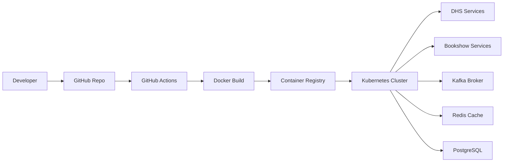

# C4-003: Deployment Architecture

---

## Title Page

| Field | Value |
|---|---|
| Document ID | C4-003 |
| Project | StarOne Galaxy |
| View | C4 Level 3 - Deployment View |
| Author | Sachin Salunke |
| Date | Jan 2026 |
| Version | 1.0 |
| Status | Draft |

---

## Revision History

| Version | Date | Author | Description |
|---|---|---|---|
| 1.0 | Jan 2026 | Sachin Salunke | Initial Deployment Architecture |

---

## Sign-Off

| Role | Status |
|---|---|
| Platform Architect | Pending |
| Security Review | Pending |
| DevOps Governance | Pending |

---

# 1. Purpose

This deployment architecture defines the runtime topology of the StarOne Galaxy ecosystem.

The objective is to provide a deployment-level view of:

- CI/CD workflow
- Container lifecycle
- Kubernetes deployment topology
- Runtime services
- Infrastructure dependencies

This view represents the C4 Deployment Architecture layer.

---

# 2. Deployment Overview

The StarOne Galaxy ecosystem follows a containerized cloud-native deployment model.

The deployment pipeline consists of:

```text
Developer
→ GitHub
→ GitHub Actions
→ Docker Build
→ Container Registry
→ Kubernetes Cluster
→ Runtime Services
```

All business services are deployed as containers and managed by Kubernetes.

---

# 3. Deployment Architecture Diagram



---

# 4. CI/CD Pipeline Flow

## Source Control

GitHub acts as the central source control system.

Responsibilities:

- Source code management
- Pull request reviews
- Branch governance
- Workflow triggering

---

## Continuous Integration

GitHub Actions provides:

- Build automation
- Validation checks
- Unit testing
- Artifact generation

---

## Container Build

Docker images are generated from application source code.

Responsibilities:

- Packaging applications
- Versioned image creation
- Deployment artifact generation

---

## Container Registry

The registry stores deployable container images.

Responsibilities:

- Image versioning
- Artifact distribution
- Deployment source

---

# 5. Kubernetes Runtime Topology

The Kubernetes cluster acts as the runtime execution environment.

Responsibilities:

- Container orchestration
- Service scaling
- Self-healing
- Service discovery

---

## Runtime Workloads

### DHS Domain

Hosts:

```text
Order Services
Validation Services
Billing Services
Dispatch Services
```

---

### Bookshow Domain

Hosts:

```text
Booking Services
Payment Services
Ticketing Services
```

---

# 6. Supporting Infrastructure Components

## Kafka

Purpose:

```text
Event-driven messaging backbone
```

Responsibilities:

- Event publishing
- Event consumption
- Asynchronous workflows

---

## Redis

Purpose:

```text
Distributed caching layer
```

Responsibilities:

- Cache management
- Performance optimization
- Session storage

---

## PostgreSQL

Purpose:

```text
Primary persistence layer
```

Responsibilities:

- Transactional storage
- Domain data management
- Service persistence

---

# 7. Runtime Dependency Model

```text
GitHub Actions
        ↓
Docker Build
        ↓
Container Registry
        ↓
Kubernetes Cluster
        ↓
Business Services
        ↓
Infrastructure Services
```

Infrastructure services:

```text
Kafka
Redis
PostgreSQL
```

support runtime workloads deployed inside the cluster.

---

# 8. Deployment Principles

The deployment architecture follows:

- Container-first deployment
- Kubernetes-native operations
- Infrastructure abstraction
- Domain isolation
- Independent service deployment
- Automated CI/CD workflows

---

# 9. Traceability

| Epic | Story | Issue |
|---|---|---|
| EPIC-ARCH-001 | STORY-ARCH-004 | S4-I01 |

---

# 10. Conclusion

This deployment architecture provides a deployment-level view of the StarOne Galaxy ecosystem.

It defines:

- CI/CD pipeline flow
- Container deployment lifecycle
- Kubernetes runtime topology
- Service deployment structure
- Supporting infrastructure dependencies

This document serves as the deployment reference for future runtime, infrastructure, and platform design activities.

---