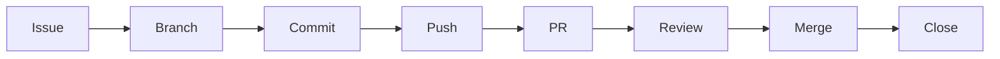

# STANDARD-002 — Branching & Contribution Governance

> **Standard ID:** STANDARD-002  
> **Title:** Branching & Contribution Governance  
> **Repository:** starone-galaxy-architecture  
> **Domain:** Governance Standards  
> **Author:** Sachin Salunke  
> **Version:** 1.0  
> **Date:** Jan 2026  
> **Status:** Approved Draft

---

# Revision History

| Version | Date     | Author         | Description                              |
| ------- | -------- | -------------- | ---------------------------------------- |
| 1.0     | Jan 2026 | Sachin Salunke | Initial contribution governance baseline |

---

# 1. Purpose

This standard defines the mandatory Git branching strategy, contribution workflow, pull request lifecycle, and governance controls across the StarOne Galaxy ecosystem.

The objective is to:

- Standardize engineering collaboration
- Enforce governance review gates
- Improve traceability
- Protect protected branches
- Enable CI/CD governance automation
- Maintain architectural integrity

---

# 2. Scope

Applies to:

- starone-galaxy-architecture
- starone-galaxy-infra
- starone-galaxy-config
- starone-dhs-system
- starone-bookshow-system

Covers:

- Branch naming
- Pull requests
- Merge strategy
- Commit standards
- Review governance
- Traceability controls

---

# 3. Branching Strategy

## Primary Branches

| Branch  | Purpose                   |
| ------- | ------------------------- |
| main    | Production-ready baseline |
| develop | Active integration branch |

---

## Feature Branch Pattern

```text
feature/<issue-name>
```

Examples:

```text
feature/s1-i05-contribution-governance
feature/c4-container-diagram
```

---

## Hotfix Branch Pattern

```text
hotfix/<issue-name>
```

Examples:

```text
hotfix/fix-rttm-linkage
```

---

## Release Branch Pattern

```text
release/vX.Y.Z
```

Examples:

```text
release/v1.0.0
```

---

# 4. Branch Governance Rules

Mandatory:

- No direct commits to `main`
- No force push to protected branches
- PR approval required before merge
- Feature branches must originate from `develop`
- Branch names must follow naming standards
- Stale branches should be deleted after merge

---

# 5. Commit Message Standards

## Pattern

```text
type(scope): summary
```

---

## Approved Types

| Type     | Usage             |
| -------- | ----------------- |
| feat     | New feature       |
| docs     | Documentation     |
| fix      | Bug fix           |
| ci       | CI/CD             |
| chore    | Governance/config |
| refactor | Refactoring       |

---

## Examples

```text
feat(repo): bootstrap architecture taxonomy
docs(standards): publish naming conventions
ci(workflows): add markdown validation workflow
```

---

# 6. Pull Request Governance

## Mandatory PR Sections

Every PR must include:

- Summary
- Scope
- Traceability
- Validation checklist

---

## Required Traceability

```markdown
Epic:
Story:
Issue:

Closes #<issue-number>
```

---

## PR Title Pattern

```text
[ISSUE-ID] Short Description
```

Examples:

```text
[S1-I04] Publish Enterprise Naming Standards
[S1-I05] Add Contribution Governance Baseline
```

---

# 7. Merge Strategy

Approved merge method:

✅ Squash and Merge

Reason:

- Cleaner governance history
- Better traceability
- Reduced commit noise
- Easier release auditing

---

# 8. Review Governance

## Mandatory Reviews

| Repository Area | Reviewer            |
| --------------- | ------------------- |
| Architecture    | Platform Architect  |
| Security        | Security Reviewer   |
| CI/CD           | DevOps Governance   |
| Standards       | Governance Reviewer |

---

# 9. Protected Branch Rules

Protected branches:

- main
- develop

Mandatory protections:

- PR required
- Review approval required
- Status checks required
- Conversation resolution required

---

# 10. Contribution Lifecycle



---

# 11. Project Workflow Governance

| Status      | Meaning       |
| ----------- | ------------- |
| Backlog     | Planned       |
| Ready       | Sprint-ready  |
| In Progress | Active branch |
| Review      | PR Open       |
| Done        | PR Merged     |
| Closed      | Released      |

---

# 12. Governance Enforcement

Future automation will enforce:

- Branch naming validation
- Conventional commits
- PR template validation
- Required reviewers
- Protected branch policies
- CI/CD validation gates

---

# 13. Exception Process

Deviation from governance standards requires:

- Architecture Review Board approval
- ADR reference
- Governance sign-off

---

# 14. Related Standards

| Standard        | Purpose              |
| --------------- | -------------------- |
| STANDARD-001    | Naming Conventions   |
| CODEOWNERS      | Ownership Governance |
| CONTRIBUTING.md | Contributor Workflow |
| ADR-001         | Repository Taxonomy  |

---

# 15. Approval

| Role               | Status   |
| ------------------ | -------- |
| Platform Architect | Approved |
| Security Review    | Pending  |
| DevOps Governance  | Pending  |

---

# 16. Traceability

| Epic          | Story          | Issue  | Requirement |
| ------------- | -------------- | ------ | ----------- |
| EPIC-ARCH-001 | STORY-ARCH-001 | S1-I05 | S1-FR-005   |

Coverage: 100%

---

Contribution Governance — Enabling Controlled Enterprise Collaboration.
