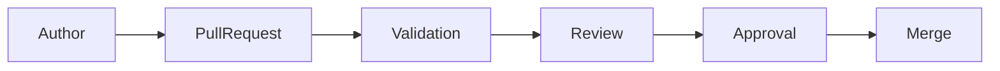
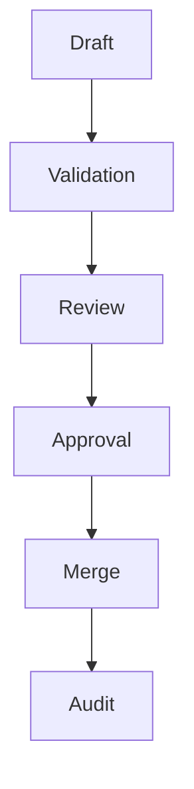

# STANDARD-003: Governance Enforcement Standard

---

## Title Page

<<<<<<< HEAD
| Field       | Value                           |
| ----------- | ------------------------------- |
| Standard ID | STANDARD-003                    |
| Title       | Governance Enforcement Standard |
| Domain      | Governance                      |
| Author      | Sachin Salunke                  |
| Date        | Jan 2026                        |
| Version     | 1.0                             |
| Status      | Superseded                      |
=======
| Field | Value |
|---|---|
| Standard ID | STANDARD-003 |
| Title | Governance Enforcement Standard |
| Domain | Governance |
| Author | Sachin Salunke |
| Date | Jan 2026 |
| Version | 1.0 |
| Status | Superseded |
>>>>>>> 49dd583 (feat(governance): define governance enforcement configuration)

---

## Revision History

<<<<<<< HEAD
| Version | Date     | Author         | Description                             |
| ------- | -------- | -------------- | --------------------------------------- |
| 1.0     | Jan 2026 | Sachin Salunke | Initial Governance Enforcement Standard |
=======
| Version | Date | Author | Description |
|---|---|---|---|
| 1.0 | Jan 2026 | Sachin Salunke | Initial Governance Enforcement Standard |
>>>>>>> 49dd583 (feat(governance): define governance enforcement configuration)

---

## Sign-Off

<<<<<<< HEAD
| Role               | Status  |
| ------------------ | ------- |
| Platform Architect | Pending |
| DevOps Governance  | Pending |
| Security Review    | Pending |
=======
| Role | Status |
|---|---|
| Platform Architect | Pending |
| DevOps Governance | Pending |
| Security Review | Pending |
>>>>>>> 49dd583 (feat(governance): define governance enforcement configuration)

---

# 1. Purpose

This standard defines how governance controls are enforced across StarOne Galaxy repositories.

It operationalizes governance standards established through:

- Repository Scaffolding
- Documentation Standards
- Traceability Standards

---

# 2. Scope

Applies to:

- Architecture Repository
- Domain Repositories
- Infrastructure Repositories
- Configuration Repositories

---

# 3. Governance Enforcement Model

---

# 4. Governance Control Areas

<<<<<<< HEAD
| Area                     | Purpose                          |
| ------------------------ | -------------------------------- |
| Repository Governance    | Ownership and review enforcement |
| Documentation Governance | Standards compliance             |
| Traceability Governance  | Requirement linkage validation   |
| Workflow Governance      | Automated policy enforcement     |
=======
| Area | Purpose |
|---|---|
| Repository Governance | Ownership and review enforcement |
| Documentation Governance | Standards compliance |
| Traceability Governance | Requirement linkage validation |
| Workflow Governance | Automated policy enforcement |
>>>>>>> 49dd583 (feat(governance): define governance enforcement configuration)

---

# 5. Governance Checkpoints

## Checkpoint 1 — Issue Creation

Validate:

- Issue template used
- Traceability defined
- Acceptance criteria defined

---

## Checkpoint 2 — Pull Request

Validate:

- PR template completed
- Story linked
- Issue linked

---

## Checkpoint 3 — Review

Validate:

- Governance review completed
- Standards followed

---

## Checkpoint 4 — Merge

Validate:

- Required approvals obtained
- Validation checks passed

---

# 6. Enforcement Ownership

<<<<<<< HEAD
| Area                   | Owner                |
| ---------------------- | -------------------- |
| Architecture Standards | Platform Architect   |
| Governance Standards   | DevOps Governance    |
| Security Controls      | Security Review      |
| Workflow Controls      | Platform Engineering |
=======
| Area | Owner |
|---|---|
| Architecture Standards | Platform Architect |
| Governance Standards | DevOps Governance |
| Security Controls | Security Review |
| Workflow Controls | Platform Engineering |
>>>>>>> 49dd583 (feat(governance): define governance enforcement configuration)

---

# 7. Governance Compliance Workflow

---

# 8. Governance Control Matrix

<<<<<<< HEAD
| Control                 | Enforcement Method   |
| ----------------------- | -------------------- |
| Documentation Standards | Validation Workflow  |
| Traceability Standards  | Review Check         |
| PR Governance           | Template Enforcement |
| Issue Governance        | Template Enforcement |
| Security Controls       | Security Validation  |
=======
| Control | Enforcement Method |
|---|---|
| Documentation Standards | Validation Workflow |
| Traceability Standards | Review Check |
| PR Governance | Template Enforcement |
| Issue Governance | Template Enforcement |
| Security Controls | Security Validation |
>>>>>>> 49dd583 (feat(governance): define governance enforcement configuration)

---

# 9. References

- STORY-ARCH-001 Repository Scaffolding
- STORY-ARCH-003 Documentation Standards
- STANDARD-001 Documentation Standard
- STANDARD-002 Traceability Standard

---

# 10. Traceability

<<<<<<< HEAD
| Epic     | Story          | Issue  |
| -------- | -------------- | ------ |
=======
| Epic | Story | Issue |
|---|---|---|
>>>>>>> 49dd583 (feat(governance): define governance enforcement configuration)
| EPIC-001 | STORY-ARCH-004 | S4-I01 |

Coverage: 100%

---

# 11. Conclusion

This standard establishes the governance enforcement baseline for all StarOne Galaxy repositories and serves as the foundation for governance automation workflows.

<<<<<<< HEAD
---
=======
---
>>>>>>> 49dd583 (feat(governance): define governance enforcement configuration)
