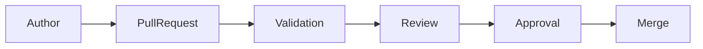

# STANDARD-004: Pull Request Governance Standard

---

## Title Page

| Field       | Value                            |
| ----------- | -------------------------------- |
| Standard ID | STANDARD-004                     |
| Title       | Pull Request Governance Standard |
| Domain      | Governance                       |
| Author      | Sachin Salunke                   |
| Date        | Jan 2026                         |
| Version     | 1.0                              |
| Status      | Superseded                       |

---

## Revision History

| Version | Date     | Author         | Description                    |
| ------- | -------- | -------------- | ------------------------------ |
| 1.0     | Jan 2026 | Sachin Salunke | Initial PR Governance Standard |

---

## Sign-Off

| Role               | Status  |
| ------------------ | ------- |
| Platform Architect | Pending |
| DevOps Governance  | Pending |
| Security Review    | Pending |

---

# 1. Purpose

This standard defines pull request governance requirements across all StarOne Galaxy repositories.

The objective is to ensure:

- Consistent reviews
- Requirement traceability
- Documentation quality
- Governance compliance

---

# 2. Scope

Applies to:

- Architecture repositories
- Domain repositories
- Infrastructure repositories
- Configuration repositories

---

# 3. Pull Request Governance Model



---

# 4. Mandatory Pull Request Sections

Every pull request shall include:

- Summary
- Business Justification
- Scope of Changes
- Traceability
- Validation Evidence
- Governance Checklist

---

# 5. Traceability Requirements

Every pull request shall reference:

- Epic
- Story
- Issue

Example:

```text
Epic: EPIC-001
Story: STORY-ARCH-004
Issue: S4-I02
```

---

# 6. Review Requirements

Minimum requirements:

- Reviewer approval obtained
- No unresolved comments
- Documentation reviewed
- Validation checks passed

---

# 7. Merge Readiness Criteria

A pull request may be merged only when:

- Governance validation passes
- Required reviews completed
- Traceability confirmed
- Documentation updated

---

# 8. Governance Checklist

Required:

- Traceability linked
- Documentation reviewed
- Standards followed
- Validation completed

---

# 9. References

- STANDARD-001 Documentation Standard
- STANDARD-002 Traceability Standard
- STANDARD-003 Governance Enforcement Standard

---

# 10. Traceability

| Epic     | Story          | Issue  |
| -------- | -------------- | ------ |
| EPIC-001 | STORY-ARCH-004 | S4-I02 |

Coverage: 100%

---

# 11. Conclusion

This standard establishes consistent pull request governance across the StarOne Galaxy ecosystem.

---
