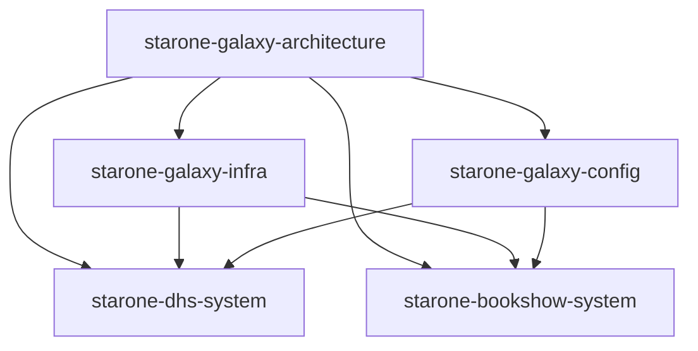

# ADR-001: Repository Taxonomy Governance

## Title Page

| Field | Value |
|---------|---------|
| ADR ID | ADR-001 |
| Title | Repository Taxonomy Governance |
| Status | Accepted |
| Date | Jan 2026 |
| Epic | EPIC-ARCH-001 Ecosystem Design & Governance Baseline |
| Story | STORY-ARCH-004 Architecture Decision Baseline |
| Author | Sachin Salunke |
| Reviewers | Platform Architect, Security Review, DevOps Governance |

---

## Revision History

| Version | Date | Author | Description |
|---------|---------|---------|---------|
| 1.0 | Jan 2026 | Sachin Salunke | Initial ADR |
| 1.1 | Jan 2026 | Architecture Review | Repository Governance Decision Approved |
| 1.2 | Jan 2026 | Sachin Salunke | Repository Taxonomy Alignment, Domain Isolation Governance, Ownership Governance Matrix |

---

## Sign-Off

| Role | Status |
|---------|---------|
| Platform Architect | Approved |
| Security Review | Approved |
| DevOps Governance | Approved |

---

## 1. Context

StarOne Galaxy consists of multiple independently governed domains that must operate under a common architectural governance model.

The ecosystem includes:

- starone-galaxy-infra (Control Plane)
- starone-galaxy-config (Configuration Store)
- starone-dhs-system (Enterprise OMS)
- starone-bookshow-system (Consumer Ticketing Platform)
- starone-galaxy-architecture (Architecture Source of Truth)

Additional business domains may be introduced in the future and shall inherit the approved repository taxonomy governance model.

As the platform grows, inconsistent repository structures create:

- Onboarding complexity
- Documentation fragmentation
- Governance drift
- Reduced discoverability
- Operational inconsistency

A standardized repository taxonomy is required to ensure all engineering teams follow a predictable and governed organizational model.

---

## 2. Problem Statement

How should repositories be organized across the StarOne Galaxy ecosystem to provide:

- Architectural consistency
- Documentation discoverability
- Governance scalability
- Platform onboarding efficiency
- Long-term maintainability

while maintaining domain isolation and independent evolution?

---

## 3. Decision Drivers

The selected repository taxonomy must support:

| Driver | Priority |
|----------|----------|
| Governance Consistency | Critical |
| Documentation-as-Code | Critical |
| Domain Isolation | Critical |
| Scalability | High |
| Discoverability | High |
| Platform Onboarding | High |
| Reusability | High |
| Auditability | Medium |

---

## 4. Considered Options

### Option 1 – Unstructured Repository Layout

Each repository independently defines its own structure.

**Advantages**

- Maximum flexibility
- Minimal initial governance effort

**Disadvantages**

- Governance drift
- Inconsistent navigation
- Poor onboarding experience
- Difficult compliance validation

---

### Option 2 – Standardized Repository Taxonomy

All repositories follow a common structural model defined by architecture governance.

**Advantages**

- Predictable structure
- Easier onboarding
- Simplified governance
- Better documentation discoverability
- Easier automation

**Disadvantages**

- Initial governance overhead
- Requires enforcement mechanisms

---

### Option 3 – Fully Centralized Monorepo

All domains managed in a single repository.

**Advantages**

- Single source of code
- Simplified dependency visibility

**Disadvantages**

- Reduced domain isolation
- Larger blast radius
- Independent deployments become harder
- Does not align with StarOne domain strategy

---

## 5. Architectural Decision

The repository taxonomy shall separate governance concerns, configuration management, architecture governance, and business domain ownership to ensure independent evolution while maintaining ecosystem-wide governance consistency.

## Chosen Option

**Option 2 – Standardized Repository Taxonomy**

All StarOne Galaxy repositories shall follow a standardized repository governance structure appropriate to their domain responsibilities.

The repository taxonomy shall support the introduction of future business domains without requiring changes to the governance model.

New domains shall inherit the approved taxonomy, governance standards, ownership model, and compliance controls established by this ADR.

---

## 6. Repository Taxonomy Model

### Repository Classification Model

The StarOne Galaxy ecosystem organizes repositories into the following governance classifications:

| Classification | Purpose |
|---------------|---------|
| Architecture Governance | Standards, ADRs, Design Governance |
| Platform Governance | Infrastructure, Security, CI/CD, Kubernetes |
| Configuration Governance | Runtime Configuration Management |
| Business Domain | Product-specific business capabilities |


Business Domain repositories include:

- starone-dhs-system
- starone-bookshow-system

Future domain repositories shall follow the same governance model.

---

### Architecture Repository

```text
starone-galaxy-architecture/

├── docs/
│   ├── adr/
│   ├── brd/
│   ├── prd/
│   ├── frd/
│   ├── hld/
│   ├── srs/
│   ├── lld/
│   ├── rtm/
│   └── standards/
│
├── architecture/
│   ├── c4/
│   ├── domain/
│   └── integration/
│
├── governance/
│   ├── policies/
│   ├── controls/
│   └── templates/
│
└── .github/
    ├── workflows/
    └── CODEOWNERS
```

---

### Ecosystem Repository Classification

The StarOne Galaxy ecosystem is organized into distinct repository categories.

| Repository | Classification | Responsibility |
|------------|---------------|----------------|
| starone-galaxy-architecture | Architecture Governance | Standards, ADRs, Design Governance |
| starone-galaxy-infra | Platform Governance | CI/CD, Security, Kubernetes, Operations |
| starone-galaxy-config | Configuration Governance | Spring Cloud Config, Environment Governance |
| starone-dhs-system | Business Domain | Enterprise OMS Platform |
| starone-bookshow-system | Business Domain | Consumer Ticketing Platform |

---

### Repository Relationship Model



---

### Domain Isolation Decision

Business domains shall remain isolated from governance repositories.

Governance repositories shall provide reusable standards, controls, workflows, and policies.

Business domain repositories shall own:

- Business capabilities
- Release lifecycle
- Deployment lifecycle
- Domain services

This model ensures governance consistency without reducing domain autonomy.

---

### Governance Principles

**Principle 1**

Git repositories are the authoritative source of architectural truth.

**Principle 2**

Documentation is managed as code and version controlled.

**Principle 3**

Architecture decisions must be traceable to Epics and Stories.

**Principle 4**

Governance standards are centrally maintained and reused.

**Principle 5**

Domain repositories remain independently deployable.

**Principle 6**

The repository taxonomy shall remain product-agnostic and support future domain expansion without structural redesign.

---

## 7. Consequences

### Positive Consequences

- Consistent repository navigation
- Faster onboarding
- Reduced governance drift
- Improved traceability
- Easier automation adoption
- Standardized documentation lifecycle
- Clear repository ownership boundaries
- Improved architecture governance scalability
- Better support for future governance automation

---

### Negative Consequences

- Additional governance requirements
- Repository reviews required for deviations
- Teams must follow approved standards
- Additional governance review requirements
- Architecture approval required for repository deviations

---

## 8. Compliance Impact

This decision supports:

- ISO/IEC/IEEE 29148 Requirements Engineering
- IEEE 1016 Software Design Description
- Documentation-as-Code practices
- Governance-as-Code principles
- Trunk-Based Development
- Architecture Governance Reviews
- Repository Governance Audits

---

## 9. Traceability

| Source | Reference |
|----------|----------|
| Epic | EPIC-ARCH-001 |
| Story | STORY-ARCH-004 |
| BRD | StarOne Galaxy Architecture Repository Governance |
| Related ADR | ADR-002 Documentation Standards Governance |
| Related ADR | ADR-003 Governance Enforcement Controls |
| Standard | STANDARD-006 CODEOWNERS Governance |
| Standard | STANDARD-007 Enterprise Naming Conventions |
| Standard | STANDARD-008 Contribution Governance |
---

## 10. Implementation Guidance

All future repositories created within StarOne Galaxy shall align with the approved repository taxonomy unless an approved Architecture Decision Record explicitly authorizes deviation.

Repository structures shall be validated during architecture review and governance audits.

All repositories shall:

- Follow approved naming conventions
- Follow approved ownership standards
- Follow approved documentation standards
- Follow governance review requirements

Any repository taxonomy deviation requires:

1. Architecture Review
2. Governance Review
3. Approved ADR documenting the exception

Future repositories introduced into the StarOne Galaxy ecosystem shall be classified into an approved repository category before implementation begins.

Repository classifications shall be approved during architecture review.

---

## 11. References

- EPIC-ARCH-001 Ecosystem Design & Governance Baseline
- STORY-ARCH-001 Repository Scaffolding
- STORY-ARCH-002 Global Ecosystem README
- STORY-ARCH-003 Documentation Standards
- STANDARD-006 CODEOWNERS Governance
- STANDARD-007 Enterprise Naming Conventions
- STANDARD-008 Contribution Governance
- ISO/IEC/IEEE 29148
- IEEE 1016

---

## ADR Outcome

**Accepted**

This ADR establishes the official repository taxonomy governance model for the StarOne Galaxy ecosystem.

The repository taxonomy becomes the authoritative architectural baseline governing:

- Repository organization
- Repository ownership
- Domain isolation
- Documentation discoverability
- Architecture traceability
- Governance automation readiness

All future repository governance decisions shall align with this approved architecture decision unless superseded by a later ADR.