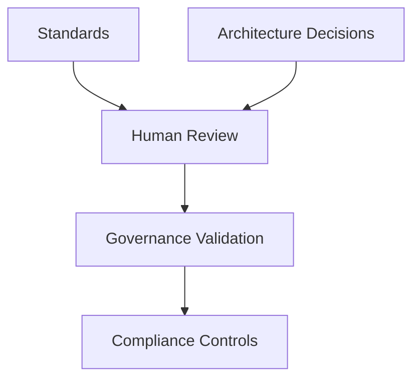

## ADR-003: Governance Enforcement Controls

| Field | Value |
|---------|---------|
| ADR ID | ADR-003 |
| Title | Governance Enforcement Controls |
| Status | Accepted |
| Date | Jan 2026 |
| Epic | EPIC-ARCH-001 Ecosystem Design & Governance Baseline |
| Story | STORY-ARCH-004 Architecture Decision Baseline |
| Author | Sachin Salunke |
| Reviewers | Platform Architect, Security Review, DevOps Governance |

---

## Revision History

| Version | Date | Author | Description |
|---------|---------|---------|---------|
| 1.0 | Jan 2026 | Sachin Salunke | Initial ADR |
| 1.1 | Jan 2026 | Architecture Governance Board | Governance Enforcement Approved |
| 1.2 | Jan 2026 | Sachin Salunke | Governance Enforcement Model Refinements |

---

## Sign-Off

| Role | Status |
|---------|---------|
| Platform Architect | Approved |
| Security Review | Approved |
| DevOps Governance | Approved |

---

## 1. Context

StarOne Galaxy has established:

- Repository Governance
- Documentation Standards
- Architectural Standards
- Traceability Standards

through the foundational governance stories.

However, governance standards alone do not guarantee compliance.

Without automated enforcement:

- Standards may be bypassed
- Documentation quality may degrade
- Security risks may increase
- Repository consistency may drift
- Review controls may become ineffective

A formal governance enforcement model is required to ensure standards are consistently applied across all repositories.

The governance model shall support both current and future StarOne Galaxy domains while maintaining consistent governance controls across the ecosystem.

---

## 2. Problem Statement

How should governance controls be enforced across the StarOne Galaxy ecosystem to ensure:

- Compliance with approved standards
- Consistent repository behavior
- Documentation quality
- Security validation
- Traceability enforcement
- Scalable governance operations

without relying solely on manual reviews?

---

## 3. Decision Drivers

| Driver | Priority |
|----------|----------|
| Governance Compliance | Critical |
| Automation | Critical |
| Security | Critical |
| Traceability | High |
| Scalability | High |
| Consistency | High |
| Auditability | High |
| Developer Experience | Medium |
| Auditability | Critical |
| Governance-as-Code | High |

---

## 4. Considered Options

### Option 1 – Manual Governance Reviews

All governance controls enforced through human review.

**Advantages**

- Simple implementation
- No automation overhead

**Disadvantages**

- Human error
- Inconsistent enforcement
- Poor scalability
- Slower delivery

**Decision Outcome**: Rejected

---

### Option 2 – Fully Automated Governance Controls

Governance enforced through automated workflows, repository controls, and validation pipelines.

**Advantages**

- Consistent enforcement
- Faster feedback
- Better scalability
- Reduced governance drift

**Disadvantages**

- Workflow maintenance required
- Initial implementation effort

**Decision Outcome**: Rejected

---

### Option 3 – Hybrid Governance Model

Critical controls automated.

Architectural decisions remain human-reviewed.

**Advantages**

- Strong governance
- Human oversight for strategic decisions
- Scalable enforcement

**Disadvantages**

- More governance design required

**Decision Outcome**: Selected

---

## 5. Decision

Governance automation shall support governance decisions but shall not replace human architectural authority.

Strategic governance decisions remain human-owned and subject to formal review and approval processes.

### Chosen Option

**Option 3 – Hybrid Governance Model**

StarOne Galaxy shall adopt a hybrid governance approach:

#### Automated Controls

- Documentation Validation
- Security Validation
- Workflow Validation
- Commit Validation
- Repository Governance Validation

#### Human Controls

- Architecture Reviews
- ADR Approvals
- Design Sign-Offs
- Governance Exception Approvals

---

## 6. Governance Enforcement Model

---

## 7. Governance Control Categories

### Repository Governance

**Purpose**

Ensure repository ownership, governance consistency, lifecycle management, and adherence to approved repository standards across the StarOne Galaxy ecosystem.

---

### Change Governance

**Purpose**

Ensure all changes to governed assets are reviewed, approved, traceable, and aligned with approved governance standards.

---

### Documentation Governance

**Purpose**

Ensure documentation quality, traceability, lifecycle compliance, and adherence to approved documentation standards.

---

### Architecture Governance

**Purpose**

Ensure architecture decisions, standards, designs, and governance artifacts remain consistent, reviewable, and aligned with approved architectural principles.

---

### Compliance Governance

**Purpose**

Ensure compliance obligations, governance requirements, traceability requirements, and review controls are consistently enforced across all domains.

---

### Security Governance

**Purpose**

Protect governance assets, architectural integrity, and ecosystem operations through approved security governance controls.

---

### Review Governance

**Purpose**

Ensure governance reviews, architecture reviews, approvals, and exception handling processes are consistently applied.

---

### Automation Governance

**Purpose**

Provide a scalable governance model that supports automated validation, compliance verification, and governance enforcement while maintaining human oversight for strategic decisions.

---

## 8. Repository Protection Strategy

Protected governance assets shall be subject to governance controls before modification.

Examples include:

- Architecture Decisions
- Standards
- Templates
- Governance Workflows
- Repository Governance Assets
- Security Governance Assets

Governance controls shall prevent unauthorized modification and ensure review accountability.

---

## 9. Governance Automation Principles

Governance validation should be automated where practical.

Automation mechanisms shall:

- Improve governance consistency
- Reduce governance drift
- Improve auditability
- Support compliance validation

Technology selections and implementation approaches are outside the scope of this ADR.

---

## 10. Governance Principles

### Principle 1

Governance is enforced by default.

---

### Principle 2

Compliance validation occurs before merge.

---

### Principle 3

Security validation is mandatory.

---

### Principle 4

Traceability is mandatory.

---

### Principle 5

Reusable workflows are preferred over duplicated logic.

---

### Principle 6

Human review remains required for architectural decisions.

---

### Principle 7

Governance controls shall support future domain expansion without requiring redesign of the governance model.

---

### Principle 8

Governance exceptions require formal architectural approval.

---

## 11. Consequences

### Positive Consequences

- Reduced governance drift
- Consistent standards adoption
- Improved security posture
- Better audit readiness
- Faster compliance validation
- Improved scalability
- Foundation for governance automation initiatives
- Improved governance auditability

---

### Negative Consequences

- Workflow maintenance required
- Governance exceptions require formal review
- Additional CI execution time
- Governance tooling investment required

---

## 12. Compliance Impact

This decision supports:

- ISO/IEC/IEEE 29148
- IEEE 1016
- Governance-as-Code
- Documentation-as-Code
- Secure SDLC
- Audit Readiness
- Governance Review Controls
- Compliance Validation Governance

---

## 13. Traceability

| Source | Reference |
|----------|----------|
| Epic | EPIC-ARCH-001 |
| Story | STORY-ARCH-004 |
| Related ADR | ADR-001 Repository Taxonomy Governance |
| Related ADR | ADR-002 Documentation Standards Governance |
| Source Story | STORY-ARCH-001 Repository Scaffolding |
| Source Story | STORY-ARCH-002 Global Ecosystem README |
| Source Story | STORY-ARCH-003 Documentation Standards |

---

## 14. Future Impact

This ADR authorizes future governance automation initiatives including:

- Future governance automation initiatives.
- Future compliance validation capabilities.
- Future repository protection mechanisms.
- Future governance operational controls.

This ADR serves as the architectural foundation for Engineering Governance Automation.

---

## 15. References

- EPIC-ARCH-001 Ecosystem Design & Governance Baseline
- STORY-ARCH-001 Repository Scaffolding
- STORY-ARCH-002 Global Ecosystem README
- STORY-ARCH-003 Documentation Standards
- ADR-001 Repository Taxonomy Governance
- ADR-002 Documentation Standards Governance
- GitHub Governance Best Practices
- STANDARD-006 CODEOWNERS Governance
- STANDARD-007 Enterprise Naming Conventions
- STANDARD-008 Contribution Governance

---

## ADR Outcome

**Accepted**

This ADR establishes the official governance enforcement strategy for the StarOne Galaxy ecosystem.

The decision becomes the authoritative architectural baseline governing:

- Governance enforcement
- Compliance validation
- Governance protection controls
- Governance automation principles
- Governance review accountability

All future governance automation initiatives shall align with this approved architecture decision unless superseded by a subsequent ADR.