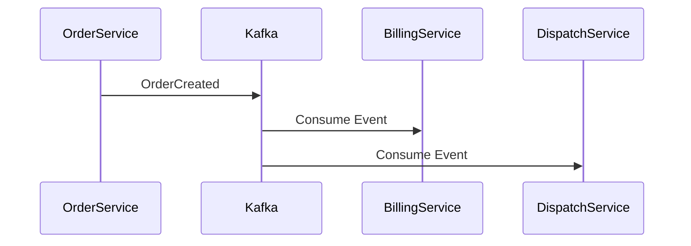

# ADR-005: Messaging Strategy — Hybrid Communication (REST + Selective Event-Driven)

---

## Title Page

| Field | Value |
|---|---|
Document ID | ADR-005 |
Project | StarOne Galaxy |
Decision | Messaging & Communication Strategy |
Author | Sachin Salunke |
Date | Jan 2026 |
Status | Accepted |

---

## 1. Context

StarOne Galaxy is a **multi-domain microservices ecosystem** with independently operating systems:

- DHS (Enterprise OMS)  
- Bookshow (Consumer Platform)  
- SportStats (Analytics System)  
- VaultIron (Security System)  

Each domain has different communication needs based on:

- Workflow complexity  
- Consistency requirements  
- Performance expectations  
- Security constraints  

---

### Problem Statement

```text
What communication strategy should be used across the system
to balance simplicity, scalability, and domain isolation?
```

---

### Key Challenges

- Avoiding over-engineering with unnecessary messaging systems  
- Supporting asynchronous workflows where required  
- Maintaining strong consistency in security-sensitive domains  
- Preventing tight coupling between services  
- Ensuring system scalability and resilience  

---

## 2. Decision

StarOne Galaxy will adopt a:

```text
Hybrid Communication Strategy:
REST (default) + Event-Driven (Kafka only where required)
```

---

## 2.1 Communication Model per Domain

| Domain | Communication Type | Justification |
|---|---|---|
DHS | Event-Driven (Kafka) + REST | Complex multi-step workflows |
Bookshow | REST (Synchronous) | User-driven transactions |
SportStats | API + Batch Processing | Pull-based data ingestion |
VaultIron | REST Only | Strong consistency & security |

---

## 2.2 REST (Primary Communication)

REST APIs will be used as the **default communication mechanism**:

- Synchronous request-response model  
- Immediate consistency  
- Suitable for user-driven operations  

Used in:

- Bookshow  
- VaultIron  
- Internal service communication  

---

## 2.3 Event-Driven Communication (Selective)

Kafka will be used **only for domains requiring asynchronous workflows**.

### Applicable Domain:

```text
DHS (Distributed Hub & Sales)
```

---

### Example Use Case (DHS)



---

### Key Rules:

```text
✔ Event-driven communication is NOT mandatory
✔ Used only for async workflows
✔ No cross-domain dependency via Kafka
```

---

## 2.4 Cross-Domain Communication Policy

- No mandatory cross-domain communication  
- If required:
  - Must be explicitly defined  
  - Must use REST APIs or governed events  
  - Must not create tight coupling  

---

## 2.5 Consistency Model

| Communication Type | Consistency |
|---|---|
REST | Strong consistency |
Kafka | Eventual consistency |

---

## 2.6 Failure Handling

### REST:
- Immediate error response  
- Retry logic at client level  

### Kafka:
- Retry mechanism  
- Dead Letter Queue (DLQ)  
- Idempotent event processing  

---

## 3. Alternatives Considered

---

### ❌ Option 1: Event-Driven Everywhere

**Description:**
All communication via Kafka

**Rejected Because:**

- Over-engineering  
- Increased complexity  
- Not suitable for security-sensitive systems (VaultIron)  

---

### ❌ Option 2: REST Only

**Description:**
All communication via synchronous APIs

**Rejected Because:**

- Not suitable for complex workflows (DHS)  
- Reduced scalability for async operations  

---

### ❌ Option 3: Direct Service Coupling

**Description:**
Services directly calling each other across domains

**Rejected Because:**

- Tight coupling  
- Reduced resilience  
- Violates domain isolation  

---

### ✅ Option 4: Hybrid Strategy (Chosen)

**Description:**
REST as default + Kafka only where needed

**Reasons:**

- Balanced complexity  
- Scalable architecture  
- Domain-specific flexibility  
- Aligns with real-world best practices  

---

## 4. Consequences

---

### ✅ Positive

- Simplified system design  
- Reduced operational complexity  
- Better performance for synchronous flows  
- Scalable async workflows where needed  
- Maintains domain isolation  

---

### ⚠️ Negative

- Requires decision discipline per use case  
- Mixed communication patterns increase learning curve  
- Event management overhead (Kafka setup)  

---

## 5. Trade-offs

| Trade-off | Decision |
|---|---|
Simplicity vs Scalability | Balanced |
Uniformity vs Flexibility | Chose flexibility |
Consistency vs Performance | Context-based |

---

## 6. Impact

---

### Affects:

- Integration design  
- Service communication  
- Infrastructure setup (Kafka optional)  
- Error handling mechanisms  

---

### Enables:

- Efficient resource usage  
- Avoidance of unnecessary complexity  
- Flexible domain evolution  

---

## 7. Rules Enforced

```text
1. REST is the default communication pattern
2. Kafka is used only for asynchronous workflows
3. No forced event-driven architecture
4. No cross-domain dependency via messaging
5. Communication must be explicitly defined
```

---

## 8. Related Artifacts

- ADR-002 Architecture Style  
- ADR-003 Domain Isolation  
- ADR-004 Config Strategy  
- SRS-001 StarOne Galaxy  
- HLD-001 Global Architecture  

---

## 9. Decision Summary

```text
StarOne Galaxy adopts a hybrid messaging strategy where REST is the default
communication model and Kafka is selectively used only for asynchronous workflows,
ensuring simplicity, scalability, and domain isolation.
```

---

## 10. Status

```text
ACCEPTED — This communication strategy is mandatory across the platform
```

---