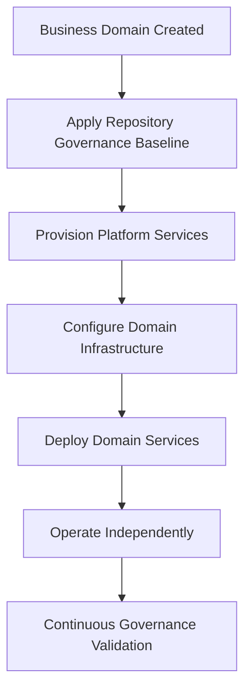
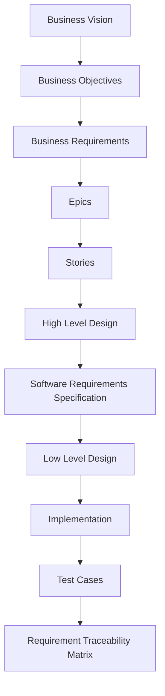

# BRD-001: StarOne Galaxy Ecosystem

---

## Title Page
Project Priority :Strategic
Business Criticality : High

| Field | Value |
|---|---|
Document ID | BRD-001 |
Project | StarOne Galaxy |
Domain | Enterprise Platform Architecture |
Author | Sachin Salunke |
Date | Jan 2026 |
Version | 1.0 |
Status | Draft |

---

## Revision History

| Version | Date | Author | Description |
|---|---|---|---|
1.0 | Jan 2026 | Sachin Salunke | Initial BRD creation |

---

## Sign-Off

| Role | Status |
|---|---|
Business Owner | Pending |
Platform Architect | Pending |
Security Review | Pending |
DevOps Governance | Pending |

---

# 1. Executive Summary

StarOne Galaxy is a cloud-native, multi-domain platform designed to host and operate independent application ecosystems under a unified governance and infrastructure model.

The platform enables enterprise and consumer systems to coexist while maintaining strict domain isolation, shared infrastructure efficiency, and standardized engineering practices.

This document defines the business vision, scope, and objectives that drive the development of the StarOne Galaxy ecosystem.

## 1.1 Background

Organizations increasingly require the ability to operate multiple business domains independently while maintaining centralized governance, security, and operational controls.

Traditional architectures often lead to tightly coupled systems, duplicated infrastructure, inconsistent engineering practices, and operational inefficiencies.

StarOne Galaxy is conceived as a unified platform ecosystem that provides domain autonomy while leveraging shared infrastructure and governance services.

---
## 1.2 Problem Statement

Modern distributed systems face several challenges:

- Tight coupling between services across domains
- Lack of standardized governance frameworks
- Difficulty scaling domains independently
- Infrastructure duplication across business units
- Inconsistent engineering practices
- Poor traceability of architectural decisions
- Security and compliance drift across teams

These challenges increase operational complexity, reduce agility, and create long-term maintenance risks.

---
## 1.3 Proposed Solution

StarOne Galaxy provides:

- Domain-isolated architecture
- Shared platform infrastructure
- Centralized configuration management
- Standardized governance processes
- Reusable engineering standards
- Independent deployment capabilities
- Event-driven communication backbone

---
# 2. Business Vision

## Vision Statement

StarOne Galaxy aims to establish a scalable and governance-driven platform that supports multiple independent application domains, supports enterprise and consumer platforms today, with future expansion into analytics and security domains.

---

## Strategic Objectives

- Shared infrastructure without cross-domain interference  
- Scalable and resilient system design  
- Enable rapid domain onboarding
- Standardize engineering governance
- Minimize infrastructure duplication
- Ensure scalability and resilience
- Promote platform-first engineering practices
- Enable independent domain evolution

---
# 3. Business Objectives (SMART)

| ID | Objective | Success Metric |
|---|---|---|
| BO-01 | Enable multi-domain architecture | Minimum 2 independent domains operational |
| BO-02 | Enforce domain isolation | Zero cross-domain data ownership violations |
| BO-03 | Standardize engineering governance | 100% repositories aligned with governance baseline |
| BO-04 | Enable independent deployments | Each domain deployable without affecting others |
| BO-05 | Centralize configuration management | 100% configuration managed through Config Store |
| BO-06 | Improve operational efficiency | Reduce duplicated infrastructure by 50% |

---
# 4. Business Value / ROI

| Area | Expected Benefit |
|---|---|
| Infrastructure Cost | Reduced infrastructure duplication |
| Operational Efficiency | Standardized deployment and governance |
| Scalability | Independent domain scaling |
| Security | Centralized security controls |
| Engineering Productivity | Reusable templates and automation |
| Compliance | Improved auditability and traceability |

---
# 5. Stakeholder Matrix (RACI)

| Stakeholder | Responsible | Accountable | Consulted | Informed |
|---|---|---|---|---|
| Business Owner | | X | | X |
| Platform Architect | X | X | | |
| Security Team | X | | X | |
| DevOps Team | X | | X | |
| Development Teams | X | | | |
| Domain Owners | X | | X | X |

---

## 5.1. Stakeholders

| Stakeholder Type | Description |
|---|---|
Platform Engineers | Manage infrastructure, CI/CD, and platform services |
DevOps Engineers | Handle deployment, monitoring, and reliability |
Enterprise Users (DHS) | Sales, operations, and finance teams |
Consumers (Bookshow) | End users booking tickets |
Analytics Users (Future Roadmap) | Data analysts and consumers |
Security Users (Future Roadmap) | Users managing credentials and secrets |

---
# 6. Scope Definition

## 6.1 In Scope

### DHS (Distributed Hub & System)

Enterprise Order Management Platform supporting:

- Order Booking
- Commercial Validation
- Account Validation
- Material Validation
- Billing
- Dispatch Management

### Bookshow

Consumer Ticket Booking Platform supporting:

- Event Discovery
- Ticket Reservation
- Payment Processing

### Shared Platform Services

- Control Plane
- Infrastructure Automation
- CI/CD
- Kubernetes Governance
- Monitoring and Observability

### Config Store

- Centralized Configuration
- Environment Segregation
- Secret Management Integration

---

## 6.2 Out of Scope

- Advanced AI/ML workloads
- Multi-region deployments
- Legacy system migrations
- Enterprise ERP integrations (Phase 1)
- Advanced UI optimization beyond MVP
- Cross-cloud deployments

### 6.2.1 Future Phase

**SportStats**

Sports Analytics Platform supporting:

- Sports Data Collection
- Analytics Processing
- Statistical Reporting

**VaultIron**

Credential Management Platform supporting:

- Secret Storage
- Credential Lifecycle Management
- Access Control

---

# 7. Business Requirements

| ID | Requirement | Priority |
|---|---|---|
| BR-01 | System must support multiple independent domains | Critical |
| BR-02 | System must enforce strict domain isolation | Critical |
| BR-03 | System must support flexible communication models | High |
| BR-04 | System must support horizontal scalability | Critical |
| BR-05 | System must provide centralized configuration management | Critical |
| BR-06 | System must support independent deployments | Critical |
| BR-07 | System must provide centralized governance controls | High |
| BR-08 | System must provide architecture traceability | High |
| BR-09 | System must support event-driven integration patterns | High |
| BR-10 | System must enforce reusable engineering standards | High |

---
# 8. Business Process Flow

---
# 9. Core Domains Overview

## 9.1 DHS (Distributed Hub & System)

**Purpose**

Enterprise Order Management System.

**Business Capabilities**

- Order Management
- Billing
- Dispatch
- Inventory Integration

**Key Stakeholders**

- Sales Teams
- Operations Teams
- Finance Teams

---

## 9.2 Bookshow

**Purpose**

Consumer Event Ticketing Platform.

**Business Capabilities**

- Event Management
- Booking Management
- Payment Processing

**Key Stakeholders**

- Consumers
- Event Organizers

---

## 9.3 Control Plane

**Purpose**

Central Infrastructure Governance Layer.

**Business Capabilities**

- CI/CD
- Kubernetes Governance
- Security Controls
- Observability

---

## 9.4 Config Store

**Purpose**

Centralized Configuration Repository.

**Business Capabilities**

- Environment Management
- Secret Configuration
- Configuration Governance

---
# 10 Current and Future Domain Vision

## 10.1 SportStats

**Purpose**

Sports Analytics Platform.

**Business Capabilities**

- Data Aggregation
- Analytics Processing
- Statistical Insights

**Key Stakeholders**

- Analysts
- Sports Consumers

---

## 10.2 VaultIron

**Purpose**

Credential and Secret Management Platform.

**Business Capabilities**

- Secret Storage
- Credential Governance
- Secure Access

**Key Stakeholders**

- Security Teams
- Platform Teams

---

# 11. Success Criteria

| ID | Success Criteria |
|---|---|
| SC-01 | All domains operate independently |
| SC-02 | Zero cross-domain ownership violations |
| SC-03 | Centralized governance adopted across domains |
| SC-04 | Independent deployment capability achieved |
| SC-05 | Shared infrastructure operational |
| SC-06 | Event-driven communication operational |
| SC-07 | Governance compliance audit passed |

---

# 12. Constraints

| Constraint | Description |
|---|---|
| Technology | Java 21 and Spring Boot 3.x |
| Messaging | Kafka as event backbone |
| Infrastructure | Kubernetes orchestration required |
| Configuration | Git-based configuration management |
| Security | TLS secured communication |
| Architecture | Domain isolation mandatory |

---

# 13. Assumptions

| ID | Assumption |
|---|---|
| ASM-01 | Cloud infrastructure is available |
| ASM-02 | Teams follow governance standards |
| ASM-03 | Microservice architecture is adopted |
| ASM-04 | Kafka infrastructure is available |
| ASM-05 | Kubernetes clusters are provisioned |

---

# 14. Dependencies

| ID | Dependency |
|---|---|
| DEP-01 | Repository Governance Baseline |
| DEP-02 | Control Plane Implementation |
| DEP-03 | Config Store Implementation |
| DEP-04 | Kubernetes Platform Availability |
| DEP-05 | Security Governance Framework |

---

# 15. Risks & Mitigations

| Risk | Impact | Mitigation |
|---|---|---|
| System Complexity | High | Modular architecture and C4 modeling |
| Governance Drift | High | Automated governance controls |
| Infrastructure Failure | Medium | High availability platform design |
| Integration Failure | Medium | Event-driven architecture |
| Over Engineering | Medium | Incremental delivery model |

---

# 16. High-Level Timeline

| Phase | Description |
|---|---|
| Phase 1 | Governance Foundation & Repository Baseline |
| Phase 2 | Control Plane & Config Store |
| Phase 3 | Domain Platform Development |
| Phase 4 | Event Backbone Integration |
| Phase 5 | Scaling, Monitoring & Optimization |

---
# 17. Business Foundation Traceability

The StarOne Galaxy ecosystem follows a top-down traceability model to ensure alignment between business vision, architecture, implementation, and validation artifacts.

---

# 18. Requirement Traceability Matrix

| BR ID | Epic | Story | Design Artifact |
|---|---|---|---|
| BR-01 | EPIC-ARCH-001 | STORY-ARCH-001 | HLD-001 |
| BR-02 | EPIC-ARCH-001 | STORY-ARCH-001 | ADR-001 |
| BR-03 | EPIC-ARCH-001 | STORY-ARCH-004 | HLD-002 |
| BR-04 | EPIC-ARCH-002 | STORY-ARCH-005 | HLD-003 |
| BR-05 | EPIC-CONFIG-001 | STORY-CONFIG-001 | HLD-CONFIG-001 |
| BR-06 | EPIC-DEPLOY-001 | STORY-DEPLOY-001 | HLD-DEPLOY-001 |
| BR-07 | EPIC-ARCH-001 | STORY-ARCH-002 | Governance Model |
| BR-08 | EPIC-ARCH-001 | STORY-ARCH-003 | RTM |
| BR-09 | EPIC-INTEGRATION-001 | STORY-INTEGRATION-001 | HLD-INTEGRATION-001 |
| BR-10 | EPIC-GOVERNANCE-001 | STORY-GOVERNANCE-001 | Standards Framework |

---

# 19. Glossary

| Term | Definition |
|---|---|
| Domain | Independent business ecosystem |
| Control Plane | Shared infrastructure governance layer |
| Config Store | Centralized configuration repository |
| Governance | Standards, controls, and policies |
| Domain Isolation | Separation of business domains and ownership |
| Event Backbone | Kafka-based integration layer |

---

# 20. Appendices

## 20.1 Reference Documents

| Document ID | Description |
|---|---|
| ADR-001 | Repository Taxonomy Decision |
| HLD-001 | StarOne Galaxy Architecture |
| RTM-001 | Requirement Traceability Matrix |

---

## 20.2 Supporting Artifacts

- C4 Architecture Diagrams
- Governance Standards
- Repository Taxonomy Standards
- Security Architecture
- Platform Architecture

---

# 21. Conclusion

StarOne Galaxy establishes a platform-first architecture that enables multiple independent domains to operate within a governed ecosystem while leveraging shared infrastructure and engineering standards.

The platform promotes scalability, security, governance, and operational efficiency while ensuring that individual domains remain autonomous and independently deployable.

This BRD serves as the primary business foundation for all subsequent architecture, design, implementation, governance, and operational artifacts within the StarOne Galaxy ecosystem.

---

