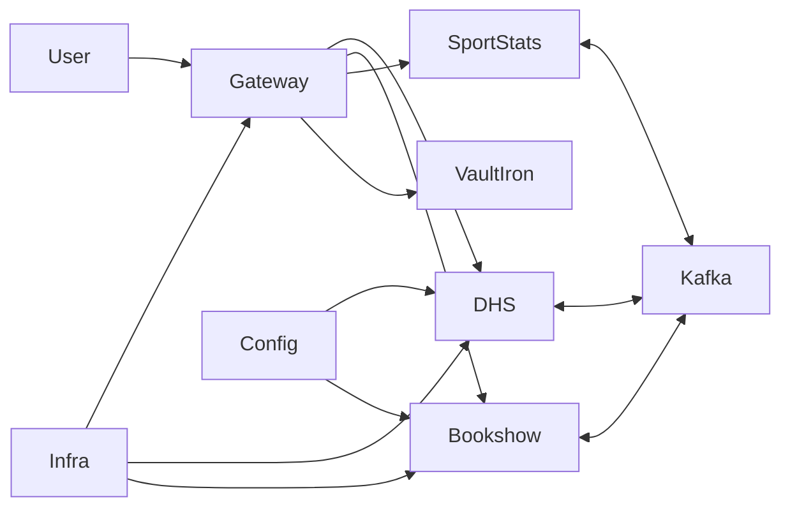
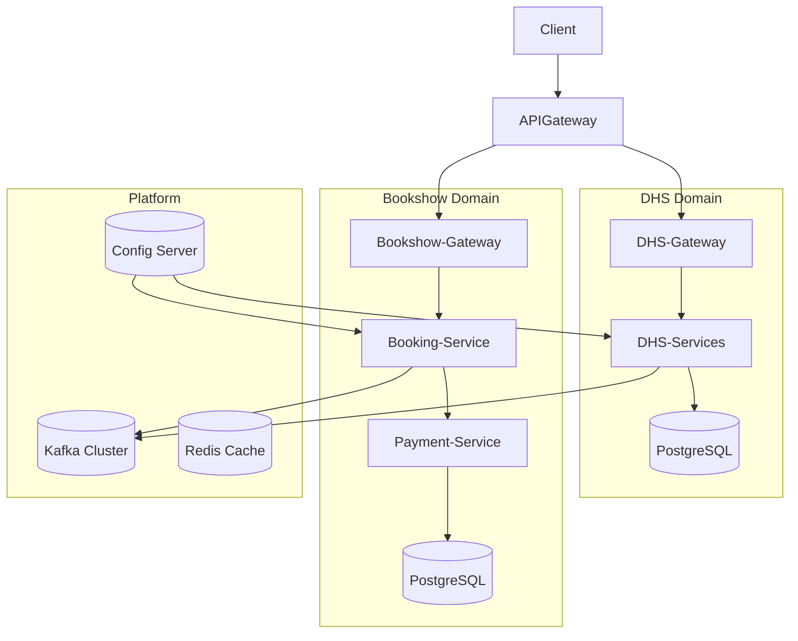
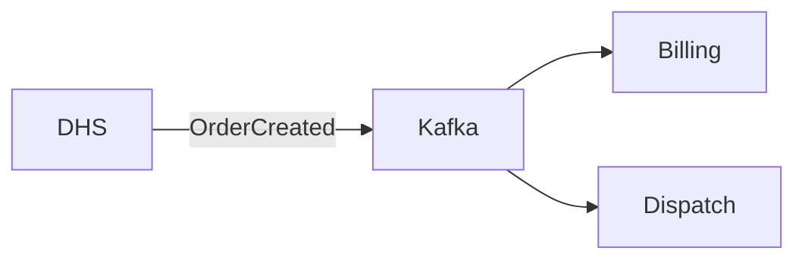
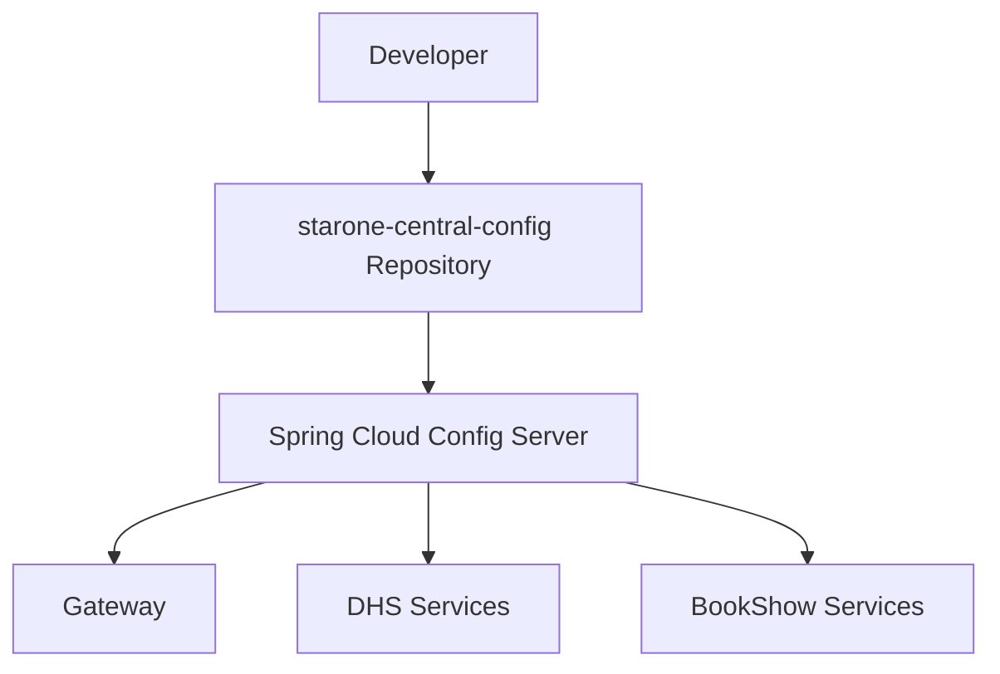

# HLD-001: StarOne Galaxy Global Architecture

---

## Title Page

| Field       | Value               |
| ----------- | ------------------- |
| Document ID | HLD-001             |
| Project     | StarOne Galaxy      |
| Domain      | System Architecture |
| Author      | Sachin Salunke      |
| Date        | Jan 2026            |
| Version     | 1.0                 |
| Status      | Draft               |

---

## Revision History

| Version | Date     | Author         | Description          |
| ------- | -------- | -------------- | -------------------- |
| 1.0     | Jan 2026 | Sachin Salunke | Initial HLD creation |

---

## Sign-Off

| Role               | Status  |
| ------------------ | ------- |
| Platform Architect | Pending |
| Security Review    | Pending |
| DevOps Governance  | Pending |
| Engineering Lead   | Pending |

---

# 1. Introduction

## 1.1 Purpose

This High-Level Design (HLD) document defines the **architecture, system components, and interactions** of the StarOne Galaxy ecosystem.

It translates SRS requirements into a **scalable, domain-driven, and cloud-native architecture** aligned with IEEE 1016 standards.

---

## 1.2 Scope

Covers:

- Multi-domain architecture (DHS, Bookshow, SportStats, VaultIron)
- Control Plane (Infrastructure)
- Config Store
- Event-driven integration model
- Deployment architecture (Kubernetes)

---

# 2. Architectural Overview

## 2.1 Architecture Style

- Microservices Architecture
- Domain-Driven Design (DDD)
- Event-Driven Architecture (Kafka Backbone)
- API Gateway Pattern
- Saga Pattern (Choreography-based primarily)

---

## 2.2 System Context (C4 Level 1)



---

# 3. Container Architecture (C4 Level 2)



---

# 4. Domain Architecture

## 4.1 Domain Isolation Strategy

- Each domain is **logically and physically isolated**
- Separate:
  - Database
  - Services
  - Deployment units

---

## 4.2 Domain Breakdown

| Domain     | Type       | Description             |
| ---------- | ---------- | ----------------------- |
| DHS        | Enterprise | Order management system |
| Bookshow   | Consumer   | Ticket booking platform |
| SportStats | Analytics  | Data processing system  |
| VaultIron  | Security   | Credential management   |

---

# 5. Integration Architecture

## 5.1 Communication Strategy

The StarOne Galaxy ecosystem follows a **domain-specific communication model**, where each domain selects the appropriate communication pattern based on its functional requirements.

### Communication Model per Domain

| Domain     | Communication Type          | Justification                              |
| ---------- | --------------------------- | ------------------------------------------ |
| DHS        | Event-Driven (Kafka) + REST | Complex asynchronous workflows             |
| Bookshow   | REST (Synchronous)          | User-driven transactional flows            |
| SportStats | API + Batch Processing      | Pull-based analytics system                |
| VaultIron  | REST (Synchronous Only)     | Strong consistency & security requirements |

---

## 5.2 Event-Driven Communication (DHS Only)



---

# 6. Deployment Architecture (C4 Level 3)

```mermaid
flowchart TD

Dev --> GitHub
GitHub --> CI[GitHub Actions]
CI --> Docker
Docker --> Registry

Registry --> Kubernetes

subgraph Kubernetes Cluster
    Gateway
    DHS Services
    Bookshow Services
    SportStats Services
    VaultIron Services
end

Kubernetes --> Kafka
Kubernetes --> Redis
Kubernetes --> PostgreSQL
```

---

# 6.1 Configuration Architecture

## Configuration Management Strategy

StarOne Galaxy adopts a centralized, Git-backed configuration management approach using Spring Cloud Config Server and a dedicated configuration repository (`starone-central-config`).

### Repository Responsibilities

| Repository                  | Responsibility                                                                 |
| --------------------------- | ------------------------------------------------------------------------------ |
| starone-galaxy-architecture | Architecture standards, governance, ADRs, and documentation                    |
| starone-galaxy-infra        | Config Server deployment, containerization, networking, and runtime management |
| starone-central-config      | Configuration assets, environment configurations, and configuration hierarchy  |
| starone-dhs-system          | Configuration consumption through Spring Cloud Config Client                   |
| bookshow-services           | Configuration consumption through Spring Cloud Config Client                   |

---

## Configuration Architecture



---

## Configuration Repository Structure

```text
starone-central-config/
├── global/
│   ├── application.yml
│   ├── application-local.yml
│   ├── application-dev.yml
│   ├── application-staging.yml
│   └── application-prod.yml
│
├── shared/
│
├── applications/
│   ├── platform/
│   ├── dhs/
│   └── bookshow/
│
└── scripts/
```

---

## Configuration Resolution Hierarchy

```text
global/application.yml
        ↓
global/application-{profile}.yml
        ↓
applications/{domain}/{service}/{service}.yml
        ↓
applications/{domain}/{service}/{service}-{profile}.yml
        ↓
Environment Variables
```

---

## Config Server Responsibilities

* Clone configuration repository
* Serve configuration through REST endpoints
* Provide environment-aware configuration resolution
* Support dynamic configuration refresh
* Maintain configuration version traceability
* Externalize application configuration from service repositories

---

## Config Client Responsibilities

* Retrieve configuration during startup
* Resolve profile-specific configuration
* Support refresh operations
* Consume externalized configuration without embedding configuration inside application repositories

---

## Benefits

* Centralized configuration management
* Independent configuration lifecycle
* Reduced configuration duplication
* Environment consistency
* Git-based configuration versioning
* Faster operational changes
* Clear repository ownership boundaries

---

# 7. Component Design

## 7.1 API Gateway

- Central entry point
- JWT authentication
- Rate limiting
- Routing

---

## 7.2 Service Layer

- Stateless microservices
- Business logic encapsulation
- OpenFeign for inter-service communication

---

## 7.3 Data Layer

- PostgreSQL per service
- Redis caching layer

---

## 7.4 Messaging Layer

- Kafka topics per domain
- Event-driven workflows
- Dead-letter queues

---

# 8. Security Architecture

- JWT Authentication
- RBAC Authorization
- TLS 1.3 encryption
- Secure configuration (JCE encryption)

---

# 9. Transaction Management

## 9.1 Saga Pattern

- Choreography-based Saga
- Event-driven coordination

## 9.2 Compensation

- Each service implements compensating transactions
- Failure recovery via event rollback

---

# 10. Observability

- Centralized logging
- Distributed tracing
- Metrics monitoring (Prometheus + Grafana)

---

# 11. Scalability & Performance

- Horizontal scaling via Kubernetes
- Stateless service design
- Load balancing at gateway level

---

# 12. Risks & Mitigation

| Risk                   | Mitigation               |
| ---------------------- | ------------------------ |
| Distributed complexity | Use domain boundaries    |
| Event failure          | Retry + DLQ              |
| Service coupling       | Enforce domain isolation |
| Data inconsistency     | Saga pattern             |

---

# 13. Architecture Decisions (Trace to ADR)

| Decision                   | ADR     |
| -------------------------- | ------- |
| Microservices architecture | ADR-001 |
| Event-driven communication | ADR-002 |
| Domain isolation           | ADR-003 |
| Central config store       | ADR-004 |

---

# 14. Traceability Matrix (HLD Level)

| Requirement        | Source |
| ------------------ | ------ |
| Architecture Style | SRS    |
| Domain Isolation   | SRS    |
| Event Integration  | SRS    |
| Security           | SRS    |

---

# 15. Conclusion

This HLD defines a **scalable, modular, and governance-driven architecture** for StarOne Galaxy.

It establishes:

- Domain-driven structure
- Event-driven integration
- Cloud-native deployment model

This document serves as the foundation for:

- Low-Level Design (LLD)
- Service implementation
- Infrastructure provisioning

---
