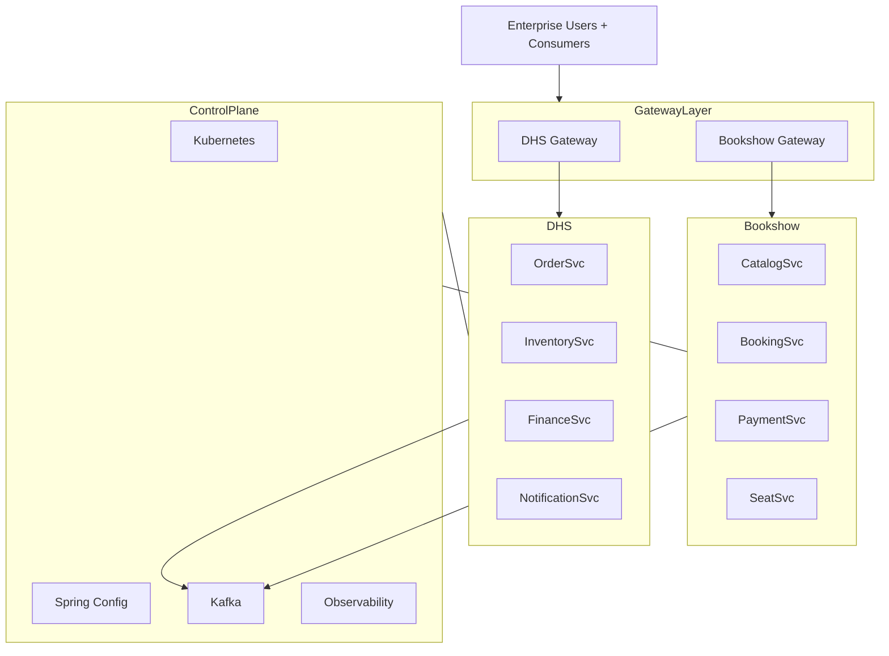
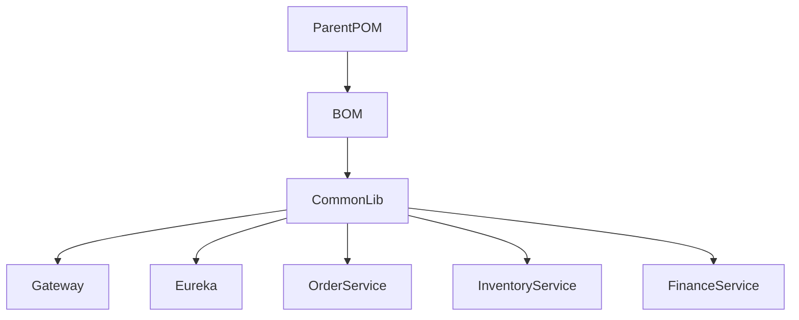
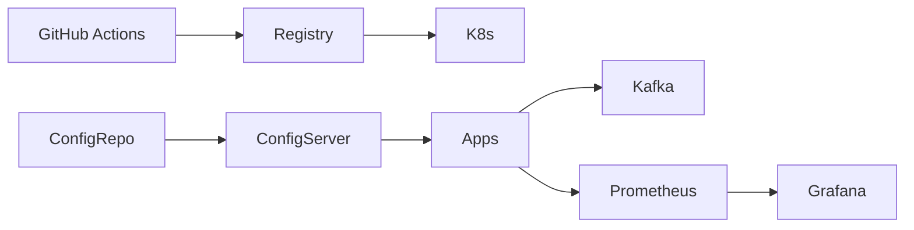
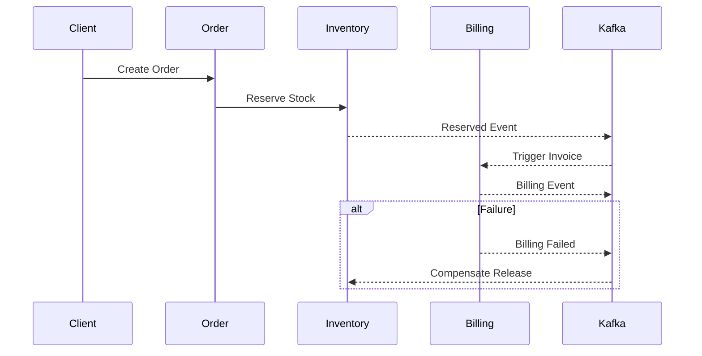
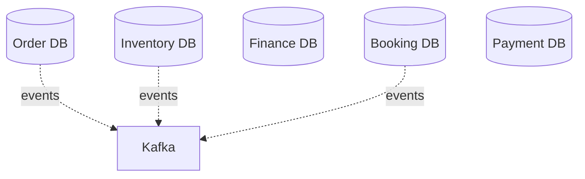
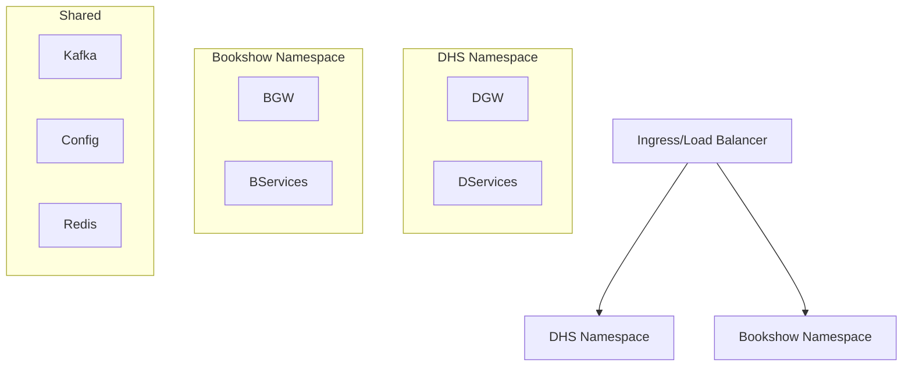
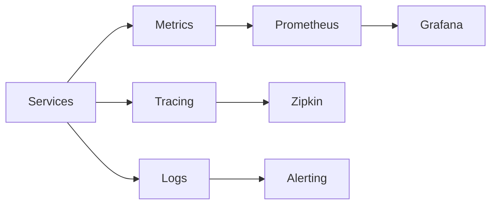
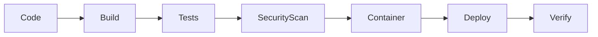

# High Level Design (HLD)
## StarOne Galaxy Enterprise Architecture

**Target Repository:** `starone-galaxy-architecture`  
**Document ID:** SOG-HLD-ARCH-V1.0  
**Author:** Sachin Salunke  
**Start Baseline:** January 2026  
**Standard:** IEEE 1016 / ISO-IEC-IEEE 29148 Compliant  
**Status:** Architectural Baseline – Proposed for Approval 

---

# Revision History
| Version | Date | Author | Description |
|---|---|---|---|
|1.0.0|2026-01-08|Sachin Salunke|Initial Enterprise HLD Baseline|

---

# Sign-Off Matrix
| Role | Name | Status |
|---|---|---|
|Chief Architect|Sachin Salunke|Approved|
|Platform Lead|Pending|Review|
|Security Lead|Pending|Review|
|DevOps Lead|Pending|Review|

---

# 1. Executive Summary

StarOne Galaxy is a federated enterprise microservices ecosystem composed of:

- **Control Plane** → Shared infrastructure and platform governance.
- **DHS Domain** → Distributed Hub and Sales transactional domain.
- **Bookshow Domain** → High concurrency ticketing domain.

Architectural strategy:

- Shared platform, isolated domains.
- Independent gateways and service registries.
- Event-driven choreography.
- GitOps and config-driven runtime.
- Saga-based consistency with compensating transactions.

---

# 2. Architectural Goals

## Primary Goals

1. Domain isolation with shared infrastructure efficiency.
2. Independent scalability of DHS and Bookshow.
3. Failure containment by cellular service boundaries.
4. Enterprise-grade observability.
5. Audit-ready SDLC traceability.

## Quality Attributes

| Attribute | Target |
|---|---|
|Availability|99.95%|
|P95 Latency|<200 ms|
|Horizontal Scalability|Elastic|
|Recovery|Automated Compensation|
|Security|Zero Trust Target State|

---

# 3. System Context Architecture (C4 Level 1)



---

# 4. Enterprise Architecture View

## 4.1 Cellular Repository Topology

```text
starone-galaxy
├── starone-galaxy-infra (Control Plane)
├── starone-central-config (Config Data Store)
├── starone-dhs-system (Multi-module Data Plane)
└── bookshow-* repos (Independent Data Plane)
```

## 4.2 Architecture Segmentation

| Plane | Responsibility |
|---|---|
|Control Plane|Infrastructure governance|
|Data Plane|Business services runtime|
|Config Plane|Centralized configuration|
|Observability Plane|Metrics, tracing, alerts|

---

# 5. Component Decomposition

## DHS Domain Components



### Core Services

| Service | Responsibility |
|---|---|
|Order Service|Order orchestration|
|Inventory Service|Stock availability|
|Finance Service|Billing/settlement|
|Notification Service|Operational messaging|

---

## Bookshow Domain Components

| Service | Responsibility |
|---|---|
|Catalog Service|Movie metadata|
|Booking Service|Reservation orchestration|
|Seat Service|Locking availability|
|Payment Service|Payment processing|

Independent:
- Gateway
- Eureka
- Deployment paths
- Runtime scaling

---

# 6. Control Plane Architecture



## Platform Services

- Kubernetes
- Spring Cloud Config
- Kafka
- CI/CD Pipelines
- Prometheus/Grafana
- Secret Encryption

---

# 7. Communication Architecture

## Synchronous
- REST
- OpenFeign
- Gateway routing

## Asynchronous
- Kafka event backbone
- Domain events
- Saga choreography

## Communication Pattern Rules

| Pattern | Use Case |
|---|---|
|REST|Query/Command APIs|
|Kafka|Cross-service async workflows|
|Saga|Distributed transactions|

---

# 8. Distributed Transaction Design (Saga)



## Compensating Transactions
Mandatory for:

- Stock rollback
- Seat release
- Payment reversal
- Dispatch cancellation
- Backorder compensation

---

# 9. Data Architecture

## Database Per Service Pattern



## Data Principles

- Service owns its schema.
- No shared operational schemas.
- Event-driven synchronization.
- CQRS-ready evolution path.

---

# 10. Deployment Architecture



## Kubernetes Isolation

Namespaces:
```text
shared-platform
shared-messaging
dhs-prod
bookshow-prod
monitoring
```

---

# 11. Security Architecture

## Security Layers

```text
Client
→ API Gateway Security
→ JWT / RBAC
→ Service Security Filters
→ Data Encryption
→ Audit Logging
```

Controls:
- OAuth2/JWT
- TLS 1.3
- Secret encryption
- Service identity
- RBAC policies
- WAF integration target state

---

# 12. Scalability Architecture

## DHS Scaling
- Horizontal stateless scaling
- Kafka consumer group partitioning
- Redis caching

## Bookshow Scaling
- Burst booking auto-scale
- Seat lock optimization
- Read-heavy caching

Autoscaling Rules:

| Metric | Trigger |
|---|---|
|CPU|70%|
|Kafka Lag|Threshold based|
|Latency|P95 breach|

---

# 13. Availability & Disaster Recovery

## Resilience Controls
- Multi-AZ deployments
- Rolling upgrades
- Circuit breakers
- Retry patterns
- Dead Letter Topics

## DR Strategy

| Layer | Strategy |
|---|---|
|Database|Replication + PITR|
|Kafka|Replication factor|
|Config|Git-backed restore|
|K8s|Infra as Code recovery|

---

# 14. Observability Architecture



Monitoring Stack:
- Prometheus
- Grafana
- Micrometer
- Distributed tracing
- Alerting pipelines

---

# 15. CI/CD Architecture



Quality Gates
- Unit Coverage >85%
- Security scans
- Contract validation
- Deployment promotion approvals

---

# 16. Architectural Decision Summary

| ADR | Decision |
|---|---|
|ADR-001|Domain Isolation Strategy|
|ADR-002|Shared Config Architecture|
|ADR-003|Kafka Event Backbone|
|ADR-004|Kubernetes Control Plane|
|ADR-005|Saga Pattern|

---

# 17. Risks & Mitigations

| Risk | Impact | Mitigation |
|---|---|---|
|Cross-domain coupling|High|Strict domain boundaries|
|Event consistency lag|Medium|Saga compensation|
|Infra bottlenecks|High|Independent scaling|
|Config drift|Medium|GitOps controls|

---

# 18. Standards & Constraints

Mandatory:

- DHS hierarchy:
Parent POM → BOM → Common Libs → Modules

- Bookshow remains repo-independent.

- Infrastructure paths isolated by domain.

- Compensating transactions required in distributed flows.

---

# 19. Requirement Traceability Mapping

| HLD Section | Parent Trace |
|---|---|
|Architecture Goals|BRD Objectives|
|Component Design|PRD/FRD|
|Communication Design|ADR Set|
|Deployment Model|Infra Controls|
|Quality Attributes|RTM NFR Trace|

---

# 20. Future-State Target Architecture

Planned evolution:

- Service Mesh
- Event Streaming Governance
- Multi-region deployment
- Policy-as-Code
- Platform Engineering Self-Service

---

# 21. EPIC Breakdown (Next Phase)

| Epic | Description | Priority |
|---|---|---|
|EPIC-HLD-01|Control Plane Foundation Hardening|P1|
|EPIC-HLD-02|DHS Core Domain Decomposition|P1|
|EPIC-HLD-03|Bookshow High Concurrency Optimization|P1|
|EPIC-HLD-04|Observability & SRE Platform|P2|
|EPIC-HLD-05|Zero Trust Security Architecture|P2|

---

# 🚀 Next Step

Recommended next deep dives:

| Option | Document |
|---|---|
|1|ADR Pack for Control Plane Decisions|
|2|Detailed DHS Domain HLD|
|3|Bookshow High-Concurrency HLD|
|4|Control Plane Kubernetes Architecture Specification|

**Suggested Next Priority:** Generate **ADR-005 Saga Pattern Decision Record Pack**.

---

## Approval Recommendation
Status recommended for progression:

☑ Architecture Review  
☑ Security Review  
☑ Platform Review  
⬜ Final Baseline Approval

