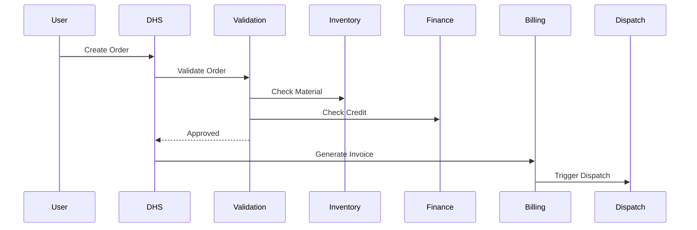
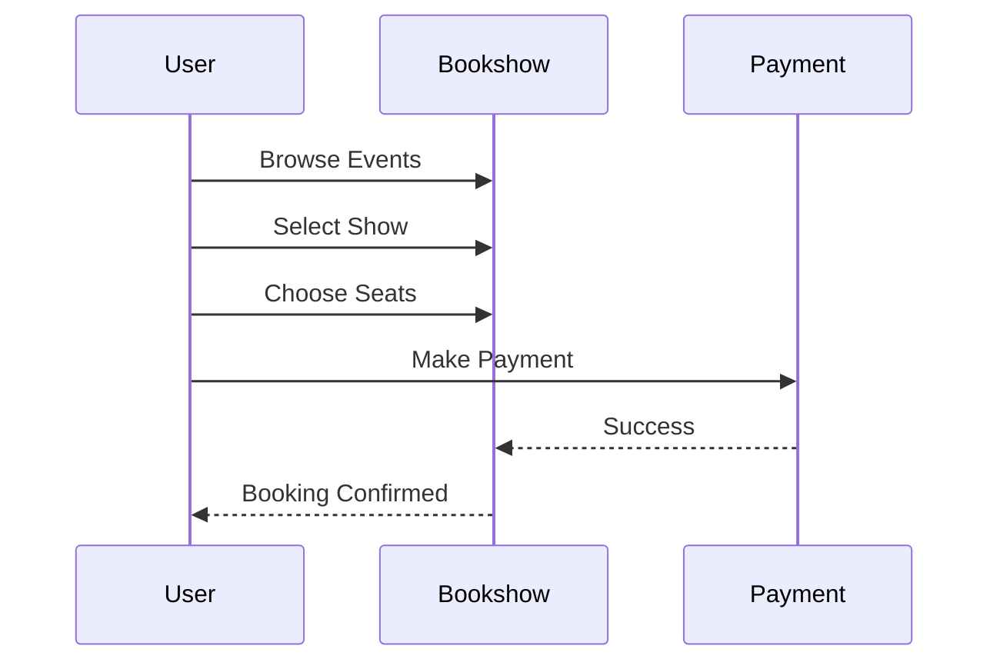

# PRD-001: StarOne Galaxy Ecosystem

---

## Title Page

| Field | Value |
|---|---|
Document ID | PRD-001 |
Project | StarOne Galaxy |
Domain | Product Architecture |
Author | Sachin Salunke |
Date | Jan 2026 |
Version | 1.0 |
Status | Draft |

---

## Revision History

| Version | Date | Author | Description |
|---|---|---|---|
1.0 | Jan 2026 | Sachin Salunke | Initial PRD creation |

---

## Sign-Off

| Role | Status |
|---|---|
Product Owner | Pending |
Platform Architect | Pending |
Engineering Lead | Pending |
DevOps Governance | Pending |

---

# 1. Executive Summary

This Product Requirement Document (PRD) defines the product-level capabilities of the StarOne Galaxy ecosystem.

StarOne Galaxy is a multi-domain platform that enables independent applications (enterprise, consumer, analytics, and security systems) to operate within a unified yet isolated architecture.

The ecosystem is built on a shared platform foundation consisting of:

- Control Plane (Infrastructure Repository)
- Config Store (Spring Cloud Config Repository)
- Domain Platforms (DHS, Bookshow)

The platform follows a domain-isolated, event-driven microservices architecture.

The PRD translates business vision into **product features, user interactions, and functional capabilities** across all domains.

---

# 2. Product Overview

StarOne Galaxy is composed of multiple independent applications:

- StarOne Galaxy Control Plane (Infrastructure Platform)
- StarOne Galaxy Config Store (Centralized Configuration Platform)
- DHS (Enterprise Order Management Platform)
- Bookshow (Consumer Ticket Booking Platform)

Future Domains:
- SportStats (Sports Analytics Platform)
- VaultIron (Credential Management Platform)

Each application:

- Operates independently  
- Has isolated users and data  
- Uses shared infrastructure without interference  

---

# 3. Product Objectives

| Objective ID | Description |
|---|---|
PO-01 | Deliver a multi-domain platform with independent applications |
PO-02 | Enable seamless user experience within each domain |
PO-03 | Ensure scalability and reliability of all product features |
PO-04 | Provide consistent governance across applications |
PO-05 | Support event-driven interactions between services |

---

# 4. User Personas

## 4.1 Platform Engineer
- Manages infrastructure and deployments  
- Configures services and environments  

## 4.2 Enterprise User (DHS)
- Sales representative  
- Operations staff  
- Finance team  

## 4.3 Consumer User (Bookshow)
- End customer browsing and booking tickets  

## 4.4 Analyst (SportStats)
- Consumes sports data and analytics  

## 4.5 Security User (VaultIron)
- Stores and manages credentials securely  

---

# 5. Product Features

---

## 5.1 DHS (Distributed Hub System)

### Order Flow

- Order Creation  
- Order Validation (Commercial, Accounts, Inventory)  
- Order Processing Workflow  
- Billing Generation  
- Dispatch Management  

---

## 5.2 Bookshow

### Show Booking Flow

- Event Discovery  
- Show Selection  
- Seat Selection  
- Ticket Booking  
- Payment Processing  
- Booking Confirmation  

---

## 5.3 SportStats

### Statics Flow

- Fetch data from third-party APIs  
- Store and process sports data  
- Generate performance statistics  
- Display analytics insights  

---

## 5.4 VaultIron

### Secret Flow

- Secure credential storage  
- Password management  
- Encryption and secure retrieval  
- User authentication  

---

## 5.5 Platform-Level Features

- API Gateway based routing
- Service Discovery
- Centralized Configuration Management
- Distributed Transaction Support
- Event Backbone using Kafka
- Independent user management per domain  
- Domain-isolated data storage  
- Centralized configuration system
- Scalable deployment via Kubernetes  
- Domain-specific communication model:
  - DHS uses event-driven workflows
  - Bookshow uses synchronous APIs
  - SportStats uses external APIs and batch processing
  - VaultIron uses secure synchronous communication

---

# 6. User Flows

---

## 6.1 DHS Order Flow

---

## 6.2 Bookshow Booking Flow

---

# 7. Functional Requirements

| ID | Requirement |
|---|---|
FR-01 | Users must be able to interact with domain-specific applications |
FR-02 | Each domain must manage its own users independently |
FR-03 | System must support event-driven communication |
FR-04 | Applications must support independent deployment |
FR-05 | System must provide secure authentication mechanisms |
FR-06 | Distributed business transactions shall use Saga orchestration or choreography patterns.
FR-07 | Services shall retrieve configuration from centralized configuration management.
FR-08 | Platform shall support service discovery and API gateway routing.
---

# 8. Non-Functional Requirements

| Category | Requirement |
|---|---|
|Scalability | System must scale horizontally |
|Availability | High availability required |
|Security | JWT + RBAC authentication |
|Performance | Low latency response |
|Reliability | Fault-tolerant architecture |
|Observability | Centralized logging and monitoring support |
|Maintainability | Independent service deployment |
|Availability | Zero shared database across domains |
---

# 9. Dependencies

- Third-party APIs (SportStats)
- Payment gateway (Bookshow)
- Infrastructure platform (Kubernetes)
- Messaging system (Kafka)

---

# 10. Constraints

- Java 21 + Spring Boot  
- Kafka-based messaging  
- Kubernetes deployment  
- Secure configuration management  
- Database per Service pattern
- Domain Isolation mandatory
- No distributed 2PC transactions

---

# 11. Risks

| Risk | Mitigation |
|---|---|
|Integration complexity | Use event-driven architecture |
|Data inconsistency | Domain isolation |
|System scalability | Use Kubernetes |
|Security breaches | Strong encryption |
|Distributed transaction failures| Saga compensation strategy|
|Configuration | drift Centralized Config Store |
|Service coupling | Domain isolation enforcement |
---

# 12. Product Roadmap (High-Level)

| Phase | Description |
|---|---|
Phase 1 | Architecture & Governance Foundation
Phase 2 | Control Plane & Config Platform
Phase 3 | DHS Platform Implementation
Phase 4 | Bookshow Platform Implementation
Phase 5 | Future Domains (SportStats, VaultIron)

---

# 13. Traceability Mapping

| PRD Feature | Maps To |
|---|---|
Architecture Governance | EPIC-ARCH-001
Control Plane Features | EPIC-INFRA-001
Config Features | EPIC-CONFIG-001
DHS Features | EPIC-DHS-001
Bookshow Features | EPIC-BOOKSHOW-001
SportStats Features | Future
VaultIron Features | Future

---

# 14. Conclusion

This PRD defines the product-level structure of StarOne Galaxy, translating business vision into actionable product features.

It serves as the foundation for:

- SRS (System Requirements)
- EPIC creation (Agile execution)
- HLD (Architecture design)

---

