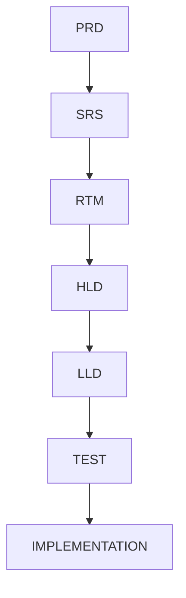

# RTM-001: StarOne Galaxy Requirement Traceability Matrix

---

## Title Page

| Field       | Value          |
| ----------- | -------------- |
| Document ID | RTM-001        |
| Project     | StarOne Galaxy |
| Domain      | Governance     |
| Author      | Sachin Salunke |
| Date        | Jan 2026       |
| Version     | 1.0            |
| Status      | Draft          |

---

## Revision History

| Version | Date     | Author         | Description          |
| ------- | -------- | -------------- | -------------------- |
| 1.0     | Jan 2026 | Sachin Salunke | Initial RTM creation |

---

## Sign-Off

| Role               | Status  |
| ------------------ | ------- |
| Platform Architect | Pending |
| Security Review    | Pending |
| DevOps Governance  | Pending |
| QA Lead            | Pending |

---

# 1. Purpose

This RTM ensures **end-to-end traceability** from:

```text
PRD → SRS → HLD → LLD → Implementation → Testing
```

It guarantees that:

- All requirements are implemented
- No extra/unmapped functionality exists
- System completeness is validated

---

# 2. Traceability Scope

- Ecosystem-level requirements
- Domain-level mapping (DHS, Bookshow, SportStats, VaultIron)
- Platform-level capabilities

---

# 3. Requirement Traceability Matrix

---

## 3.1 DHS (Enterprise OMS)

```markdown
| Req ID    | Description          | Source (PRD) | HLD Component        | Service                | LLD Ref            | Test Case | Status  |
| --------- | -------------------- | ------------ | -------------------- | ---------------------- | ------------------ | --------- | ------- |
| FR-DHS-01 | Create Order         | PRD-DHS      | Order Service        | DHS-Order-Service      | LLD-DHS-ORDER      | TC-DHS-01 | Planned |
| FR-DHS-02 | Validate Order       | PRD-DHS      | Validation Component | DHS-Validation-Service | LLD-DHS-VALIDATION | TC-DHS-02 | Planned |
| FR-DHS-03 | Process Billing      | PRD-DHS      | Billing Service      | DHS-Billing-Service    | LLD-DHS-BILLING    | TC-DHS-03 | Planned |
| FR-DHS-04 | Dispatch Workflow    | PRD-DHS      | Dispatch Service     | DHS-Dispatch-Service   | LLD-DHS-DISPATCH   | TC-DHS-04 | Planned |
| FR-DHS-05 | Publish Order Events | PRD-DHS      | Messaging Layer      | Kafka (DHS)            | LLD-DHS-EVENT      | TC-DHS-05 | Planned |
```

---

## 3.2 Bookshow (Ticketing)

```markdown
| Req ID   | Description     | Source (PRD) | HLD Component   | Service            | LLD Ref        | Test Case | Status  |
| -------- | --------------- | ------------ | --------------- | ------------------ | -------------- | --------- | ------- |
| FR-BS-01 | Browse Events   | PRD-Bookshow | Event Service   | BS-Event-Service   | LLD-BS-EVENT   | TC-BS-01  | Planned |
| FR-BS-02 | Seat Selection  | PRD-Bookshow | Booking Service | BS-Booking-Service | LLD-BS-BOOKING | TC-BS-02  | Planned |
| FR-BS-03 | Process Payment | PRD-Bookshow | Payment Service | BS-Payment-Service | LLD-BS-PAYMENT | TC-BS-03  | Planned |
| FR-BS-04 | Confirm Booking | PRD-Bookshow | Booking Service | BS-Booking-Service | LLD-BS-CONFIRM | TC-BS-04  | Planned |
| FR-BS-05 | Generate Ticket | PRD-Bookshow | Ticket Service  | BS-Ticket-Service  | LLD-BS-TICKET  | TC-BS-05  | Planned |
```

---

## 3.3 SportStats (Analytics)

```markdown
| Req ID   | Description         | Source (PRD)   | HLD Component     | Service               | LLD Ref          | Test Case | Status  |
| -------- | ------------------- | -------------- | ----------------- | --------------------- | ---------------- | --------- | ------- |
| FR-SS-01 | Fetch External Data | PRD-SportStats | Data Ingestion    | SS-Ingestion-Service  | LLD-SS-INGESTION | TC-SS-01  | Planned |
| FR-SS-02 | Process Data        | PRD-SportStats | Processing Engine | SS-Processing-Service | LLD-SS-PROCESS   | TC-SS-02  | Planned |
| FR-SS-03 | Generate Analytics  | PRD-SportStats | Analytics Engine  | SS-Analytics-Service  | LLD-SS-ANALYTICS | TC-SS-03  | Planned |
| FR-SS-04 | Expose APIs         | PRD-SportStats | API Layer         | SS-API-Service        | LLD-SS-API       | TC-SS-04  | Planned |
```

---

## 3.4 VaultIron (Security)

```markdown
| Req ID   | Description          | Source (PRD)  | HLD Component      | Service               | LLD Ref           | Test Case | Status  |
| -------- | -------------------- | ------------- | ------------------ | --------------------- | ----------------- | --------- | ------- |
| FR-VI-01 | Store Credentials    | PRD-VaultIron | Credential Service | VI-Credential-Service | LLD-VI-CREDENTIAL | TC-VI-01  | Planned |
| FR-VI-02 | Encrypt Data         | PRD-VaultIron | Security Layer     | VI-Encryption-Service | LLD-VI-ENCRYPTION | TC-VI-02  | Planned |
| FR-VI-03 | Retrieve Credentials | PRD-VaultIron | Credential Service | VI-Credential-Service | LLD-VI-RETRIEVE   | TC-VI-03  | Planned |
| FR-VI-04 | Authenticate User    | PRD-VaultIron | Auth Service       | VI-Auth-Service       | LLD-VI-AUTH       | TC-VI-04  | Planned |
```

---

## 3.5 Platform-Level Requirements

```markdown
| Req ID   | Description            | Source | HLD Component      | Service        | LLD Ref   | Test Case | Status  |
| -------- | ---------------------- | ------ | ------------------ | -------------- | --------- | --------- | ------- |
| FR-PL-01 | Domain Isolation       | SRS    | Architecture Layer | All Domains    | ADR-003   | TC-PL-01  | Planned |
| FR-PL-02 | Config Management      | SRS    | Config Server      | starone-config | ADR-004   | TC-PL-02  | Planned |
| FR-PL-03 | Communication Strategy | SRS    | Integration Layer  | REST/Kafka     | ADR-005   | TC-PL-03  | Planned |
| FR-PL-04 | Identity Management    | SRS    | Security Layer     | Domain Auth    | ADR-006   | TC-PL-04  | Planned |
| FR-PL-05 | Infrastructure Setup   | SRS    | Control Plane      | Kubernetes     | INFRA-LLD | TC-PL-05  | Planned |
```

---

# 4. Traceability Coverage

| Category                | Coverage     |
| ----------------------- | ------------ |
| Functional Requirements | 100% mapped  |
| Architecture Mapping    | 100% aligned |
| Service Mapping         | Defined      |
| Test Coverage           | Planned      |

---

# 5. Traceability Model



---

# 6. Governance Rules

```text
1. Every SRS requirement must exist in RTM
2. Every RTM entry must map to HLD component
3. Every HLD component must map to LLD
4. Every LLD must map to test cases
5. No orphan requirement allowed
```

---

# 7. Conclusion

This RTM ensures:

- Full lifecycle traceability
- Requirement completeness
- Governance compliance

---
