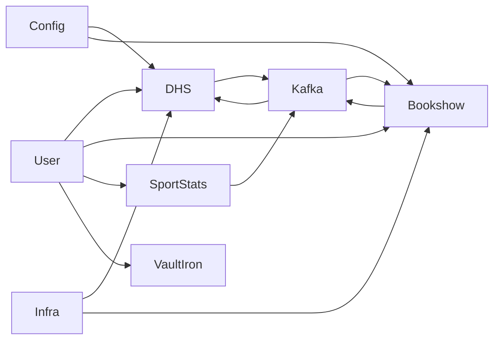

# SRS-001: StarOne Galaxy Ecosystem

---

## Title Page

| Field | Value |
|---|---|
Document ID | SRS-001 |
Project | StarOne Galaxy |
Domain | System Architecture |
Author | Sachin Salunke |
Date | Jan 2026 |
Version | 1.0 |
Status | Draft |

---

## Revision History

| Version | Date | Author | Description |
|---|---|---|---|
1.0 | Jan 2026 | Sachin Salunke | Initial SRS creation |

---

## Sign-Off

| Role | Status |
|---|---|
Platform Architect | Pending |
Security Review | Pending |
DevOps Governance | Pending |
QA Lead | Pending |

---

# 1. Introduction

## 1.1 Purpose

This Software Requirement Specification (SRS) defines the **functional and non-functional requirements** for the StarOne Galaxy ecosystem.

It translates product-level definitions (PRD) into **precise system behavior and constraints**, serving as the foundation for architecture (HLD) and implementation.

---

## 1.2 Scope

StarOne Galaxy is a multi-domain, cloud-native ecosystem consisting of:

- DHS (Enterprise OMS)
- Bookshow (Ticketing Platform)
- SportStats (Analytics Platform)
- VaultIron (Credential Management)
- Control Plane (Infrastructure)
- Config Store (Centralized Configuration)

Each domain must operate independently while leveraging shared platform capabilities.

---

## 1.3 Definitions

| Term | Description |
|---|---|
Domain | Independent application boundary |
Control Plane | Shared infrastructure layer |
Config Store | Centralized configuration system |
Event Backbone | Kafka-based messaging system |

---

# 2. Overall Description

## 2.1 System Perspective

---

## 2.2 Design Principles

- Domain Isolation  
- Event-Driven Architecture  
- Independent Deployment  
- Centralized Governance  
- Secure Communication  

---

## 2.3 Assumptions

- Cloud-native infrastructure available  
- Kafka available as messaging backbone  
- Kubernetes used for orchestration  

---

## 2.4 Constraints

- Java 21 + Spring Boot 3.x  
- Kafka mandatory for async communication  
- PostgreSQL per service  
- Redis for caching  
- TLS 1.3 security  

---

# 3. Functional Requirements

---

## 3.1 DHS (Enterprise OMS)

| ID | Requirement |
|---|---|
FR-DHS-01 | System shall allow order creation |
FR-DHS-02 | System shall validate orders (commercial, account, inventory) |
FR-DHS-03 | System shall process billing |
FR-DHS-04 | System shall trigger dispatch workflow |
FR-DHS-05 | System shall publish order events to Kafka |
FR-DHS-06 | DHS system shall support event-driven communication using Kafka
---

## 3.2 Bookshow

| ID | Requirement |
|---|---|
FR-BS-01 | System shall allow users to browse events |
FR-BS-02 | System shall allow seat selection |
FR-BS-03 | System shall process payments |
FR-BS-04 | System shall confirm bookings |
FR-BS-05 | System shall publish booking events |

---

## 3.3 SportStats

| ID | Requirement |
|---|---|
FR-SS-01 | System shall fetch data from external APIs |
FR-SS-02 | System shall process and store data |
FR-SS-03 | System shall generate analytics |
FR-SS-04 | System shall expose analytics APIs |
FR-SS-05 | SportStats shall support batch and API-based data processing
---

## 3.4 VaultIron

| ID | Requirement |
|---|---|
FR-VI-01 | System shall securely store credentials |
FR-VI-02 | System shall encrypt sensitive data |
FR-VI-03 | System shall allow secure retrieval |
FR-VI-04 | System shall support authentication |
FR-VI-05 | VaultIron system shall enforce synchronous operations for secure data handling
---

## 3.5 Platform-Level Requirements

| ID | Requirement |
|---|---|
FR-PL-01 | Each domain shall operate independently |
FR-PL-02 | Each domain shall have isolated database |
FR-PL-03 | System shall support domain-specific communication patterns (REST, Event, Batch)
FR-PL-04 | System shall support service discovery |
FR-PL-05 | System shall enforce API Gateway security |

---

# 4. Non-Functional Requirements

---

## 4.1 Performance

- Response time < 200ms (API average)
- Event processing latency < 500ms  

---

## 4.2 Scalability

- Horizontal scaling supported via Kubernetes  
- Auto-scaling enabled  

---

## 4.3 Availability

- 99.9% uptime  
- Fault-tolerant services  

---

## 4.4 Security

- JWT-based authentication  
- Role-based access control (RBAC)  
- TLS 1.3 encryption  
- Secure secrets management  

---

## 4.5 Reliability

- Retry mechanisms for failures  
- Event replay capability  
- Idempotent operations  

---

# 5. External Interfaces

---

## 5.1 User Interfaces

- Web-based UI (future phase)  
- API-based interactions  

---

## 5.2 System Interfaces

- Kafka (event backbone)  
- Payment Gateway (Bookshow)  
- Third-party APIs (SportStats)  

---

## 5.3 Communication Interfaces

- REST APIs  
- Kafka topics  
- OpenFeign for inter-service communication  

---

## 5.4 Communication Constraints

- Event-driven communication is limited to domains requiring asynchronous workflows (DHS)
- Security-sensitive domains (VaultIron) must avoid asynchronous eventual consistency models

---

# 6. Data Requirements

---

## 6.1 Data Storage

- PostgreSQL per service  
- Redis for caching  

---

## 6.2 Data Isolation

- No shared database across domains  
- Strict domain-based schema separation  

---

# 7. Integration Requirements

---

## 7.1 Event-Driven Integration

- Kafka used for asynchronous communication  
- Each domain publishes and consumes events  
- Event schema must be versioned  

---

## 7.2 API Integration

- REST APIs exposed per service  
- OpenFeign for service-to-service calls  

---

# 8. Error Handling

- Standardized error response model  
- Retry mechanism for transient failures  
- Dead-letter queue for failed events  

---

# 9. Logging & Monitoring

- Centralized logging  
- Distributed tracing  
- Metrics collection (Prometheus/Grafana)  

---

# 10. Traceability Matrix (SRS Level)

| Requirement | Source |
|---|---|
FR-DHS-* | PRD DHS |
FR-BS-* | PRD Bookshow |
FR-SS-* | PRD SportStats |
FR-VI-* | PRD VaultIron |

---

# 11. Conclusion

This SRS provides a **complete system-level specification** for StarOne Galaxy.

It serves as the authoritative input for:

- High-Level Design (HLD)  
- Architecture decisions (ADR)  
- Implementation planning  

---