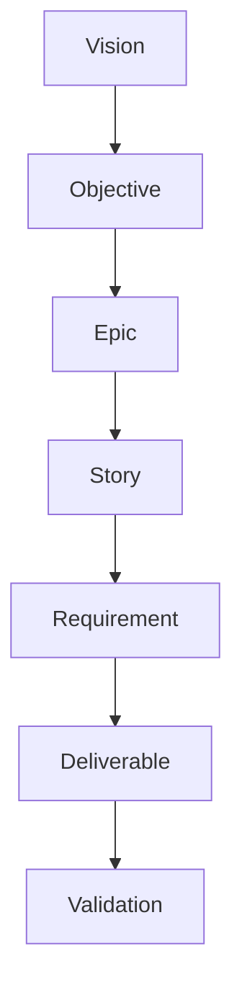
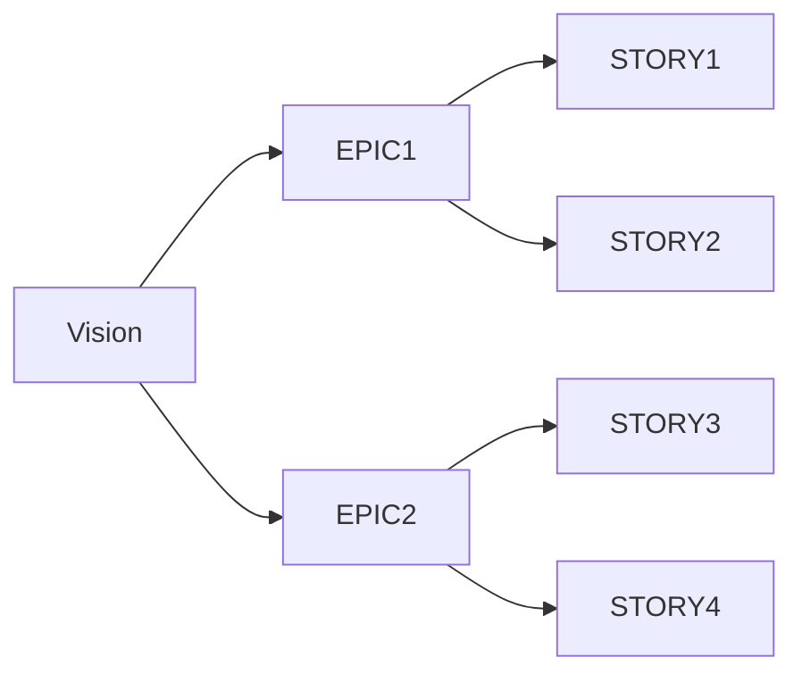

# EPIC-STORY-LINKAGE-XXX: <Initiative / Program Name>

---

## Title Page

| Field | Value |
|---|---|
| Document ID | EPIC-STORY-LINKAGE-XXX |
| Project | <Project Name> |
| Domain | Governance |
| Author | <Author Name> |
| Date | <MMM YYYY> |
| Version | 1.0 |
| Status | Draft / Review / Approved |
| Linked Epic | EPIC-XXX |
| Linked Story | N/A |
| Approval Status | Pending |

---

## Revision History

| Version | Date | Author | Description |
|---|---|---|---|
| 1.0 | <Date> | <Author> | Initial Linkage Creation |

---

## Sign-Off

| Role | Status |
|---|---|
| Platform Architect | Pending |
| Product Owner | Pending |
| DevOps Governance | Pending |
| PMO Governance | Pending |

---

## References

### Business References

- Vision-XXX
- BRD-XXX
- PRD-XXX

### Governance References

- ADR-XXX
- HLD-XXX
- SRS-XXX
- RTM-XXX

---

# 1. Purpose

This document establishes complete traceability between:

```text
Vision
   ↓
Business Objectives
   ↓
Epics
   ↓
Stories
   ↓
Requirements
   ↓
Deliverables
   ↓
Validation
```

The objective is to ensure:

- Strategic alignment
- Requirement traceability
- Delivery governance
- Portfolio visibility
- Audit readiness

---

# 2. Scope

This document governs:

- Product Vision
- Strategic Objectives
- Epics
- Stories
- Requirements
- Deliverables
- Dependencies
- Acceptance Criteria
- Governance Controls

---

# 3. Vision Alignment

## Vision Statement

```text
<Insert Product Vision>
```

---

## Strategic Objectives

| Objective ID | Objective | Priority |
|---|---|---|
| OBJ-001 | Objective Description | High |
| OBJ-002 | Objective Description | Medium |
| OBJ-003 | Objective Description | High |

---

# 4. Epic Registry

| Epic ID | Epic Name | Objective | Status |
|---|---|---|---|
| EPIC-001 | Epic Name | OBJ-001 | In Progress |
| EPIC-002 | Epic Name | OBJ-002 | Planned |

---

# 5. Epic to Story Mapping

| Epic | Story | Story Name | Status |
|---|---|---|---|
| EPIC-001 | STORY-001 | Story Name | Complete |
| EPIC-001 | STORY-002 | Story Name | Complete |
| EPIC-001 | STORY-003 | Story Name | In Progress |

---

# 6. Story to Requirement Mapping

| Story | Requirement ID | Requirement Description |
|---|---|---|
| STORY-001 | FR-001 | Requirement Description |
| STORY-001 | FR-002 | Requirement Description |
| STORY-002 | FR-003 | Requirement Description |

---

# 7. Story Deliverable Mapping

| Story | Deliverable ID | Deliverable |
|---|---|---|
| STORY-001 | D1 | Deliverable Description |
| STORY-001 | D2 | Deliverable Description |
| STORY-002 | D3 | Deliverable Description |

---

# 8. Story Dependency Matrix

| Story | Depends On | Dependency Type |
|---|---|---|
| STORY-002 | STORY-001 | Mandatory |
| STORY-003 | STORY-002 | Mandatory |

---

# 9. Requirement Coverage Matrix

| Requirement | Story | Deliverable | Coverage |
|---|---|---|---|
| FR-001 | STORY-001 | D1 | Complete |
| FR-002 | STORY-001 | D2 | Complete |
| FR-003 | STORY-002 | D3 | Complete |

---

# 10. Acceptance Criteria Coverage

| Story | Acceptance Criteria | Coverage |
|---|---|---|
| STORY-001 | AC-01 to AC-05 | Complete |
| STORY-002 | AC-01 to AC-07 | Complete |
| STORY-003 | AC-01 to AC-08 | In Progress |

---

# 11. Story Progress Dashboard

| Story | Status | Completion |
|---|---|---|
| STORY-001 | Complete | 100% |
| STORY-002 | Complete | 100% |
| STORY-003 | In Progress | 40% |

---

# 12. Deliverable Traceability Model



---

# 13. Strategic Roadmap Alignment



---

# 14. Governance Rules

```text
1. Every Epic must map to a Strategic Objective
2. Every Story must belong to an Epic
3. Every Requirement must belong to a Story
4. Every Deliverable must map to a Story
5. Every Story must define Acceptance Criteria
6. Every Requirement must be traceable
7. No orphan Epics allowed
8. No orphan Stories allowed
9. No orphan Requirements allowed
```

---

# 15. Audit Checklist

| Check | Status |
|---|---|
| All Objectives mapped to Epics | ☐ |
| All Epics mapped to Stories | ☐ |
| All Stories mapped to Requirements | ☐ |
| All Deliverables mapped | ☐ |
| All Dependencies documented | ☐ |
| Acceptance Criteria covered | ☐ |
| Governance review completed | ☐ |

---

# 16. Compliance & Governance

## Standards Alignment

| Standard | Application |
|---|---|
| ISO/IEC/IEEE 29148 | Requirement Traceability |
| Internal Governance | Portfolio Controls |
| SDLC Governance | Story Traceability |

---

## Governance Controls

- Mandatory Epic ownership
- Mandatory Story ownership
- Traceability reviews required
- Coverage verification required
- Audit validation required

---

# 17. Related Artifacts

## Upstream Artifacts

- Vision
- BRD
- PRD

---

## Governance Artifacts

- ADR
- HLD
- SRS
- RTM

---

# 18. Strategic Next Steps

- Review Epic coverage
- Review Story coverage
- Validate requirement traceability
- Update RTM mappings
- Complete governance review

---

# 19. Conclusion

This document establishes complete governance traceability between strategic objectives, epics, stories, requirements, deliverables, and validation activities.

It serves as the authoritative governance artifact for:

- Portfolio Management
- Requirement Governance
- Delivery Tracking
- Audit Readiness
- SDLC Traceability

---

# 20. Approval Status

| Review Area | Status |
|---|---|
| Product Review | Pending |
| Architecture Review | Pending |
| Governance Review | Pending |
| PMO Review | Pending |

---

## Final Approval Statement

```text
This Epic-Story Linkage document becomes authoritative
once all required reviews and approvals are completed.
```

---