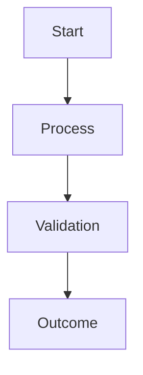

# EPIC-XXX: Epic Title

---

## 1. Epic Metadata

| Field           | Value                                                 |
| --------------- | ----------------------------------------------------- |
| Document ID     |                                                       |
| Domain          |                                                       |
| Document Type   | Agile Epic Specification (ISO/IEC/IEEE 29148 aligned) |
| Version         |                                                       |
| Author          |                                                       |
| Status          |                                                       |
| Date            |                                                       |
| Linked Epic     |                                                       |
| Linked Story    |                                                       |
| Approval Status |                                                       |

---

## 2. Sign-offs

| Role               | Name | Status  | Date |
| ------------------ | ---- | ------- | ---- |
| Platform Architect |      | Pending |      |
| Security Review    |      | Pending |      |
| DevOps Governance  |      | Pending |      |

---

## 3. Revision History

| Version | Date | Author | Description     |
| ------- | ---- | ------ | --------------- |
| v1.0    |      |        | Initial Version |

---

## 4. Business Objective

Describe the business and engineering objective of the epic.

Explain:

- Why this epic exists
- What business problem it solves
- What platform capabilities it delivers
- Which systems or repositories are impacted

---

## 5. Business Value

- Value 1
- Value 2
- Value 3
- Value 4
- Value 5

---

## 6. Scope

### In Scope

- Item 1
- Item 2
- Item 3
- Item 4
- Item 5

### Out of Scope

- Item 1
- Item 2
- Item 3
- Item 4
- Item 5

---

## 7. User Stories

### STORY-XX1

**Story Title**

As a <Role>,
I want <Capability>,
So that <Business Outcome>.

---

### STORY-XX2

**Story Title**

As a <Role>,
I want <Capability>,
So that <Business Outcome>.

---

### STORY-XX3

**Story Title**

As a <Role>,
I want <Capability>,
So that <Business Outcome>.

---

## 8. High-Level Requirements

### HR-01

Requirement description.

```text
High-Level Flow
        ↓
Process
        ↓
Outcome
```

### HR-02

Requirement description.

### HR-03

Requirement description.

### HR-04

Requirement description.

### HR-05

Requirement description.

---

## 9. High-Level Workflow



---

## 10. Deliverables

- Deliverable 1
- Deliverable 2
- Deliverable 3
- Deliverable 4
- Deliverable 5

---

## 11. Dependencies

| Dependency ID | Description |
| ------------- | ----------- |
| DEP-01        |             |
| DEP-02        |             |
| DEP-03        |             |
| DEP-04        |             |
| DEP-05        |             |

---

## 12. Risks

| Risk   | Impact | Mitigation |
| ------ | ------ | ---------- |
| Risk 1 | High   |            |
| Risk 2 | Medium |            |
| Risk 3 | Low    |            |

---

## 13. Acceptance Criteria

- Criterion 1
- Criterion 2
- Criterion 3
- Criterion 4
- Criterion 5

---

## 14. Definition of Done

- [ ] All stories completed and approved
- [ ] Functional requirements completed
- [ ] Documentation published
- [ ] Architecture review completed
- [ ] Deliverables validated
- [ ] Dependencies resolved
- [ ] Risks mitigated
- [ ] Acceptance criteria satisfied
- [ ] Requirement traceability validated
- [ ] Sign-offs completed

---

## 15. Traceability

| BR ID | Business Requirement | Story | Deliverable |
| ----- | -------------------- | ----- | ----------- |
|       |                      |       |             |
|       |                      |       |             |
|       |                      |       |             |

---
