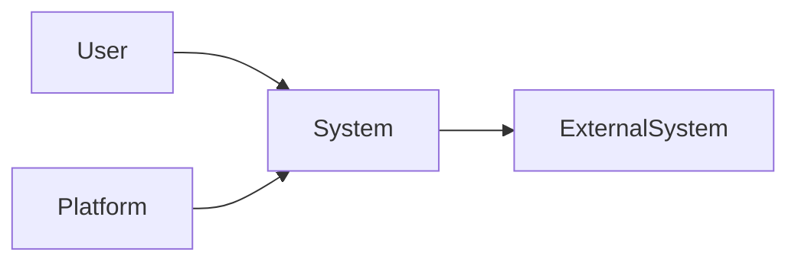
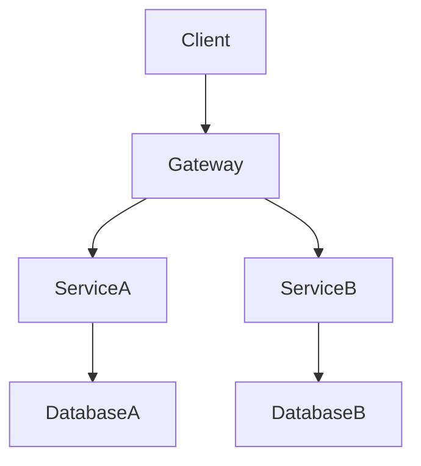
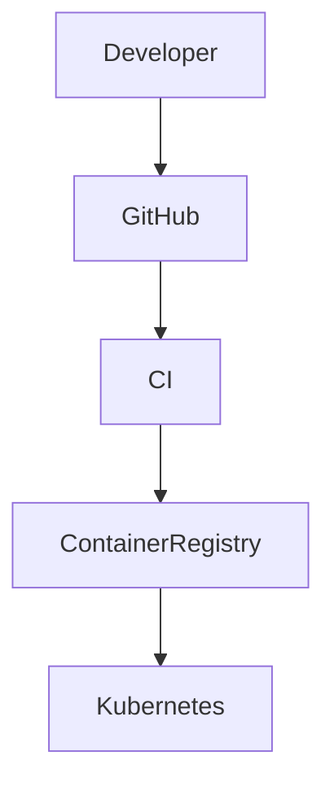

# HLD-XXX: <Solution / System Name>

---

## Title Page

| Field | Value |
|---|---|
| Document ID | HLD-XXX |
| Project | <Project Name> |
| Domain | <Domain Name> |
| Author | <Author Name> |
| Date | <MMM YYYY> |
| Version | 1.0 |
| Status | Draft / Review / Approved |
| Linked Epic | EPIC-XXX |
| Linked Story | STORY-XXX |
| Approval Status | Pending |

---

## Revision History

| Version | Date | Author | Description |
|---|---|---|---|
| 1.0 | <Date> | <Author> | Initial HLD Creation |

---

## Sign-Off

| Role | Status |
|---|---|
| Platform Architect | Pending |
| Security Review | Pending |
| DevOps Governance | Pending |
| Engineering Lead | Pending |

---

## References

### Business References

- BRD-XXX
- PRD-XXX

### Architecture References

- ADR-XXX
- SRS-XXX
- RTM-XXX

### External References

- Standards
- Framework Documentation
- Vendor Documentation

---

# 1. Introduction

## 1.1 Purpose

This High-Level Design (HLD) document defines the architecture, system components, deployment model, and integration strategy for the solution.

It translates approved requirements into a scalable, secure, maintainable, and governance-compliant architecture.

---

## 1.2 Scope

Covers:

- Architecture design
- Domain architecture
- Component architecture
- Integration architecture
- Deployment architecture
- Security architecture
- Operational architecture

---

## 1.3 Assumptions

- Assumption 1
- Assumption 2
- Assumption 3

---

## 1.4 Constraints

- Technology constraints
- Security constraints
- Compliance constraints
- Operational constraints

---

# 2. Architectural Overview

## 2.1 Architecture Style

- Architecture Pattern 1
- Architecture Pattern 2
- Architecture Pattern 3

---

## 2.2 Architectural Principles

- Principle 1
- Principle 2
- Principle 3
- Principle 4

---

## 2.3 System Context (C4 Level 1)



---

# 3. Container Architecture (C4 Level 2)



---

# 4. Domain Architecture

## 4.1 Domain Isolation Strategy

- Domain ownership
- Service ownership
- Data ownership
- Deployment ownership

---

## 4.2 Domain Breakdown

| Domain | Type | Description |
|---|---|---|
| Domain A | Enterprise | Description |
| Domain B | Consumer | Description |

---

## 4.3 Domain Responsibilities

| Domain | Responsibilities |
|---|---|
| Domain A | Responsibilities |
| Domain B | Responsibilities |

---

# 5. Integration Architecture

## 5.1 Communication Strategy

| Domain | Communication Type | Justification |
|---|---|---|
| Domain A | REST | Description |
| Domain B | Kafka | Description |

---

## 5.2 API Integration

- REST APIs
- API Gateway
- Service-to-Service Communication
- Contract Standards

---

## 5.3 Event-Driven Integration


---

## 5.4 External System Integration

| System | Type | Purpose |
|---|---|---|
| External System | API | Integration Purpose |

---

# 6. Deployment Architecture (C4 Level 3)



---

## 6.1 Environment Strategy

| Environment | Purpose |
|---|---|
| Development | Development activities |
| SIT | System Integration Testing |
| UAT | User Acceptance Testing |
| Production | Live Operations |

---

## 6.2 Infrastructure Components

- Kubernetes
- API Gateway
- Message Broker
- Database
- Cache
- Monitoring Stack

---

# 7. Component Design

## 7.1 API Gateway

- Authentication
- Authorization
- Routing
- Rate Limiting

---

## 7.2 Service Layer

- Business Services
- Domain Services
- Integration Services

---

## 7.3 Data Layer

- Database Strategy
- Persistence Model
- Caching Strategy

---

## 7.4 Messaging Layer

- Topics
- Queues
- Event Processing

---

# 8. Security Architecture

## 8.1 Authentication

- Authentication strategy
- Identity provider
- Token management

---

## 8.2 Authorization

- RBAC
- ABAC
- Access controls

---

## 8.3 Data Security

- Encryption at rest
- Encryption in transit
- Key management

---

## 8.4 Secrets Management

- Vault strategy
- Secret rotation
- Credential management

---

# 9. Transaction Management

## 9.1 Transaction Strategy

- ACID
- Eventual Consistency
- Saga Pattern

---

## 9.2 Compensation Strategy

- Retry
- Rollback
- Recovery

---

# 10. Observability

## 10.1 Logging

- Centralized logging
- Log retention

---

## 10.2 Monitoring

- Infrastructure monitoring
- Application monitoring

---

## 10.3 Tracing

- Distributed tracing
- Correlation IDs

---

## 10.4 Alerting

- Operational alerts
- Security alerts

---

# 11. Scalability & Performance

## 11.1 Scalability Strategy

- Horizontal scaling
- Auto-scaling
- Capacity planning

---

## 11.2 Performance Requirements

| Metric | Target |
|---|---|
| API Response Time | Target |
| Throughput | Target |
| Latency | Target |

---

# 12. Availability & Resilience

## 12.1 Availability Requirements

- Uptime targets
- Recovery objectives

---

## 12.2 Resilience Strategy

- Failover
- Retry mechanisms
- Circuit breakers

---

# 13. Risks & Mitigation

| Risk | Impact | Mitigation |
|---|---|---|
| Risk | High | Mitigation |
| Risk | Medium | Mitigation |

---

# 14. Architecture Decisions (Trace to ADR)

| Decision | ADR |
|---|---|
| Architecture Decision | ADR-XXX |
| Security Decision | ADR-XXX |

---

# 15. Compliance & Governance

## Standards Alignment

| Standard | Application |
|---|---|
| IEEE 1016 | Architecture Documentation |
| ISO/IEC/IEEE 29148 | Requirement Traceability |
| Internal Governance | Architecture Controls |

---

## Governance Controls

- Architecture review required
- Security review required
- Traceability updates required
- Change management required

---

# 16. Traceability Matrix (HLD Level)

| Requirement | Source |
|---|---|
| FR-XXX | SRS |
| NFR-XXX | SRS |
| SEC-XXX | SRS |

Coverage: 100%

---

# 17. Related Artifacts

## Upstream Artifacts

- Vision
- BRD
- PRD
- ADR
- SRS

---

## Downstream Artifacts

- LLD
- RTM
- Test Strategy
- Infrastructure Design

---

# 18. Strategic Next Steps

- Create LLD
- Define API Specifications
- Create Infrastructure Design
- Define Test Strategy

---

# 19. Conclusion

This HLD establishes the architecture baseline for the solution.

It defines:

- System architecture
- Domain architecture
- Integration strategy
- Deployment architecture
- Security architecture
- Operational architecture

This document serves as the foundation for:

- Low-Level Design (LLD)
- Service Implementation
- Infrastructure Provisioning
- Testing Strategy

---

# 20. Approval Status

| Review Area | Status |
|---|---|
| Architecture Review | Pending |
| Security Review | Pending |
| Governance Review | Pending |

---

## Final Approval Statement

```text
This HLD becomes authoritative once all required reviews
and approvals are completed.
```

---