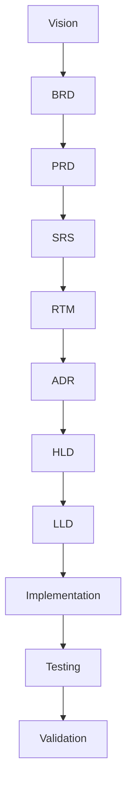

# RTM-XXX: <System / Domain Name> Requirement Traceability Matrix

---

## Title Page

| Field | Value |
|---|---|
| Document ID | RTM-XXX |
| Project | <Project Name> |
| Domain | <Domain Name> |
| Author | <Author Name> |
| Date | <MMM YYYY> |
| Version | 1.0 |
| Status | Draft / Review / Approved |
| Linked Epic | EPIC-XXX |
| Linked Story | STORY-XXX |
| Approval Status | Pending |

---

## Revision History

| Version | Date | Author | Description |
|---|---|---|---|
| 1.0 | <Date> | <Author> | Initial RTM Creation |

---

## Sign-Off

| Role | Status |
|---|---|
| Platform Architect | Pending |
| Security Review | Pending |
| DevOps Governance | Pending |
| QA Lead | Pending |

---

## References

### Business References

- Vision-XXX
- BRD-XXX
- PRD-XXX

### Architecture References

- ADR-XXX
- HLD-XXX
- SRS-XXX
- LLD-XXX

### Validation References

- TEST-PLAN-XXX
- TEST-CASE-XXX

---

# 1. Purpose

This RTM ensures complete end-to-end traceability across the entire software delivery lifecycle.

```text
Vision
   ↓
BRD
   ↓
PRD
   ↓
SRS
   ↓
RTM
   ↓
ADR
   ↓
HLD
   ↓
LLD
   ↓
Implementation
   ↓
Testing
   ↓
Validation
```

The RTM guarantees:

- Requirement completeness
- Design traceability
- Test coverage validation
- Governance compliance
- Audit readiness
- Delivery accountability

---

# 2. Traceability Scope

This RTM covers:

- Business Requirements
- Functional Requirements
- Non-Functional Requirements
- Security Requirements
- Architecture Requirements
- Integration Requirements
- Testing Requirements
- Deployment Requirements

---

# 3. Traceability Strategy

## 3.1 Forward Traceability

```text
Requirement
      ↓
Design
      ↓
Implementation
      ↓
Testing
```

Forward traceability ensures every requirement is implemented and validated.

---

## 3.2 Backward Traceability

```text
Test Case
      ↓
Implementation
      ↓
Design
      ↓
Requirement
```

Backward traceability ensures every implementation artifact originates from a valid requirement.

---

# 4. Business Requirement Traceability

| Business Requirement | PRD Reference | SRS Reference | Status |
|---|---|---|---|
| BR-001 | PRD-001 | FR-001 | Planned |
| BR-002 | PRD-002 | FR-002 | Planned |

---

# 5. Functional Requirement Traceability

## 5.1 Domain / Module A

| Req ID | Description | Source (PRD) | HLD Component | Service | LLD Ref | Test Case | Status |
|---|---|---|---|---|---|---|---|
| FR-A-01 | Requirement Description | PRD-A | Component | Service | LLD-A | TC-A-01 | Planned |
| FR-A-02 | Requirement Description | PRD-A | Component | Service | LLD-A | TC-A-02 | Planned |

---

## 5.2 Domain / Module B

| Req ID | Description | Source (PRD) | HLD Component | Service | LLD Ref | Test Case | Status |
|---|---|---|---|---|---|---|---|
| FR-B-01 | Requirement Description | PRD-B | Component | Service | LLD-B | TC-B-01 | Planned |
| FR-B-02 | Requirement Description | PRD-B | Component | Service | LLD-B | TC-B-02 | Planned |

---

## 5.3 Platform Requirements

| Req ID | Description | Source | HLD Component | Service | LLD Ref | Test Case | Status |
|---|---|---|---|---|---|---|---|
| FR-PL-01 | Requirement Description | SRS | Component | Service | LLD | TC-PL-01 | Planned |
| FR-PL-02 | Requirement Description | SRS | Component | Service | LLD | TC-PL-02 | Planned |

---

# 6. Non-Functional Requirement Traceability

| NFR ID | Description | Source | Architecture Component | Validation Method | Status |
|---|---|---|---|---|---|
| NFR-PERF-01 | Performance Requirement | SRS | API Layer | Performance Test | Planned |
| NFR-SCAL-01 | Scalability Requirement | SRS | Infrastructure Layer | Load Test | Planned |
| NFR-AVL-01 | Availability Requirement | SRS | Platform Layer | Operational Validation | Planned |
| NFR-REL-01 | Reliability Requirement | SRS | Service Layer | Recovery Testing | Planned |

---

# 7. Security Requirement Traceability

| Security ID | Description | Source | Architecture Component | Validation Method | Status |
|---|---|---|---|---|---|
| SEC-01 | Authentication | SRS | Security Layer | Security Test | Planned |
| SEC-02 | Authorization | SRS | Access Layer | Security Test | Planned |
| SEC-03 | Encryption | SRS | Data Layer | Security Test | Planned |
| SEC-04 | Audit Logging | SRS | Logging Layer | Compliance Test | Planned |

---

# 8. Architecture Traceability

## 8.1 Requirement to ADR Mapping

| Requirement | ADR |
|---|---|
| FR-001 | ADR-001 |
| FR-002 | ADR-002 |

---

## 8.2 ADR to HLD Mapping

| ADR | HLD Component |
|---|---|
| ADR-001 | Component-A |
| ADR-002 | Component-B |

---

## 8.3 HLD to LLD Mapping

| HLD Component | LLD Reference |
|---|---|
| Component-A | LLD-A |
| Component-B | LLD-B |

---

# 9. Implementation Traceability

| Requirement | Service | Repository | Status |
|---|---|---|---|
| FR-001 | Service-A | Repo-A | Planned |
| FR-002 | Service-B | Repo-B | Planned |

---

# 10. Test Coverage Traceability

| Requirement | Test Case | Test Type | Status |
|---|---|---|---|
| FR-001 | TC-001 | Functional | Planned |
| FR-002 | TC-002 | Integration | Planned |
| NFR-001 | TC-003 | Performance | Planned |
| SEC-001 | TC-004 | Security | Planned |

---

# 11. Coverage Summary

| Category | Coverage |
|---|---|
| Business Requirements | 100% |
| Functional Requirements | 100% |
| Non-Functional Requirements | 100% |
| Security Requirements | 100% |
| Architecture Mapping | 100% |
| Implementation Mapping | 100% |
| Test Coverage | 100% |

---

# 12. Traceability Model



---

# 13. Governance Rules

```text
1. Every Business Requirement must map to PRD
2. Every PRD Requirement must map to SRS
3. Every SRS Requirement must exist in RTM
4. Every RTM Requirement must map to ADR and HLD
5. Every HLD Component must map to LLD
6. Every LLD must map to implementation
7. Every implementation artifact must map to test cases
8. Every test case must map back to a requirement
9. No orphan requirements allowed
10. No orphan implementation allowed
11. No orphan test cases allowed
```

---

# 14. Audit Checklist

| Check | Status |
|---|---|
| All Business Requirements mapped | ☐ |
| All Functional Requirements mapped | ☐ |
| All NFRs mapped | ☐ |
| All Security Requirements mapped | ☐ |
| All ADR references mapped | ☐ |
| All HLD references mapped | ☐ |
| All LLD references mapped | ☐ |
| All Test Cases mapped | ☐ |
| Coverage verified | ☐ |
| Governance review completed | ☐ |

---

# 15. Related Artifacts

## Upstream Artifacts

- Vision-XXX
- BRD-XXX
- PRD-XXX
- SRS-XXX

---

## Design Artifacts

- ADR-XXX
- HLD-XXX
- LLD-XXX

---

## Validation Artifacts

- TEST-PLAN-XXX
- TEST-CASE-XXX

---

# 16. Strategic Next Steps

- Validate requirement coverage
- Complete architecture mapping
- Complete implementation mapping
- Complete test mapping
- Perform governance review

---

# 17. Compliance & Governance

## Standards Alignment

| Standard | Application |
|---|---|
| ISO/IEC/IEEE 29148 | Requirement Traceability |
| IEEE 1016 | Architecture Mapping |
| Internal Governance | SDLC Compliance |

---

## Governance Controls

- Mandatory traceability reviews
- Mandatory coverage verification
- Architecture compliance validation
- Test coverage validation
- Audit readiness validation

---

# 18. Conclusion

This RTM provides complete lifecycle traceability across business requirements, architecture, implementation, testing, and validation.

It serves as the authoritative governance artifact for:

- Requirement Traceability
- Architecture Compliance
- Test Coverage Validation
- Audit Readiness
- SDLC Governance
- Delivery Assurance

---

# 19. Approval Status

| Review Area | Status |
|---|---|
| Architecture Review | Pending |
| QA Review | Pending |
| Security Review | Pending |
| Governance Review | Pending |

---

## Final Approval Statement

```text
This RTM becomes authoritative once all required reviews
and approvals are completed.
```

---