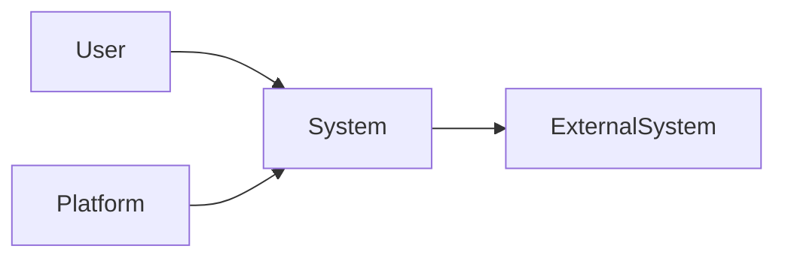

# SRS-XXX: <System / Domain Name>

---

## Title Page

| Field | Value |
|---|---|
| Document ID | SRS-XXX |
| Project | <Project Name> |
| Domain | <Domain Name> |
| Author | <Author Name> |
| Date | <MMM YYYY> |
| Version | 1.0 |
| Status | Draft / Review / Approved |
| Linked Epic | EPIC-XXX |
| Linked Story | STORY-XXX |
| Approval Status | Pending |

---

## Revision History

| Version | Date | Author | Description |
|---|---|---|---|
| 1.0 | <Date> | <Author> | Initial SRS Creation |

---

## Sign-Off

| Role | Status |
|---|---|
| Platform Architect | Pending |
| Security Review | Pending |
| DevOps Governance | Pending |
| QA Lead | Pending |

---

## References

### Business References

- Vision-XXX
- BRD-XXX
- PRD-XXX

### Architecture References

- ADR-XXX
- HLD-XXX
- RTM-XXX

### External References

- ISO/IEC/IEEE 29148
- Regulatory Standards
- Vendor Documentation

---

# 1. Introduction

## 1.1 Purpose

This Software Requirements Specification (SRS) defines the functional and non-functional requirements for the solution.

It translates business requirements into precise system behavior, constraints, interfaces, and validation criteria.

This document serves as the authoritative source for architecture, design, implementation, testing, and traceability.

---

## 1.2 Scope

Covers:

- Functional Requirements
- Non-Functional Requirements
- Security Requirements
- Data Requirements
- Integration Requirements
- Interface Requirements
- Operational Requirements

---

## 1.3 Definitions

| Term | Description |
|---|---|
| Domain | Definition |
| Service | Definition |
| Event | Definition |
| API | Definition |

---

## 1.4 Assumptions

- Assumption 1
- Assumption 2
- Assumption 3

---

## 1.5 Constraints

- Technology Constraints
- Security Constraints
- Regulatory Constraints
- Operational Constraints

---

# 2. Overall Description

## 2.1 System Perspective



---

## 2.2 Business Context

Describe:

- Business problem
- Business objectives
- Stakeholders
- Expected outcomes

---

## 2.3 Design Principles

- Principle 1
- Principle 2
- Principle 3
- Principle 4

---

## 2.4 Stakeholders

| Stakeholder | Responsibility |
|---|---|
| Business Owner | Business Ownership |
| Architect | Solution Design |
| Engineering Team | Implementation |
| QA Team | Validation |

---

# 3. Functional Requirements

---

## 3.1 Domain / Module A

| ID | Requirement |
|---|---|
| FR-A-01 | System shall ... |
| FR-A-02 | System shall ... |
| FR-A-03 | System shall ... |

---

## 3.2 Domain / Module B

| ID | Requirement |
|---|---|
| FR-B-01 | System shall ... |
| FR-B-02 | System shall ... |
| FR-B-03 | System shall ... |

---

## 3.3 Domain / Module C

| ID | Requirement |
|---|---|
| FR-C-01 | System shall ... |
| FR-C-02 | System shall ... |
| FR-C-03 | System shall ... |

---

## 3.4 Domain / Module D

| ID | Requirement |
|---|---|
| FR-D-01 | System shall ... |
| FR-D-02 | System shall ... |
| FR-D-03 | System shall ... |

---

## 3.5 Platform-Level Requirements

| ID | Requirement |
|---|---|
| FR-PL-01 | Platform shall ... |
| FR-PL-02 | Platform shall ... |
| FR-PL-03 | Platform shall ... |

---

# 4. Non-Functional Requirements

---

## 4.1 Performance

| Requirement ID | Requirement |
|---|---|
| NFR-PERF-01 | Response time requirement |
| NFR-PERF-02 | Throughput requirement |

---

## 4.2 Scalability

| Requirement ID | Requirement |
|---|---|
| NFR-SCAL-01 | Horizontal scaling |
| NFR-SCAL-02 | Capacity management |

---

## 4.3 Availability

| Requirement ID | Requirement |
|---|---|
| NFR-AVL-01 | Uptime requirement |
| NFR-AVL-02 | Recovery objectives |

---

## 4.4 Reliability

| Requirement ID | Requirement |
|---|---|
| NFR-REL-01 | Retry capability |
| NFR-REL-02 | Fault tolerance |

---

## 4.5 Maintainability

| Requirement ID | Requirement |
|---|---|
| NFR-MAIN-01 | Modular design |
| NFR-MAIN-02 | Operational supportability |

---

# 5. Security Requirements

---

## 5.1 Authentication

| ID | Requirement |
|---|---|
| SEC-01 | System shall authenticate users |

---

## 5.2 Authorization

| ID | Requirement |
|---|---|
| SEC-02 | System shall enforce role-based access |

---

## 5.3 Data Protection

| ID | Requirement |
|---|---|
| SEC-03 | Data encryption at rest |
| SEC-04 | Data encryption in transit |

---

## 5.4 Compliance Requirements

| ID | Requirement |
|---|---|
| SEC-05 | Regulatory compliance |
| SEC-06 | Audit logging |

---

# 6. External Interfaces

---

## 6.1 User Interfaces

- Web UI
- Mobile UI
- Administrative UI

---

## 6.2 System Interfaces

| System | Type | Purpose |
|---|---|---|
| External System | API | Integration |

---

## 6.3 Communication Interfaces

- REST APIs
- Messaging
- Event Streaming
- Batch Processing

---

## 6.4 Communication Constraints

- Constraint 1
- Constraint 2
- Constraint 3

---

# 7. Data Requirements

---

## 7.1 Data Storage

- Database Requirements
- Cache Requirements
- Retention Requirements

---

## 7.2 Data Ownership

| Domain | Data Owner |
|---|---|
| Domain A | Team A |
| Domain B | Team B |

---

## 7.3 Data Isolation

- Schema isolation
- Domain ownership
- Access restrictions

---

## 7.4 Data Retention

| Data Type | Retention Period |
|---|---|
| Operational Data | Period |
| Audit Data | Period |

---

# 8. Integration Requirements

---

## 8.1 API Integration

- API Standards
- Versioning Standards
- Contract Management

---

## 8.2 Event-Driven Integration

- Event Standards
- Event Ownership
- Event Versioning

---

## 8.3 Third-Party Integration

| System | Integration Type |
|---|---|
| External Vendor | API |

---

# 9. Error Handling Requirements

- Standardized Error Model
- Retry Strategy
- Failure Recovery
- Dead Letter Handling

---

# 10. Logging & Monitoring Requirements

---

## 10.1 Logging

- Centralized Logging
- Audit Logging

---

## 10.2 Monitoring

- Infrastructure Monitoring
- Application Monitoring

---

## 10.3 Metrics

- Business Metrics
- Technical Metrics

---

## 10.4 Alerting

- Operational Alerts
- Security Alerts

---

# 11. Reporting Requirements

| Report | Purpose |
|---|---|
| Operational Report | Monitoring |
| Audit Report | Compliance |

---

# 12. Risks & Assumptions

## Risks

| Risk | Impact | Mitigation |
|---|---|---|
| Risk | High | Mitigation |

---

## Assumptions

- Assumption 1
- Assumption 2

---

# 13. Acceptance Criteria

| Requirement | Validation Method |
|---|---|
| FR-XXX | Functional Testing |
| NFR-XXX | Performance Testing |
| SEC-XXX | Security Testing |

---

# 14. Traceability Matrix (SRS Level)

| Requirement | Source |
|---|---|
| FR-XXX | PRD |
| NFR-XXX | Business Requirement |
| SEC-XXX | Compliance Requirement |

Coverage: 100%

---

# 15. Related Artifacts

## Upstream Artifacts

- Vision
- BRD
- PRD

---

## Downstream Artifacts

- ADR
- HLD
- RTM
- LLD
- Test Strategy
- Test Cases

---

# 16. Strategic Next Steps

- Create ADR
- Create HLD
- Create RTM
- Create LLD
- Define Test Strategy

---

# 17. Compliance & Governance

## Standards Alignment

| Standard | Application |
|---|---|
| ISO/IEC/IEEE 29148 | Requirements Engineering |
| Internal Governance | SDLC Controls |

---

## Governance Rules

- Every requirement must have an identifier
- Every requirement must be traceable
- Every requirement must be testable
- No orphan requirements allowed

---

# 18. Conclusion

This SRS provides the authoritative system-level specification for the solution.

It defines:

- Functional Requirements
- Non-Functional Requirements
- Security Requirements
- Integration Requirements
- Operational Requirements

This document serves as the foundation for:

- Architecture Design
- Implementation Planning
- Testing
- Traceability
- Governance Compliance

---

# 19. Approval Status

| Review Area | Status |
|---|---|
| Business Review | Pending |
| Architecture Review | Pending |
| Security Review | Pending |
| Governance Review | Pending |

---

## Final Approval Statement

```text
This SRS becomes authoritative once all required reviews
and approvals are completed.
```

---