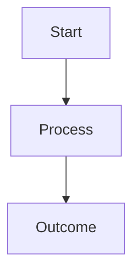

# STORY-XXX: Story Title

---

## 1. Story Metadata

| Field           | Value                                                  |
| --------------- | ------------------------------------------------------ |
| Document ID     |                                                        |
| Domain          |                                                        |
| Document Type   | Agile Story Specification (ISO/IEC/IEEE 29148 aligned) |
| Version         |                                                        |
| Author          |                                                        |
| Status          |                                                        |
| Date            |                                                        |
| Linked Epic     |                                                        |
| Linked BR       |                                                        |
| Planned Issues  |                                                        |
| Approval Status |                                                        |

---

## 2. Story Objective

Describe the business and engineering objective of the story.

---

## 3. Business Value

- Value 1
- Value 2
- Value 3

---

## 4. User Story

**As a** <Role>  
**I want** <Capability>  
**So that** <Business Outcome>

---

## 5. Scope

### In Scope

- Item 1
- Item 2
- Item 3

### Out of Scope

- Item 1
- Item 2
- Item 3

---

## 6. Functional Requirements

| ID    | Requirement |
| ----- | ----------- |
| FR-01 |             |
| FR-02 |             |
| FR-03 |             |

---

## 7. Non-Functional Requirements

| ID     | Requirement |
| ------ | ----------- |
| NFR-01 |             |
| NFR-02 |             |
| NFR-03 |             |

---

## 8. High-Level Workflow

---

## 9. Deliverables

- Deliverable 1
- Deliverable 2
- Deliverable 3

---

## 10. Dependencies

| Dependency ID | Description |
| ------------- | ----------- |
| DEP-01        |             |
| DEP-02        |             |
| DEP-03        |             |

---

## 11. Risks

| Risk   | Impact | Mitigation |
| ------ | ------ | ---------- |
| Risk 1 | High   | Mitigation |
| Risk 2 | Medium | Mitigation |

---

## 12. Acceptance Criteria

- [ ] Criterion 1
- [ ] Criterion 2
- [ ] Criterion 3
- [ ] Criterion 4

---

## 13. Definition of Done

- [ ] Functional requirements completed
- [ ] Documentation updated
- [ ] Architecture reviewed
- [ ] Acceptance criteria validated
- [ ] Traceability updated
- [ ] Sign-offs completed

---

## 14. Traceability

| Requirement          | Mapping |
| -------------------- | ------- |
| Business Requirement |         |
| Epic                 |         |
| Issues               |         |
| Design Artifacts     |         |

---
