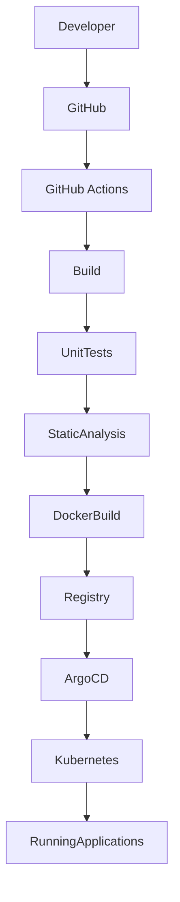
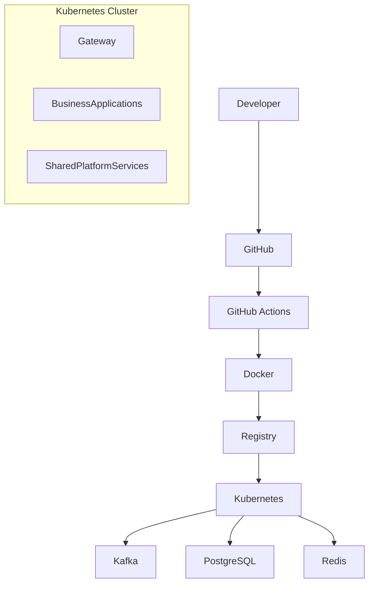

# SIT-006: Platform Architecture

---

# 1. Title Page

| Field          | Value                            |
| -------------- | -------------------------------- |
| Document ID    | SIT-006                          |
| Document Name  | Platform Architecture            |
| Organization   | STARONE INFOTECH                 |
| Domain         | Enterprise Platform Architecture |
| Document Type  | Enterprise Standard              |
| Version        | 1.0.0                            |
| Status         | Approved                         |
| Owner          | Enterprise Architecture          |
| Classification | Internal                         |
| Effective Date | TBD                              |

---

# 2. Revision History

| Version | Date       | Author                  | Description                   |
| ------- | ---------- | ----------------------- | ----------------------------- |
| 1.0.0   | 2026-07-02 | Enterprise Architecture | Initial Platform Architecture |

---

# 3. Approval & Sign-Off

| Role                 | Status   |
| -------------------- | -------- |
| Enterprise Architect | Approved |
| Platform Architect   | Approved |
| DevSecOps Lead       | Approved |
| Engineering Lead     | Approved |

---

# 4. Executive Summary

The Platform Architecture defines the shared engineering platform that supports all software products within the STARONE INFOTECH ecosystem.

The platform provides standardized infrastructure, deployment automation, configuration management, observability, messaging, and shared engineering capabilities that are consumed by all business applications.

Applications shall focus exclusively on business functionality while the platform provides reusable cross-cutting capabilities.

This document establishes the target-state platform architecture for current and future STARONE products.

---

# 5. Background

As the number of applications grows, duplicating infrastructure and operational capabilities within each application results in:

- Increased operational complexity
- Higher infrastructure cost
- Inconsistent deployments
- Configuration duplication
- Security inconsistencies
- Difficult maintenance
- Slower engineering delivery

The STARONE Platform Architecture centralizes these capabilities into reusable platform services.

Applications consume platform capabilities instead of implementing them independently.

---

# 6. Purpose

This document establishes:

- Enterprise Platform Architecture
- Platform Components
- Platform Services
- Infrastructure Architecture
- Shared Engineering Capabilities
- Platform Interaction Model
- Platform Governance
- Platform Evolution Strategy

---

# 7. Scope

The Platform Architecture governs:

### Infrastructure Platform

- Kubernetes
- Container Runtime
- Networking
- Storage

---

### Deployment Platform

- GitHub Actions
- Argo CD
- Helm
- GitHub

---

### Configuration Platform

- Spring Cloud Config
- Environment Configuration
- Feature Flags

---

### Integration Platform

- REST APIs
- Kafka
- Event Communication

---

### Observability Platform

- Logging
- Metrics
- Monitoring
- Distributed Tracing

---

### Security Platform

- Authentication
- Authorization
- Secrets Management
- Secure Communication

---

# 8. Platform Vision

The STARONE Engineering Platform shall provide:

- Reusable infrastructure
- Standardized deployments
- Centralized configuration
- Secure engineering services
- Enterprise observability
- High availability
- Scalability
- Automation
- Self-service engineering
- Cloud-native capabilities

The platform shall continuously evolve while remaining transparent to business applications.

---

# 9. Platform Objectives

| ID      | Objective                            |
| ------- | ------------------------------------ |
| PLA-001 | Standardize platform services.       |
| PLA-002 | Eliminate duplicated infrastructure. |
| PLA-003 | Improve engineering productivity.    |
| PLA-004 | Support cloud-native applications.   |
| PLA-005 | Centralize operational capabilities. |
| PLA-006 | Enable independent deployments.      |
| PLA-007 | Improve platform reliability.        |
| PLA-008 | Support platform scalability.        |
| PLA-009 | Simplify operations.                 |
| PLA-010 | Enable future platform evolution.    |

---

# 10. Platform Architecture Overview

The STARONE ecosystem is organized into three architectural layers.

```text
                    STARONE ENGINEERING ECOSYSTEM

┌──────────────────────────────────────────────────────────┐
│                 Enterprise Layer                         │
│ Standards │ Governance │ Architecture │ Templates        │
└─────────────────────────┬────────────────────────────────┘
                          │
                          ▼
┌──────────────────────────────────────────────────────────┐
│                  Platform Layer                          │
│ Infrastructure │ Config │ CI/CD │ Messaging │ Monitoring │
└─────────────────────────┬────────────────────────────────┘
                          │
                          ▼
┌──────────────────────────────────────────────────────────┐
│                Application Layer                         │
│ DHS │ BookShow │ VaultIron │ SportStats │ Future Apps    │
└──────────────────────────────────────────────────────────┘
```

Applications consume services from the Platform Layer.

The Platform Layer is governed by the Enterprise Layer.

---

# 11. Platform Components

The STARONE platform consists of multiple reusable engineering components.

```text
Platform

├── Infrastructure Platform
├── Configuration Platform
├── Deployment Platform
├── Messaging Platform
├── Security Platform
├── Observability Platform
├── Shared Libraries
└── Developer Platform
```

Each component owns one well-defined responsibility.

---

# 12. Platform Repository Landscape

The engineering platform is implemented through dedicated repositories.

| Repository                              | Purpose                               |
| --------------------------------------- | ------------------------------------- |
| starone-galaxy-architecture             | Enterprise standards and architecture |
| starone-galaxy-infra                    | Infrastructure platform               |
| starone-galaxy-central-config           | Centralized configuration             |
| starone-galaxy-shared _(Future)_        | Shared engineering libraries          |
| starone-galaxy-security _(Future)_      | Security platform                     |
| starone-galaxy-observability _(Future)_ | Monitoring and observability          |

Each repository shall remain independently maintainable.

---

# 13. Platform Principles

The platform shall comply with the following principles.

## PP-001 Platform Before Application

Shared capabilities belong to the platform.

Applications consume them.

---

## PP-002 Reuse Before Build

Reusable platform capabilities shall be evaluated before creating application-specific implementations.

---

## PP-003 Cloud Native

The platform shall leverage cloud-native technologies.

---

## PP-004 Automation First

Platform operations shall be automated wherever practical.

---

## PP-005 Secure by Default

Security capabilities shall be embedded within the platform.

Applications inherit security capabilities.

---

## PP-006 Independent Evolution

Platform services shall evolve independently of business applications.

---

## PP-007 High Availability

Platform services shall minimize operational downtime.

---

## PP-008 Observability

Every platform component shall expose sufficient operational visibility.

---

# 14. Infrastructure Platform

The Infrastructure Platform provides the runtime foundation for all STARONE applications.

Applications shall never directly manage infrastructure resources.

---

## 14.1 Core Infrastructure

| Component          | Purpose                       |
| ------------------ | ----------------------------- |
| Kubernetes         | Container orchestration       |
| Docker             | Application containerization  |
| Helm               | Kubernetes package management |
| Container Registry | Image storage                 |
| Networking         | Service communication         |
| Persistent Storage | Stateful workloads            |
| Ingress Controller | External traffic routing      |

---

## 14.2 Infrastructure Principles

The infrastructure platform shall provide:

- High Availability
- Horizontal Scalability
- Fault Tolerance
- Automated Recovery
- Infrastructure as Code
- Immutable Deployments
- Environment Consistency

Infrastructure implementation details remain isolated from application repositories.

---

# 15. Configuration Platform

Centralized configuration eliminates environment-specific configuration from applications.

Repository:

```text
starone-galaxy-central-config
```

Responsibilities include:

- Environment Configuration
- Application Properties
- Feature Flags
- Shared Configuration
- Configuration Versioning
- Secure Property References

Applications shall retrieve configuration during runtime.

Configuration shall not be embedded within application binaries.

---

# 16. CI/CD Platform

Software delivery shall be standardized across every application.

Platform Components

| Component          | Purpose                |
| ------------------ | ---------------------- |
| GitHub             | Source Control         |
| GitHub Actions     | Continuous Integration |
| Docker             | Image Creation         |
| Container Registry | Artifact Storage       |
| Argo CD            | Continuous Deployment  |
| Kubernetes         | Runtime Platform       |

---

## Continuous Delivery Pipeline



The pipeline shall remain consistent across all applications.

---

# 17. Deployment Architecture

Application deployment follows the enterprise deployment architecture.



Deployment automation shall require no manual production deployment activities.

---

# 18. Messaging Platform

Enterprise messaging enables asynchronous communication.

Primary messaging platform:

| Technology   | Purpose                   |
| ------------ | ------------------------- |
| Apache Kafka | Enterprise Event Backbone |

Messaging supports:

- Event Publication
- Event Subscription
- Asynchronous Processing
- Event Replay
- Event Persistence
- Decoupled Integration

Applications publish business events rather than directly invoking downstream services where asynchronous communication is appropriate.

---

# 19. API Platform

Synchronous communication shall occur through standardized REST APIs.

API capabilities include:

- REST
- OpenAPI
- Versioning
- Validation
- Authentication
- Authorization
- Rate Limiting
- Error Handling

External APIs shall be exposed through an API Gateway.

Applications shall not expose services directly to external consumers.

---

# 20. Security Platform

The Security Platform provides centralized security capabilities.

Platform responsibilities include:

- Authentication
- Authorization
- JWT Management
- RBAC
- TLS Encryption
- Secret Management
- Certificate Management
- Audit Logging

Applications consume these platform services rather than implementing custom security frameworks.

---

# 21. Observability Platform

Operational visibility is a platform capability.

The observability platform provides:

## Monitoring

- Prometheus

---

## Visualization

- Grafana

---

## Logging

- Structured Logs
- Centralized Log Aggregation

---

## Tracing

- Distributed Tracing

---

## Health Monitoring

Applications shall expose:

- Liveness
- Readiness
- Startup Health

Observability shall be available by default for every application.

---

# 22. Platform Interaction Model

The STARONE platform follows a layered interaction model.

```text
                    Enterprise Standards
                             │
                             ▼
                 Platform Engineering Services
                             │
      ┌──────────────┬──────────────┬──────────────┐
      ▼              ▼              ▼
 Configuration    Messaging    Observability
      │              │              │
      └──────────────┼──────────────┘
                     ▼
             Business Applications
```

Business applications interact with platform services through well-defined interfaces.

Applications shall remain independent from platform implementation details.

---

# 23. Platform Service Responsibilities

| Platform Capability | Responsibility       |
| ------------------- | -------------------- |
| Kubernetes          | Runtime              |
| Helm                | Deployment Packaging |
| GitHub Actions      | Build Automation     |
| Argo CD             | Continuous Delivery  |
| Spring Cloud Config | Configuration        |
| Kafka               | Messaging            |
| Prometheus          | Monitoring           |
| Grafana             | Visualization        |
| Redis               | Distributed Cache    |
| PostgreSQL          | Persistent Storage   |

Each platform capability owns a single engineering responsibility.

---

# 24. Domain Isolation Strategy

The STARONE ecosystem is composed of independent business domains.

Each domain owns its business capabilities, services, data, deployment lifecycle, and operational responsibilities.

## Domain Isolation Principles

Every domain shall own:

- Business Logic
- Domain Services
- APIs
- Events
- Database
- Deployment
- Operational Monitoring

Domains shall **not**:

- Access another domain's database.
- Share business logic.
- Share internal implementation.
- Deploy together unless explicitly required.

Domain autonomy enables independent evolution while maintaining enterprise consistency.

---

# 25. Domain Communication Strategy

The STARONE ecosystem follows a domain-specific communication model.

Each product may adopt synchronous, asynchronous, or hybrid communication depending on business requirements.

| Domain     | Communication Model          | Rationale                                                                                 |
| ---------- | ---------------------------- | ----------------------------------------------------------------------------------------- |
| DHS        | Hybrid (REST + Events)       | Complex business workflows requiring both immediate responses and asynchronous processing |
| BookShow   | REST APIs                    | User-driven transactional interactions with immediate feedback                            |
| SportStats | REST APIs + Batch Processing | Data ingestion, scheduled analytics, and reporting                                        |
| VaultIron  | REST APIs                    | Strong consistency and security requirements                                              |

Communication patterns shall be selected based on business requirements rather than technical preference.

---

# 26. Transaction Management

Distributed transactions shall avoid traditional two-phase commit mechanisms.

The preferred enterprise approach is **eventual consistency** using asynchronous coordination.

## Transaction Principles

- Business transactions shall remain bounded within a domain whenever practical.
- Cross-domain workflows shall use asynchronous events.
- Long-running workflows shall support compensation.
- Business events shall be immutable.

---

## Saga Pattern

The Saga Pattern shall coordinate distributed business processes.

```text
Business Event
        │
        ▼
Service A
        │
        ▼
Event
        │
        ▼
Service B
        │
        ▼
Event
        │
        ▼
Service C
```

Each participating service owns its own transaction.

---

## Compensation Strategy

When failures occur:

- Compensating actions shall reverse completed business operations where appropriate.
- Compensation shall be driven through business events.
- Rollback logic shall remain within the owning domain.

Compensation is a business responsibility rather than a platform responsibility.

---

# 27. Scalability & Performance

The platform shall support enterprise-scale workloads.

## Scalability Principles

Applications shall support:

- Horizontal Scaling
- Stateless Processing
- Independent Deployments
- Elastic Resource Allocation

Platform components shall scale independently of business applications.

---

## Performance Principles

Solutions shall:

- Minimize synchronous dependencies.
- Use asynchronous processing where appropriate.
- Cache frequently accessed data.
- Optimize database interactions.
- Avoid unnecessary network communication.

Performance optimization shall never compromise correctness or maintainability.

---

# 28. Platform Governance

Platform capabilities shall be governed under the Engineering Governance framework.

Governance activities include:

- Platform Architecture Reviews
- Infrastructure Reviews
- Security Reviews
- Technology Reviews
- Deployment Reviews
- Capacity Planning
- Platform Modernization

Platform changes that affect multiple products shall undergo Enterprise Architecture review before implementation.

---

# 29. Platform Roadmap

The platform shall evolve incrementally.

### Phase 1 – Foundation

- Kubernetes Platform
- GitHub
- GitHub Actions
- Docker
- Helm
- Argo CD
- Central Configuration

---

### Phase 2 – Shared Platform Services

- Kafka
- Monitoring
- Logging
- Distributed Tracing
- Shared Libraries

---

### Phase 3 – Enterprise Platform

- Internal Developer Platform (IDP)
- Self-Service Provisioning
- Platform APIs
- Centralized Secret Management

---

### Phase 4 – Intelligent Platform

- AI-Assisted Operations
- Automated Platform Optimization
- Predictive Monitoring
- Policy as Code
- Enterprise Service Catalog

Platform evolution shall remain backward compatible whenever practical.

---

# 30. Platform Compliance

All platform components shall comply with:

- Engineering Operating Model (SIT-001)
- Engineering Governance (SIT-002)
- Repository Architecture (SIT-003)
- Technology Strategy (SIT-004)
- Architecture Principles (SIT-005)

Platform deviations require:

- Architecture Review
- Risk Assessment
- Approved Architecture Decision Record (ADR)

---

# 31. Related Documents

| Document ID | Document                          |
| ----------- | --------------------------------- |
| SIT-001     | Engineering Operating Model       |
| SIT-002     | Engineering Governance            |
| SIT-003     | Repository Architecture           |
| SIT-004     | Technology Strategy               |
| SIT-005     | Architecture Principles           |
| SIT-007     | Enterprise Reference Architecture |

---

# 32. Glossary

| Term                    | Definition                                               |
| ----------------------- | -------------------------------------------------------- |
| Platform                | Shared engineering capabilities consumed by applications |
| Platform Service        | Reusable infrastructure or engineering capability        |
| Domain                  | Independent business boundary                            |
| Saga                    | Distributed transaction coordination pattern             |
| Compensation            | Business action that reverses a completed operation      |
| Eventual Consistency    | Distributed consistency achieved asynchronously          |
| Infrastructure Platform | Shared runtime environment                               |
| Observability           | Monitoring, logging, metrics, and tracing capabilities   |

---

# 33. References

This document shall be read together with:

- SIT-001 Engineering Operating Model
- SIT-002 Engineering Governance
- SIT-003 Repository Architecture
- SIT-004 Technology Strategy
- SIT-005 Architecture Principles
- SIT-007 Enterprise Reference Architecture

---

# 34. Document Ownership

| Responsibility       | Owner                   |
| -------------------- | ----------------------- |
| Document Owner       | Enterprise Architecture |
| Platform Authority   | Platform Engineering    |
| Document Maintenance | Enterprise Architecture |
| Review Authority     | Enterprise Architecture |
| Approval Authority   | Enterprise Architecture |

This document shall be reviewed annually or whenever significant changes occur to the engineering platform.

---

# 35. Revision History (Current Version)

| Version | Date       | Author                  | Description                   |
| ------- | ---------- | ----------------------- | ----------------------------- |
| 1.0.0   | 2026-07-02 | Enterprise Architecture | Initial Platform Architecture |

---

# 36. Conclusion

The Platform Architecture defines the shared engineering foundation for all STARONE INFOTECH products.

By centralizing infrastructure, deployment automation, configuration management, messaging, security, observability, and other cross-cutting capabilities, the platform enables business applications to focus solely on delivering business value.

The principles of **Platform Before Application**, **Reuse Before Build**, **Cloud-Native by Design**, and **Independent Domain Ownership** ensure that the engineering ecosystem remains scalable, maintainable, secure, and capable of supporting multiple products over the long term.

Together with the Engineering Operating Model, Engineering Governance, Repository Architecture, Technology Strategy, Architecture Principles, and Enterprise Reference Architecture, this document establishes the complete platform blueprint for the STARONE engineering ecosystem.

---

**End of Document**
