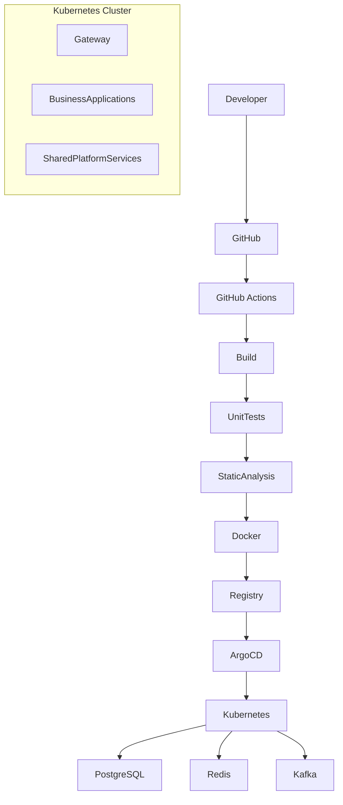

# SIT-007: Enterprise Reference Architecture

---

# 1. Title Page

| Field | Value |
|-------|-------|
| Document ID | SIT-007 |
| Document Name | Enterprise Reference Architecture |
| Organization | STARONE INFOTECH |
| Domain | Enterprise Architecture |
| Document Type | Enterprise Standard |
| Version | 1.0.0 |
| Status | Approved |
| Owner | Enterprise Architecture |
| Classification | Internal |
| Effective Date | TBD |

---

# 2. Revision History

| Version | Date | Author | Description |
|----------|------|--------|-------------|
| 1.0.0 | 2026-07-02 | Enterprise Architecture | Initial Enterprise Reference Architecture |

---

# 3. Approval & Sign-Off

| Role | Status |
|------|--------|
| Enterprise Architect | Approved |
| Platform Architect | Approved |
| Solution Architect | Approved |
| Engineering Lead | Approved |

---

# 4. Executive Summary

The Enterprise Reference Architecture (ERA) defines the target-state architecture for the STARONE INFOTECH engineering ecosystem.

It serves as the highest-level architectural blueprint by integrating enterprise governance, engineering standards, platform capabilities, infrastructure, repositories, application architecture, and software delivery into a single reference model.

This document provides the architectural baseline that every current and future STARONE product shall align with.

The Enterprise Reference Architecture does not replace solution architecture. Instead, it establishes the common architectural foundation from which all solution architectures are derived.

---

# 5. Background

STARONE INFOTECH is designed as a multi-product engineering ecosystem.

Products such as:

- DHS
- BookShow
- VaultIron
- SportStats

share a common engineering platform while remaining architecturally independent.

Without a common reference architecture, independent solutions gradually diverge, resulting in:

- duplicated engineering effort
- inconsistent technologies
- incompatible integrations
- operational complexity
- governance challenges
- reduced platform reuse

The Enterprise Reference Architecture provides the common blueprint that prevents architectural drift while allowing independent product evolution.

---

# 6. Purpose

The purpose of this document is to define the enterprise architectural blueprint governing all STARONE engineering initiatives.

This document establishes:

- Enterprise Architecture Landscape
- Platform Landscape
- Repository Landscape
- Application Landscape
- Infrastructure Landscape
- Integration Landscape
- Deployment Landscape
- Runtime Architecture
- Enterprise Design Patterns
- Architectural Relationships

---

# 7. Scope

This architecture applies to:

### Enterprise Architecture

- Standards
- Governance
- Engineering Documents

---

### Platform Architecture

- Infrastructure
- Configuration
- Shared Platform Services

---

### Product Architecture

- DHS
- BookShow
- VaultIron
- SportStats

---

### Infrastructure

- Kubernetes
- Networking
- Storage
- CI/CD

---

### Enterprise Integration

- APIs
- Events
- Messaging

---

### Runtime Architecture

- Containers
- Kubernetes
- Platform Services

---

# 8. Enterprise Architecture Vision

The STARONE ecosystem shall provide:

- Unified Engineering
- Shared Platform Services
- Independent Business Domains
- Standardized Engineering Practices
- Cloud-Native Runtime
- Platform Engineering
- Event-Driven Integration
- Enterprise Scalability
- Operational Excellence
- Continuous Evolution

Architecture shall remain business-driven while enabling long-term technological evolution.

---

# 9. Architecture Objectives

| ID | Objective |
|----|-----------|
| ERA-001 | Standardize enterprise architecture. |
| ERA-002 | Promote reusable engineering capabilities. |
| ERA-003 | Enable independent business domains. |
| ERA-004 | Reduce duplicated engineering effort. |
| ERA-005 | Support cloud-native deployment. |
| ERA-006 | Enable platform engineering. |
| ERA-007 | Improve operational consistency. |
| ERA-008 | Maintain engineering governance. |
| ERA-009 | Enable enterprise scalability. |
| ERA-010 | Support future ecosystem growth. |

---

# 10. Enterprise Architecture Landscape

The STARONE ecosystem is organized into three architectural layers.

```text
                    STARONE ENGINEERING ECOSYSTEM

┌─────────────────────────────────────────────────────┐
│               Enterprise Layer                      │
│ Standards │ Governance │ Architecture │ Templates   │
└───────────────────────┬─────────────────────────────┘
                        │
                        ▼
┌─────────────────────────────────────────────────────┐
│                Platform Layer                       │
│ Infrastructure │ Config │ Security │ Observability  │
└───────────────────────┬─────────────────────────────┘
                        │
                        ▼
┌─────────────────────────────────────────────────────┐
│             Business Application Layer              │
│ DHS │ BookShow │ VaultIron │ SportStats │ Future    │
└─────────────────────────────────────────────────────┘
```

The Enterprise Layer governs the Platform Layer.

The Platform Layer provides reusable capabilities to the Business Application Layer.

---

# 11. Enterprise Repository Landscape

The engineering ecosystem is implemented through specialized repositories.

```text
STARONE Engineering

│
├── Enterprise Repository
│      └── starone-galaxy-architecture
│
├── Platform Repositories
│      ├── starone-galaxy-infra
│      ├── starone-galaxy-central-config
│      ├── starone-galaxy-security (Future)
│      ├── starone-galaxy-observability (Future)
│      └── starone-galaxy-shared (Future)
│
└── Application Repositories
       ├── starone-galaxy-dhs-platform
       ├── starone-galaxy-bookshow-platform
       ├── starone-galaxy-vaultiron-platform
       └── starone-galaxy-sportstats-platform
```

Each repository owns a single engineering responsibility and participates in the enterprise governance model.

---

# 12. Enterprise Capability Model

The enterprise architecture consists of six primary capability layers.

```text
Enterprise Capabilities

├── Governance
├── Platform Engineering
├── Infrastructure
├── Integration
├── Business Applications
└── Operations
```

Each capability layer evolves independently while remaining aligned with enterprise standards.

---

# 13. Enterprise Architecture Principles

The Enterprise Reference Architecture adopts the following architectural foundations:

- Business First
- Platform Before Application
- Domain-Driven Design
- API First
- Event-Driven Architecture
- Cloud-Native by Design
- Security by Design
- Reuse Before Build
- Automation First
- Single Source of Truth

Detailed implementation guidance is defined in **SIT-005 Architecture Principles**.

---

# 14. Domain Architecture

The STARONE ecosystem is organized around independent business domains.

Each domain represents a bounded business capability and owns its complete software lifecycle.

```text
STARONE Galaxy

├── DHS
├── BookShow
├── VaultIron
└── SportStats
```

Each domain owns:

- Business Logic
- APIs
- Events
- Database
- Deployment
- Documentation
- SDLC Artifacts

Domains remain autonomous while participating in the enterprise ecosystem.

---

# 15. Domain Isolation Strategy

Business domains shall remain both logically and physically isolated.

## Every domain owns

- Business Services
- Database
- Event Topics
- REST APIs
- Deployment Units
- Runtime Configuration

---

## Domains shall NOT share

- Database Tables
- Business Logic
- Internal Services
- Private APIs
- Internal Events

---

## Domain Independence

Each domain shall be capable of:

- Independent development
- Independent testing
- Independent deployment
- Independent scaling
- Independent release
- Independent retirement

Domain isolation minimizes coupling and enables long-term maintainability.

---

# 16. Enterprise Context View (C4 Level 1)

```text
                        Users
                           │
                           ▼
                    API Gateway
                           │
     ┌─────────────┬─────────────┬─────────────┐
     ▼             ▼             ▼             ▼
    DHS        BookShow     VaultIron    SportStats
     │             │             │             │
     └─────────────┼─────────────┼─────────────┘
                   ▼
          Shared Platform Services
                   │
                   ▼
             Kubernetes Platform
```

The API Gateway provides a unified entry point while each domain remains independently deployable.

---

# 17. Platform Architecture View

The engineering platform provides reusable services to all applications.

```text
Enterprise Standards
         │
         ▼
Platform Services

├── Infrastructure
├── Configuration
├── Security
├── Messaging
├── Observability
├── CI/CD
└── Shared Libraries
         │
         ▼
Business Applications
```

Business applications consume platform capabilities rather than implementing them independently.

---

# 18. Integration Architecture

Enterprise integration follows standardized communication patterns.

## Synchronous Communication

Used when immediate responses are required.

Technology:

- REST APIs
- OpenAPI
- API Gateway

---

## Asynchronous Communication

Used for long-running workflows and business events.

Technology:

- Apache Kafka

---

## Integration Principles

- API First
- Event Driven
- Loose Coupling
- Contract Based
- Domain Isolation
- Independent Evolution

---

# 19. Domain Communication Matrix

Each product adopts the communication model appropriate to its business requirements.

| Domain | Communication | Primary Pattern | Reason |
|----------|--------------|----------------|--------|
| DHS | Hybrid | REST + Kafka | Complex business workflows |
| BookShow | Synchronous | REST APIs | Immediate transactional response |
| SportStats | Hybrid | REST + Batch Processing | Analytics and reporting |
| VaultIron | Synchronous | REST APIs | Strong consistency and security |

This matrix provides enterprise guidance. Individual solutions may refine implementation details while remaining consistent with these patterns.

---

# 20. Runtime Architecture

Applications execute on a common cloud-native runtime platform.

```text
Applications

│
├── API Gateway
├── Business Services
├── Background Workers
└── Scheduled Jobs

          │

          ▼

Kubernetes Cluster

│
├── Config
├── Secrets
├── Storage
├── Networking
└── Monitoring
```

The runtime platform abstracts infrastructure complexity from business applications.

---

# 21. Deployment Architecture

Enterprise deployments follow a standardized GitOps pipeline.



All deployments shall be automated.

Manual production deployments are prohibited except during approved emergency procedures.

---

# 22. Infrastructure View

The enterprise infrastructure consists of reusable platform services.

```text
Infrastructure

├── Kubernetes
├── Docker
├── Helm
├── GitHub
├── GitHub Actions
├── Argo CD
├── PostgreSQL
├── Redis
├── Kafka
├── Prometheus
└── Grafana
```

Infrastructure components remain independent of business domains and are shared across the engineering ecosystem.

---

# 23. Security Architecture

Security is implemented as a cross-cutting enterprise capability.

Enterprise security includes:

- Authentication
- Authorization
- JWT
- RBAC
- TLS 1.3
- Secure Configuration
- Secrets Management
- Audit Logging

Security controls shall be inherited from the platform wherever practical.

---

# 24. Transaction Management

Enterprise business transactions shall prioritize consistency within a domain while supporting reliable coordination across domains.

Cross-domain transactions shall avoid distributed database transactions.

---

## 24.1 Transaction Principles

- Business transactions shall remain domain-local whenever practical.
- Cross-domain communication shall use events.
- Services shall own their own transactions.
- Database sharing between domains is prohibited.
- Long-running business processes shall support compensation.

---

## 24.2 Distributed Transaction Pattern

The STARONE ecosystem adopts the **Saga Pattern** for distributed business processes.

```text
Business Event
        │
        ▼
Service A
        │
        ▼
Business Event
        │
        ▼
Service B
        │
        ▼
Business Event
        │
        ▼
Service C
```

Each service commits only its own local transaction.

---

## 24.3 Compensation Strategy

Failures shall be handled through compensating business actions.

Compensation principles:

- Reverse completed business actions where applicable.
- Maintain auditability.
- Preserve business consistency.
- Avoid global rollback mechanisms.
- Handle failures asynchronously.

---

# 25. Observability Architecture

Observability is a core enterprise capability.

Every application shall expose operational information using standardized platform services.

---

## 25.1 Logging

Applications shall produce structured logs.

Logs shall support:

- Request tracing
- Error diagnosis
- Security auditing
- Operational monitoring

---

## 25.2 Metrics

Applications shall publish runtime metrics.

Typical metrics include:

- Request Count
- Error Rate
- Response Time
- JVM Metrics
- Database Metrics
- Business Metrics

---

## 25.3 Distributed Tracing

Distributed tracing shall enable end-to-end request visibility across services.

Tracing shall support:

- Service dependency analysis
- Latency analysis
- Failure diagnosis
- Performance optimization

---

## 25.4 Health Monitoring

Every service shall expose:

- Liveness Endpoint
- Readiness Endpoint
- Startup Endpoint

Health checks shall integrate with Kubernetes.

---

# 26. Scalability & Performance

Enterprise architecture shall support horizontal scalability.

---

## Scalability Principles

Applications shall be:

- Stateless
- Containerized
- Independently Deployable
- Horizontally Scalable

Platform services shall scale independently.

---

## Performance Principles

Solutions shall:

- Minimize synchronous dependencies.
- Use caching appropriately.
- Optimize database access.
- Reduce network latency.
- Prefer asynchronous processing for long-running workflows.

Performance optimization shall not compromise maintainability.

---

# 27. Engineering Information Flow

Every engineering artifact shall maintain complete traceability.

```text
Business Need
        │
        ▼
Business Requirements Document (BRD)
        │
        ▼
Product Requirements Document (PRD)
        │
        ▼
Functional Requirements Document (FRD)
        │
        ▼
Software Requirements Specification (SRS)
        │
        ▼
High-Level Design (HLD)
        │
        ▼
Low-Level Design (LLD)
        │
        ▼
Implementation
        │
        ▼
Testing
        │
        ▼
Deployment
        │
        ▼
Operations
```

Each downstream artifact shall reference its approved upstream artifact.

---

# 28. Enterprise Architecture Roadmap

The STARONE architecture shall evolve progressively.

## Phase 1 — Engineering Foundation

- Engineering Operating Model
- Governance
- Standards
- Templates
- Repository Architecture

---

## Phase 2 — Platform Foundation

- Infrastructure Platform
- Configuration Platform
- CI/CD Platform
- Shared Platform Services

---

## Phase 3 — Product Expansion

Products:

- DHS
- BookShow
- VaultIron
- SportStats

Focus:

- Independent domains
- Platform reuse
- Event-driven integration

---

## Phase 4 — Enterprise Platform

Future capabilities:

- Internal Developer Platform (IDP)
- Service Mesh
- Centralized Secret Management
- Enterprise Service Catalog
- Platform APIs

---

## Phase 5 — Intelligent Engineering

Future evolution may include:

- AI-Assisted Development
- AI Architecture Validation
- AI Test Generation
- AI Documentation Generation
- Predictive Platform Operations
- Engineering Knowledge Platform

Architecture evolution shall preserve backward compatibility wherever practical.

---

# 29. Architecture Compliance

All enterprise, platform, and application architectures shall comply with this Enterprise Reference Architecture.

Compliance includes:

- Architecture Principles
- Technology Strategy
- Platform Standards
- Repository Standards
- SDLC Governance
- Security Standards

Architecture deviations require:

- Business Justification
- Technical Assessment
- Risk Analysis
- Architecture Review
- Approved Architecture Decision Record (ADR)

---

# 30. Related Documents

| Document ID | Document |
|-------------|----------|
| SIT-001 | Engineering Operating Model |
| SIT-002 | Engineering Governance |
| SIT-003 | Repository Architecture |
| SIT-004 | Technology Strategy |
| SIT-005 | Architecture Principles |
| SIT-006 | Platform Architecture |

Together, these documents form the STARONE Enterprise Engineering Framework.

---

# 31. Glossary

| Term | Definition |
|------|------------|
| Enterprise Reference Architecture | Target-state architecture for the STARONE ecosystem |
| Domain | Independent business capability with clear ownership |
| Platform | Shared engineering capabilities consumed by applications |
| API Gateway | Centralized entry point for external API requests |
| Saga | Distributed transaction coordination pattern |
| Eventual Consistency | Consistency achieved asynchronously across distributed systems |
| Observability | Combined capability of logging, metrics, tracing, and health monitoring |
| IDP | Internal Developer Platform |

---

# 32. References

This document should be read together with:

- SIT-001 Engineering Operating Model
- SIT-002 Engineering Governance
- SIT-003 Repository Architecture
- SIT-004 Technology Strategy
- SIT-005 Architecture Principles
- SIT-006 Platform Architecture

These documents collectively define the enterprise engineering and architecture standards for STARONE INFOTECH.

---

# 33. Document Ownership

| Responsibility | Owner |
|---------------|-------|
| Document Owner | Enterprise Architecture |
| Architecture Authority | Enterprise Architecture |
| Document Maintenance | Enterprise Architecture |
| Review Authority | Enterprise Architecture |
| Approval Authority | Enterprise Architecture |

This document shall be reviewed annually or whenever significant architectural changes occur within the STARONE ecosystem.

---

# 34. Revision History (Current Version)

| Version | Date | Author | Description |
|----------|------|--------|-------------|
| 1.0.0 | 2026-07-02 | Enterprise Architecture | Initial Enterprise Reference Architecture |

---

# 35. Conclusion

The Enterprise Reference Architecture defines the strategic architectural blueprint for the STARONE INFOTECH engineering ecosystem.

It establishes a unified architecture spanning enterprise governance, repository organization, platform engineering, infrastructure, business domains, integration, deployment, and operations.

By promoting **domain isolation**, **platform reuse**, **cloud-native engineering**, **event-driven integration**, **automation**, and **architecture governance**, this reference architecture enables multiple independent products to evolve consistently while sharing a common engineering foundation.

Together with **SIT-001** through **SIT-006**, this document completes the STARONE Enterprise Engineering Framework and serves as the authoritative reference architecture for all current and future engineering initiatives.

---

**End of Document**