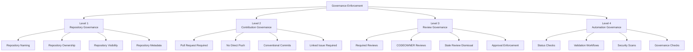
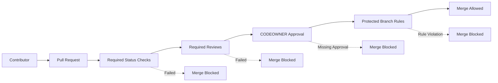

# Governance Enforcement Configuration

---

## Title Page

| Field         | Value                                                |
| ------------- | ---------------------------------------------------- |
| Document ID   | GOV-CONFIG-001                                       |
| Document Name | Governance Enforcement Configuration                 |
| Epic          | EPIC-ARCH-001 Ecosystem Design & Governance Baseline |
| Story         | STORY-ARCH-005 Engineering Governance Automation     |
| Issue         | S5-I01 Governance Enforcement Configuration          |
| Domain        | Governance Automation                                |
| Author        | Sachin Salunke                                       |
| Date          | 2026                                                 |
| Version       | 1.0                                                  |
| Status        | Draft                                                |

---

# Revision History

| Version | Date | Author         | Description                                  |
| ------- | ---- | -------------- | -------------------------------------------- |
| 1.0     | 2026 | Sachin Salunke | Initial Governance Enforcement Configuration |

---

# Sign-Off Table

| Role               | Status  |
| ------------------ | ------- |
| Platform Architect | Pending |
| Security Review    | Pending |
| DevOps Governance  | Pending |

---

# 1. Purpose

This document defines the governance enforcement configuration for all repositories within the StarOne Galaxy ecosystem.

The purpose of this document is to operationalize governance controls approved through architecture decisions and governance standards by defining enforcement configurations that can be implemented through repository settings, branch protection controls, ownership controls, and automated governance workflows.

This document does not establish governance standards.

This document defines how approved governance standards are enforced.

---

# 2. Scope

## Applicable Repositories

This configuration applies to:

- starone-galaxy-infra
- starone-galaxy-config
- starone-dhs-system
- starone-bookshow-system
- Shared libraries
- Platform repositories
- Future StarOne Galaxy repositories

---

## Out of Scope

The following artifacts define governance requirements and are not redefined here:

- Repository Taxonomy Standards
- Documentation Standards
- Contribution Governance Standards
- CODEOWNERS Governance Standards
- Naming Convention Standards
- Architectural Decisions

---

# 3. Governance Enforcement Model

## 3.1 Governance Levels



### Level 1 – Repository Governance

Purpose:

Establish repository-level governance controls.

Controls:

- Repository Naming
- Repository Ownership
- Repository Visibility
- Repository Metadata

**Repository Naming**

Repository names shall comply with STANDARD-007 Enterprise Naming Conventions.

Approved naming patterns:

```text
starone-galaxy-*
starone-dhs-*
starone-bookshow-*
```

Repositories that do not comply with approved naming conventions shall not be onboarded into the StarOne Galaxy governance model.

---

### Level 2 – Contribution Governance

Controls:

- Pull Request Required
- No Direct Push
- Conventional Commit Compliance
- Linked Issue Required

---

#### Contribution Governance Controls

All pull requests shall:

- Reference a valid Issue
- Reference a valid Story
- Follow Conventional Commit standards
- Pass governance validation controls

---

### Level 3 – Review Governance

Controls:

- Required Reviews
- CODEOWNER Reviews
- Stale Review Dismissal
- Approval Enforcement

---

### Level 4 – Automation Governance

Controls:

- Status Checks
- Validation Workflows
- Security Scans
- Governance Checks

## 3.2 Governance Enforcement Lifecycle



---

### 3.3 Governance Enforcement Responsibilities

Governance enforcement responsibilities are distributed across designated governance authorities to ensure consistent implementation, validation, and compliance across the StarOne Galaxy ecosystem.

| Governance Area         | Responsible Authority   |
| ----------------------- | ----------------------- |
| Architecture Standards  | Platform Architect      |
| Documentation Standards | Architecture Governance |
| Repository Governance   | DevOps Governance       |
| Workflow Governance     | Platform Engineering    |
| Security Governance     | Security Review         |
| Compliance Controls     | Governance Board        |

### Responsibility Principles

- Governance standards define required controls.
- Governance configurations define enforcement mechanisms.
- Platform Engineering implements automated enforcement.
- DevOps Governance validates repository compliance.
- Governance Board provides final compliance oversight.

---

# 4. Repository Governance Configuration

## Repository Naming

Repository names shall comply with STANDARD-007 Enterprise Naming Conventions.

Approved naming patterns:

<<<<<<< HEAD
- starone-galaxy-\*
- starone-dhs-\*
- starone-bookshow-\*
=======
- starone-galaxy-*
- starone-dhs-*
- starone-bookshow-*
>>>>>>> d2df9b4 (feat(governance): implement S5-I03 issue management governance)

Non-compliant repositories shall not be onboarded into the governance model.

---

**Repository Governance**

- [ ] Repository naming compliant
- [ ] Repository ownership configured
- [ ] Repository metadata present

---

## Repository Ownership

All repositories shall maintain assigned ownership through CODEOWNERS.

Ownership assignments shall define:

- Platform ownership
- Documentation ownership
- Security ownership
- Domain ownership

---

## Repository Metadata

All repositories shall include:

- README
- LICENSE
- CODEOWNERS
- Issue Templates
- Pull Request Templates

---

## Repository Visibility

Visibility shall be governed according to repository classification.

| Repository Type  | Visibility |
| ---------------- | ---------- |
| Platform         | Private    |
| Infrastructure   | Private    |
| Configuration    | Private    |
| Domain Services  | Private    |
| Shared Libraries | Private    |

---

# 5. CODEOWNERS Enforcement Configuration

## Required CODEOWNER Approval

Configuration:

```text
Require CODEOWNER Reviews = TRUE
```

---

## Approval Requirement

Configuration:

```text
Minimum CODEOWNER Approvals = 1
```

---

## Enforcement Scope

CODEOWNER approval shall be required for:

- Documentation changes
- Governance changes
- Workflow changes
- Security changes
- Infrastructure changes
- Platform changes

---

## CODEOWNER Enforcement Matrix

| Area           | CODEOWNER Approval Required |
| -------------- | --------------------------- |
| Documentation  | Yes                         |
| Governance     | Yes                         |
| Security       | Yes                         |
| Infrastructure | Yes                         |
| Platform       | Yes                         |
| Workflows      | Yes                         |

---

# 6. Required Reviewer Configuration

## Minimum Approval Requirement

Configuration:

```text
Minimum Approvals = 2
```

Required:

- 1 CODEOWNER Approval
- 1 Peer Reviewer Approval

---

## Review Requirements

All pull requests shall require:

```text
Pull Request Review = Required
Conversation Resolution = Required
```

---

## Stale Review Handling

Configuration:

```text
Dismiss Stale Reviews = TRUE
```

When changes are pushed after review approval, approvals must be revalidated.

---

# 7. Branch Protection Configuration

## Protected Branches

Protected branches:

```text
main
release/*
```

---

## Direct Push Restrictions

Configuration:

```text
Direct Push = Disabled
Force Push = Disabled
Branch Deletion = Disabled
```

---

## Merge Requirements

Configuration:

```text
Pull Request Required = TRUE
Required Approvals = 2
Require CODEOWNER Approval = TRUE
Require Status Checks = TRUE
Require Conversation Resolution = TRUE
```

---

## Branch Protection Matrix

| Control                  | Main | Release |
| ------------------------ | ---- | ------- |
| Direct Push Disabled     | Yes  | Yes     |
| Force Push Disabled      | Yes  | Yes     |
| Branch Deletion Disabled | Yes  | Yes     |
| Pull Request Required    | Yes  | Yes     |
| Required Reviews         | Yes  | Yes     |
| CODEOWNER Approval       | Yes  | Yes     |
| Status Checks            | Yes  | Yes     |

---

# 8. Required Status Check Configuration

## Governance Status Checks

The following status checks shall be required before merge.

```text
governance-validation
markdown-validation
mermaid-validation
commit-validation
security-validation
```

---

## Status Check Enforcement

Configuration:

```text
Require Status Checks = TRUE
Require Checks Before Merge = TRUE
```

---

## Future Workflow Dependency

Status checks will be implemented through:

- S5-I04 Governance Validation Pipeline
- S5-I05 Security Governance Automation
- S5-I06 Reusable Workflow Framework

---

# 9. Governance Control Matrix

| Control Area             | Enforcement Mechanism        |
| ------------------------ | ---------------------------- |
| Repository Ownership     | CODEOWNERS                   |
| Documentation Compliance | Validation Workflow          |
| Traceability Compliance  | Governance Workflow          |
| Pull Request Governance  | Branch Protection            |
| Review Governance        | Required Review Controls     |
| CODEOWNERS Governance    | Required CODEOWNER Approval  |
| Branch Governance        | Protected Branch Rules       |
| Security Governance      | Security Validation Workflow |
| Workflow Governance      | Required Status Checks       |

---

# 10. Repository Applicability Matrix

<<<<<<< HEAD
| Repository                | Governance Model |
| ------------------------- | ---------------- |
| starone-galaxy-infra      | Full Enforcement |
| starone-galaxy-config     | Full Enforcement |
| starone-dhs-system        | Full Enforcement |
| starone-bookshow-gateway  | Full Enforcement |
| starone-bookshow-services | Full Enforcement |
| Shared Libraries          | Full Enforcement |
=======
| Repository | Governance Model |
|----------|----------|
| starone-galaxy-infra | Full Enforcement |
| starone-galaxy-config | Full Enforcement |
| starone-dhs-system | Full Enforcement |
| starone-bookshow-gateway | Full Enforcement |
| starone-bookshow-services | Full Enforcement |
| Shared Libraries | Full Enforcement |
>>>>>>> d2df9b4 (feat(governance): implement S5-I03 issue management governance)

---

# 11. Compliance Verification

## Governance Verification Checklist

### Repository Governance

- [ ] Repository naming compliant
- [ ] Repository ownership configured
- [ ] Repository metadata present

### CODEOWNERS Governance

- [ ] CODEOWNERS file exists
- [ ] CODEOWNER approvals enforced

### Branch Governance

- [ ] Protected branches configured
- [ ] Direct pushes blocked
- [ ] Force pushes blocked

### Review Governance

- [ ] Required approvals configured
- [ ] Conversation resolution enabled

### Automation Governance

- [ ] Status checks configured
- [ ] Validation gates configured

---

# 12. Requirement Traceability Matrix (RTM)

| Requirement ID | Requirement                                | Configuration Section |
| -------------- | ------------------------------------------ | --------------------- |
| S5-I01-FR1     | Governance enforcement controls configured | Sections 3-11         |
| S5-I01-FR2     | CODEOWNERS enforcement configured          | Section 5             |
| S5-I01-FR3     | Protected branch controls configured       | Section 7             |
| S5-I01-FR4     | Required reviewer controls configured      | Section 6             |
| S5-I01-FR5     | Governance control mappings documented     | Section 9             |

---

# 13. Acceptance Criteria Verification

| Acceptance Criteria                                     | Coverage |
| ------------------------------------------------------- | -------- |
| AC-01 Governance enforcement configuration documented   | Complete |
| AC-02 CODEOWNERS enforcement configuration defined      | Complete |
| AC-03 Protected branch governance configuration defined | Complete |
| AC-04 Required reviewer controls defined                | Complete |
| AC-05 Governance control mappings documented            | Complete |
| AC-06 Architecture review completed                     | Pending  |
| AC-07 Governance review completed                       | Pending  |

---

# 14. References

## Stories

- STORY-ARCH-001 Repository Scaffolding
- STORY-ARCH-002 Global Ecosystem README
- STORY-ARCH-003 Documentation Standards
- STORY-ARCH-005 Engineering Governance Automation

---

## Standards

- STANDARD-002 Contribution Governance
- STANDARD-003 CODEOWNERS Governance
- STANDARD-007 Enterprise Naming Conventions

---

## ADRs

- ADR-001 Repository Taxonomy Governance
- ADR-002 Documentation Standards Governance
- ADR-003 Governance Enforcement Controls

---

# 15. Conclusion

This document establishes the governance enforcement configuration baseline for StarOne Galaxy repositories.

It defines the implementation-level enforcement controls required to operationalize approved governance standards through repository controls, CODEOWNERS enforcement, protected branch configuration, review controls, and governance validation mechanisms.

This document serves as the authoritative governance enforcement configuration reference for all subsequent governance automation workflows.
