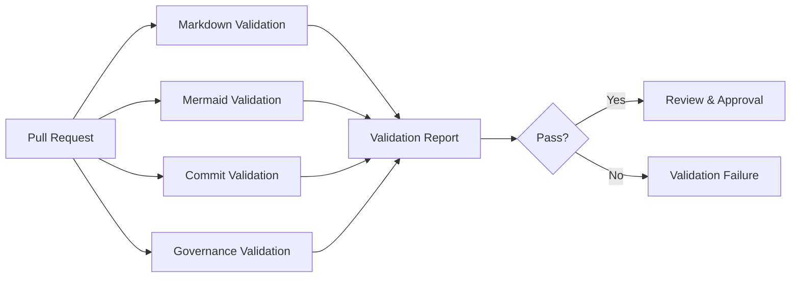
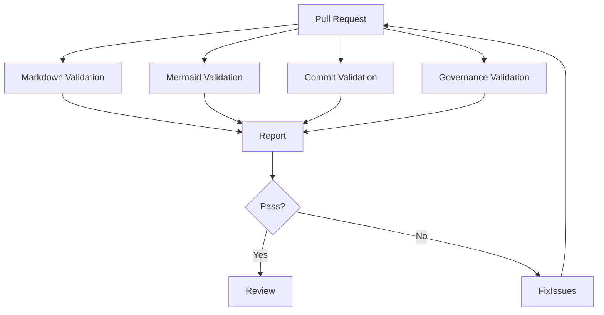

# Governance Validation Architecture

---

## Title Page

| Field | Value |
|---|---|
| Document ID | GOV-VAL-001 |
| Document Name | Governance Validation Architecture |
| Epic | EPIC-ARCH-001 Ecosystem Design & Governance Baseline |
| Story | STORY-ARCH-005 Engineering Governance Automation |
| Issue | S5-I04 Governance Validation Pipeline |
| Domain | Governance Automation |
| Author | Sachin Salunke |
| Date | 2026 |
| Version | 1.0 |
| Status | Draft |

---

# Revision History

| Version | Date | Author | Description |
|---|---|---|---|
| 1.0 | 2026 | Sachin Salunke | Initial Governance Validation Architecture |

---

# Sign-Off Table

| Role | Status |
|---|---|
| Platform Architect | Pending |
| Security Review | Pending |
| DevOps Governance | Pending |

---

# 1. Purpose

This document defines the Governance Validation Architecture for the StarOne Galaxy ecosystem.

The purpose of this architecture is to automate governance validation through GitHub Actions and continuously enforce repository standards, documentation quality, contribution controls, and governance compliance.

This architecture transforms governance controls from manual review activities into automated validation gates executed during Continuous Integration (CI).

---

# 2. Scope

## In Scope

- Governance validation workflow
- Markdown validation
- Mermaid diagram validation
- Conventional commit validation
- Pull request governance validation
- Governance status reporting
- Merge readiness validation

---

## Out of Scope

The following capabilities are governed through separate issues:

- Security scanning
- Dependency vulnerability scanning
- Reusable workflow framework
- Infrastructure deployment automation
- Application build pipelines

---

## Applicable Repositories

- starone-galaxy-infra
- starone-galaxy-config
- starone-dhs-system
- bookshow-* repositories
- Shared libraries
- Platform repositories

---

# 3. Validation Architecture

## Governance Validation Model



---

## Architecture Objectives

The validation architecture shall:

- Automate governance enforcement
- Reduce manual review effort
- Improve documentation quality
- Enforce contribution standards
- Prevent governance bypass
- Support merge readiness validation

---

# 4. Validation Areas

## Documentation Validation

Validates repository documentation quality and standards compliance.

Checks include:

- Heading hierarchy
- Markdown syntax
- Table formatting
- Broken links
- File naming conventions

---

## Mermaid Validation

Validates architecture and process diagrams.

Checks include:

- Mermaid syntax
- Rendering compatibility
- Diagram structure compliance

---

## Commit Validation

Validates contribution compliance.

Checks include:

```text
feat(scope): description
fix(scope): description
docs(scope): description
refactor(scope): description
chore(scope): description
```

---

## Governance Validation

Validates governance compliance.

Checks include:

- PR template compliance
- Issue traceability references
- Required governance sections
- Standards compliance
- Metadata completeness

---

# 5. Markdown Validation Rules

## Rule MD-001

All Markdown files shall contain valid Markdown syntax.

---

## Rule MD-002

Heading hierarchy shall be sequential.

Example:

```text
# Heading 1
## Heading 2
### Heading 3
```

---

## Rule MD-003

Tables shall follow valid Markdown table formatting.

---

## Rule MD-004

Links shall not contain broken references.

---

## Rule MD-005

Markdown files shall comply with repository documentation standards.

---

# 6. Mermaid Validation Rules

## Rule MM-001

All Mermaid diagrams shall use valid Mermaid syntax.

---

## Rule MM-002

Diagrams shall be renderable by GitHub Mermaid renderer.

---

## Rule MM-003

Flowcharts shall contain valid node relationships.

---

## Rule MM-004

Sequence diagrams shall contain valid participant definitions.

---

## Rule MM-005

Diagrams shall comply with StarOne documentation standards.

---

# 7. Commit Validation Rules

## Conventional Commit Standard

All commits shall follow:

```text
feat(scope): description
fix(scope): description
docs(scope): description
refactor(scope): description
chore(scope): description
```

---

## Rule CC-001

Commit messages shall contain a valid commit type.

---

## Rule CC-002

Commit messages shall contain a scope.

---

## Rule CC-003

Commit messages shall contain a meaningful description.

---

## Rule CC-004

Merge commits shall not bypass validation requirements.

---

# 8. Governance Validation Rules

## Rule GV-001

Pull requests shall include required traceability references.

Required:

```text
Epic
Story
Issue
```

---

## Rule GV-002

Required governance sections shall be present.

---

## Rule GV-003

Governance checklist shall be completed.

---

## Rule GV-004

Documentation impact shall be declared.

---

## Rule GV-005

Requirements impacted shall be documented where applicable.

---

## Rule GV-006

Issue and pull request templates shall comply with governance standards.

---

# 9. Workflow Execution Model

## Workflow Structure

The Governance Validation Pipeline shall consist of the following workflow jobs:

| Job | Purpose |
|------|------|
| markdown-validation | Validate markdown syntax and documentation quality |
| mermaid-validation | Validate Mermaid diagram syntax and rendering compatibility |
| commit-validation | Validate Conventional Commit compliance |
| governance-validation | Validate governance compliance and traceability requirements |

---

## Workflow Execution Order

```text
markdown-validation
mermaid-validation
commit-validation
governance-validation
```

All validation jobs shall execute independently and report status through GitHub Actions checks.

Workflow success requires all jobs to complete successfully.

Workflow failure occurs when any validation job fails.

---

## Trigger Events

Validation shall execute on:

```text
Pull Request Opened
Pull Request Updated
Pull Request Reopened
Push to Feature Branch
```

---

## Workflow Model



---

## Validation Reporting

Validation results shall be published through GitHub Actions checks.

Expected checks:

```text
markdown-validation

mermaid-validation

commit-validation

governance-validation
```

---

# 10. Validation Control Matrix

| Validation Area | Mandatory |
|---|---|
| Markdown Lint | Yes |
| Mermaid Validation | Yes |
| Commit Validation | Yes |
| Governance Compliance | Yes |
| Metadata Validation | Yes |

---

## Merge Readiness Controls

Merge readiness shall be blocked when:

- Markdown validation fails
- Mermaid validation fails
- Commit validation fails
- Governance validation fails

---

# 11. Failure Handling

## Validation Failure Policy

Any validation failure shall result in:

```text
Workflow Failure
↓
Pull Request Blocked
↓
Remediation Required
```

---

## Failure Categories

| Category | Action |
|---|---|
| Markdown Failure | Fix documentation |
| Mermaid Failure | Fix diagram syntax |
| Commit Failure | Correct commit message |
| Governance Failure | Correct governance metadata |

---

## Escalation

Repeated governance failures shall be reviewed during governance audits.

---

# 12. Compliance Verification

## Governance Compliance Checklist

### Documentation Compliance

- [ ] Markdown validation passed
- [ ] Documentation standards satisfied

### Diagram Compliance

- [ ] Mermaid validation passed
- [ ] Diagram standards satisfied

### Commit Compliance

- [ ] Conventional commit validation passed

### Governance Compliance

- [ ] Traceability verified
- [ ] Governance metadata complete
- [ ] Required sections present

---

## Validation Outcome

A pull request is governance compliant only when all validation checks pass successfully.

---

# 13. Requirement Traceability Matrix (RTM)

| Requirement ID | Requirement | Coverage Section |
|---|---|---|
| S5-I04-FR1 | Governance validation workflow shall be implemented | Sections 3, 9 |
| S5-I04-FR2 | Markdown linting shall be automated | Section 5 |
| S5-I04-FR3 | Mermaid diagram validation shall be automated | Section 6 |
| S5-I04-FR4 | Conventional commit validation shall be enforced | Section 7 |
| S5-I04-FR5 | Validation results shall be visible in pull requests | Sections 9, 12 |
| S5-I04-FR6 | Governance failures shall block merge readiness | Sections 10, 11 |

---

# 14. References

## Stories

- STORY-ARCH-003 Documentation Standards
- STORY-ARCH-005 Engineering Governance Automation

---

## Standards

- STANDARD-006 CODEOWNERS Governance
- STANDARD-007 Enterprise Naming Conventions
- STANDARD-008 Contribution Governance

---

## ADRs

- ADR-002 Documentation Standards Governance
- ADR-003 Governance Enforcement Controls

---

## Related Governance Artifacts

- Governance-Enforcement-Configuration.md
- Pull-Request-Governance.md
- Issue-Governance.md

---

# Conclusion

This document establishes the Governance Validation Architecture baseline for the StarOne Galaxy ecosystem.

It defines the validation architecture, validation rules, execution model, compliance controls, and governance enforcement requirements necessary to automate governance validation through GitHub Actions and support merge readiness governance across all repositories.

---