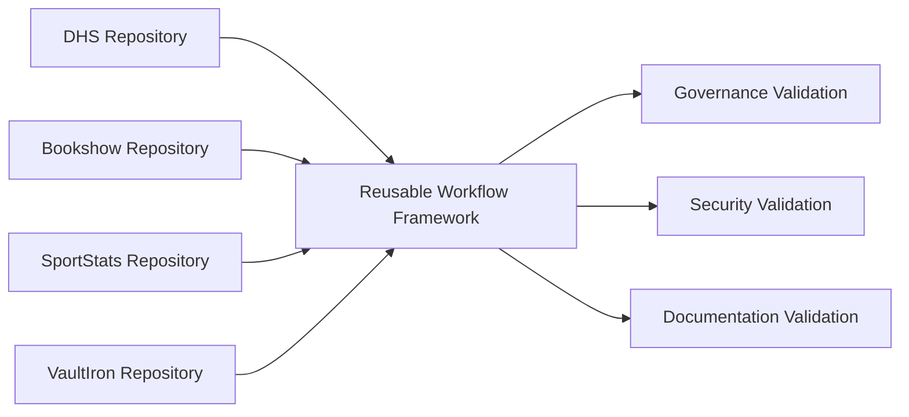
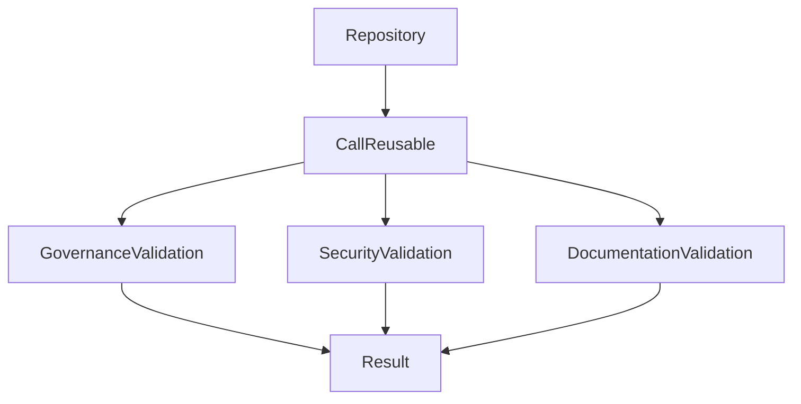

# Reusable Workflow Framework

## Title Page

| Field         | Value                                                |
| ------------- | ---------------------------------------------------- |
| Document ID   | GOV-PLATFORM-001                                     |
| Document Name | Reusable Workflow Framework                          |
| Epic          | EPIC-ARCH-001 Ecosystem Design & Governance Baseline |
| Story         | STORY-ARCH-005 Engineering Governance Automation     |
| Issue         | S5-I06 Reusable Workflow Framework                   |
| Domain        | Platform Engineering                                 |
| Author        | Sachin Salunke                                       |
| Date          | 2026                                                 |
| Version       | 1.0                                                  |
| Status        | Draft                                                |

---

## Revision History

| Version | Date | Author         | Description     |
| ------- | ---- | -------------- | --------------- |
| 1.0     | 2026 | Sachin Salunke | Initial version |

---

## Sign-Off

| Role               | Status                           |
| ------------------ | -------------------------------- |
| Platform Architect | Pending                          |
| Security Review    | Deferred (Solo Contributor Mode) |
| DevOps Governance  | Deferred (Solo Contributor Mode) |

---

# 1 Purpose

Define the reusable GitHub Actions workflow framework for the StarOne Galaxy ecosystem.

The framework enables governance, security, and documentation validation workflows to be centrally maintained and consumed by multiple repositories without duplication.

The framework establishes a standardized automation foundation for:

- Governance validation
- Security validation
- Documentation validation
- Platform-wide governance consistency

---

# 2 Scope

This framework applies to:

- DHS repositories
- Bookshow repositories
- Infrastructure repositories
- Shared governance repositories
- Future StarOne Galaxy repositories

Included:

- Reusable workflow definitions
- Workflow consumption model
- Workflow interfaces
- Workflow registry
- Validation orchestration

Excluded:

- Repository-specific business logic
- Domain-specific validation rules
- Organization-wide rollout activities
- Runtime application validation

---

# 3 Reusable Workflow Architecture



---

# 4 Workflow Design Principles

## Reusability

Workflows shall:

- Be repository agnostic
- Support workflow_call interfaces
- Support parameterized execution
- Support centralized maintenance

## Standardization

Workflows shall:

- Follow common naming conventions
- Use standard inputs and outputs
- Produce consistent validation results
- Support governance reporting

## Maintainability

Workflows shall:

- Minimize duplication
- Support versioning
- Support future enhancements
- Support backward compatibility

---

# 5 Workflow Registry

| Workflow                   | Purpose                           |
| -------------------------- | --------------------------------- |
| reusable-governance.yml    | Governance validation controls    |
| reusable-security.yml      | Security validation controls      |
| reusable-documentation.yml | Documentation validation controls |
| reusable-validation.yml    | Validation orchestration          |

---

# 6 Workflow Interfaces

Reusable workflows shall expose standard interfaces using:

```yaml
on:
  workflow_call:
```

Supported interface types:

- Inputs
- Outputs
- Secrets
- Validation status

Example:

```yaml
on:
  workflow_call:
    inputs:
      repository-name:
        required: true
        type: string
```

---

# 7 Workflow Consumption Model

Consumer repositories shall invoke reusable workflows.

Example:



Consumer example:

```yaml
jobs:
  governance:
    uses: STARONE-INFOTECH/starone-galaxy-architecture/.github/workflows/reusable/reusable-governance.yml@main
```

---

# 8 Versioning Strategy

Reusable workflows shall support controlled versioning.

Supported references:

```text
main
release/v1
release/v2
tag references
```

Versioning objectives:

- Backward compatibility
- Controlled rollout
- Safe upgrades
- Change traceability

---

# 9 Governance Controls

Reusable workflows shall enforce:

- Governance validation
- Security validation
- Documentation validation
- Pull request controls
- Traceability verification

Validation execution shall be standardized across all consuming repositories.

---

# 10 Validation Strategy

Validation shall verify:

| Validation Area               | Mandatory |
| ----------------------------- | --------- |
| Governance Validation         | Yes       |
| Security Validation           | Yes       |
| Documentation Validation      | Yes       |
| Workflow Integrity Validation | Yes       |

Validation execution:

```text
Pull Request Opened
Pull Request Updated
Pull Request Reopened
Push To Feature Branch
```

Validation outcomes:

```text
Pass
Fail
Warning
```

---

# 11 Requirement Traceability Matrix (RTM)

| Epic          | Story          | Issue  | Requirement | Implementation                  |
| ------------- | -------------- | ------ | ----------- | ------------------------------- |
| EPIC-ARCH-001 | STORY-ARCH-005 | S5-I06 | S5-I06-FR1  | Reusable Workflow Framework     |
| EPIC-ARCH-001 | STORY-ARCH-005 | S5-I06 | S5-I06-FR2  | Reusable Governance Workflow    |
| EPIC-ARCH-001 | STORY-ARCH-005 | S5-I06 | S5-I06-FR3  | Reusable Security Workflow      |
| EPIC-ARCH-001 | STORY-ARCH-005 | S5-I06 | S5-I06-FR4  | Reusable Documentation Workflow |
| EPIC-ARCH-001 | STORY-ARCH-005 | S5-I06 | S5-I06-FR5  | Workflow Consumption Guide      |
| EPIC-ARCH-001 | STORY-ARCH-005 | S5-I06 | S5-I06-FR6  | Standard Workflow Interfaces    |

Coverage: 100%

---

# 12 References

| Artifact | Purpose                              |
| -------- | ------------------------------------ |
| ADR-002  | Documentation Standards Decision     |
| ADR-003  | Governance Enforcement Decision      |
| S5-I01   | Governance Enforcement Configuration |
| S5-I02   | Pull Request Governance              |
| S5-I03   | Issue Management Governance          |
| S5-I04   | Governance Validation Pipeline       |
| S5-I05   | Security Governance Automation       |
| S5-I06   | Reusable Workflow Framework          |

---
