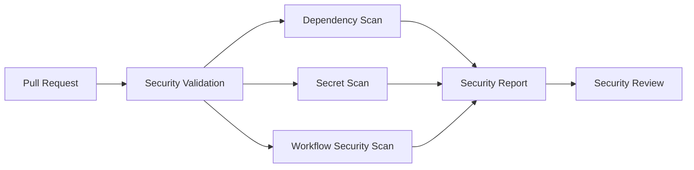
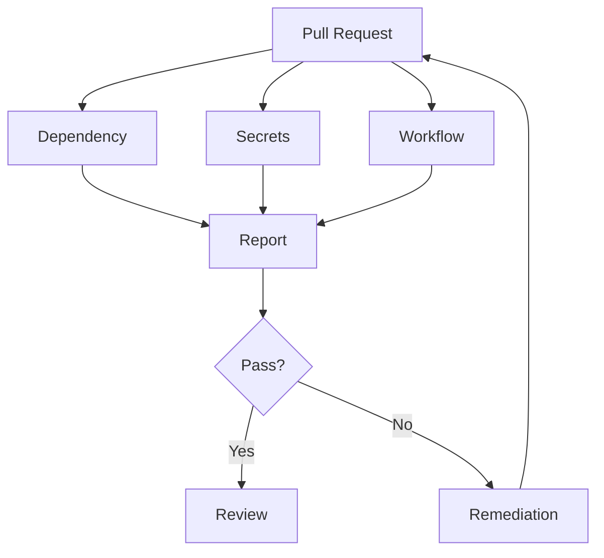

# Security Governance Automation

## Title Page

| Field         | Value                                                |
| ------------- | ---------------------------------------------------- |
| Document ID   | GOV-CTRL-005                                         |
| Document Name | Security Governance Automation                       |
| Epic          | EPIC-ARCH-001 Ecosystem Design & Governance Baseline |
| Story         | STORY-ARCH-005 Engineering Governance Automation     |
| Issue         | S5-I05 Security Governance Automation                |
| Domain        | Security Governance                                  |
| Author        | Sachin Salunke                                       |
| Date          | 2026                                                 |
| Version       | 1.0                                                  |
| Status        | Draft                                                |

---

# Revision History

| Version | Date | Author         | Description     |
| ------- | ---- | -------------- | --------------- |
| 1.0     | 2026 | Sachin Salunke | Initial version |

---

# Sign-Off

| Role               | Status   |
| ------------------ | -------- |
| Platform Architect | Approved |
| Security Review    | Approved |
| DevOps Governance  | Approved |

---

# 1 Purpose

Define the security governance automation controls required to continuously validate repository security posture, detect security risks early, and enforce security compliance through automated validation workflows.

This control establishes the security automation baseline for all StarOne Galaxy repositories.

---

# 2 Scope

This governance control applies to:

- Repository workflows
- Pull requests
- Feature branches
- Governance repositories
- Infrastructure repositories
- Application repositories

Included:

- Dependency vulnerability scanning
- Secret scanning
- Workflow security validation
- Security reporting
- Merge blocking controls

Excluded:

- Runtime application security testing
- Infrastructure penetration testing
- Container image scanning
- Production security monitoring

---

# 3 Security Validation Architecture



---

# 4 Security Governance Areas

## Dependency Security

Validate:

- Vulnerable dependencies
- Known CVEs
- Outdated packages
- Security advisories

## Secret Protection

Validate:

- API keys
- Access tokens
- Passwords
- Connection strings
- Private keys
- Hardcoded credentials

## Workflow Security

Validate:

- Workflow permissions
- Third-party action usage
- Action version pinning
- Trust boundaries
- Workflow execution security

## Repository Security

Validate:

- Repository configuration
- Secret exposure risks
- Workflow permissions
- Security governance compliance

---

# 5 Dependency Security Validation Rules

The platform shall validate:

- Dependency vulnerabilities
- Known CVEs
- Critical security advisories
- High severity vulnerabilities

Validation controls:

```text
Dependency Review
GitHub Advisory Database
Security Severity Evaluation
```

Validation outcome:

```text
Pass
Fail
Warning
```

---

# 6 Secret Protection Validation Rules

The platform shall validate:

- Hardcoded passwords
- API keys
- Authentication tokens
- Secrets
- Connection strings
- Private keys

Validation controls:

```text
Gitleaks
Pattern Detection
Repository Scanning
```

Validation outcome:

```text
Pass
Fail
Warning
```

---

# 7 Workflow Security Validation Rules

The platform shall validate:

- Workflow permissions
- Excessive privileges
- Untrusted actions
- Insecure workflow patterns
- Unpinned action references

Validation controls:

```text
Workflow Security Scan
Permission Analysis
Action Trust Validation
```

Validation outcome:

```text
Pass
Fail
Warning
```

---

# 8 Security Reporting Model

Security validation results shall be reported through:

- GitHub Actions
- Pull Request Checks
- Workflow Execution Results
- Security Validation Reports

Reporting categories:

```text
Dependency Security
Secret Protection
Workflow Security
Repository Security
```

---

# 9 Security Execution Model

Security validation shall execute during:

```text
Pull Request Opened
Pull Request Updated
Pull Request Reopened
Push To Feature Branch
Scheduled Security Scan
```

Security validation flow:



---

# 10 Security Control Matrix

| Control Area                 | Mandatory |
| ---------------------------- | --------- |
| Dependency Scan              | Yes       |
| Secret Scan                  | Yes       |
| Workflow Security Validation | Yes       |
| Security Reporting           | Yes       |
| Merge Blocking               | Yes       |

---

# 11 Merge Blocking Rules

Pull requests shall not be eligible for merge when:

- Critical vulnerability detected
- Secret detected
- Workflow security violation detected
- Security validation workflow fails
- Required security checks fail

Merge readiness requires:

- All security checks passed
- Security review completed
- No unresolved security findings

---

# 12 Compliance Verification

Compliance shall be verified through:

- Automated workflow execution
- Pull request security checks
- Security validation reports
- Governance review activities

Verification frequency:

```text
Per Pull Request
Per Feature Branch Push
Scheduled Repository Security Scan
```

Success criteria:

```text
All mandatory security controls pass
No critical security findings
No active secret exposure
No workflow security violations
```

---

# 13 Requirement Traceability Matrix (RTM)

| Epic          | Story          | Issue  | Requirement | Implementation                 |
| ------------- | -------------- | ------ | ----------- | ------------------------------ |
| EPIC-ARCH-001 | STORY-ARCH-005 | S5-I05 | S5-I05-FR1  | Security Validation Workflow   |
| EPIC-ARCH-001 | STORY-ARCH-005 | S5-I05 | S5-I05-FR2  | Dependency Security Validation |
| EPIC-ARCH-001 | STORY-ARCH-005 | S5-I05 | S5-I05-FR3  | Secret Scanning Validation     |
| EPIC-ARCH-001 | STORY-ARCH-005 | S5-I05 | S5-I05-FR4  | Workflow Security Validation   |
| EPIC-ARCH-001 | STORY-ARCH-005 | S5-I05 | S5-I05-FR5  | Security Reporting             |
| EPIC-ARCH-001 | STORY-ARCH-005 | S5-I05 | S5-I05-FR6  | Merge Blocking Controls        |

Coverage: 100%

---

# 14 References

| Artifact       | Purpose                              |
| -------------- | ------------------------------------ |
| STORY-ARCH-003 | Documentation Standards              |
| ADR-002        | Documentation Standards Decision     |
| ADR-003        | Governance Enforcement Decision      |
| S5-I01         | Governance Enforcement Configuration |
| S5-I02         | Pull Request Governance              |
| S5-I03         | Issue Management Governance          |
| S5-I04         | Governance Validation Pipeline       |
| S5-I05         | Security Governance Automation       |

---
