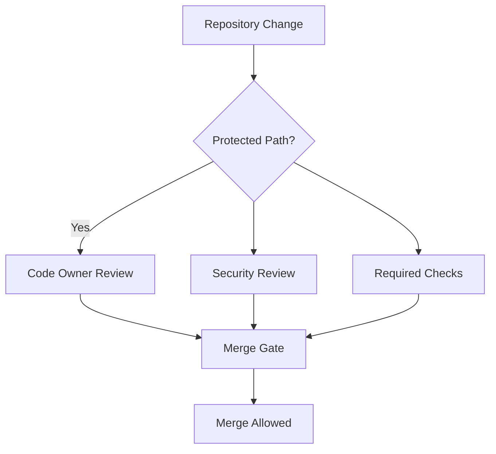
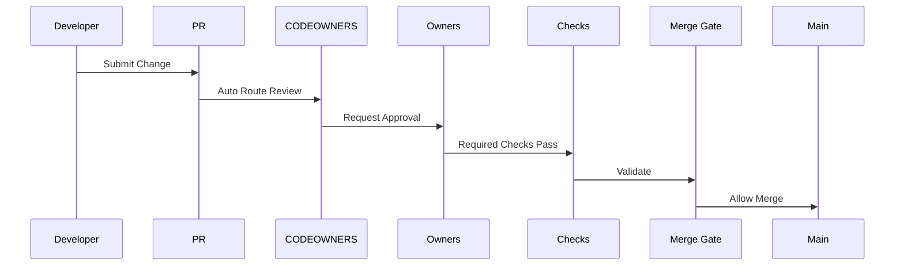

# Protected Review Paths Standard
**Document ID:** GOV-CTRL-001  
**Document Type:** Governance Control Standard  
**Issue Reference:** S1-I02 Implement CODEOWNERS Model  
**Story:** STORY-ARCH-001 Repository Scaffolding  
**Repository:** starone-galaxy-architecture  
**Version:** 1.0  
**Status:** Draft for Governance Review

---

# Revision History

| Version | Date | Author | Description |
|---|---|---|---|
| 1.0 | Jan 2026 | Sachin Salunke | Initial protected review paths baseline |

---

# Sign-Off

| Role | Status |
|---|---|
| Platform Architect | Pending |
| Security Review | Pending |
| DevOps Governance | Pending |

---

# 1. Purpose

Define **Protected Review Paths** requiring mandatory CODEOWNER approval and governance controls before merge.

Purpose:

- Enforce ownership boundaries  
- Protect critical architecture artifacts  
- Prevent governance bypass  
- Standardize mandatory reviewer routing  
- Support controlled change management

---

# 2. Scope

Applies to all protected paths within:

```text
starone-galaxy-architecture
```

Covers:

- Architecture artifacts  
- Governance controls  
- Workflow automation  
- Security-sensitive changes  
- Protected repository configuration

---

# 3. Protected Review Path Model



---

# 4. Protected Paths

## Tier 1 — Critical Architectural Paths

Mandatory dual approval.

```text
/docs/adr/*
/docs/hld/*
/docs/srs/*
/docs/rtm/*
```

Required reviewers:

| Path | Reviewers |
|---|---|
ADR | Platform Architect + Security |
HLD | Platform Architect + DevOps |
SRS | Solution Architect + Domain Owner |
RTM | Architecture + QA Governance |

Approvals Required:

```text
Minimum 2 approvals
Code Owner approval mandatory
```

---

## Tier 2 — Governance Protected Paths

```text
/governance/policies/*
/governance/controls/*
/governance/templates/*
```

Required reviewers:

```text
Governance Board
Security Governance
```

---

## Tier 3 — Automation Protected Paths

```text
.github/workflows/*
.github/CODEOWNERS
```

Required reviewers:

```text
Platform Engineering
DevSecOps
Platform Architects
```

Workflow changes require:

- Security review
- Architecture review
- Pipeline validation

---

# 5. Protected Path Matrix

| Path | Protection Level | Required Approvals |
|---|---|---|
/docs/adr/* | Critical | 2 |
/docs/hld/* | Critical | 2 |
/docs/srs/* | Critical | 2 |
/docs/rtm/* | Critical | 2 |
/governance/* | High | 2 |
.github/workflows/* | Critical | 2+ |

---

# 6. CODEOWNERS Mapping

Protected paths governed by:

```text
/docs/adr/                      @starone/architecture-governance
/docs/hld/                      @starone/platform-architects
/docs/srs/                      @starone/solution-architecture
/docs/rtm/                      @starone/qa-governance

/governance/policies/           @starone/governance-board
/governance/controls/           @starone/security-governance

.github/workflows/              @starone/platform-engineering @starone/devsecops
```

---

# 7. Branch Protection Rules

Main branch protection:

```yaml
Require pull request reviews: true
Required approvals: 2
Require code owner review: true
Dismiss stale approvals: true
```

Required checks:

```text
architecture-review
security-compliance
doc-validation
lint-standards
```

No direct push allowed.

---

# 8. Review Control Policies

Protected path changes require:

- Pull Request only
- Code Owner approval
- Required checks passing
- Protected branch policy enforcement

Forbidden:

- Direct commits to main
- Merge without approvals
- Bypass of required checks

---

# 9. Escalated Protection Rules

Additional scrutiny required for:

## Security-sensitive changes

```text
**/*security*
**/*rbac*
**/*tls*
```

Additional mandatory security review required.

---

## Architectural Decision Changes

```text
/docs/adr/*
```

Changes require:

- Decision rationale review
- Traceability validation
- Architecture Board approval

---

# 10. Review Routing Model



---

# 11. Validation Scenarios

## Scenario 1
Change:

```text
/docs/adr/ADR-002.md
```

Expected:

Auto-request:

```text
@starone/architecture-governance
```

Result:

Protected review enforced.

---

## Scenario 2
Change:

```text
.github/workflows/security-compliance.yml
```

Expected:

Auto-request:

```text
@starone/platform-engineering
@starone/devsecops
```

Result:

Workflow path protected.

---

# 12. Exception Governance

Exceptions require:

- Formal ADR approval
- Governance Board approval
- Exception recorded in audit log

No informal exceptions permitted.

---

# 13. Audit Controls

Review evidence must include:

- PR link
- Approver evidence
- Status check evidence
- Merge approval trace

Audit artifacts retained in:

```text
/governance/audits/
```

---

# 14. Risks

| Risk | Mitigation |
|---|---|
Approval bypass | Protected branches |
Ownership ambiguity | CODEOWNERS |
Unauthorized changes | Mandatory reviewers |
Workflow tampering | Protected automation paths |

---

# 15. Compliance Controls

Protected review paths support:

- Change control governance  
- Segregation of duties  
- Review accountability  
- Auditability

---

# 16. Acceptance Criteria

- [x] Protected paths identified
- [x] Review routing defined
- [x] Approval controls specified
- [x] Branch protection mapped
- [x] Validation scenarios documented

Control Ready: ✅

---

# 17. File Placement

Store:

```text
/governance/controls/protected-review-paths.md
```

---

# 18. Traceability

| Epic | Story | Issue | Control Artifact |
|---|---|---|---|
EPIC-001 | S1 | S1-I02 | GOV-CTRL-001 |

Coverage: 100%

