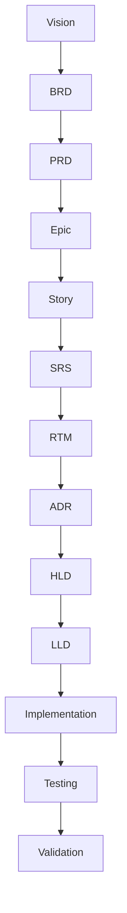

# Traceability Standard

**Document ID:** GOV-TRACE-001  
**Project:** StarOne Galaxy  
**Domain:** Architecture Governance  
**Author:** Sachin Salunke  
**Version:** 1.0.0  
**Status:** Draft  
**Approval Status:** Pending  

---

## Revision History

| Version | Date | Author | Description |
|---|---|---|---|
| 1.0.0 | Jan 2026 | Sachin Salunke | Initial Traceability Standard |

---

## Sign-Off

| Role | Status |
|---|---|
| Platform Architect | Pending |
| Security Review | Pending |
| DevOps Governance | Pending |
| QA Governance | Pending |

---

# 1. Purpose

This standard establishes mandatory traceability rules across the StarOne Galaxy Software Development Lifecycle (SDLC).

The objective is to ensure complete visibility, governance, validation, and auditability from business objectives through implementation and testing.

This standard guarantees:

- Requirement completeness
- Architecture alignment
- Implementation accountability
- Test coverage validation
- Governance compliance
- Audit readiness

---

# 2. Scope

This standard applies to:

- Business Requirements
- Product Requirements
- Epics
- User Stories
- Architecture Artifacts
- Design Artifacts
- Source Code
- Infrastructure Components
- Test Artifacts
- Validation Activities

Applicable repositories:

```text
starone-galaxy-architecture
starone-galaxy-infra
starone-galaxy-config
dhs-system
bookshow-system
sportstats-system
vaultiron-system
```

---

# 3. Traceability Lifecycle Model

## End-to-End Traceability Chain



---

# 4. Traceability Principles

## Principle 1 — Complete Coverage

Every requirement shall be traceable from source to validation.

---

## Principle 2 — Bidirectional Traceability

Every artifact shall support:

- Forward Traceability
- Backward Traceability

---

## Principle 3 — No Orphan Artifacts

No artifact may exist without a valid parent artifact.

---

## Principle 4 — Auditability

Every traceability relationship shall be reviewable and auditable.

---

## Principle 5 — Governance Enforcement

Traceability compliance shall be mandatory for all architecture and engineering artifacts.

---

# 5. Forward Traceability Standard

## Definition

Forward traceability ensures requirements are implemented and validated.

---

## Standard Model

```text
Requirement
      ↓
Architecture
      ↓
Design
      ↓
Implementation
      ↓
Testing
      ↓
Validation
```

---

## Mandatory Rules

Every requirement must map to:

- ADR
- HLD
- LLD
- Implementation
- Test Case
- Validation Result

---

# 6. Backward Traceability Standard

## Definition

Backward traceability ensures every implementation artifact originates from a valid requirement.

---

## Standard Model

```text
Validation
      ↓
Test Case
      ↓
Implementation
      ↓
Design
      ↓
Architecture
      ↓
Requirement
```

---

## Mandatory Rules

Every:

- Test Case
- Source Code Module
- Service
- Deployment Unit

Must trace back to:

- Requirement
- Story
- Epic

---

# 7. Requirement Linkage Standard

## Strategic Traceability

```text
Vision
   ↓
Business Objective
   ↓
Epic
   ↓
Story
   ↓
Requirement
```

---

## Mandatory Rules

1. Every Requirement must belong to a Story
2. Every Story must belong to an Epic
3. Every Epic must map to a Business Objective
4. Every Business Objective must support Product Vision

---

# 8. Architecture Traceability Standard

## Architecture Mapping Model

```text
Requirement
      ↓
ADR
      ↓
HLD
      ↓
LLD
```

---

## Mandatory Rules

Every requirement shall map to:

- Architecture Decision
- High-Level Design
- Low-Level Design

---

## Architecture Artifact Ownership

| Artifact | Owner |
|---|---|
| ADR | Architect |
| HLD | Architect |
| LLD | Engineering Team |

---

# 9. Implementation Traceability Standard

## Implementation Mapping Model

```text
Requirement
      ↓
Repository
      ↓
Service
      ↓
Source Code
      ↓
Deployment Unit
```

---

## Mandatory Rules

Every implementation artifact must reference:

- Epic ID
- Story ID
- Requirement ID

---

## Example

```text
EPIC-001
STORY-003
FR-DHS-001
```

---

# 10. Testing Traceability Standard

## Testing Mapping Model

```text
Requirement
      ↓
Test Case
      ↓
Test Execution
      ↓
Validation
```

---

## Mandatory Rules

Every requirement must have:

- Functional Test Coverage
- Integration Test Coverage
- Validation Status

---

## Coverage Requirement

```text
100% Requirement Coverage Mandatory
```

---

# 11. RTM Governance Standard

## RTM Ownership

| Activity | Owner |
|---|---|
| Requirement Creation | Business |
| Requirement Mapping | Architect |
| Architecture Mapping | Architect |
| Test Mapping | QA |
| Coverage Validation | Governance Team |

---

## RTM Update Triggers

RTM shall be updated when:

- New Requirement added
- Requirement modified
- ADR updated
- HLD updated
- New Test Case created
- Requirement retired

---

# 12. Traceability Status Model

| Status | Meaning |
|---|---|
| Planned | Requirement identified |
| In Progress | Design or implementation started |
| Implemented | Development completed |
| Tested | Validation completed |
| Approved | Requirement satisfied |
| Retired | Requirement deprecated |

---

# 13. Coverage Standards

## Functional Coverage

| Category | Target |
|---|---|
| Functional Requirements | 100% |
| Architecture Mapping | 100% |
| Implementation Mapping | 100% |
| Test Coverage | 100% |

---

## Security Coverage

| Category | Target |
|---|---|
| Security Requirements | 100% |
| Security Tests | 100% |

---

## Non-Functional Coverage

| Category | Target |
|---|---|
| Performance Requirements | 100% |
| Scalability Requirements | 100% |
| Reliability Requirements | 100% |

---

# 14. Governance Rules

```text
1. Every Requirement must exist in RTM
2. Every Requirement must map to architecture
3. Every Requirement must map to implementation
4. Every Requirement must map to testing
5. Every Test Case must map back to a Requirement
6. Every Architecture Artifact must map to a Requirement
7. Every Service must map to a Requirement
8. Every Deployment Unit must map to a Requirement
9. No orphan requirements allowed
10. No orphan architecture artifacts allowed
11. No orphan implementation allowed
12. No orphan test cases allowed
```

---

# 15. Audit Checklist

| Check | Status |
|---|---|
| Requirement Coverage Verified | ☐ |
| Architecture Mapping Complete | ☐ |
| Implementation Mapping Complete | ☐ |
| Test Coverage Complete | ☐ |
| Security Coverage Complete | ☐ |
| Governance Review Completed | ☐ |

---

# 16. Compliance & Standards Alignment

| Standard | Application |
|---|---|
| ISO/IEC/IEEE 29148 | Requirement Traceability |
| IEEE 1016 | Architecture Mapping |
| Internal Governance Standards | SDLC Governance |
| Documentation Governance Standard | Documentation Controls |

---

# 17. Related Artifacts

## Governance Artifacts

- Documentation_Compliance_Standard.md
- RTM_Template.md

---

## Architecture Artifacts

- ADR_Template.md
- HLD_Template.md
- SRS_Template.md

---

## Portfolio Artifacts

- EPIC_Story_Linkage_Template.md

---

# 18. Strategic Next Steps

- Establish Mermaid Modeling Standards
- Define Review Workflow Controls
- Automate Traceability Validation
- Integrate Governance Reviews into SDLC

---

# 19. Conclusion

This standard establishes the official traceability governance model for StarOne Galaxy.

It ensures:

- Complete lifecycle traceability
- Requirement accountability
- Architecture alignment
- Test coverage validation
- Governance compliance
- Audit readiness

This document is authoritative for all traceability activities across the StarOne Galaxy ecosystem.

---

# 20. Approval Status

| Review Area | Status |
|---|---|
| Architecture Review | Pending |
| QA Review | Pending |
| Security Review | Pending |
| Governance Review | Pending |

---

## Final Approval Statement

```text
This Traceability Standard becomes authoritative once all
required reviews and approvals have been completed.
```

---