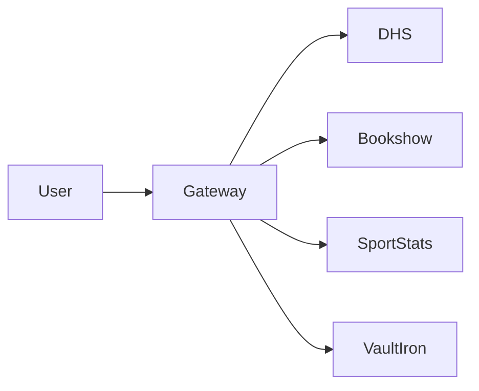
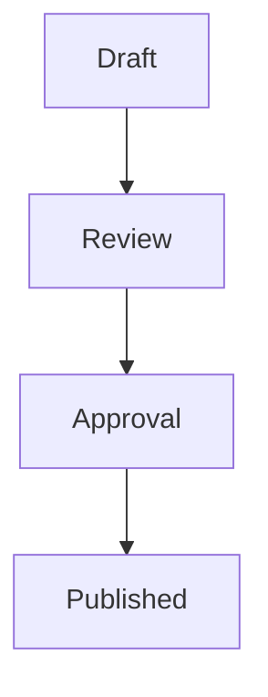
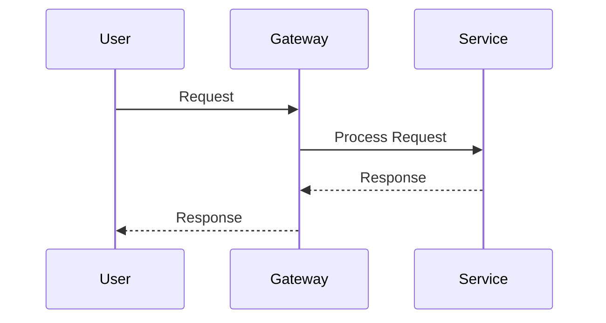
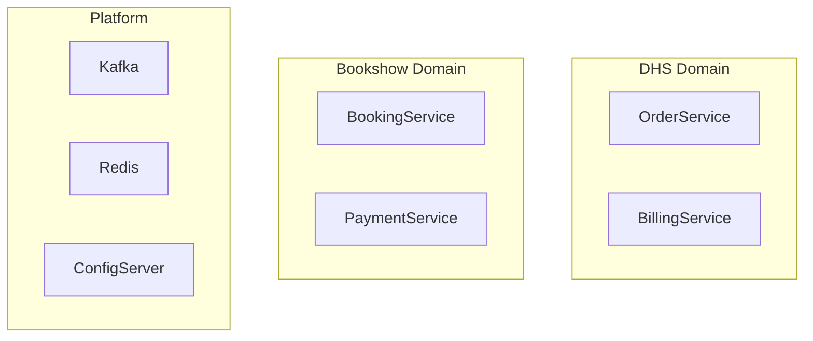

# Mermaid Modeling Standard

**Document ID:** GOV-MERMAID-001  
**Project:** StarOne Galaxy  
**Domain:** Architecture Governance  
**Author:** Sachin Salunke  
**Version:** 1.0.0  
**Status:** Draft  
**Approval Status:** Pending  

---

## Revision History

| Version | Date | Author | Description |
|---|---|---|---|
| 1.0.0 | Jan 2026 | Sachin Salunke | Initial Mermaid Modeling Standard |

---

## Sign-Off

| Role | Status |
|---|---|
| Platform Architect | Pending |
| Security Review | Pending |
| DevOps Governance | Pending |
| Documentation Governance | Pending |

---

# 1. Purpose

This standard establishes mandatory Mermaid diagram conventions across the StarOne Galaxy ecosystem.

The objective is to ensure:

- Consistent architecture visualizations
- Reusable modeling patterns
- Improved document readability
- Standardized architecture communication
- Governance compliance
- Audit-ready documentation

This standard applies to all architecture and engineering documentation produced within the StarOne Galaxy ecosystem.

---

# 2. Scope

This standard applies to:

- ADR Documents
- HLD Documents
- SRS Documents
- RTM Documents
- Architecture READMEs
- Governance Documents
- Future LLD Documents
- Infrastructure Documentation

Applicable repositories:

```text
starone-galaxy-architecture
starone-galaxy-infra
starone-galaxy-config
dhs-system
bookshow-system
sportstats-system
vaultiron-system
```

---

# 3. Modeling Principles

## Principle 1 — Simplicity

Diagrams must communicate architecture clearly.

Avoid unnecessary complexity.

---

## Principle 2 — Consistency

All diagrams must follow standardized naming, layout, and grouping conventions.

---

## Principle 3 — Domain Ownership

Every domain must be visually represented as an independent architectural boundary.

---

## Principle 4 — Reusability

Modeling patterns should be reusable across domains.

---

## Principle 5 — Governance First

Visual models are governed architecture artifacts and must follow approved standards.

---

# 4. Approved Diagram Types

| Diagram Type | Purpose |
|---|---|
| Flowchart | Process flows |
| Sequence Diagram | Service interactions |
| ER Diagram | Data modeling |
| State Diagram | State transitions |
| Journey Diagram | User journeys |
| Class Diagram | Logical design |

---

## Recommended Usage

| Artifact | Diagram Types |
|---|---|
| ADR | Flowchart |
| HLD | Flowchart, Sequence |
| SRS | Flowchart, Sequence, State |
| RTM | Flowchart |
| LLD | Sequence, Class, State |

---

# 5. Layout Standards

## 5.1 Context Diagrams

Use:

```mermaid
flowchart LR
```

Purpose:

```text
System Context
Repository Context
Domain Context
Platform Context
```

Example:



---

## 5.2 Process Flow Diagrams

Use:

```mermaid
flowchart TD
```

Purpose:

```text
Business Flows
Governance Flows
Lifecycle Flows
Approval Flows
```

Example:



---

## 5.3 Sequence Diagrams

Use:



Purpose:

```text
API Flows
Service Interactions
Event Processing
```

---

## 5.4 ER Diagrams

Use:

```mermaid
erDiagram
```

Purpose:

```text
Logical Data Models
Database Relationships
```

---

## 5.5 State Diagrams

Use:

```mermaid
stateDiagram-v2
```

Purpose:

```text
Workflow States
Entity Lifecycle States
```

---

# 6. Naming Standards

## Naming Principles

Names must be:

- Business meaningful
- Consistent
- Readable
- Self-explanatory

---

## Approved Examples

```text
Order Service
Billing Service
Booking Service
Credential Service
Customer Database
Event Processing Engine
```

---

## Prohibited Examples

```text
OS
BS
CS
DB1
SvcA
SvcB
```

---

## Service Naming Standard

Format:

```text
<Service Name>
```

Examples:

```text
Order Service
Payment Service
Dispatch Service
```

---

## Database Naming Standard

Format:

```text
<Domain>-Database
```

Examples:

```text
DHS-Database
Bookshow-Database
VaultIron-Database
```

---

# 7. Domain Boundary Standards

Every architecture diagram must explicitly identify domain ownership.

---

## Approved Pattern



---

## Governance Rules

Mandatory:

- Domains separated visually
- Platform components separated
- Shared services isolated
- Domain ownership visible

---

## Prohibited Pattern

```text
Mixing multiple domains without boundaries
```

---

# 8. Architecture View Standards

## C4 Level 1 — System Context

Purpose:

```text
Show external actors and major systems
```

Layout:

```text
Left to Right (LR)
```

---

## C4 Level 2 — Container View

Purpose:

```text
Show applications and containers
```

Layout:

```text
Top Down (TD)
```

---

## C4 Level 3 — Component View

Purpose:

```text
Show major components within a service
```

Layout:

```text
Top Down (TD)
```

---

## C4 Level 4 — Code View

Purpose:

```text
Detailed implementation view
```

Recommendation:

```text
Prefer UML or Class Diagram
```

---

# 9. Reusable Modeling Patterns

Approved reusable patterns:

```text
System Context Pattern
Container Pattern
Component Pattern
Deployment Pattern
Integration Pattern
Event Flow Pattern
Governance Workflow Pattern
Traceability Pattern
```

---

# 10. Styling Guidelines

## Default Rule

Focus on:

```text
Clarity over decoration
```

---

## Allowed

- Standard Mermaid syntax
- Domain grouping
- Logical separation

---

## Discouraged

- Excessive styling
- Decorative colors
- Complex visual effects

---

## Color Usage

Rule:

```text
Avoid custom colors unless explicitly required.
```

---

# 11. Documentation Integration Standards

Mermaid diagrams should be used in:

| Artifact | Recommended |
|---|---|
| ADR | Yes |
| HLD | Mandatory |
| SRS | Recommended |
| RTM | Optional |
| LLD | Mandatory |

---

# 12. Governance Rules

```text
1. Only approved Mermaid diagram types may be used
2. Layout standards must be followed
3. Domain boundaries must be visible
4. Naming standards must be followed
5. Shared platform components must be isolated
6. Reusable patterns should be preferred
7. Diagrams must remain readable and maintainable
8. Every diagram is subject to architecture review
```

---

# 13. Audit Checklist

| Check | Status |
|---|---|
| Approved Diagram Type Used | ☐ |
| Layout Standard Followed | ☐ |
| Naming Standard Followed | ☐ |
| Domain Boundaries Defined | ☐ |
| Reusable Pattern Applied | ☐ |
| Governance Review Completed | ☐ |

---

# 14. Compliance & Standards Alignment

| Standard | Application |
|---|---|
| IEEE 1016 | Architecture Visualization |
| C4 Model | Architecture Views |
| Mermaid Documentation | Diagram Syntax |
| Internal Governance Standards | Modeling Controls |

---

# 15. Related Artifacts

## Governance Artifacts

- Documentation_Compliance_Standard.md
- Traceability_Standard.md

---

## Architecture Artifacts

- ADR_Template.md
- HLD_Template.md
- SRS_Template.md
- RTM_Template.md

---

## Portfolio Artifacts

- EPIC_Story_Linkage_Template.md

---

# 16. Strategic Next Steps

- Define Review Workflow Controls
- Standardize LLD Templates
- Introduce Architecture Review Process
- Establish Modeling Quality Gates

---

# 17. Conclusion

This standard establishes the official Mermaid modeling conventions for StarOne Galaxy.

It ensures:

- Consistent architecture visualization
- Reusable modeling patterns
- Domain ownership visibility
- Governance compliance
- Architecture review readiness

This document is authoritative for all Mermaid-based architecture diagrams across the StarOne Galaxy ecosystem.

---

# 18. Approval Status

| Review Area | Status |
|---|---|
| Architecture Review | Pending |
| Security Review | Pending |
| Governance Review | Pending |
| Documentation Review | Pending |

---

## Final Approval Statement

```text
This Mermaid Modeling Standard becomes authoritative once
all required reviews and approvals have been completed.
```

---