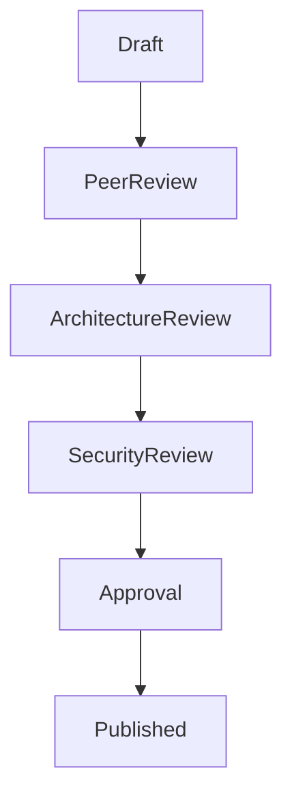
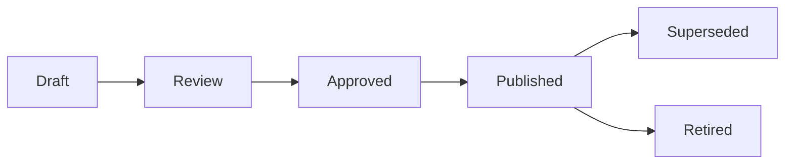
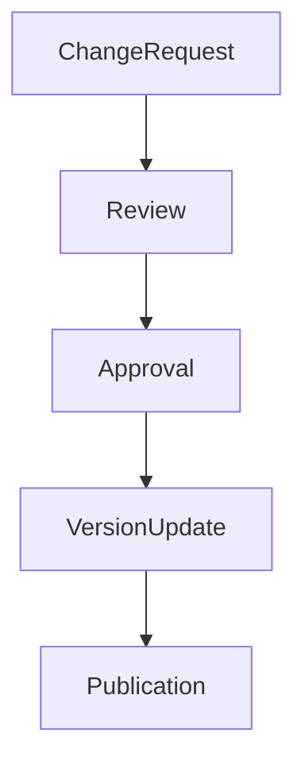
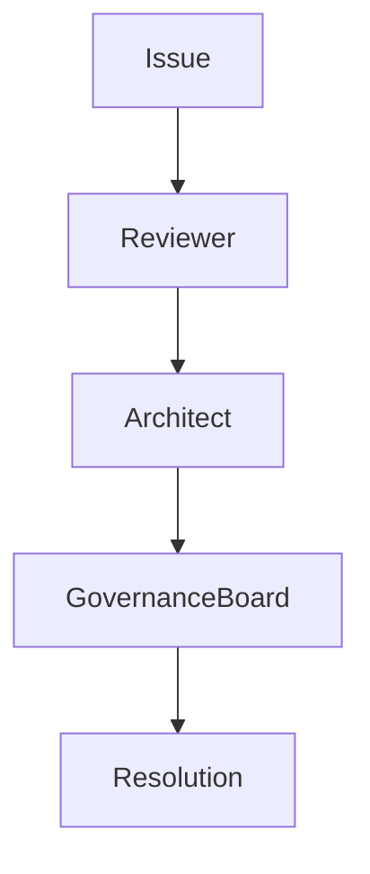

# Review Workflow Standard

**Document ID:** GOV-REVIEW-001  
**Project:** StarOne Galaxy  
**Domain:** Architecture Governance  
**Author:** Sachin Salunke  
**Version:** 1.0.0  
**Status:** Draft  
**Approval Status:** Pending

---

## Revision History

| Version | Date | Author | Description |
|---|---|---|---|
| 1.0.0 | Jan 2026 | Sachin Salunke | Initial Review Workflow Standard |

---

## Sign-Off

| Role | Status |
|---|---|
| Platform Architect | Pending |
| Security Review | Pending |
| DevOps Governance | Pending |
| Documentation Governance | Pending |

---

# 1. Purpose

This standard establishes the official review, approval, publication, and change management workflow for all architecture and governance artifacts within the StarOne Galaxy ecosystem.

The objective is to ensure:

- Consistent document quality
- Architecture governance compliance
- Security review enforcement
- Audit readiness
- Controlled publication process
- Standardized change management

This document serves as the authoritative governance workflow for all documentation activities.

---

# 2. Scope

This standard applies to:

- ADR Documents
- HLD Documents
- SRS Documents
- RTM Documents
- Governance Standards
- Architecture READMEs
- Future LLD Documents
- Technical Design Documents

Applicable repositories:

```text
starone-galaxy-architecture
starone-galaxy-infra
starone-galaxy-config
dhs-system
bookshow-system
sportstats-system
vaultiron-system
```

---

# 3. Review Workflow Lifecycle

## Standard Review Workflow



---

## Workflow Description

| Stage | Purpose |
|---|---|
| Draft | Initial document creation |
| Peer Review | Quality and completeness validation |
| Architecture Review | Architecture compliance validation |
| Security Review | Security and compliance validation |
| Approval | Governance approval |
| Published | Official document release |

---

# 4. Document Lifecycle States

## Status Model

| Status | Description |
|---|---|
| Draft | Authoring stage |
| Review | Under formal review |
| Approved | All approvals completed |
| Published | Official active document |
| Superseded | Replaced by newer version |
| Retired | No longer maintained |

---

## Lifecycle Flow



---

# 5. Review Ownership Model

## Review Responsibility Matrix

| Stage | Owner |
|---|---|
| Draft | Author |
| Peer Review | Engineering Team |
| Architecture Review | Platform Architect |
| Security Review | Security Reviewer |
| Approval | Governance Board |
| Publication | Repository Maintainer |

---

## Reviewer Responsibilities

### Author

Responsible for:

- Document creation
- Content accuracy
- Initial traceability
- Review coordination

---

### Peer Reviewer

Responsible for:

- Content completeness
- Readability
- Standards compliance
- Quality validation

---

### Platform Architect

Responsible for:

- Architecture validation
- Design consistency
- Governance compliance
- Technical approval

---

### Security Reviewer

Responsible for:

- Security validation
- Compliance verification
- Risk assessment
- Security approval

---

### Governance Board

Responsible for:

- Final approval
- Policy compliance
- Publication authorization

---

# 6. Approval Gate Standards

## ADR Approval Requirements

Mandatory approvals:

```text
Peer Review
Architecture Review
Security Review
```

---

## HLD Approval Requirements

Mandatory approvals:

```text
Peer Review
Architecture Review
Security Review
```

---

## SRS Approval Requirements

Mandatory approvals:

```text
Peer Review
Architecture Review
QA Review
```

---

## RTM Approval Requirements

Mandatory approvals:

```text
Peer Review
Architecture Review
QA Review
```

---

## Governance Standards Approval Requirements

Mandatory approvals:

```text
Peer Review
Architecture Review
Governance Review
```

---

# 7. Publication Controls

A document may enter the Published state only when:

- Required reviews completed
- Required approvals completed
- Sign-off table completed
- Audit checklist completed
- Revision history updated
- Approval status updated

---

## Publication Validation Checklist

```text
Review Complete
Approval Complete
Audit Complete
Metadata Complete
Version Updated
```

All items are mandatory.

---

# 8. Change Management Workflow

## Standard Change Process



---

## Change Types

| Change Type | Description |
|---|---|
| Major | Significant architectural change |
| Minor | Content enhancement |
| Patch | Typographical or formatting update |

---

## Versioning Model

```text
Major.Minor.Patch
```

Examples:

```text
1.0.0
1.1.0
1.1.1
2.0.0
```

---

# 9. Escalation Workflow

Escalation shall occur when:

- Review exceeds SLA
- Approval blocked
- Security issue identified
- Compliance issue identified
- Governance dispute identified

---

## Escalation Model



---

# 10. Review Service Level Agreements (SLAs)

| Review Type | Target SLA |
|---|---|
| Peer Review | 2 Business Days |
| Architecture Review | 3 Business Days |
| Security Review | 3 Business Days |
| Governance Review | 3 Business Days |
| Final Approval | 2 Business Days |

---

# 11. Governance Rules

```text
1. No document may bypass Peer Review
2. No document may bypass Approval
3. Published artifacts require signoff
4. Revision history must be maintained
5. Audit checklist must be completed
6. Security review required where applicable
7. Governance review required before publication
8. Every published artifact must have an owner
9. Every document change requires versioning
10. All approvals must be recorded
```

---

# 12. Audit Checklist

| Check | Status |
|---|---|
| Peer Review Completed | ☐ |
| Architecture Review Completed | ☐ |
| Security Review Completed | ☐ |
| Governance Review Completed | ☐ |
| Approval Recorded | ☐ |
| Publication Authorized | ☐ |
| Revision History Updated | ☐ |
| Sign-Off Completed | ☐ |

---

# 13. Compliance & Standards Alignment

| Standard | Application |
|---|---|
| ISO/IEC/IEEE 29148 | Documentation Governance |
| IEEE 1016 | Architecture Reviews |
| Documentation Compliance Standard | Approval Controls |
| Internal Governance Standards | Review Workflow |

---

# 14. Review Metrics

## Governance KPIs

| Metric | Target |
|---|---|
| Review Completion Rate | 100% |
| Approval Compliance | 100% |
| Traceability Compliance | 100% |
| Audit Readiness | 100% |

---

## Quality KPIs

| Metric | Target |
|---|---|
| Documentation Accuracy | 100% |
| Review SLA Compliance | ≥95% |
| Governance Compliance | 100% |

---

# 15. Related Artifacts

## Governance Standards

- Documentation_Compliance_Standard.md
- Traceability_Standard.md
- Mermaid_Modeling_Standard.md

---

## Templates

- ADR_Template.md
- HLD_Template.md
- SRS_Template.md
- RTM_Template.md
- EPIC_Story_Linkage_Template.md

---

# 16. Strategic Next Steps

- Automate approval workflows
- Implement document quality gates
- Introduce governance dashboards
- Establish architecture review board
- Integrate workflow checks into CI/CD

---

# 17. Success Criteria

Success is achieved when:

- All architecture artifacts follow the workflow
- Review ownership is clearly defined
- Approval gates are enforced
- Publication controls are standardized
- Governance compliance is measurable
- Audit readiness is maintained

---

# 18. Conclusion

This standard establishes the official review, approval, publication, and governance workflow for StarOne Galaxy documentation.

It ensures:

- Controlled document lifecycle management
- Consistent review practices
- Governance compliance
- Audit readiness
- Change management discipline

This document is authoritative for all documentation review and approval activities across the StarOne Galaxy ecosystem.

---

# 19. Approval Status

| Review Area | Status |
|---|---|
| Architecture Review | Pending |
| Security Review | Pending |
| Governance Review | Pending |
| Documentation Review | Pending |

---

## Final Approval Statement

```text
This Review Workflow Standard becomes authoritative once
all required reviews and approvals have been completed.
```

---