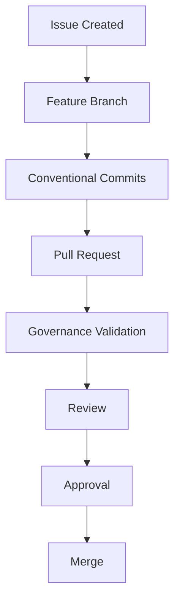

# STANDARD-002 — Contribution Governance

## Document Metadata

| Field           | Description                                          |
| --------------- | ---------------------------------------------------- |
| Document ID     | STANDARD-008                                         |
| Document Title  | Contribution Governance                              |
| Domain          | Governance Standards                                 |
| Document Type   | Governance Standard                                  |
| Repository      | starone-galaxy-architecture                          |
| Version         | 1.0                                                  |
| Author          | Sachin Salunke                                       |
| Date            | 2026                                                 |
| Status          | Approved Draft                                       |
| Linked Epic     | EPIC-ARCH-001 Ecosystem Design & Governance Baseline |
| Linked Story    | STORY-ARCH-001 Repository Scaffolding                |
| Linked Issue    | S1-I05 Define Branching & Contribution Governance    |
| Approval Status | Platform Architect Approved                          |
| Classification  | Governance Controlled Document                       |

---

# Revision History

| Version | Date | Author         | Description                              |
| ------- | ---- | -------------- | ---------------------------------------- |
| 1.0     | 2026 | Sachin Salunke | Initial Contribution Governance baseline |

---

# Purpose

This standard defines the mandatory contribution governance model for the StarOne Galaxy ecosystem.

The purpose of this standard is to:

- Establish controlled contribution practices
- Standardize branching and pull request governance
- Enforce traceability requirements
- Define review and approval controls
- Enable governance automation readiness
- Support scalable multi-contributor operations

---

# Scope

This standard applies to:

- Architecture repositories
- Governance repositories
- Platform repositories
- Documentation repositories
- Shared engineering assets

Including:

- starone-galaxy-architecture
- starone-galaxy-infra
- starone-galaxy-config
- starone-dhs-system
- starone-bookshow-system

---

# Governance Principles

All contributions shall follow:

- Platform First
- Documentation as Code
- Governance as Code
- Security by Default
- Traceability by Design
- Standards Before Implementation

---

# Branching Governance

## Approved Branch Types

```text
main
feature/*
hotfix/*
release/*
```

### Examples

```text
feature/s1-i05-contribution-governance
feature/adr-documentation-strategy
hotfix/fix-security-policy
release/v1.0.0
```

### Rules

- Branch names must follow STANDARD-007 Naming Conventions
- Long-lived feature branches are discouraged
- Direct commits to main are prohibited
- Pull Requests are required for all governed changes

---

# Pull Request Governance

Every Pull Request shall include:

- Linked Epic
- Linked Story
- Linked Issue
- Scope Summary
- Architecture Impact
- Validation Evidence
- Governance Checklist

The repository Pull Request template shall be used for all changes.

---

# Contribution Workflow



---

# Review Governance

## Target-State Review Model

| Change Type          | Required Reviewers                |
| -------------------- | --------------------------------- |
| ADR                  | Platform Architect + Security     |
| HLD                  | Platform Architect + DevOps       |
| SRS                  | Solution Architect + Domain Owner |
| Governance Standards | Governance Board                  |
| Workflow Changes     | Platform Engineering              |

---

# Solo Contributor Operating Mode

The repository is currently maintained by a single contributor.

Until governance teams are formally established:

- Platform Architect fulfills all review responsibilities
- Self-review is mandatory
- Pull Requests remain mandatory
- Governance validation remains mandatory
- Available workflow checks must pass

The governance model defined by this standard represents the target-state operating model for future multi-contributor governance.

---

# Approval Governance

**Target-State**

Mandatory requirements:

- Minimum 2 approvals
- CODEOWNER approval
- All required governance checks passing

**Solo Contributor Mode**

Mandatory requirements:

- Self-review completed
- Pull Request raised
- Governance checklist completed
- Available validations passing

---

# Definition of Ready

Work shall begin only when:

- Scope defined
- Issue linked
- Acceptance criteria defined
- Standards identified
- Dependencies understood

---

# Definition of Done

**Target-State**

Contribution is complete when:

- Required approvals obtained
- CODEOWNER approvals obtained
- Governance checks passed
- Documentation updated
- Traceability updated
- Pull Request merged

**Solo Contributor Mode**

Contribution is complete when:

- Self-review completed
- Documentation updated
- Traceability updated
- Available validations passed
- Pull Request merged

---

# Protected Path Governance

The following paths require governed review:

```text
/docs/*
/architecture/*
/governance/*
/.github/workflows/*
```

---

# Required Governance Checks

Planned governance validations include:

```text
architecture-review
security-compliance
doc-validation
lint-standards
```

Implementation automation shall be progressively introduced through Engineering Governance Automation initiatives.

---

# Conventional Commit Standard

Pattern:

```text
type(scope): description
```

Approved types:

```text
feat
fix
docs
refactor
chore
test
```

---

# Traceability Requirements

All contributions shall be traceable to:

```text
Epic
→ Story
→ Issue
→ Deliverable
```

No orphan artifacts are permitted.

---

# Related Standards

| Standard        | Purpose                        |
| --------------- | ------------------------------ |
| STANDARD-007    | Enterprise Naming Conventions  |
| STANDARD-006    | CODEOWNERS Governance          |
| CONTRIBUTING.md | Operational Contribution Guide |

---

# Sign-Off

| Role               | Status                           |
| ------------------ | -------------------------------- |
| Platform Architect | Approved                         |
| Security Review    | Deferred (Solo Contributor Mode) |
| DevOps Governance  | Deferred (Solo Contributor Mode) |

---

# Traceability

| Epic          | Story          | Issue  | Requirement |
| ------------- | -------------- | ------ | ----------- |
| EPIC-ARCH-001 | STORY-ARCH-001 | S1-I05 | S1-FR-005   |
| EPIC-ARCH-001 | STORY-ARCH-001 | S1-I05 | S1-FR-006   |

Coverage: 100%
