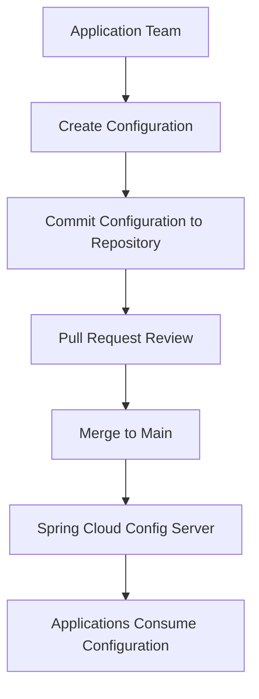

# BRD-001-CONFIG: Configuration Repository Management

---

## 1. Title Page

| Field         | Value                                                       |
| ------------- | ----------------------------------------------------------- |
| Document ID   | BRD-001-CONFIG                                              |
| Project       | StarOne Galaxy                                              |
| Domain        | Platform Configuration Management                           |
| Repository    | starone-central-config                                      |
| Document Type | Business Requirements Document (ISO/IEC/IEEE 29148 aligned) |
| Version       | v1.0                                                        |
| Author        | Sachin Salunke                                              |
| Status        | Draft                                                       |
| Date          | June 2026                                                   |

---

## 2. Revision History

| Version | Date      | Author         | Description     |
| ------- | --------- | -------------- | --------------- |
| v1.0    | June 2026 | Sachin Salunke | Initial Version |

---

## 3. Sign-Off Table

| Role               | Status  |
| ------------------ | ------- |
| Platform Architect | Pending |
| Security Review    | Pending |
| DevOps Governance  | Pending |

---

## 4. Executive Summary

StarOne Galaxy requires a centralized and governed configuration repository to manage application configuration data across all platform domains and deployment environments.

The repository shall serve as the single source of truth for application configuration data consumed by the Spring Cloud Config Server.

The repository shall provide:

- Centralized configuration management
- Environment-specific configuration isolation
- Shared configuration reuse
- Repository governance and standardization
- Self-service onboarding capabilities
- Secure and auditable configuration lifecycle management

---

## 5. Business Problem Statement

Managing configuration data within individual service repositories creates several challenges:

- Configuration duplication
- Inconsistent environment management
- Configuration drift across environments
- Increased operational overhead
- Reduced configuration visibility
- Difficult governance enforcement
- Complex onboarding processes
- Reduced platform scalability

A centralized and governed configuration repository is required to address these challenges while supporting independent domain evolution and platform growth.

---

## 6. Business Objectives

### BO-01

Establish a centralized repository for application configuration management.

### BO-02

Provide environment-specific configuration isolation.

### BO-03

Standardize configuration structures and naming conventions.

### BO-04

Enable reusable shared configuration patterns.

### BO-05

Provide secure and governed configuration management practices.

### BO-06

Enable self-service onboarding for application teams.

### BO-07

Improve maintainability and scalability of platform configuration management.

---

## 7. Business Drivers

| Driver ID | Business Driver               |
| --------- | ----------------------------- |
| BD-01     | Configuration Standardization |
| BD-02     | Environment Isolation         |
| BD-03     | Governance and Compliance     |
| BD-04     | Operational Efficiency        |
| BD-05     | Developer Productivity        |
| BD-06     | Platform Scalability          |
| BD-07     | Future Domain Onboarding      |

---

## 8. Scope

### 8.1 In Scope

- Centralized configuration repository
- Shared configurations
- Environment-specific configurations
- Application-specific configurations
- Configuration templates
- Configuration examples
- Repository governance
- Repository onboarding documentation
- Contribution standards
- Pull request templates
- CODEOWNERS configuration
- Configuration documentation

### 8.2 Out of Scope

- Spring Cloud Config Server application
- Kubernetes implementation
- Docker implementation
- CI/CD implementation
- Secret management infrastructure
- Service implementation
- Runtime configuration refresh mechanisms
- Infrastructure provisioning

---

## 9. Stakeholders

| Stakeholder        | Responsibility                         |
| ------------------ | -------------------------------------- |
| Platform Architect | Repository architecture and governance |
| DevOps Team        | Repository operations and governance   |
| Security Team      | Security standards and compliance      |
| Application Teams  | Configuration creation and maintenance |
| DHS Team           | DHS configuration management           |
| Bookshow Team      | Bookshow configuration management      |

---

## 10. Business Requirements

### BR-CONFIG-001

The platform shall provide a centralized repository for all application configuration data.

---

### BR-CONFIG-002

The platform shall support environment-specific configuration management.

Supported environments:

- Development
- SIT
- UAT
- Production

---

### BR-CONFIG-003

The platform shall support shared and reusable configurations.

Examples:

- Logging
- Kafka
- Redis
- Common application properties

---

### BR-CONFIG-004

The platform shall provide repository governance and contribution standards.

---

### BR-CONFIG-005

The platform shall provide onboarding guidance and templates for application teams.

---

## 11. High-Level Business Workflow

---

## 12. Business Capabilities

| Capability ID | Capability                           |
| ------------- | ------------------------------------ |
| BC-01         | Centralized Configuration Management |
| BC-02         | Environment Configuration Management |
| BC-03         | Shared Configuration Management      |
| BC-04         | Configuration Governance             |
| BC-05         | Configuration Onboarding             |
| BC-06         | Template Management                  |
| BC-07         | Documentation Management             |

---

## 13. Success Criteria

| ID    | Success Criteria                                                   |
| ----- | ------------------------------------------------------------------ |
| SC-01 | All applications use centralized configuration management          |
| SC-02 | Environment configurations are standardized                        |
| SC-03 | Shared configurations are reusable                                 |
| SC-04 | Repository governance is enforced                                  |
| SC-05 | New applications can be onboarded using self-service documentation |
| SC-06 | Configuration changes are fully auditable                          |

---

## 14. Dependencies

| Dependency ID | Description                               |
| ------------- | ----------------------------------------- |
| DEP-01        | Spring Cloud Config Server implementation |
| DEP-02        | Repository governance standards           |
| DEP-03        | Configuration templates                   |
| DEP-04        | Security standards                        |
| DEP-05        | Application onboarding process            |

---

## 15. Risks

| Risk                      | Impact | Mitigation                                     |
| ------------------------- | ------ | ---------------------------------------------- |
| Configuration duplication | Medium | Enforce shared configurations                  |
| Environment drift         | High   | Standardize environment structure              |
| Governance non-compliance | Medium | Enforce pull request reviews                   |
| Improper onboarding       | Medium | Provide onboarding documentation and templates |

---

## 16. Business Benefits

- Centralized configuration management
- Reduced operational complexity
- Improved governance and compliance
- Reduced configuration duplication
- Faster application onboarding
- Improved maintainability
- Platform scalability and future extensibility

---

## 17. Related Artifacts

- ADR-001 Repository & Architecture Strategy for StarOne Galaxy
- EPIC-CONFIG-001 Configuration Repository Management
- PRD-001-CONFIG Product Requirements Document
- RTM-001-CONFIG Requirements Traceability Matrix

---

## 18. Approval

This document establishes the business requirements for Configuration Repository Management within the StarOne Galaxy platform and serves as the business foundation for subsequent product, architecture, and implementation activities.

---
