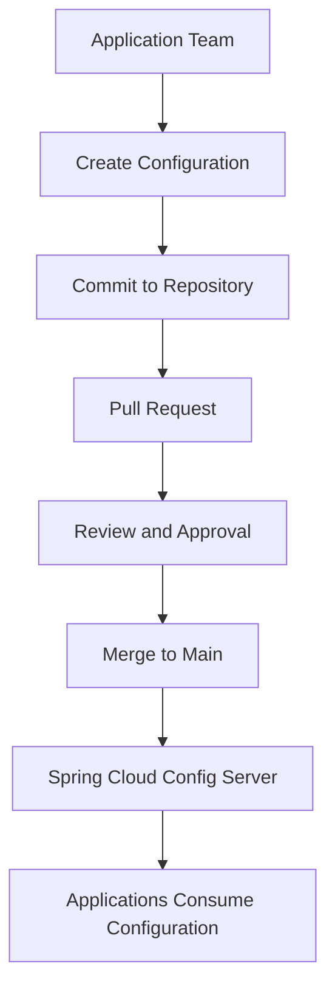

# PRD-001-CONFIG: Configuration Repository Management

---

## 1. Title Page

| Field         | Value                                                      |
| ------------- | ---------------------------------------------------------- |
| Document ID   | PRD-001-CONFIG                                             |
| Project       | StarOne Galaxy                                             |
| Domain        | Platform Configuration Management                          |
| Repository    | starone-central-config                                     |
| Document Type | Product Requirements Document (ISO/IEC/IEEE 29148 aligned) |
| Version       | v1.0                                                       |
| Author        | Sachin Salunke                                             |
| Status        | Draft                                                      |
| Date          | June 2026                                                  |

---

## 2. Revision History

| Version | Date      | Author         | Description     |
| ------- | --------- | -------------- | --------------- |
| v1.0    | June 2026 | Sachin Salunke | Initial Version |

---

## 3. Sign-Off Table

| Role               | Status  |
| ------------------ | ------- |
| Platform Architect | Pending |
| Security Review    | Pending |
| DevOps Governance  | Pending |

---

## 4. Product Overview

The Configuration Repository Management product provides a centralized, Git-backed repository for storing, managing, and governing application configuration data consumed by the Spring Cloud Config Server.

The repository serves as the single source of truth for configuration data across all StarOne Galaxy domains and deployment environments.

The repository provides:

- Centralized configuration management
- Environment-specific configuration isolation
- Shared configuration reuse
- Repository governance and standards
- Security baseline and compliance
- Self-service onboarding capabilities
- Configuration documentation and examples

---

## 5. Product Vision

Provide a scalable, secure, and governed configuration management platform that enables application teams to manage configurations consistently while supporting independent domain evolution and future platform growth.

---

## 6. Product Goals

### PG-01

Provide centralized configuration management.

### PG-02

Provide environment-specific configuration isolation.

### PG-03

Establish standardized configuration structures.

### PG-04

Enable reusable shared configurations.

### PG-05

Provide repository governance and compliance.

### PG-06

Provide secure configuration management practices.

### PG-07

Provide self-service onboarding for application teams.

---

## 7. Product Scope

### In Scope

- Configuration repository structure
- Shared configurations
- Environment configurations
- Application configurations
- Configuration templates
- Configuration examples
- Repository governance
- Repository documentation
- Contribution guidelines
- Onboarding guides
- Security standards
- Pull request templates
- CODEOWNERS configuration

### Out of Scope

- Spring Cloud Config Server implementation
- Infrastructure provisioning
- Kubernetes implementation
- Docker implementation
- Secret management infrastructure
- Runtime configuration refresh mechanisms
- Service implementation
- CI/CD implementation

---

## 8. Target Users

| User              | Responsibilities                        |
| ----------------- | --------------------------------------- |
| Platform Team     | Repository ownership and governance     |
| DevOps Team       | Repository operations and standards     |
| Security Team     | Security and compliance reviews         |
| Application Teams | Configuration management and onboarding |
| DHS Team          | DHS application configurations          |
| Bookshow Team     | Bookshow application configurations     |

---

## 9. Product Features

### PF-01 Centralized Configuration Repository

Provide a single repository for all application configuration data.

---

### PF-02 Environment Configuration Management

Provide isolated configurations for:

- Development
- SIT
- UAT
- Production

---

### PF-03 Shared Configuration Management

Provide reusable configurations for:

- Logging
- Kafka
- Redis
- Common application properties

---

### PF-04 Repository Governance

Provide:

- Contribution guidelines
- Pull request templates
- CODEOWNERS
- Review standards
- Documentation standards

---

### PF-05 Application Onboarding

Provide:

- Onboarding documentation
- Configuration templates
- Configuration examples
- Repository usage guides

---

## 10. Functional Requirements

| ID            | Requirement                                                   |
| ------------- | ------------------------------------------------------------- |
| FR-CONFIG-001 | Repository shall provide centralized configuration management |
| FR-CONFIG-002 | Repository shall support environment-specific configurations  |
| FR-CONFIG-003 | Repository shall support shared configurations                |
| FR-CONFIG-004 | Repository shall provide configuration templates              |
| FR-CONFIG-005 | Repository shall provide onboarding documentation             |
| FR-CONFIG-006 | Repository shall provide contribution guidelines              |
| FR-CONFIG-007 | Repository shall provide governance mechanisms                |
| FR-CONFIG-008 | Repository shall provide configuration examples               |

---

## 11. Non-Functional Requirements

| ID             | Requirement                                                      |
| -------------- | ---------------------------------------------------------------- |
| NFR-CONFIG-001 | Repository shall support version control and auditability        |
| NFR-CONFIG-002 | Repository shall support future domain onboarding                |
| NFR-CONFIG-003 | Repository shall provide secure configuration handling practices |
| NFR-CONFIG-004 | Repository shall maintain standardized structures                |
| NFR-CONFIG-005 | Repository shall provide maintainable documentation              |
| NFR-CONFIG-006 | Repository shall support scalable configuration growth           |

---

## 12. Product Workflow



---

## 13. Repository Structure

```text
starone-central-config
├── shared/
├── environments/
├── applications/
├── templates/
├── examples/
├── docs/
├── .github/
├── README.md
├── CONTRIBUTING.md
└── ONBOARDING.md
```

---

## 14. Deliverables

### Repository Foundation

- Repository structure
- Shared configurations
- Environment configurations
- Application configurations

### Governance Assets

- CODEOWNERS
- Pull request template
- Contribution guidelines

### Documentation Assets

- README
- ONBOARDING
- Configuration guides
- Security guides
- Examples

### Templates

- Service templates
- Environment templates
- Configuration examples

---

## 15. Dependencies

| Dependency ID | Description                               |
| ------------- | ----------------------------------------- |
| DEP-01        | Spring Cloud Config Server implementation |
| DEP-02        | Repository governance standards           |
| DEP-03        | Security standards                        |
| DEP-04        | Platform onboarding standards             |
| DEP-05        | Architecture repository documentation     |

---

## 16. Risks

| Risk                      | Impact | Mitigation                             |
| ------------------------- | ------ | -------------------------------------- |
| Configuration duplication | Medium | Shared configuration patterns          |
| Environment drift         | High   | Standardized environment structures    |
| Governance non-compliance | Medium | Review and approval workflows          |
| Improper onboarding       | Medium | Documentation and templates            |
| Repository misuse         | Medium | Contribution guidelines and onboarding |

---

## 17. Success Metrics

| Metric                              | Target |
| ----------------------------------- | ------ |
| Environment standardization         | 100%   |
| Repository onboarding documentation | 100%   |
| Configuration governance coverage   | 100%   |
| Shared configuration reuse          | >80%   |
| Configuration auditability          | 100%   |

---

## 18. Related Artifacts

- BRD-001-CONFIG Configuration Repository Management
- ADR-001 Repository & Architecture Strategy for StarOne Galaxy
- EPIC-CONFIG-001 Configuration Repository Management
- RTM-001-CONFIG Requirements Traceability Matrix

---

## 19. Product Summary

The Configuration Repository Management product establishes a centralized, governed, and secure Git-backed configuration repository for StarOne Galaxy.

The product enables:

- Standardized configuration management
- Environment isolation
- Configuration reuse
- Governance and compliance
- Self-service onboarding
- Future platform scalability

---
