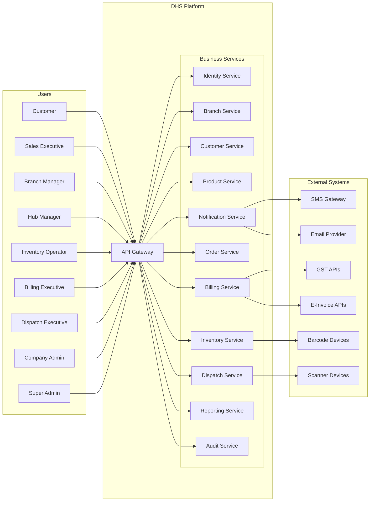
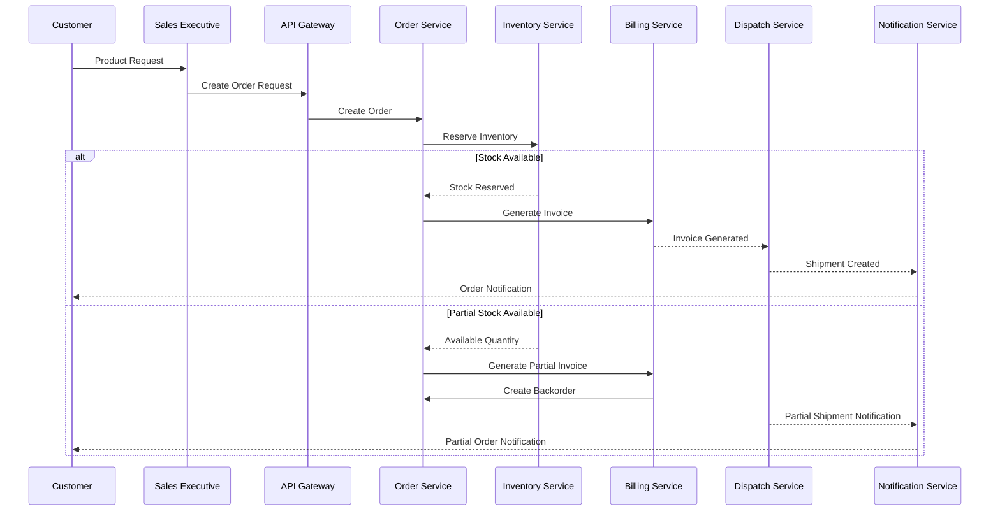
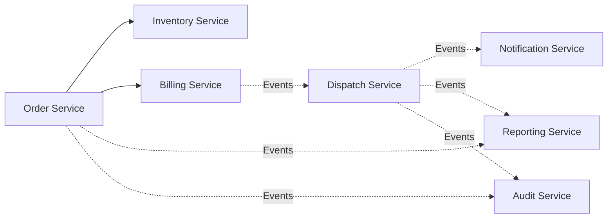
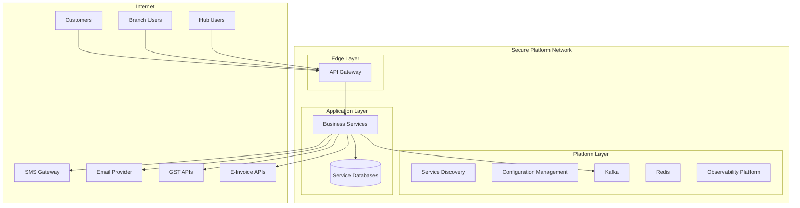

# CONTEXT-001: Distributed Hub and Sales (DHS) System Context

## 1. Title Page

| Field         | Value                                    |
| ------------- | ---------------------------------------- |
| Project Name  | Distributed Hub and Sales (DHS) Platform |
| Document ID   | CONTEXT-001                              |
| Domain        | OMS / Electronic Distribution Platform   |
| Document Type | System Context Document                  |
| Version       | v1.1.0                                   |
| Author        | Sachin Salunke                           |
| Status        | Draft                                    |
| Date          | 2026-06-20                               |

---

# 2. Document Metadata

| Field               | Value                                  |
| ------------------- | -------------------------------------- |
| Document ID         | CONTEXT-001                            |
| Domain              | OMS / Electronic Distribution Platform |
| Document Type       | System Context Document                |
| Version             | v1.1.0                                 |
| Author              | Sachin Salunke                         |
| Status              | Draft                                  |
| Date                | 2026-06-20                             |
| Linked BRD          | BRD-001                                |
| Linked PRD          | PRD-001                                |
| Linked SRS          | SRS-001                                |
| Linked HLD          | HLD-001                                |
| Linked RTM          | RTM-001                                |
| Linked Domain Model | DOMAIN-001                             |
| Linked ADRs         | ADR-001 to ADR-007                     |
| Approval Status     | Pending                                |

---

# 3. Revision History

| Version | Date       | Author         | Description                                                                     |
| ------- | ---------- | -------------- | ------------------------------------------------------------------------------- |
| v1.0.0  | 2026-06-19 | Sachin Salunke | Initial system context definition                                               |
| v1.1.0  | 2026-06-20 | Sachin Salunke | Updated for Cloud-Native Monorepo-Based Multi-Module Microservices Architecture |

---

# 4. References

| Reference ID | Document                                               |
| ------------ | ------------------------------------------------------ |
| BRD-001      | Business Requirements Document                         |
| PRD-001      | Product Requirements Document                          |
| SRS-001      | Software Requirements Specification                    |
| HLD-001      | High-Level Design                                      |
| RTM-001      | Requirements Traceability Matrix                       |
| DOMAIN-001   | Domain Model                                           |
| ADR-001      | Monorepo-Based Multi-Module Microservices Architecture |
| ADR-002      | Database per Service Strategy                          |
| ADR-003      | Hybrid Communication Architecture                      |
| ADR-004      | Service Discovery Architecture                         |
| ADR-005      | API Gateway Strategy                                   |
| ADR-006      | Saga-Based Distributed Transaction Strategy            |
| ADR-007      | Security Architecture                                  |

---

# 5. Sign-Off Table

| Role                 | Name           | Status  |
| -------------------- | -------------- | ------- |
| Product Owner        | Sachin Salunke | Pending |
| Enterprise Architect | Sachin Salunke | Pending |
| Solution Architect   | Sachin Salunke | Pending |
| Technical Lead       | TBD            | Pending |
| Security Lead        | TBD            | Pending |
| Platform Lead        | TBD            | Pending |

---

# 6. Purpose

This document defines the external environment, users, integrations, communication channels, trust boundaries, and platform context of the Distributed Hub and Sales (DHS) Platform.

Objectives:

* Define system boundaries
* Identify actors and external systems
* Define inbound and outbound integrations
* Define platform services
* Establish trust boundaries
* Identify communication channels
* Establish architecture baseline
* Establish integration boundaries
* Establish operational context for downstream design activities

---

# 7. System Vision

The Distributed Hub and Sales (DHS) Platform is a cloud-native Order Management System designed for electronic distribution businesses operating through one central hub and multiple branches.

The platform follows a:

```text
Cloud-Native
+
Monorepo
+
Multi-Module Maven
+
Microservices
+
API Gateway
+
Service Discovery
+
Database per Service
+
OpenFeign
+
Kafka
+
Independent Deployments
```

The platform provides:

* Centralized order management
* Real-time inventory visibility
* Billing and dispatch operations
* Customer order tracking
* Event-driven workflows
* Operational reporting
* Audit and compliance capabilities
* Distributed observability
* Service autonomy
* Independent deployments

---

# 8. Business Context

```text
Electronic Distribution Company
        |
        |--- Central Hub
        |
        |--- Multiple Branches
        |
        |--- Customers
```

The Central Hub acts as the operational control center for:

* Inventory
* Order Fulfillment
* Billing
* Dispatch
* Reporting
* System Administration
* Platform Operations

Branches act as customer engagement and sales centers.

Customers can:

* Request products
* View order status
* Track shipments
* Receive notifications

---

# 9. System Boundary

```mermaid
flowchart TB

subgraph External World
CUSTOMER[Customer]
BRANCH[Branch Users]
HUB[Hub Users]

SMS[SMS Gateway]
EMAIL[Email Provider]
GST[GST API]
EINV[E-Invoice API]

BARCODE[Barcode Devices]
SCANNER[Scanner Devices]
end

subgraph DHS Platform

GATEWAY[API Gateway]

subgraph Platform Services
EUREKA[Service Discovery]
CONFIG[Configuration Management]
KAFKA[Kafka]
REDIS[Redis]
OBS[Observability Platform]
end

subgraph Business Services
IAM[Identity Service]
BRANCH_SVC[Branch Service]
CUSTOMER_SVC[Customer Service]
PRODUCT_SVC[Product Service]
INVENTORY_SVC[Inventory Service]
ORDER_SVC[Order Service]
BILLING_SVC[Billing Service]
DISPATCH_SVC[Dispatch Service]
NOTIFICATION_SVC[Notification Service]
REPORTING_SVC[Reporting Service]
AUDIT_SVC[Audit Service]
end

end

CUSTOMER --> GATEWAY
BRANCH --> GATEWAY
HUB --> GATEWAY

GATEWAY --> EUREKA
GATEWAY --> IAM
GATEWAY --> BRANCH_SVC
GATEWAY --> CUSTOMER_SVC
GATEWAY --> PRODUCT_SVC
GATEWAY --> INVENTORY_SVC
GATEWAY --> ORDER_SVC
GATEWAY --> BILLING_SVC
GATEWAY --> DISPATCH_SVC
GATEWAY --> NOTIFICATION_SVC
GATEWAY --> REPORTING_SVC
GATEWAY --> AUDIT_SVC

NOTIFICATION_SVC --> SMS
NOTIFICATION_SVC --> EMAIL
BILLING_SVC --> GST
BILLING_SVC --> EINV

INVENTORY_SVC --> BARCODE
DISPATCH_SVC --> SCANNER
```



---

# 10. Primary Actors

## Customer

Responsibilities:

* Submit product requests
* View order status
* View shipment status
* Receive notifications

Permissions:

* View own requests
* View own orders
* View own invoices
* View shipment status

---

## Sales Executive

Responsibilities:

* Customer interactions
* Customer onboarding
* Order creation
* Order tracking

---

## Inventory Operator

Responsibilities:

* Inventory updates
* Stock reservations
* Stock movements
* Barcode operations

---

## Billing Executive

Responsibilities:

* Invoice generation
* Partial billing management
* Tax processing
* Invoice adjustments

---

## Dispatch Executive

Responsibilities:

* Shipment processing
* Delivery management
* Shipment tracking

---

## Branch Manager

Responsibilities:

* Branch operations management
* Order monitoring
* Customer oversight
* Inventory visibility

---

## Hub Manager

Responsibilities:

* Central operations
* Inventory monitoring
* Billing oversight
* Dispatch oversight
* Reporting oversight

---

## Company Admin

Responsibilities:

* Business administration
* System configuration
* User administration
* Operational visibility
* Platform governance

---

## Super Admin

Responsibilities:

* Platform governance
* Security administration
* User management
* Role management
* Permission management
* Audit management

---

# 11. External Systems and Integrations

## SMS Gateway

Purpose:

* Order notifications
* Shipment notifications
* OTP delivery

Communication:

```text
Protocol : HTTPS REST API
Direction : Outbound
Pattern   : Synchronous
Security  : API Keys + TLS 1.3
```

---

## Email Provider

Purpose:

* Invoice notifications
* Shipment updates
* Operational communications

Communication:

```text
Protocol : HTTPS REST API
Direction : Outbound
Pattern   : Synchronous
Security  : API Keys + TLS 1.3
```

---

## GST APIs

Purpose:

* GST validations
* Tax calculations
* Invoice verification

Communication:

```text
Protocol : HTTPS REST API
Direction : Outbound
Pattern   : Synchronous
Security  : Certificates + TLS 1.3
```

---

## E-Invoice APIs

Purpose:

* Invoice registration
* E-Invoice generation
* Invoice verification

Communication:

```text
Protocol : HTTPS REST API
Direction : Outbound
Pattern   : Synchronous
Security  : Certificates + TLS 1.3
```

---

## Barcode Devices

Purpose:

* Product scanning
* Inventory operations
* Stock identification

Communication:

```text
Protocol : Device Integration
Direction : Bidirectional
Pattern   : Real-Time
```

---

## Scanner Devices

Purpose:

* Shipment scanning
* Stock verification
* Dispatch operations

Communication:

```text
Protocol : Device Integration
Direction : Bidirectional
Pattern   : Real-Time
```

---

## Platform Services

### API Gateway

Responsibilities:

* Single entry point
* Authentication
* Authorization
* Routing
* Rate limiting
* Observability

---

### Service Discovery

Responsibilities:

* Dynamic service registration
* Dynamic service discovery
* Service health management
* Runtime resolution

---

### Configuration Management

Responsibilities:

* Centralized configuration
* Environment configuration
* Secret management
* Configuration versioning

---

### Kafka

Responsibilities:

* Event-driven communication
* Saga coordination
* Event streaming
* Decoupled integrations

---

### Redis

Responsibilities:

* Caching
* Performance optimization
* Temporary data storage
* Session support

---

### Observability Platform

Responsibilities:

* Distributed tracing
* Metrics collection
* Structured logging
* Monitoring dashboards
* Alerting

# 12. High-Level Interaction Diagram



---

# 13. Order Processing Context



---

# 14. Service-to-Service Communication Context

The DHS Platform uses a hybrid communication model.

## Synchronous Communication

Used for:

* Authentication
* Inventory Validation
* Customer Validation
* Product Lookup
* Search Operations
* Master Data Queries

Technologies:

```text
REST APIs
OpenFeign
Service Discovery
```

---

## Asynchronous Communication

Used for:

* Order Events
* Billing Events
* Dispatch Events
* Notifications
* Reporting
* Audit Logging
* Saga Coordination

Technologies:

```text
Apache Kafka
Domain Events
Consumer Groups
Dead Letter Topics
```

---

## Service Communication Flow



---

# 15. Trust Boundaries



---

# 16. Communication Matrix

| Source               | Target            | Protocol       | Pattern      |
| -------------------- | ----------------- | -------------- | ------------ |
| Customers            | API Gateway       | HTTPS          | Synchronous  |
| Branch Users         | API Gateway       | HTTPS          | Synchronous  |
| Hub Users            | API Gateway       | HTTPS          | Synchronous  |
| API Gateway          | Business Services | HTTPS          | Synchronous  |
| Business Services    | Business Services | REST/OpenFeign | Synchronous  |
| Business Services    | Kafka             | Kafka Protocol | Asynchronous |
| Business Services    | Service Databases | JDBC           | Synchronous  |
| Notification Service | SMS Gateway       | HTTPS          | Synchronous  |
| Notification Service | Email Provider    | HTTPS          | Synchronous  |
| Billing Service      | GST APIs          | HTTPS          | Synchronous  |
| Billing Service      | E-Invoice APIs    | HTTPS          | Synchronous  |
| Inventory Service    | Barcode Devices   | Device API     | Real-Time    |
| Dispatch Service     | Scanner Devices   | Device API     | Real-Time    |

---

# 17. Context Assumptions

* Stable internet connectivity across branches.
* Third-party providers maintain SLA commitments.
* Barcode devices support standard protocols.
* Scanner devices support real-time integrations.
* Kafka cluster remains highly available.
* Service Discovery remains continuously available.
* Configuration services remain accessible.
* Service databases remain independently available.
* Platform observability components remain operational.
* Customers access the platform through secured channels.

---

# 18. Context Constraints

* Single centralized hub architecture.
* Regulatory compliance requirements.
* Dependence on third-party integrations.
* Multi-branch operational support requirements.
* Distributed system complexity.
* Eventual consistency across business workflows.
* Independent database management requirements.
* Service-to-service security requirements.
* Future scalability and extensibility requirements.

---

# 19. Success Criteria

* Clearly defined system boundary.
* Clearly identified actors and integrations.
* Clearly defined trust boundaries.
* Clearly defined communication channels.
* Clearly defined platform services.
* Clearly defined integration responsibilities.
* Established foundation for ADRs.
* Established foundation for HLD and LLD.
* Established foundation for implementation repositories.
* Established foundation for operational architecture.

---

# 20. Future Expansion

The context model supports future integrations including:

* ERP Systems
* SAP Integrations
* Payment Gateways
* Supplier Portals
* Marketplace Integrations
* Warehouse Management Systems
* Mobile Applications
* Customer Self-Service Portal
* Partner APIs
* Business Intelligence Platforms
* Data Warehouse Platforms
* Machine Learning Services

---
