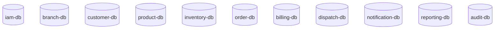

# ADR-002: Adopt Database per Service Strategy for DHS Platform

---

# 1. Document Information

| Field         | Value                                                |
| ------------- | ---------------------------------------------------- |
| ADR ID        | ADR-002                                              |
| Title         | Adopt Database per Service Strategy for DHS Platform |
| Date          | 2026-06-20                                           |
| Status        | Accepted                                             |
| Author        | Sachin Salunke                                       |
| Domain        | OMS / Electronic Distribution Platform               |
| Decision Type | Architecture Decision Record                         |

---

# 2. Context & Problem Statement

The Distributed Hub and Sales (DHS) Platform follows a Cloud-Native Monorepo-Based Multi-Module Microservices Architecture composed of independently deployable business services.

The platform consists of the following services:

- Identity Service
- Branch Service
- Customer Service
- Product Service
- Inventory Service
- Order Service
- Billing Service
- Dispatch Service
- Notification Service
- Reporting Service
- Audit Service

The platform requires:

- Clear domain ownership
- Data isolation
- Service autonomy
- Independent deployment
- Independent schema evolution
- Reduced coupling
- High maintainability
- Event-driven communication
- Future scalability

A database strategy is required that preserves service boundaries and prevents services from directly manipulating data owned by other services.

---

# 3. Decision Drivers

## Business Drivers

- Single source of truth
- High maintainability
- Business domain ownership
- Future scalability
- Lower operational risks
- Independent service evolution

---

## Technical Drivers

- Service isolation
- Loose coupling
- Independent deployment
- Service autonomy
- Independent schema evolution
- Event-driven integration
- Auditability
- Data ownership

---

## Operational Drivers

- Easier maintenance
- Easier troubleshooting
- Reduced data corruption risks
- Independent deployments
- Better observability
- Service resilience

---

# 4. Considered Options

---

## Option 1: Shared Database with Shared Tables

### Description

All services share the same schema and directly access each other's tables.

### Advantages

- Simple initial implementation
- Easier reporting queries
- Lower initial design effort

### Disadvantages

- Tight coupling
- Data ownership violations
- Difficult schema evolution
- Independent deployments become difficult
- High regression risks
- Service autonomy violations

---

## Option 2: Single Database with Multiple Schemas

### Description

All services use a single PostgreSQL cluster with logically separated schemas.

### Advantages

- Lower infrastructure cost
- Logical separation
- Easier administration

### Disadvantages

- Shared infrastructure dependency
- Potential ownership violations
- Reduced service isolation
- Infrastructure coupling
- Independent database scaling limitations

---

## Option 3: Database per Service (Chosen)

### Description

Each business service owns its own database and exclusively manages its data.

### Advantages

- Strong service isolation
- Independent deployments
- Independent scalability
- Service autonomy
- Clear ownership boundaries
- Independent schema evolution
- Better resilience
- Better fault isolation

### Disadvantages

- Distributed transactions
- Operational complexity
- Increased infrastructure requirements
- More complex reporting

---

# 5. Decision

The DHS Platform shall adopt a:

# Database per Service Strategy

Implementation model:

```text
Business Service
        ↓
Dedicated Database
        ↓
Exclusive Data Ownership
        ↓
No Direct Database Sharing
```

---

# 6. Database Architecture



---

# 7. Database Ownership

| Service              | Database        |
| -------------------- | --------------- |
| Identity Service     | iam-db          |
| Branch Service       | branch-db       |
| Customer Service     | customer-db     |
| Product Service      | product-db      |
| Inventory Service    | inventory-db    |
| Order Service        | order-db        |
| Billing Service      | billing-db      |
| Dispatch Service     | dispatch-db     |
| Notification Service | notification-db |
| Reporting Service    | reporting-db    |
| Audit Service        | audit-db        |

---

# 8. Ownership Principles

## DP-001

Every database has a single owner.

---

## DP-002

Services may only access their own database.

---

## DP-003

Services shall never directly query or update another service's database.

---

## DP-004

Cross-service interactions shall occur through:

- REST APIs
- OpenFeign clients
- Domain events
- Public service contracts

---

## DP-005

Reporting data shall be built using projections and read models.

---

# 9. Data Access Rules

## Allowed

```text
Order Service
      ↓
Inventory Service API
      ↓
Inventory Response
```

---

## Not Allowed

```text
Order Service
      ↓
inventory-db.stock
      ↓
Direct SQL Access
```

---

# 10. Example Data Ownership

## Identity Service

Owns:

```text
users
roles
permissions
user_roles
role_permissions
sessions
```

---

## Branch Service

Owns:

```text
branches
branch_addresses
branch_configurations
branch_contacts
```

---

## Customer Service

Owns:

```text
customers
customer_addresses
customer_contacts
customer_preferences
```

---

## Product Service

Owns:

```text
products
categories
product_prices
product_attributes
product_images
```

---

## Inventory Service

Owns:

```text
inventory_items
stock_movements
reservations
adjustments
barcodes
```

---

## Order Service

Owns:

```text
orders
order_items
order_statuses
back_orders
back_order_items
```

---

## Billing Service

Owns:

```text
invoices
invoice_items
taxes
partial_invoices
```

---

## Dispatch Service

Owns:

```text
shipments
shipment_items
shipment_tracking
delivery_confirmations
```

---

## Notification Service

Owns:

```text
notifications
email_notifications
sms_notifications
notification_templates
```

---

## Reporting Service

Owns:

```text
dashboards
reports
metrics
kpis
```

---

## Audit Service

Owns:

```text
audit_logs
audit_events
compliance_records
```

---

# 11. Transaction Strategy

## Within a Service

Transaction Type:

```text
ACID Transactions
```

Characteristics:

- Strong consistency
- Single transaction boundary
- Immediate commits
- Rollback support

---

## Across Services

Transaction Type:

```text
Eventually Consistent
Saga Pattern
Compensating Actions
```

Characteristics:

- Loose coupling
- Independent processing
- Failure recovery
- Service autonomy

---

# 12. Data Integration Strategy

## Synchronous Communication

Used For:

- Authentication
- Validation
- Master Data Queries
- Search Operations

Technology:

```text
REST APIs
OpenFeign
```

---

## Asynchronous Synchronization

Used For:

- Order Events
- Inventory Events
- Billing Events
- Dispatch Events
- Notifications
- Reporting Projections
- Audit Events

Technology:

```text
Apache Kafka
Domain Events
```

---

# 13. Security Implications

## Advantages

- Controlled data access
- Easier auditing
- Clear ownership boundaries
- Reduced accidental data corruption
- Better fault isolation

---

## Risks

- Distributed transaction complexity
- Infrastructure overhead
- Data synchronization complexity

---

## Mitigations

- Saga pattern
- Compensating transactions
- Event-driven synchronization
- Service contracts
- Automated integration tests

---

# 14. Operational Considerations

## Backup Strategy

- Daily backups
- Point-in-time recovery
- Service-level restoration procedures

---

## Monitoring

Monitor:

- Database health
- Connection pools
- Query performance
- Storage utilization
- Replication health
- Migration status

---

## Performance Strategy

- Service-level indexing
- Redis caching
- Query optimization
- Connection pooling
- Read models
- Projections

---

# 15. Consequences

## Positive Consequences

- Strong service ownership
- Reduced coupling
- Independent deployments
- Easier maintenance
- Easier debugging
- Better resilience
- Better scalability
- Improved governance

---

## Negative Consequences

- Distributed transaction complexity
- Increased operational overhead
- More complex reporting requirements

---

# 16. Decision Outcome

Status:

```text
ACCEPTED
```

Decision:

```text
DHS shall use a Database per Service strategy.
Each business service owns its own database and
shall never directly access another service's data.
Cross-service interactions shall occur only through
APIs and events.
```

---

# 17. Related Documents

- BRD-001
- PRD-001
- SRS-001
- HLD-001
- ADR-001 Monorepo-Based Multi-Module Microservices Architecture
- ADR-003 Communication Strategy
- ADR-004 Service Discovery Strategy
- ADR-005 API Gateway Strategy
- ADR-006 Distributed Transaction Strategy

---
