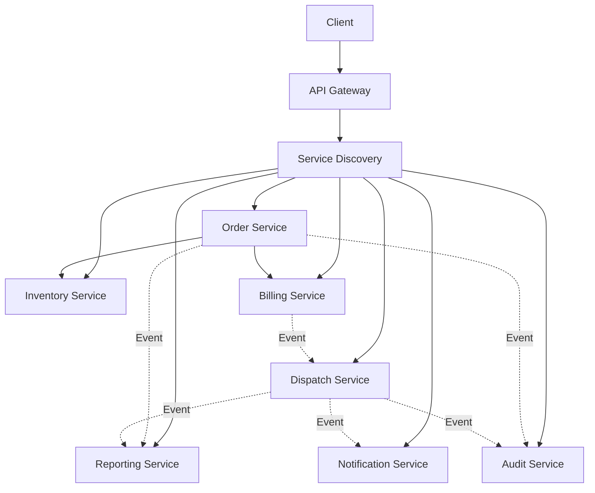
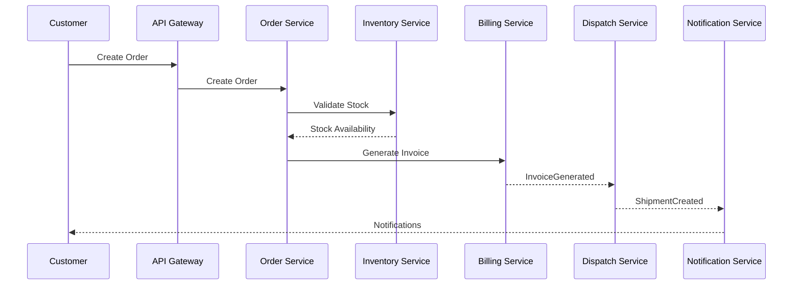
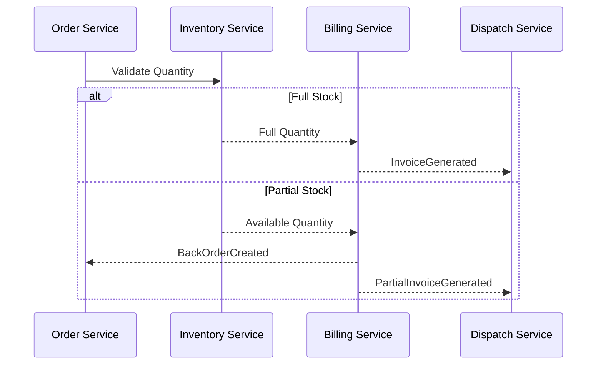

# ADR-003: Adopt Hybrid Communication Architecture for DHS Platform

---

# 1. Document Information

| Field         | Value                                                    |
| ------------- | -------------------------------------------------------- |
| ADR ID        | ADR-003                                                  |
| Title         | Adopt Hybrid Communication Architecture for DHS Platform |
| Date          | 2026-06-20                                               |
| Status        | Accepted                                                 |
| Author        | Sachin Salunke                                           |
| Domain        | OMS / Electronic Distribution Platform                   |
| Decision Type | Architecture Decision Record                             |

---

# 2. Context & Problem Statement

The Distributed Hub and Sales (DHS) Platform follows a Cloud-Native Monorepo-Based Multi-Module Microservices Architecture composed of independently deployable business services.

The platform supports:

- Customer order requests
- Inventory management
- Order processing
- Billing and partial billing
- Dispatch operations
- Notifications
- Reporting and analytics
- Audit and compliance

The system requires communication mechanisms that provide:

- Low latency for request-response interactions
- Loose coupling between services
- Scalability
- Failure isolation
- Independent deployments
- Real-time event propagation
- Resilient distributed workflows

A single communication model cannot satisfy all business and technical requirements.

---

# 3. Decision Drivers

## Business Drivers

- Real-time business operations
- Faster order processing
- Better user experience
- Reliable notifications
- Business scalability

---

## Technical Drivers

- Service isolation
- Reduced coupling
- Event-driven workflows
- Failure recovery
- Maintainability
- Independent deployment
- Distributed communication

---

## Operational Drivers

- Easier troubleshooting
- Better observability
- Failure isolation
- Operational resilience
- Platform standardization

---

# 4. Considered Options

---

## Option 1: REST Only

### Description

All services communicate exclusively through synchronous APIs.

### Advantages

- Simple implementation
- Easy debugging
- Easy monitoring

### Disadvantages

- Tight runtime coupling
- Cascading failures
- Poor scalability
- Increased latency
- No event-driven workflows

---

## Option 2: Messaging Only

### Description

All services communicate exclusively through events.

### Advantages

- Loose coupling
- Better scalability
- Failure isolation

### Disadvantages

- Complex workflows
- Eventual consistency
- Difficult debugging
- Increased operational complexity

---

## Option 3: Hybrid Communication Model (Chosen)

### Description

Services communicate using both synchronous APIs and asynchronous events.

### Advantages

- Low latency where required
- Loose coupling where beneficial
- Better scalability
- Improved reliability
- Event-driven workflows
- Failure isolation
- Independent deployments

### Disadvantages

- Requires communication standards
- Additional governance
- Increased observability requirements

---

# 5. Decision

The DHS Platform shall adopt a:

# Hybrid Communication Architecture

Communication Model:

```text
Synchronous Communication
        +
Asynchronous Communication
```

Technologies:

```text
Spring Cloud Gateway
Netflix Eureka
REST APIs
OpenFeign
Apache Kafka
```

---

# 6. Architecture Overview



---

# 7. Communication Principles

## CP-001

Communication shall be API-first.

---

## CP-002

Synchronous communication shall be used only when immediate responses are required.

---

## CP-003

Asynchronous communication shall be preferred for business workflows and integrations.

---

## CP-004

Services shall never directly access another service's database.

---

## CP-005

Services shall communicate only through:

- Public APIs
- Domain Events
- Message Consumers

---

## CP-006

All service communication shall be observable and traceable.

---

# 8. Synchronous Communication Strategy

## Technologies

- Spring Cloud Gateway
- Netflix Eureka
- REST APIs
- OpenFeign
- OpenAPI Specifications

---

## Usage Guidelines

### Authentication

```text
Gateway
    ↓
Identity Service
    ↓
JWT Validation
```

---

### Master Data Lookup

```text
Order Service
      ↓
Customer Service
```

---

### Inventory Validation

```text
Order Service
      ↓
Inventory Service
```

---

### Search Operations

```text
Dashboard
      ↓
Reporting Service
```

---

## Characteristics

| Property    | Value            |
| ----------- | ---------------- |
| Pattern     | Request-Response |
| Latency     | Low              |
| Consistency | Strong           |
| Coupling    | Medium           |
| Reliability | High             |

---

# 9. Asynchronous Communication Strategy

## Technologies

- Apache Kafka
- Domain Events
- Consumer Groups
- Dead Letter Topics

---

## Order Events

```text
OrderCreated
OrderUpdated
OrderCancelled
BackOrderCreated
```

---

## Inventory Events

```text
StockReserved
StockAdjusted
StockReleased
InventoryUpdated
```

---

## Billing Events

```text
InvoiceGenerated
PartialInvoiceGenerated
InvoiceCancelled
```

---

## Dispatch Events

```text
ShipmentCreated
ShipmentDispatched
ShipmentDelivered
```

---

## Notification Events

```text
NotificationSent
EmailDelivered
SMSDelivered
```

---

## Audit Events

```text
AuditRecorded
SecurityViolationDetected
```

---

## Characteristics

| Property    | Value             |
| ----------- | ----------------- |
| Pattern     | Publish-Subscribe |
| Latency     | Near Real-Time    |
| Consistency | Eventual          |
| Coupling    | Low               |
| Reliability | High              |

---

# 10. Communication Matrix

| Source           | Target               | Type  |
| ---------------- | -------------------- | ----- |
| Gateway          | Identity Service     | REST  |
| Order Service    | Inventory Service    | REST  |
| Order Service    | Customer Service     | REST  |
| Order Service    | Billing Service      | REST  |
| Billing Service  | Dispatch Service     | Event |
| Dispatch Service | Notification Service | Event |
| Order Service    | Reporting Service    | Event |
| Billing Service  | Reporting Service    | Event |
| Dispatch Service | Reporting Service    | Event |
| All Services     | Audit Service        | Event |

---

# 11. Order Processing Flow



---

# 12. Partial Billing Flow



---

# 13. Event Publishing Rules

## Rule 1

Events represent business facts.

---

## Rule 2

Events are immutable.

---

## Rule 3

Events shall contain:

```json
{
  "eventId": "UUID",
  "eventType": "OrderCreated",
  "aggregateId": "UUID",
  "occurredAt": "timestamp",
  "correlationId": "UUID",
  "version": 1,
  "payload": {}
}
```

---

## Rule 4

Event consumers must be idempotent.

---

## Rule 5

Events must be versioned.

---

# 14. Failure Handling Strategy

## REST Failures

Mechanisms:

- Retry
- Timeout
- Circuit Breakers
- Fallback Responses

---

## Event Failures

Mechanisms:

- Retry Policies
- Dead Letter Topics
- Event Replay
- Consumer Recovery

---

# 15. Security Considerations

## REST Communication

- JWT Authentication
- RBAC Authorization
- TLS 1.3
- Input Validation
- Service-to-Service JWT Propagation

---

## Event Communication

- Encrypted Communication
- Event Validation
- Access Control
- Audit Logging

---

# 16. Observability

Communication Metrics:

- Request Latency
- Error Rates
- Throughput
- Event Processing Time
- Consumer Lag
- Dead Letter Events

Technology:

```text
Micrometer
OpenTelemetry
Prometheus
Grafana
Structured Logging
Correlation IDs
Distributed Tracing
```

---

# 17. Consequences

## Positive Consequences

- Low latency interactions
- Event-driven workflows
- Reduced coupling
- Better scalability
- Failure isolation
- Independent deployments
- Better observability

## Negative Consequences

- Increased operational complexity
- More communication patterns
- Event monitoring complexity
- Additional governance requirements

---

# 18. Decision Outcome

Status:

```text
ACCEPTED
```

Decision:

```text
DHS shall adopt a Hybrid Communication Architecture
using REST and OpenFeign for synchronous service
communication and Apache Kafka for asynchronous
event-driven workflows and integrations.
```

---

# 19. Related Documents

- BRD-001
- PRD-001
- SRS-001
- HLD-001
- ADR-001 Monorepo-Based Multi-Module Microservices Architecture
- ADR-002 Database per Service Strategy
- ADR-004 Service Discovery Strategy
- ADR-005 API Gateway Strategy
- ADR-006 Distributed Transaction Strategy

---
