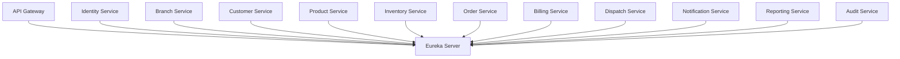

# ADR-004: Adopt Service Discovery Architecture for DHS Platform

---

# 1. Document Information

| Field         | Value                                                 |
| ------------- | ----------------------------------------------------- |
| ADR ID        | ADR-004                                               |
| Title         | Adopt Service Discovery Architecture for DHS Platform |
| Date          | 2026-06-20                                            |
| Status        | Accepted                                              |
| Author        | Sachin Salunke                                        |
| Domain        | OMS / Electronic Distribution Platform                |
| Decision Type | Architecture Decision Record                          |

---

# 2. Context & Problem Statement

The Distributed Hub and Sales (DHS) Platform follows a Cloud-Native Monorepo-Based Multi-Module Microservices Architecture composed of independently deployable business services.

The platform consists of:

* API Gateway
* Identity Service
* Branch Service
* Customer Service
* Product Service
* Inventory Service
* Order Service
* Billing Service
* Dispatch Service
* Notification Service
* Reporting Service
* Audit Service

The system requires:

* Dynamic service registration
* Dynamic service discovery
* Independent deployments
* Horizontal scalability
* Failure isolation
* Load balancing
* Simplified service communication
* Runtime service resolution

Hardcoded service endpoints would introduce operational complexity and tightly couple services.

---

# 3. Decision Drivers

## Business Drivers

* Continuous availability
* Faster deployments
* Future scalability
* Operational simplicity

---

## Technical Drivers

* Independent deployments
* Dynamic service resolution
* Service scaling
* Reduced configuration complexity
* Runtime discovery

---

## Operational Drivers

* Easier deployments
* Reduced maintenance overhead
* Better resiliency
* Simplified operations

---

# 4. Considered Options

---

## Option 1: Static Configuration

### Description

All service endpoints are maintained using fixed URLs.

### Advantages

* Simple implementation
* Easy to understand

### Disadvantages

* Tight coupling
* Difficult scaling
* Operational overhead
* Manual configuration changes
* Poor resiliency

---

## Option 2: Kubernetes DNS Only

### Description

Services communicate using Kubernetes Service DNS names.

### Advantages

* Native Kubernetes support
* Reduced infrastructure components

### Disadvantages

* Limited service metadata
* Limited client-side discovery capabilities
* Tightly coupled to Kubernetes

---

## Option 3: Service Registry (Chosen)

### Description

Services dynamically register themselves with a central registry and discover other services at runtime.

### Advantages

* Dynamic discovery
* Independent deployments
* Runtime resolution
* Horizontal scalability
* Better resiliency
* Simplified communication

### Disadvantages

* Additional infrastructure component
* Registry availability requirements
* Additional operational monitoring

---

# 5. Decision

The DHS Platform shall adopt:

# Service Registry and Discovery Architecture

Implementation:

```text id="vjlwm2"
Service Startup
        ↓
Register with Eureka
        ↓
Registry Maintains Metadata
        ↓
Services Discover Each Other
        ↓
Communication Established
```

Technology:

```text id="jlwm23"
Netflix Eureka
Spring Cloud LoadBalancer
OpenFeign
```

---

# 6. Architecture Overview



---

# 7. Service Discovery Principles

## SDP-001

All business services shall register with Eureka during startup.

---

## SDP-002

Services shall communicate using logical service names.

---

## SDP-003

Services shall not use hardcoded IP addresses.

---

## SDP-004

Services shall support dynamic registration and deregistration.

---

## SDP-005

Service communication shall occur through service discovery.

---

## SDP-006

Service health shall determine service availability.

---

# 8. Registration Flow

```text id="jlwm25"
Service Startup
       ↓
Register with Eureka
       ↓
Heartbeat Updates
       ↓
Service Available
```

---

# 9. Discovery Flow

```text id="jlwm26"
Calling Service
       ↓
Query Eureka
       ↓
Resolve Target Service
       ↓
Load Balancer Selection
       ↓
Invoke Service
```

---

# 10. Communication Examples

## OpenFeign

```text id="jlwm27"
Order Service
      ↓
inventory-service
      ↓
Inventory Service
```

---

## Gateway Routing

```text id="jlwm28"
Client
   ↓
API Gateway
   ↓
order-service
   ↓
Order Service
```

---

# 11. Health Management

Services shall expose:

* Liveness endpoint
* Readiness endpoint
* Health endpoint
* Metrics endpoint

---

# 12. Failure Handling

## Registry Failure

Mechanisms:

* Client cache
* Retry policies
* Graceful degradation

---

## Service Failure

Mechanisms:

* Heartbeat expiration
* Automatic deregistration
* Retry policies
* Circuit breakers

---

# 13. Security Considerations

* TLS communication
* Service registration authentication
* Gateway authorization
* JWT propagation
* Audit logging

---

# 14. Observability

Metrics:

* Registered services
* Healthy instances
* Failed registrations
* Registry response times
* Discovery failures
* Service availability

Technology:

```text id="jlwm29"
Micrometer
Prometheus
Grafana
Structured Logging
Distributed Tracing
```

---

# 15. Consequences

## Positive Consequences

* Dynamic service discovery
* Independent deployments
* Horizontal scalability
* Better resiliency
* Simplified communication
* Reduced configuration management

## Negative Consequences

* Additional infrastructure component
* Registry availability requirements
* Additional monitoring requirements

---

# 16. Decision Outcome

Status:

```text id="jlwm30"
ACCEPTED
```

Decision:

```text id="jlwm31"
DHS shall use Netflix Eureka as the service
registry and discovery mechanism. All services
shall dynamically register and discover other
services using logical service identifiers.
```

---

# 17. Related Documents

* BRD-001
* PRD-001
* SRS-001
* HLD-001
* ADR-001 Monorepo-Based Multi-Module Microservices Architecture
* ADR-002 Database per Service Strategy
* ADR-003 Hybrid Communication Architecture
* ADR-005 API Gateway Strategy
* ADR-006 Distributed Transaction Strategy

---

# Document Location

```text id="jlwm32"
starone-galaxy-architecture/
└── architecture/
    └── platform/
        └── dhs/
            └── adr/
                └── ADR-004-Service-Discovery-Architecture.md
```
