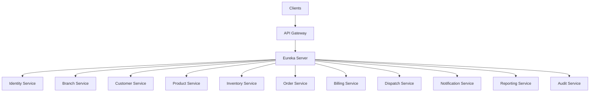
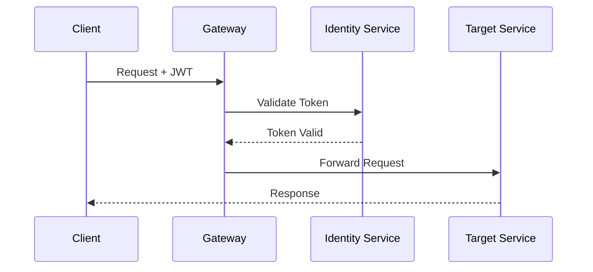

# ADR-005: Adopt API Gateway Strategy for DHS Platform

---

# 1. Document Information

| Field         | Value                                       |
| ------------- | ------------------------------------------- |
| ADR ID        | ADR-005                                     |
| Title         | Adopt API Gateway Strategy for DHS Platform |
| Date          | 2026-06-20                                  |
| Status        | Accepted                                    |
| Author        | Sachin Salunke                              |
| Domain        | OMS / Electronic Distribution Platform      |
| Decision Type | Architecture Decision Record                |

---

# 2. Context & Problem Statement

The Distributed Hub and Sales (DHS) Platform follows a Cloud-Native Monorepo-Based Multi-Module Microservices Architecture composed of independently deployable business services.

The platform consists of:

* Identity Service
* Branch Service
* Customer Service
* Product Service
* Inventory Service
* Order Service
* Billing Service
* Dispatch Service
* Notification Service
* Reporting Service
* Audit Service

The system requires:

* Centralized API access
* Authentication and authorization enforcement
* Unified routing mechanism
* Service abstraction
* Request filtering
* Rate limiting
* API versioning
* Observability
* Security controls

Direct client-to-service communication would expose internal services, increase coupling, and duplicate security and operational concerns across all services.

---

# 3. Decision Drivers

## Business Drivers

* Simplified client integrations
* Improved security
* Centralized governance
* Better operational visibility
* Future scalability

---

## Technical Drivers

* Service abstraction
* Centralized security
* Centralized routing
* Reduced duplication
* Better observability
* Independent deployments
* API versioning support

---

## Operational Drivers

* Easier monitoring
* Easier troubleshooting
* Centralized policy management
* Simplified maintenance
* Reduced operational risks

---

# 4. Considered Options

---

## Option 1: Direct Client-to-Service Communication

### Description

Clients communicate directly with every service.

### Advantages

* Simple implementation
* Lower infrastructure requirements

### Disadvantages

* Service exposure
* Duplicated security
* Complex client integrations
* Difficult monitoring
* Tight client coupling
* Increased maintenance effort

---

## Option 2: Reverse Proxy

### Description

A reverse proxy forwards requests to backend services.

### Advantages

* Centralized entry point
* Simplified routing

### Disadvantages

* Limited API capabilities
* Limited security features
* Limited observability
* No service discovery integration

---

## Option 3: API Gateway (Chosen)

### Description

All client traffic enters through a dedicated API Gateway that performs routing, filtering, security, and observability responsibilities.

### Advantages

* Single entry point
* Centralized security
* Dynamic routing
* Service abstraction
* Better observability
* Rate limiting
* API versioning
* Service discovery integration

### Disadvantages

* Additional infrastructure component
* Potential bottleneck
* Additional operational monitoring

---

# 5. Decision

The DHS Platform shall adopt:

# API Gateway Architecture

Implementation:

```text id="jlwm34"
Client
    ↓
API Gateway
    ↓
Service Discovery
    ↓
Business Services
```

Technology:

```text id="jlwm35"
Spring Cloud Gateway
Netflix Eureka
Spring Security
JWT
```

---

# 6. Architecture Overview



---

# 7. Gateway Principles

## GP-001

All external traffic shall enter through API Gateway.

---

## GP-002

Business services shall not be directly exposed to clients.

---

## GP-003

Gateway shall perform centralized authentication.

---

## GP-004

Gateway shall perform centralized authorization.

---

## GP-005

Gateway shall route requests dynamically using service discovery.

---

## GP-006

Gateway shall provide centralized observability.

---

## GP-007

Gateway shall support API versioning.

---

# 8. Gateway Responsibilities

The API Gateway shall provide:

* Request Routing
* Service Discovery Integration
* Authentication
* Authorization
* Rate Limiting
* Request Validation
* Correlation ID Management
* Structured Logging
* Metrics Collection
* Distributed Tracing
* Health Monitoring

---

# 9. Routing Strategy

## Request Flow

```text id="jlwm36"
Client
   ↓
Gateway Route Resolution
   ↓
Service Discovery
   ↓
Target Service
```

---

## Example Routes

| Route                    | Target Service       |
| ------------------------ | -------------------- |
| /api/v1/auth/**          | identity-service     |
| /api/v1/branches/**      | branch-service       |
| /api/v1/customers/**     | customer-service     |
| /api/v1/products/**      | product-service      |
| /api/v1/inventory/**     | inventory-service    |
| /api/v1/orders/**        | order-service        |
| /api/v1/billing/**       | billing-service      |
| /api/v1/dispatch/**      | dispatch-service     |
| /api/v1/notifications/** | notification-service |
| /api/v1/reports/**       | reporting-service    |
| /api/v1/audit/**         | audit-service        |

---

# 10. Authentication Flow



---

# 11. Authorization Flow

```text id="jlwm37"
Request
    ↓
JWT Validation
    ↓
Role Resolution
    ↓
Permission Validation
    ↓
Route Authorization
    ↓
Forward Request
```

---

# 12. Rate Limiting Strategy

Policies:

* Per User
* Per Client
* Per API
* Configurable Thresholds

Objectives:

* Prevent abuse
* Protect backend services
* Ensure platform stability

---

# 13. Correlation and Tracing

Gateway shall:

* Generate Correlation IDs
* Propagate Correlation IDs
* Propagate Trace Context
* Capture Request Metrics
* Capture Response Metrics

---

# 14. Error Handling Strategy

## Authentication Errors

* Invalid Token
* Expired Token
* Missing Token

---

## Authorization Errors

* Access Denied
* Insufficient Permissions

---

## Routing Errors

* Route Not Found
* Service Unavailable
* Timeout

---

## Resiliency Mechanisms

* Retry Policies
* Circuit Breakers
* Timeouts
* Fallback Responses
* Graceful Degradation

---

# 15. Security Considerations

Gateway Security:

* JWT Authentication
* RBAC Authorization
* TLS 1.3
* Request Validation
* Header Validation
* CORS Configuration
* Rate Limiting
* Audit Logging

---

# 16. Observability

Metrics:

* Request Count
* Request Latency
* Error Rate
* Route Failures
* Authentication Failures
* Authorization Failures
* Service Availability
* Throughput

Technology:

```text id="jlwm38"
Micrometer
OpenTelemetry
Prometheus
Grafana
Structured Logging
Distributed Tracing
Correlation IDs
```

---

# 17. Consequences

## Positive Consequences

* Centralized API management
* Improved security
* Reduced duplication
* Better observability
* Simplified client integrations
* Service abstraction
* Dynamic routing
* Easier governance

## Negative Consequences

* Additional infrastructure component
* Additional operational complexity
* Potential bottleneck
* Requires high availability deployment

---

# 18. Decision Outcome

Status:

```text id="jlwm39"
ACCEPTED
```

Decision:

```text id="jlwm40"
DHS shall use Spring Cloud Gateway as the
single entry point for all external requests.
Gateway shall provide centralized routing,
security, observability, and integration with
Service Discovery.
```

---

# 19. Related Documents

* BRD-001
* PRD-001
* SRS-001
* HLD-001
* ADR-001 Monorepo-Based Multi-Module Microservices Architecture
* ADR-002 Database per Service Strategy
* ADR-003 Hybrid Communication Architecture
* ADR-004 Service Discovery Architecture
* ADR-006 Distributed Transaction Strategy

---
