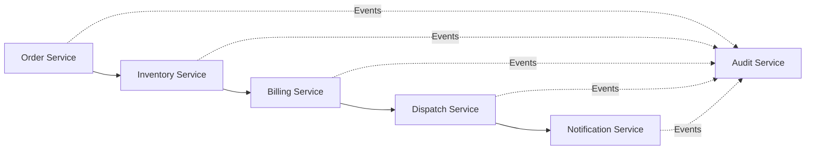
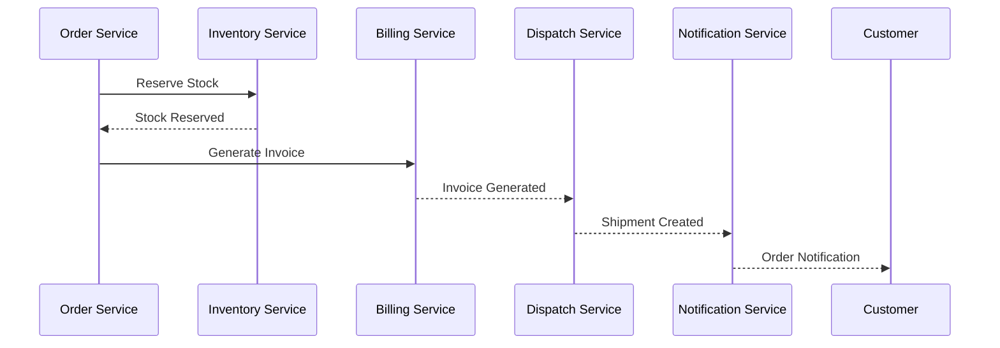
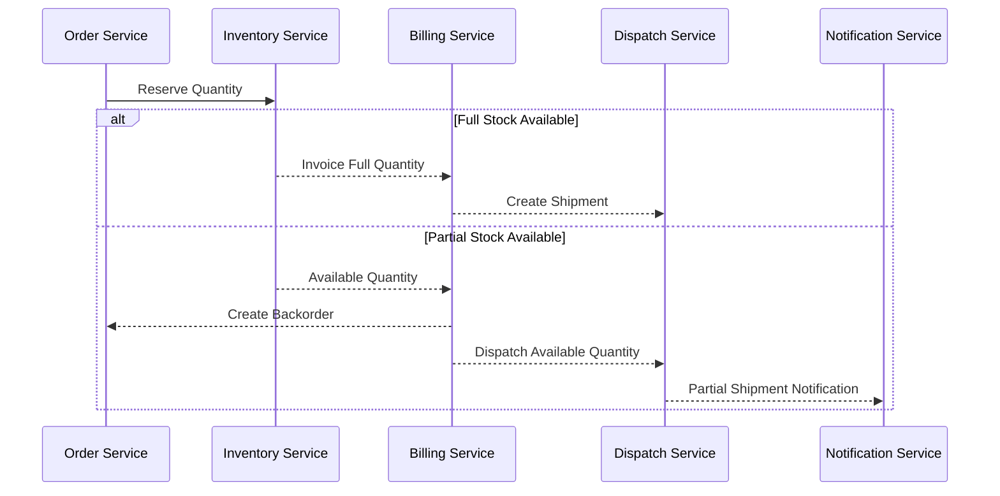
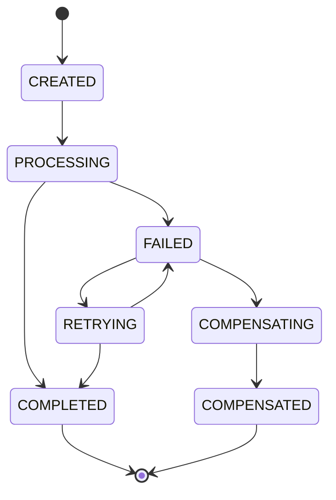

# ADR-006: Adopt Saga-Based Distributed Transaction Strategy for DHS Platform

---

# 1. Document Information

| Field         | Value                                                              |
| ------------- | ------------------------------------------------------------------ |
| ADR ID        | ADR-006                                                            |
| Title         | Adopt Saga-Based Distributed Transaction Strategy for DHS Platform |
| Date          | 2026-06-20                                                         |
| Status        | Accepted                                                           |
| Author        | Sachin Salunke                                                     |
| Domain        | OMS / Electronic Distribution Platform                             |
| Decision Type | Architecture Decision Record                                       |

---

# 2. Context & Problem Statement

The Distributed Hub and Sales (DHS) Platform follows a Cloud-Native Monorepo-Based Multi-Module Microservices Architecture composed of independently deployable business services.

The platform supports business processes that span multiple services, including:

* Order Creation
* Inventory Reservation
* Partial Billing
* Invoice Generation
* Shipment Creation
* Customer Notifications
* Reporting and Analytics
* Audit Logging

A typical business transaction spans multiple services.

Example:

```text
Order Service
      ↓
Inventory Service
      ↓
Billing Service
      ↓
Dispatch Service
      ↓
Notification Service
```

Failures can occur at any stage:

* Inventory unavailable
* Billing failure
* Dispatch failure
* Notification failure
* Service unavailability
* Integration failures

The platform requires:

* Data consistency
* Failure recovery
* Service independence
* High availability
* Independent deployments
* Partial billing support
* Backorder management
* Distributed resiliency

Traditional distributed transactions such as Two-Phase Commit (2PC) are unsuitable because they introduce tight coupling, blocking behavior, and reduced availability.

---

# 3. Decision Drivers

## Business Drivers

* Prevent inconsistent business states
* Support partial fulfillment
* Minimize order failures
* Ensure operational reliability
* Improve customer satisfaction

---

## Technical Drivers

* Loose coupling
* Failure isolation
* Event-driven workflows
* Scalability
* Independent deployments
* Service autonomy
* Distributed resiliency

---

## Operational Drivers

* Better observability
* Easier troubleshooting
* Improved resiliency
* Simplified operations
* Independent deployments

---

# 4. Considered Options

---

## Option 1: Two-Phase Commit (2PC)

### Description

All participating services commit or rollback together.

### Advantages

* Strong consistency
* Simple conceptual model

### Disadvantages

* Tight coupling
* Blocking transactions
* Single point of failure
* Poor scalability
* Reduced availability
* Operational complexity

---

## Option 2: Cross-Service Synchronous Transactions

### Description

Business services invoke each other synchronously and maintain transaction state through request chains.

### Advantages

* Easier implementation
* Immediate consistency

### Disadvantages

* Tight runtime coupling
* Cascading failures
* Reduced availability
* Poor scalability
* Complex recovery

---

## Option 3: Saga Pattern (Chosen)

### Description

Business transactions are decomposed into local transactions coordinated through events and compensating actions.

### Advantages

* Loose coupling
* High availability
* Scalable architecture
* Failure isolation
* Independent service deployments
* Distributed resiliency
* Supports partial billing workflows

### Disadvantages

* Eventual consistency
* Requires compensating logic
* Additional observability requirements

---

# 5. Decision

The DHS Platform shall adopt:

# Saga-Based Distributed Transaction Strategy

Implementation Strategy:

```text
Local Transaction
        ↓
Publish Domain Event
        ↓
Next Service Processes Event
        ↓
Failure Handling
        ↓
Compensating Action
```

---

# 6. Transaction Principles

## TP-001

Every service owns its local transaction.

---

## TP-002

Cross-service workflows are eventually consistent.

---

## TP-003

Business failures shall be handled through compensating actions.

---

## TP-004

Services shall communicate through immutable events.

---

## TP-005

Event consumers shall be idempotent.

---

## TP-006

Business transactions shall be fully auditable.

---

# 7. Saga Architecture



---

# 8. Order Fulfillment Saga

## Happy Path



---

# 9. Partial Billing Saga

Example:

```text
Requested Quantity : 10
Available Quantity : 6

Invoice Quantity   : 6
Backorder Quantity : 4
```

Workflow:



---

# 10. Failure Handling Strategy

## Scenario 1: Inventory Reservation Failure

```text
Order Created
      ↓
Inventory Reservation Failed
      ↓
Order Cancelled
      ↓
Customer Notification
```

---

## Scenario 2: Billing Failure

```text
Order Created
      ↓
Stock Reserved
      ↓
Billing Failed
      ↓
Release Reserved Stock
      ↓
Cancel Order
      ↓
Notify Customer
```

---

## Scenario 3: Dispatch Failure

```text
Order Created
      ↓
Invoice Generated
      ↓
Dispatch Failed
      ↓
Retry Shipment Creation
      ↓
Notify Operations
```

---

## Scenario 4: Service Unavailable

```text
Order Created
      ↓
Billing Service Unavailable
      ↓
Retry Policy
      ↓
Circuit Breaker
      ↓
Dead Letter Topic
      ↓
Manual Replay
```

---

# 11. Compensating Actions

| Failure                       | Compensation                      |
| ----------------------------- | --------------------------------- |
| Inventory Reservation Failure | Cancel Order                      |
| Billing Failure               | Release Reserved Stock            |
| Invoice Failure               | Cancel Invoice                    |
| Dispatch Failure              | Retry Shipment Creation           |
| Notification Failure          | Retry Notification                |
| Service Unavailable           | Dead Letter Processing and Replay |
| Integration Failure           | Retry Event Processing            |

---

# 12. Event Model

## Order Events

```text
OrderCreated
OrderCancelled
BackOrderCreated
OrderCompleted
```

## Inventory Events

```text
StockReserved
StockReleased
StockAdjusted
ReservationFailed
```

## Billing Events

```text
InvoiceGenerated
PartialInvoiceGenerated
InvoiceCancelled
BillingFailed
```

## Dispatch Events

```text
ShipmentCreated
ShipmentDispatched
ShipmentDelivered
ShipmentFailed
```

## Notification Events

```text
NotificationSent
NotificationFailed
```

---

# 13. Event Contract

```json
{
  "eventId": "UUID",
  "eventType": "InvoiceGenerated",
  "aggregateId": "UUID",
  "correlationId": "UUID",
  "causationId": "UUID",
  "timestamp": "2026-06-20T12:00:00Z",
  "version": 1,
  "payload": {}
}
```

---

# 14. Idempotency Requirements

Consumers shall:

* Process an event only once
* Ignore duplicate events
* Maintain processing status
* Support replay mechanisms

Implementation:

```text
event_id
aggregate_id
processed_at
status
```

---

# 15. Retry Strategy

## Immediate Retry

```text
Attempts : 3
Delay     : 5 Seconds
```

---

## Exponential Retry

```text
5 Seconds
10 Seconds
30 Seconds
```

---

## Retry Configuration

```text
Maximum Attempts : 3
Backoff Strategy : Exponential
Circuit Breaker  : Enabled
Dead Letter Topic: Enabled
Replay Support   : Enabled
```

---

# 16. Transaction State Management



---

# 17. Observability

Monitor:

* Transaction completion rates
* Compensation success rates
* Retry counts
* Dead letter events
* Processing latency
* Event lag
* Failed workflows
* Saga completion time
* Workflow execution time
* Service retry counts

Technology:

```text
Micrometer
OpenTelemetry
Prometheus
Grafana
Structured Logging
Distributed Tracing
Correlation IDs
Audit Events
```

---

# 18. Security Considerations

Events shall:

* Be immutable
* Be authenticated
* Be authorized
* Be audited
* Avoid sensitive payload exposure

Compensation activities shall:

* Be logged
* Be traceable
* Preserve audit trails

---

# 19. Consequences

## Positive Consequences

* Loose coupling
* High availability
* Failure isolation
* Better resiliency
* Independent service deployments
* Distributed resiliency
* Partial billing support
* Backorder support
* Better scalability

---

## Negative Consequences

* Eventual consistency
* Increased observability requirements
* More complex troubleshooting
* Compensation logic complexity

---

# 20. Decision Outcome

Status:

```text
ACCEPTED
```

Decision:

```text
DHS shall implement cross-service business
transactions using the Saga Pattern with
event-driven coordination and compensating
actions while preserving service autonomy,
independent deployments, and distributed
resiliency.
```

---

# 21. Related Documents

* BRD-001
* PRD-001
* SRS-001
* HLD-001
* ADR-001 Monorepo-Based Multi-Module Microservices Architecture
* ADR-002 Database per Service Strategy
* ADR-003 Hybrid Communication Architecture
* ADR-004 Service Discovery Architecture
* ADR-005 API Gateway Strategy

---
