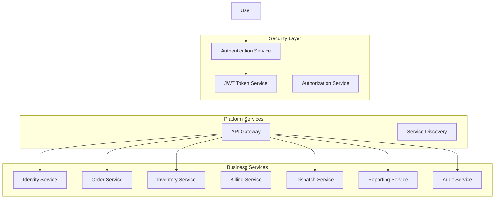
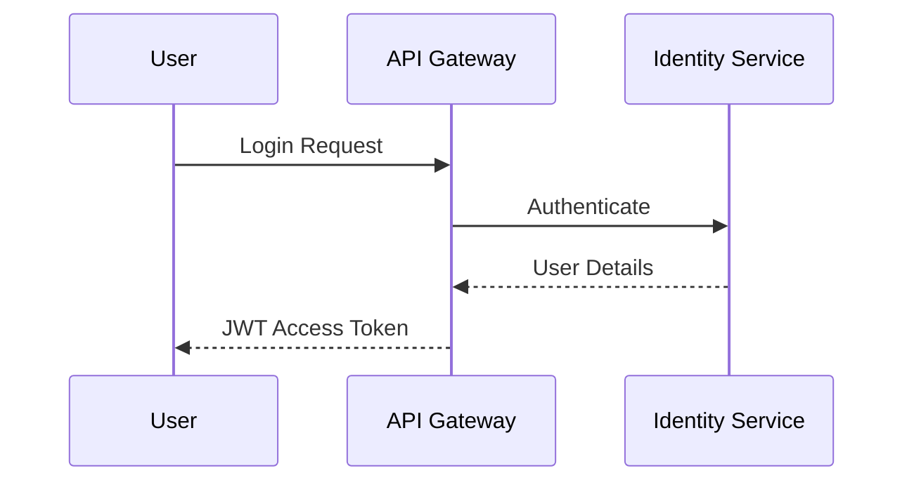

# ADR-007: Adopt JWT and RBAC-Based Security Architecture for DHS Platform

---

# 1. Document Information

| Field         | Value                                                           |
| ------------- | --------------------------------------------------------------- |
| ADR ID        | ADR-007                                                         |
| Title         | Adopt JWT and RBAC-Based Security Architecture for DHS Platform |
| Date          | 2026-06-20                                                      |
| Status        | Accepted                                                        |
| Author        | Sachin Salunke                                                  |
| Domain        | OMS / Electronic Distribution Platform                          |
| Decision Type | Architecture Decision Record                                    |

---

# 2. Context & Problem Statement

The Distributed Hub and Sales (DHS) Platform follows a Cloud-Native Monorepo-Based Multi-Module Microservices Architecture composed of independently deployable business services.

The platform manages sensitive business information including:

- Customer information
- Product catalogs
- Inventory information
- Orders
- Invoices
- Shipment information
- Operational reports
- Audit records

The system requires:

- Secure authentication
- Fine-grained authorization
- Multi-role access control
- Secure APIs
- Secure service-to-service communication
- Comprehensive auditing
- Independent deployments
- Cloud-native compatibility
- Observability and traceability

---

# 3. Decision Drivers

## Business Drivers

- Protect business data
- Prevent unauthorized access
- Meet compliance requirements
- Ensure auditability
- Support multiple business roles

---

## Technical Drivers

- Stateless authentication
- Horizontal scalability
- Low latency authorization
- API security
- Service isolation
- Independent deployments
- Cloud-native compatibility

---

## Operational Drivers

- Centralized identity management
- Simplified administration
- Easier user management
- Better observability
- Reduced operational risks

---

# 4. Considered Options

---

## Option 1: Session-Based Authentication

### Description

Server-side sessions stored in memory or databases.

### Advantages

- Easy implementation
- Simple invalidation

### Disadvantages

- Stateful architecture
- Poor horizontal scalability
- Increased server memory usage
- Complex distributed deployments

---

## Option 2: External Identity Provider

### Description

Authentication delegated to an external identity platform.

### Advantages

- Enterprise-grade identity management
- Single Sign-On support
- Federation support

### Disadvantages

- Additional infrastructure
- Increased complexity
- Higher operational overhead
- Premature for current requirements

---

## Option 3: JWT + RBAC (Chosen)

### Description

Stateless authentication using JWT tokens combined with Role-Based Access Control.

### Advantages

- Stateless
- Scalable
- Cloud-native
- Low latency
- Fine-grained authorization
- Easy service integration
- Independent deployments

### Disadvantages

- Token invalidation complexity
- Secret management requirements
- Authorization governance requirements

---

# 5. Decision

The DHS Platform shall adopt:

# JWT Authentication + Role-Based Access Control (RBAC)

Security Model:

```text
User
   ↓
Authentication
   ↓
JWT Access Token
   ↓
API Gateway
   ↓
Authorization
   ↓
Business Services
```

---

# 6. Security Architecture Overview



---

# 7. Authentication Architecture

## Authentication Flow



---

# 8. JWT Strategy

## Access Token Purpose

- Authenticate requests
- Carry identity information
- Carry authorization information
- Propagate user context

---

## Token Claims

```json
{
  "sub": "userId",
  "username": "john.doe",
  "branchId": "BR001",
  "roles": ["ROLE_BRANCH_MANAGER"],
  "permissions": ["ORDER_CREATE", "ORDER_VIEW"],
  "iat": 1718790000,
  "exp": 1718793600
}
```

---

## Token Configuration

| Property             | Value      |
| -------------------- | ---------- |
| Signing Algorithm    | RS256      |
| Access Token Expiry  | 15 Minutes |
| Refresh Token Expiry | 8 Hours    |
| Token Type           | Bearer     |
| Transport            | HTTPS Only |

---

# 9. Authorization Strategy

The DHS Platform shall implement:

# Role-Based Access Control (RBAC)

Authorization Model:

```text
User
   ↓
Roles
   ↓
Permissions
   ↓
Resources
```

---

# 10. System Roles

## Super Admin

- Full platform access
- User management
- Role management
- Security administration
- Audit access

---

## Company Admin

- Company administration
- Branch oversight
- Reporting access

---

## Hub Manager

- Inventory management
- Billing oversight
- Dispatch management
- Reporting access

---

## Branch Manager

- Branch operations
- Order management
- Customer management
- Reporting access

---

## Sales Executive

- Customer management
- Order creation
- Order tracking

---

## Inventory Operator

- Inventory operations
- Stock adjustments
- Barcode management

---

## Billing Executive

- Invoice generation
- Partial billing
- Invoice management

---

## Dispatch Executive

- Shipment processing
- Delivery management

---

## Customer

- View own orders
- View shipment status
- Receive notifications

---

# 11. Permission Model

## Identity Permissions

```text
USER_CREATE
USER_UPDATE
USER_DELETE
ROLE_MANAGE
PERMISSION_MANAGE
```

---

## Customer Permissions

```text
CUSTOMER_CREATE
CUSTOMER_UPDATE
CUSTOMER_VIEW
CUSTOMER_SEARCH
```

---

## Inventory Permissions

```text
STOCK_VIEW
STOCK_RESERVE
STOCK_ADJUST
STOCK_RELEASE
```

---

## Order Permissions

```text
ORDER_CREATE
ORDER_UPDATE
ORDER_CANCEL
ORDER_VIEW
```

---

## Billing Permissions

```text
INVOICE_CREATE
INVOICE_VIEW
PARTIAL_BILLING
```

---

## Dispatch Permissions

```text
SHIPMENT_CREATE
SHIPMENT_DISPATCH
SHIPMENT_TRACK
```

---

# 12. API Security Model

All APIs shall be secured using:

```text
HTTPS
JWT Authentication
RBAC Authorization
Input Validation
Audit Logging
TLS 1.3
```

---

## Public APIs

```text
POST /api/auth/login
POST /api/auth/refresh
GET  /actuator/health
```

---

## Protected APIs

```text
POST /api/orders
GET  /api/inventory
POST /api/invoices
POST /api/shipments
```

---

# 13. Service-to-Service Security

Business services shall communicate using:

- TLS 1.3
- JWT propagation
- Service identity validation
- Correlation IDs
- Audit logging

---

# 14. Data Security

## Data in Transit

- HTTPS
- TLS 1.3
- Secure Headers

---

## Data at Rest

- Database encryption
- Backup encryption
- Secret encryption

---

## Secrets Management

```text
JWT Keys
Database Credentials
API Keys
Certificates
Encryption Keys
```

---

# 15. Audit and Security Logging

The platform shall audit:

- User login
- Failed authentication attempts
- User creation
- Role assignments
- Permission changes
- Order creation
- Billing operations
- Dispatch operations
- Security violations
- Service authentication failures

---

## Audit Event Example

```json
{
  "eventId": "UUID",
  "eventType": "USER_LOGIN",
  "userId": "USR001",
  "timestamp": "2026-06-20T10:00:00Z",
  "ipAddress": "x.x.x.x",
  "status": "SUCCESS"
}
```

---

# 16. Security Principles

## SP-001

Least privilege access.

---

## SP-002

Deny by default.

---

## SP-003

Authentication before authorization.

---

## SP-004

Every action shall be auditable.

---

## SP-005

No anonymous access to business APIs.

---

## SP-006

Sensitive data shall never be exposed in logs.

---

# 17. Failure Handling

Authentication Failures:

- Invalid credentials
- Expired tokens
- Invalid signatures
- Disabled users

Authorization Failures:

- Missing permissions
- Role restrictions
- Resource ownership violations

Responses:

```text
401 Unauthorized
403 Forbidden
```

---

# 18. Observability

Monitor:

- Login attempts
- Authentication failures
- Authorization failures
- Token issuance
- Token refreshes
- Security violations
- Suspicious activities
- Service authentication failures

Technology:

```text
Micrometer
OpenTelemetry
Prometheus
Grafana
Structured Logging
Distributed Tracing
Correlation IDs
Audit Events
```

---

# 19. Consequences

## Positive Consequences

- Stateless authentication
- Fine-grained authorization
- Independent deployments
- Better observability
- Improved auditability
- Cloud-native compatibility
- Future SSO readiness

## Negative Consequences

- Token invalidation complexity
- Secret management requirements
- Additional authorization governance

---

# 20. Decision Outcome

Status:

```text
ACCEPTED
```

Decision:

```text
DHS shall implement a stateless security
architecture using JWT-based authentication
and Role-Based Access Control (RBAC),
secured by TLS 1.3, service-to-service
authentication, and comprehensive audit logging.
```

---

# 21. Related Documents

- BRD-001
- PRD-001
- SRS-001
- HLD-001
- ADR-001 Monorepo-Based Multi-Module Microservices Architecture
- ADR-002 Database per Service Strategy
- ADR-003 Hybrid Communication Architecture
- ADR-004 Service Discovery Architecture
- ADR-005 API Gateway Strategy
- ADR-006 Saga-Based Distributed Transaction Strategy

---
