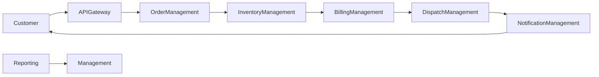

# BRD-001: Distributed Hub and Sales (DHS) Platform

## 1. Title Page

| Field         | Value                                                            |
| ------------- | ---------------------------------------------------------------- |
| Project Name  | Distributed Hub and Sales (DHS) Platform                         |
| Document ID   | BRD-001                                                          |
| Document Type | Business Requirements Document (BRD)                             |
| Domain        | Order Management System (OMS) / Electronic Distribution Platform |
| Version       | v1.0.0                                                           |
| Author        | Sachin Salunke                                                   |
| Status        | Draft                                                            |
| Date          | 2026-06-19                                                       |

---

## 2. Document Metadata

| Field           | Value                                  |
| --------------- | -------------------------------------- |
| Document ID     | BRD-001                                |
| Domain          | OMS / Electronic Distribution Platform |
| Document Type   | Business Requirements Document         |
| Version         | v1.0.0                                 |
| Author          | Sachin Salunke                         |
| Status          | Draft                                  |
| Date            | 2026-06-19                             |
| Linked Epic     | EPIC-DHS-001 To EPIC-DHS-012           |
| Linked Story    | STORY-DHS-001 To STORY-DHS-052         |
| Approval Status | Pending Approval                       |

---

## 3. Revision History

| Version | Date       | Author         | Description                                              |
| ------- | ---------- | -------------- | -------------------------------------------------------- |
| v1.0.0  | 2026-06-19 | Sachin Salunke | Initial BRD creation and business baseline establishment |
| v1.1.0 | 2026-06-20 | Sachin Salunke | Updated BRD to align with cloud-native monorepo-based multi-module microservices architecture and finalized epic mapping |

---

## 4. References

| Reference ID | Document |
|--------------|-----------|
| PRD-001 | Product Requirements Document |
| SRS-001 | Software Requirements Specification |
| RTM-001 | Requirements Traceability Matrix |
| HLD-001 | Platform Foundation High-Level Design |
| ADR-001 | Monorepo-Based Multi-Module Microservices Architecture |
| ADR-002 | Database Strategy Decision |
| ADR-003 | Inter-Service Communication Strategy |
| ADR-004 | Service Discovery Strategy |
| ADR-005 | API Gateway Strategy |
| ADR-006 | Event-Driven Communication Strategy |
---

## 5. Sign-Off Table

| Role                 | Name           | Status  | Date |
| -------------------- | -------------- | ------- | ---- |
| Product Owner        | Sachin Salunke | Pending | TBD  |
| Solution Architect   | Sachin Salunke | Pending | TBD  |
| Technical Lead       | TBD            | Pending | TBD  |
| Business Stakeholder | TBD            | Pending | TBD  |

---

## 6. Scope

### 6.1 In Scope

* Identity and Access Management
* Branch Management
* Customer Management
* Product Catalog Management
* Inventory Management
* Order Management
* Billing Management
* Dispatch Management
* Notification Management
* Reporting and Analytics
* Audit and Compliance
* Centralized API Access Management
* Service Registration and Discovery
* Centralized Configuration Management
* Platform Monitoring and Observability
* SMS and Email integrations
* GST and E-Invoicing integrations
* Barcode and Scanner device integrations

### 6.2 Out Scope

* Payment Gateway Integration
* ERP Integration
* SAP Integration
* Tally Integration
* Human Resource Management
* Payroll Management
* Accounting Ledger System
* Procurement Management
* Supplier Management
* Warehouse Management System (WMS)

---

## 7. Requirements

The DHS platform shall:

1. Provide centralized order management capabilities.
2. Enable real-time inventory visibility.
3. Support branch-to-hub order lifecycle management.
4. Support partial billing and dispatch processing.
5. Provide customer order request and order tracking capabilities.
6. Support role-based access control.
7. Provide centralized API access management.
8. Support dynamic service registration and discovery.
9. Maintain operational audit logs and monitoring capabilities.
10. Provide dashboards and reporting capabilities.
11. Integrate with notification systems.
12. Support centralized configuration management.
13. Support observability and monitoring capabilities.
14. Support high availability and future scalability requirements.

---

## 8. Assumptions

* Stable internet connectivity exists at the central hub and branch locations.
* Barcode devices support standard communication protocols.
* Users are trained on operational workflows.
* GST and E-Invoicing APIs are available and accessible.
* Infrastructure environments are provisioned prior to production rollout.
* Organization hierarchy remains centralized with one operational hub.
* Platform services may evolve independently over time.
* Business capabilities shall remain available during future platform expansion.
* Platform infrastructure supports distributed service deployment.

---

## 9. Risks

| Risk                                      | Impact | Mitigation                                   |
| ----------------------------------------- | ------ | -------------------------------------------- |
| Network failures between branches and hub | High   | Retry mechanisms and asynchronous processing |
| Inventory synchronization delays          | High   | Event-driven architecture using Kafka        |
| Integration service downtime              | Medium | Circuit breakers and fallback mechanisms     |
| User adoption challenges                  | Medium | Training and phased onboarding               |
| Data migration issues                     | Medium | Validation and reconciliation procedures     |
| Distributed service communication failures | Medium | Implement resiliency and monitoring mechanisms |
| Service dependency failures | Medium | Implement retry and fallback mechanisms |
| Increased operational complexity | Medium | Standardized platform governance and monitoring |
---

## 10. Dependencies

* Cloud infrastructure availability
* PostgreSQL database provisioning
* Kafka infrastructure provisioning
* Redis cache provisioning
* Centralized configuration infrastructure
* API Gateway infrastructure
* Service Discovery infrastructure
* Monitoring and Observability infrastructure
* SMS Gateway APIs
* Email Service Provider APIs
* GST and E-Invoicing APIs
* Barcode and Scanner hardware procurement

---

## 11. Traceability Matrix

| BR ID | Requirement | Epic | Status |
|-------|-------------|------|---------|
| BR-001 | Platform Foundation | EPIC-DHS-001 | Draft |
| BR-002 | Identity and Access Management | EPIC-DHS-002 | Draft |
| BR-003 | Branch Management | EPIC-DHS-003 | Draft |
| BR-004 | Customer Management | EPIC-DHS-004 | Draft |
| BR-005 | Product Management | EPIC-DHS-005 | Draft |
| BR-006 | Inventory Management | EPIC-DHS-006 | Draft |
| BR-007 | Order Management | EPIC-DHS-007 | Draft |
| BR-008 | Billing Management | EPIC-DHS-008 | Draft |
| BR-009 | Dispatch Management | EPIC-DHS-009 | Draft |
| BR-010 | Notification Management | EPIC-DHS-010 | Draft |
| BR-011 | Reporting and Audit Management | EPIC-DHS-011 | Draft |
| BR-012 | DevOps and Platform Operations | EPIC-DHS-012 | Draft |

---

## 12. Executive Summary

Distributed Hub and Sales (DHS) Platform is a centralized, cloud-native Order Management System designed specifically for electronic distribution businesses. The platform provides real-time visibility into inventory, orders, billing, dispatch operations, and customer interactions across multiple branches and a centralized operational hub.

The platform is designed as a cloud-native, monorepo-based, multi-module microservices platform that enables centralized business operations while supporting independent service evolution, scalability, and future business growth.

---

## 13. Business Background

Electronic distribution businesses frequently face operational challenges due to fragmented systems, manual processes, delayed inventory updates, disconnected billing workflows, and limited visibility into branch operations.

Current challenges include:

* Manual order processing
* Inventory visibility issues
* Disconnected billing and dispatch activities
* Reporting delays
* Limited operational analytics
* Absence of centralized monitoring
* Inefficient customer order tracking

These challenges directly impact operational efficiency, customer satisfaction, and business scalability.

---

## 14. Business Objectives

### OBJ-001

Establish a centralized order management platform for all branches and hub operations.

### OBJ-002

Provide real-time inventory visibility across the organization.

### OBJ-003

Reduce manual operational activities and billing errors.

### OBJ-004

Provide a single source of truth for orders and inventory.

### OBJ-005

Support at least 1000 registered users.

### OBJ-006

Support 100+ daily orders with future scalability.

### OBJ-007

Improve customer order visibility and tracking.

### OBJ-008

Provide operational reporting and analytics.

### OBJ-009
Provide a future-ready platform architecture supporting independent service evolution and scalability.

### OBJ-010
Establish centralized operational visibility and monitoring capabilities.

### OBJ-011
Enable platform extensibility and future integration requirements.

---

## 15. Stakeholder Analysis

| Stakeholder         | Responsibilities                           |
| ------------------- | ------------------------------------------ |
| Super Admin         | Platform administration and governance     |
| Company Admin       | Business administration                    |
| Hub Manager         | Hub operations management                  |
| Branch Manager      | Branch operations management               |
| Sales Executive     | Order creation and customer management     |
| Inventory Operator  | Inventory maintenance and stock operations |
| Billing Executive   | Invoice and billing operations             |
| Finance Executive   | Financial review and reconciliation        |
| Operation Executive | Operational coordination                   |
| Dispatch Executive  | Shipment and dispatch processing           |
| Customer            | Order requests and order tracking          |
| Platform Administrator | Platform configuration and monitoring |
| System Administrator | Platform operations and security management |

---

## 16. Business Scope

### 16.1 In Scope

* Centralized OMS platform
* Real-time inventory visibility
* Multi-branch operations support
* Order lifecycle management
* Partial billing and dispatch workflows
* Customer order tracking
* Reporting and dashboards
* Notifications and alerts
* Audit and compliance capabilities
* Centralized API access management
* Service registration and discovery
* Configuration management
* Platform monitoring and observability

### 16.2 Out of Scope

* Payment processing systems
* ERP systems
* SAP integrations
* Tally integrations
* Supplier management
* Procurement systems
* Accounting systems

---

## 17. Business Requirements

| ID     | Requirement                                                       | Priority |
| ------ | ----------------------------------------------------------------- | -------- |
| BR-001 | System shall support centralized authentication and authorization | Critical |
| BR-002 | System shall support branch management                            | Critical |
| BR-003 | System shall support customer management                          | Critical |
| BR-004 | System shall support product catalog management                   | Critical |
| BR-005 | System shall support inventory management                         | Critical |
| BR-006 | System shall support order management                             | Critical |
| BR-007 | System shall support billing operations                           | Critical |
| BR-008 | System shall support dispatch operations                          | Critical |
| BR-009 | System shall support customer order tracking                      | High     |
| BR-010 | System shall support notifications and alerts                     | High     |
| BR-011 | System shall support reporting and analytics                      | High     |
| BR-012 | System shall maintain operational audit logs                      | High     |
| BR-013 | System shall support GST and E-Invoicing integration              | Medium   |
| BR-014 | System shall support barcode and scanner integrations             | Medium   |
| BR-015 | System shall provide centralized API access management | High |
| BR-016 | System shall support service registration and discovery | High |
| BR-017 | System shall provide centralized configuration management | High |
| BR-018 | System shall provide platform monitoring and observability capabilities | High |

---

## 18. Business Process Overview



### Order Lifecycle


---

## 19. Business Constraints

* Centralized operational hub architecture.
* Electronic distribution business processes must remain uninterrupted during migration.
* Regulatory compliance for taxation and invoicing.
* Integration dependencies on third-party providers.
* Future scalability requirements for additional branches and higher transaction volumes.
* Platform capabilities must remain available during independent service deployments.
* Platform must support future service expansion and increasing transaction volumes.

---

## 20. Success Criteria

* Real-time inventory visibility.
* Reduced order processing time.
* Reduced billing errors.
* Single source of truth for operational data.
* Support for 1000+ registered users.
* Support for 100+ daily orders.
* API response times below 200 ms for standard operations.
* Platform availability target of 99.9%.
* Centralized operational visibility and monitoring.
* Independent deployment capability for platform services.
* Support future business growth without architectural redesign.

---

## 21. Business Value / ROI

### Operational Benefits

* Reduced manual effort
* Faster order processing
* Improved inventory accuracy
* Better customer experience
* Increased operational visibility
* Reduced reporting delays

### Strategic Benefits

* Platform scalability
* Centralized governance
* Improved decision making
* Better operational control
* Foundation for future business capabilities
* Future-ready cloud-native platform
* Independent service evolution
* Improved platform observability
* Reduced modernization effort
* Increased platform scalability

---

## 22. Business Impact Assessment

### Business Impact

* High positive impact on operational efficiency.
* High positive impact on customer satisfaction.
* Medium impact on organizational change management.

### Technical Impact

* Adoption of cloud-native microservices architecture.
* Introduction of centralized API management and service discovery capabilities.
* Adoption of platform observability and monitoring standards.
* Foundation for future business growth and service evolution.

### Organizational Impact

* Standardized business processes.
* Reduced dependency on manual activities.
* Improved collaboration between branches and hub operations.

---

**Document Location**

```text
starone-galaxy-architecture/
└── architecture/
    └── platform/
        └── dhs/
            └── BRD-001-DHS-Distributed Hub and Sales (DHS) Platform.md
```
